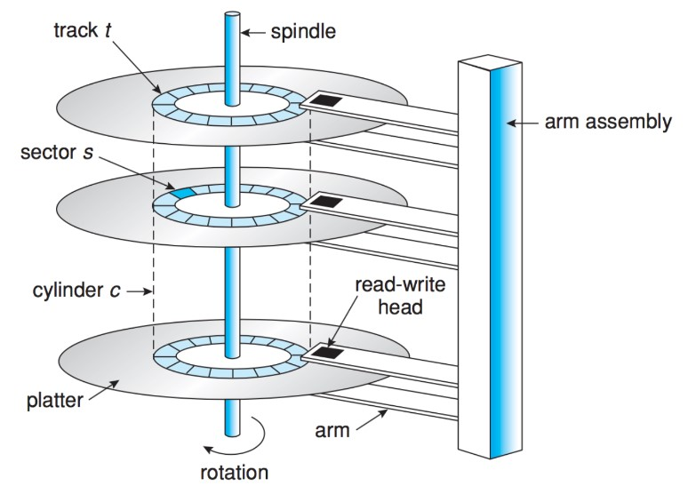
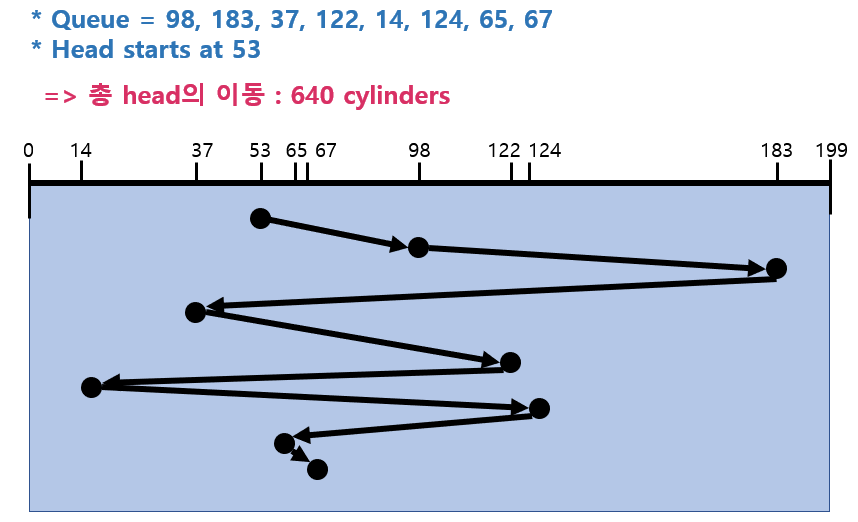
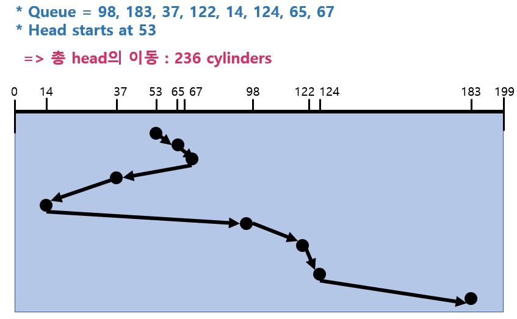
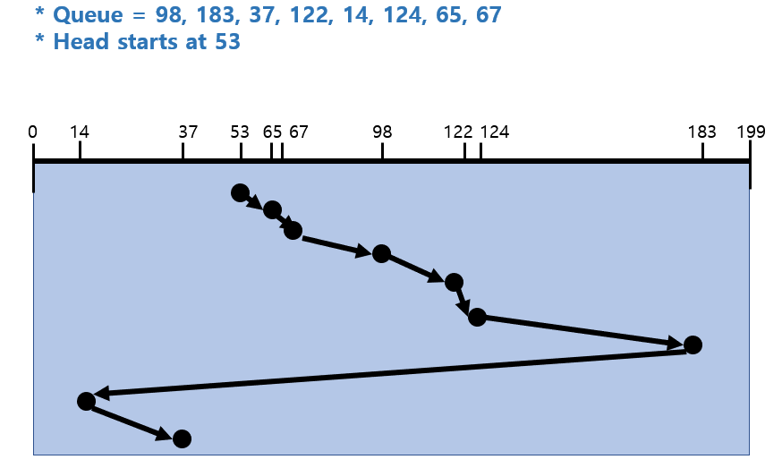
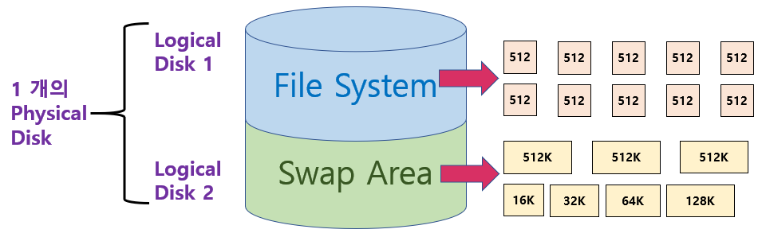
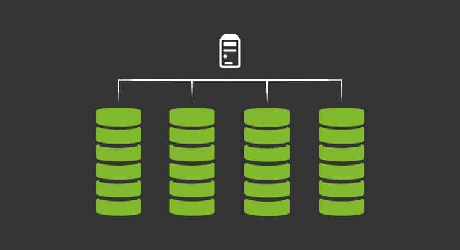

# 12 디스크 관리 및 스케줄링 Disk Management and Scheduling

<hr/>

## 목차

1. [Disk](#1-disk) <br/>
   &nbsp; 1-1. [Disk Structure](#1-1-disk-structure) <br/>
   &nbsp; 1-2. [Disk Management](#1-2-disk-management) <br/>
   &nbsp; 1-3. [Disk Access Time](#1-3-disk-access-time) <br/>

<br/>

2. [Allocation의 구현](#2-disk-scheduling-algorithm) <br/>
   &nbsp; 2-1. [FCFS](#2-1-fcfs) <br/>
   &nbsp; 2-2. [SSTF](#2-2-sstf) <br/>
   &nbsp; 2-3. [SCAN](#2-3-scan) <br/>
   &nbsp; 2-4. [C-SCAN](#2-4-c-scan) <br/>
   &nbsp; 2-5. [N-SCAN](#2-5-n-scan) <br/>
   &nbsp; 2-6. [Look](#2-6-look) <br/>
   &nbsp; 2-7. [Disk Scheduling Algorithm의 결정](#2-7-disk-scheduling-algorithm의-결정) <br/>

<br/>

3. [Swap Space Management](#3-swap-space-management) <br/>

<br/>

4. [RAID](#4-raid) <br/>

<br/><br/>

<hr/>

## 1. Disk

<br/>

<hr/>

### 1-1. Disk Structure

<br/>



- Logical Block
    - 디스크의 외부에서 바라보는 디스크의 단위 정보 저장 공간들
    - 주소를 가진 1차원 배열처럼 취급
    - 정보를 전송하는 최소 단위

<br/>

- Sector
    - Logical Block이 물리적 디스크에 매핑된 위치
    - 디스크를 관리하는 최소의 단위
    - Sector 0은 최외곽 실린더의 첫 트랙에 있는 첫 번째 섹터이다. 부팅과 관련된 정보가 저장되어 있다.
    - Sector에서 데이터를 읽고 쓰는 요청은 Disk Controller가 직접 조작

<br/>

<hr/>

### 1-2. Disk Management

<br/>

- Physical Formatting (Low-level Formatting)
    - 디스크를 컨트롤러가 읽고 쓸 수 있도록 sector들로 나누는 과정
    - 각 섹터는 <u>header</u> + <u>실제 data</u>(logical block, 보통 512byte) + <u>trailer</u>로 구성
    - header와 trailer는 sector number, ECC(Error-Correcting Code) 등의 정보가 저장되며 controller가 직접 접근 및 운영
    - cf) ECC : 내용을 요약하여 해쉬 함수를 적용한 데이터로, 축약본된 오류 검출용으로 사용하는 코드이다.

<br/>

- Partitioninig
    - 디스크를 하나 이상의 실린더 그룹으로 나누는 과정
    - OS는 이것을 <u>독립적 Disk</u>로 취급(Logical Disk)
    
<br/>

- Logical Formatting
    - 파일 시스템을 만드는 것
    - <u>FAT</u>, <u>Inode</u>, Free Space 등의 구조 포함

<br/>

- Booting
    - 컴퓨터 전원을 키면 CPU가 ROM을 가리키게 되고, ROM에 있는 `small bootstrap loader`를 실행
    - `small bootstrap loader`의 Instruction으로 sector 0 (boot block)을 load하여 실행
    - `boot block`의 지시로 sector 0 `full bootstrap loader program`을 실행
    - OS를 디스크에서 load하여 실행
    - 하드디스크에서 0번 sector를 읽고 실행 => 운영체제 커널 위치를 찾아서 올림

<br/>

### 1-3. Disk Access Time

<br/>

- 추가 용어정리

```
플래터 Platter는 하드 디스크에서 데이터가 저장되는 원판을 말한다.

실린더 Cylinder: 각각의 플래터에 같은 위치에 존재하는 트랙들을 모아서 연결하면 하나의 원통형이 되는데 이것을 실린더라고 한다.

섹터 Sector: 트랙을 원형 부채꼴의 형태로 나눈 구역을 말한다.

클러스터 Cluster: 소프트웨어적으로 데이터를 읽고 쓸 때 하나의 묶음 형태로 다루는 정보 저장 단위입니다.

헤드 Head: 암(Arm) 끝에 달려 데이터를 읽어주는 역할을 담당한다.
```


- `Access Time`의 구성
    - `Seek time`
        - 헤드를 해당 실린더로 움직이는데 걸리는 시간
        - 대부분의 시간을 `Seek time`에서 소모한다.
    - `Rotational latency`
        - 헤드가 원하는 섹터에 도달하기까지 걸리는 회전지연시간
        - `Seek time`의 약 1/10에 해당하는 적은 시간을 소모한다.
    - `Transfer time`
        - 실제 데이터의 전송시간
        - 굉장히 적은 시간을 소모한다.

<br/>

- `Disk Bandwidth`
    - 단위 시간 당 전송된 바이트의 수

<br/>

- `Disk Scheduling`
    - Seek time을 최소화하는 것이 목표(스케줄링의 필요성)
    - Seek time은 Seek distance에 비례

<br/>

<hr/>

<hr/>

## 2. Disk Scheduling Algorithm

<br/>

큐에 다음과 같은 실린더 위치의 요청이 존재하는 경우, 디스크헤드가 53번에서 시작할 때, 각 알고리즘을 실행 결과를 통해 알아보자.

- 실린더 위치는 0-199
- 큐의 내용: 98, 183, 37, 122, 14, 124, 65, 67

<br/>

<hr/>

### 2-1. FCFS

<br/>

`FCFS`는 `First Come First Service`라는 의미로 먼저 들어온 것을 먼저 처리하는 알고리즘이다.



<br/>

<hr/>

### 2-2. SSTF

<br/>

`SSTF (Shortest Seek Time First)`은 현재 헤드 위치에서 큐에 들어있는 요청 중 가장 가까운 요청을 먼저 처리하는 알고리즘이다.<br/> 
하지만 `starvation` 문제가 발생할 수 있다. 현재 헤드의 위치 근처에 있는 요청이 큐에 지속적으로 들어온다면 큐가 주변 요청만 처리할 가능성이 농후하다.



- 65 -> 67 -> 37 -> 14 -> 98 -> 122 -> 124 -> 183

<br/>

<hr/>

### 2-3. SCAN

<br/>

가장 간단하면서도 획기적인 방법으로 엘레베이터와 스케줄링 방식이 유사하기 때문에 `엘리베이터 스케줄링 Elevator Scheduling`이라고도 불린다. 상황에 영향을 받지 않고 한 방향으로 끝까지 간다.

<br/>

Disk arm이 디스크의 한쪽 끝에서 다른쪽 끝으로 이동하며 가는 길목에 있는 모든 요청을 처리한다. `SCAN`은 다른 한쪽 끝에 도달하면 역방향으로 이동하며 오는 길목에 있는 모든 요청을 처리하며 다시 반대쪽 끝으로 이동한다. `starvaion` 문제가 발생하지 않는다는 장점이 있다. 그러나 <u>실린더 위치에 따라 대기 시간이 다르다는 문제</u>가 있다.

<br/>

<hr/>

### 2-4. C-SCAN

<br/>

`C-SCAN`은 디스크 헤드가 한 쪽 방향만 처리하며 `SCAN`과는 다르게 역방향을 처리하지 않는다. 이동거리는 늘어날 수 있으나 `SCAN` 알고리즘보다는 대기 시간이 균일해진다는 장점이 있다.

<br/>

헤드가 한쪽 끝에서 다른 쪽 끝으로 이동하며 가는 길목에 있는 모든 요청을 처리한다. 다른쪽 끝에 도달했으면 요청을 처리하지않고 곧바로 출발점으로 다시 이동해 같은 방향으로 요청을 다시 처리하기 시작한다.

<br/>

<hr/>

### 2-5. N-SCAN

<br/>

`N-SCAN`은 `SCAN`의 변형 알고리즘으로, 일단 arm이 한 방향으로 움직이기 시작하면 그 시점 이후에 도착한 job은 되돌아올 때 서비스하는 방식이다. 출발하기 전에 들어온 것들은 가면서 처리하지만 가는 도중 들어오는 애들은 처리하지 않는다. 요청의 대기시간이 균일해진다는 장점이 있다.

<br/>

<hr/>

### 2-6. LOOK

<br/>

`SCAN`이나 `C-SCAN`은 헤드가 디스크 끝에서 끝으로 이동한다는 특징이 있기 때문에 시간 낭비가 심하다는 단점이 있다. 이를 개선하기 위해 `LOOK`과 `C-LOOK`은 헤드가 진행 중이다가 그 방향에 더이상 기다리는 요청이 없으면 헤드의 이동방향을 즉시 반대로 이동한다.

<br/>

- `C-LOOK`으로 처리한 Disk Scheduling



<br/>

<hr/>

### 2-7. Disk-Scheduling Algorithm의 결정

<br/>

현대 디스크 시스템에서는 `SCAN` 기반한 알고리즘을 주로 쓰고 있다. 헤드 이동거리를 줄일 수 있기 때문이다. `SCAN`, `C-SCAN` 및 그 응용 알고리즘은 `LOOK`, `C-LOOK`등이 일반적으로 디스크 입출력이 많은 시스템에서 효율적인 것으로 알려져 있다.

<br/>

`Disk Scheduling`은 File의 할당 방법에 따라 디스크 요청이 영향을 받기 때문에 이를 잘 고려해야 한다. `디스크 스케줄링 알고리즘`은 필요할 경우 다른 알고리즘으로 쉽게 교체할 수 있도록 OS와 별도의 모듈로 작성되는 것이 바람직하다.

<br/>

<hr/>

## 3. Swap-Space Management

<br/>



`보조기억장치`인 `Hard Disk`가 사용되는 이유가 2가지 있는데, 이는 Memory가 가진 제약 조건과 관련이 깊다. Memory의 `휘발성 Volatile`의 특성을 가지기 때문에 <u>`File System`처럼 영속적으로 데이터를 유지해야하는 경우 Disk를 활용</u>한다. 프로그램의 주소공간 전체를 `RAM` 또는 `DRAM`에 올려놓기에는 공간이 한정되어 있기 때문에 `Swap Space(Swap Area)`로써 Disk를 사용한다.

<br/>

`Swap Space`는 `Virtual Memory System`에서 디스크를 Memory의 연장 공간으로 사용한다. 파일 시스템 내부에 둘 수 있으나 별도 `Partition` 사용이 일반적이다. 공간효율성보다는 속도 효율성이 우선이기 때문에 512bytes로 고정된 일반 파일 시스템의 block과 Swap space의 block 크기 및 저장 방식이 다르다. `Seek Time`을 줄이기 위해 Swap Area에서 사용하는 데이터의 단위는 굉장히 큰 단위를 순차적으로 할당한다. 일반 파일보다는 훨씬 짧은 시간만 존재하고 자주 참조된다.

<br/>

하드디스크에서 Swap Spaces를 관리하는 방법을 자세히 설명하자면 다음과 같다. 물리적 디스크를 Partitioning 해서 Logical Disk를 만들 수 있고, 운영체제는 각각의 Logical Disk를 각각을 독립적인 디스크로 간주하게 된다. 여기서, Logical Disk는 File System으로 사용될 수 있고 Swap Area로도 사용될 수 있다.<br/>
File System은 512Byte의 Sector 단위로 데이터를 저장하고 있고 데이터를 저장하는 방식은 연속할당, 링크 할당, 인덱스 할당 등이 존재했다. Swap Area는 프로그램이 실행되는 동안에 Swap Area에 머물러 있던 프로세스의 주소공간이 프로그램이 끝나면 사라지기 때문에 오버헤드가 큰 Seek Time을 줄이기 위해 공간활용성보다는 시간활용성이 중요하다고 볼 수 있다.(어차피 공간은 프로그램 종료 시 자동으로 비워지기 때문이다.)

<br/>

<hr/>

## 4. RAID

<br/>



`RAID, Redundant Array of Independent Disks`는 저렴한 디스크 여러 개를 묶어서 사용하는 기법이다.<br/>
`RAID`는 <u>`디스크 처리 속도 향상`</u>과 여러 디스크 block의 내용을 분산 저장하기 위해 사용한다. 또한 데이터를 병렬적으로 읽어오기 위한 기법(Interleaving, Sriping)을 사용할 수 있다.<br/>
`RAID`를 사용하면 동일 정보를 여러 디스크에 중복 저장하고, 하나의 디스크가 고장시 다른 디스크에서 읽어올 수 있다. 이를 Mirroring, Shadowing이라고 하는데 이 방법을 통해 <u>`신뢰성 향상`</u>시킬 수 있다. 또한, 단순한 중복 저장이 아니라 일부 디스크에 `Parity`를 저장하여 오류를 검출할 수 있고 공간의 효율성을 높일 수 있다. <br/>

<br/>

- 용어 정리

```
Interleaving : 여기 저기서 조금씩 읽어옴

Striping : 디스크를 조금씩 나눠서 저장
```

<br/><br/>

<hr/>

## 출처

- 반효경, 운영체제와 정보기술의 원리

- Abraham Silberschatz, Operating System Concept

- https://jhi93.github.io/category/os/2019-12-29-operatingsystem-11/

<hr/>

#### Edited by pythonstrup (myvelop.tistory.com)

<hr/>