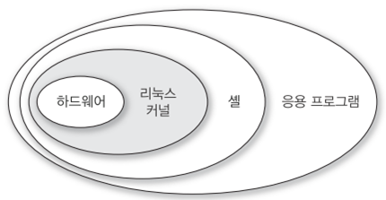
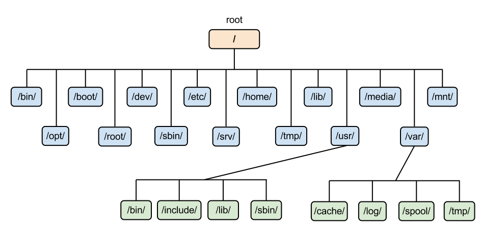

# 리눅스

## 리눅스란?

- 리눅스는 1991년 Linus Torvals가 개발한 운영체제로 Unix 기반으로 만들어졌다. (유닉스 클론 운영체제)
- Unix와 마찬가지로 다중 사용자, 다중 작업, 다중 스레드를 지원하는 네트워크 운영체제이다.
- Unix가 통신 네트워크를 징향해 설계된 것처럼 Linux 또한 네트워크 지향 운영체제이며, 서버로 작동하는 것에 최적화되어있다.
- 리눅스는 자유 소프트 라이센스로 누구나 소스코드를 활용, 수정, 재배포가 가능해 지속적으로 업그레이드가 이루어지고 있다. 예를 들면 우분투 리눅스, CentOS 등이 있다.

 

## 리눅스는 언제 사용될까?

- **서버 구축**, 이것이 가장 주된 이유다.
- 많은 클라우드 서비스에서 대부분 리눅스를 기본 서버로 사용하는데 그 이유는 아래와 같다!
  1. 오픈소스다. 즉 공짜라는 얘기다.
  2. 높은 보안성이 보장된다. 때문에 바이러스나 멀웨어를 신경쓰지 않고 개발과 응용 프로그램 개발에 집중할 수 있다.(오픈소스였기 때문에 많은 사람들이 보안 취약성을 파악하게 되었고, 이를 고쳤다.)
  3. 안정된 구조를 가지고 있다.(충돌이 잘 발생하지 않는다.) 윈도우즈와 달리 업데이트 또는 피치 후에 재부팅할 필요도 없다. => 유지보수에 유리하다.
  4. 호환성이 좋다. (어떤 하드웨어에서도 잘 작동 - 높은 이식성) 윈도우즈(많이 무거운 운영체제)는 기술 사양을 많이 따지는 반면, 리눅스는 웬만한 하드웨어에서 잘 실행된다.
  5. 커스터마이징을 할 수 있다.

 

## 리눅스의 구조

- 커널 Kernel: 리눅스의 핵심, 프로세스 관리, 메모리 관리, 파일 및 장치 등 컴퓨터의 하드웨어를 모두 제어하는 영역이다. 좁은 의미의 운영체제를 의미하기도 한다.
- 셸 Shell: 커널과 사용자간의 접점으로 셸을 통해 우리는 컴퓨터가 원하는 동작을 하도록 할 수 있다. 대표적인 셸은 BASH가 있고 요즘은 zsh (Z shell)이 많이 사용된다. 명령어 해석기라고도 불리며 사용자가 입력한 명령어를 커널에 전달하는 역할을 한다.
- 응용 프로그램 Application: 각종 프로그램 시스템을 위한 프로그램, 사용자의 문서 편집 도구, 브라우저, 네트워크 도구 등 다양한 프로그램을 일컫는다.

 

## Linux File System Hierarchy(FHS)

- FHS의 가장 위에는 `/` 디렉토리가 있다. Root(뿌리) 디렉토리라고 한다. 즉, Tree 형태의 FHS의 뿌리가 된다는 뜻이다. 디렉토리는 윈도우스의 폴더와 동일한 개념이다.
- 시작점인 root 디렉토리 안에 여러 하위 디렉토리들이 있고 각 하위 디렉토리들 안에 또 하위 디렉토리들이 존재한다. 각 디렉토리의 구분은 `/`(slash-슬래시)로 구분하며 위 사진의 `bin` 디렉토리의 경로는 `/usr/bin`과 같이 표현할 수 있다.
- 리눅스 파일시스템은 나중에 더 자세히 알아보도록 하자!

 

## 참고자료

- [만화로 나누는 자유/오픈소스 소프트웨어 이야기](https://joone.net/2018/09/27/26-%EB%A6%AC%EB%88%85%EC%8A%A4-%EC%9D%B4%EC%95%BC%EA%B8%B0-%EB%A6%AC%EB%88%84%EC%8A%A4-%ED%86%A0%EB%B0%9C%EC%A6%88%EC%9D%98-%EC%96%B4%EB%A6%B0%EC%8B%9C%EC%A0%88/)

- [리눅스란 무엇인가](https://smoothiecoding.kr/%EB%A6%AC%EB%88%85%EC%8A%A4%EB%9E%80-%EB%AC%B4%EC%97%87%EC%9D%B8%EA%B0%80/)

- [리눅스란 무엇인가](https://velog.io/@ghldjfldj/%EB%A6%AC%EB%88%85%EC%8A%A4Linux%EB%9E%80-%EB%AC%B4%EC%97%87%EC%9D%B8%EA%B0%80)

- [리눅스의 구조](https://spromotion.tistory.com/7)

- [리눅스 기초](https://velog.io/@sji7532/Linux-Linux-%EA%B8%B0%EC%B4%88%EC%99%80-%EB%AA%85%EB%A0%B9%EC%96%B4)
