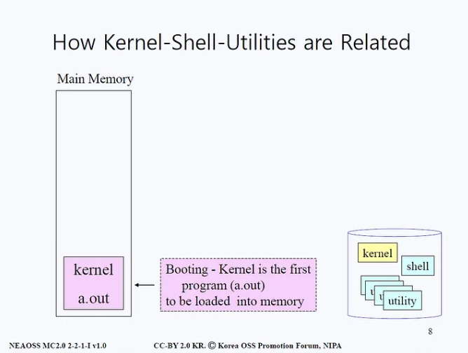

# 리눅스 커널

## 커널이란?

- 커널은 운영체제 중 항상 메모리에 올라가 있는 운영체제의 핵심 부분으로 하드웨어와 응용 프로그램 사이에서 인터페이스를 제공한다. 즉, 컴퓨터의 자원들을 관리하는 역할을 한다.
- 커널은 인터페이스로 응용 프로그램 수행에 필요한 여러가지 서비스(추상화 자원)를 제공하고 여러가지 하드웨어(CPU, 메모리 등의 물리적 자원) 리소스를 관리한다.
- 커널은 항상 컴퓨터 자원들만 바라보고 있기 때문에 쉘이라는 명령어 해석기를 사용한다. 이를 통해 사용자가 물리적인 하드웨어에 접근하고 사용할 수 있도록 도와준다.
- 커널은 하나의 하드웨어 자원을 여러 사용자들이 사용할 수 있도록 복수 개의 추상화된 객체로 관리한다.

### 커널의 기능

1. 메모리 관리: 메모리가 어디에서 무엇을 저장하는 데 얼마나 사용되는지 추척한다.
2. 프로세스 관리: 어느 프로세스가 중앙 처리 장치(CPU)를 언제 얼마나 오랫동안 사용할지 결정한다.
3. 장치 드라이버: 하드웨어와 프로세스 사이에서 중재자/인터프리터 역할을 수행한다.
4. 시스템 호출 및 보안: 프로세스의 서비스 요청을 수신한다.

### 커널은 언제 사용될까?

- 보통 커널은 사용자가 볼 수 없으며, 커널 공간이라는 자신만의 작은 작업 공간에서 메모리를 할당하고 저장되는 모든 항목을 추적한다.
- 웹 브라우저 및 파일과 같이 사용자가 볼 수 있는 것을 사용자 공간이라고 하는데, 사용자 공간에서 시스템 호출 인터페이스(SCI)를 이용해 커널과 통신한다.

### OS에서 커널의 위치

1. 하드웨어: 시스템의 토대가 되는 물리적 머신으로 메모리(RAM)와 프로세서 또는 중앙 처리 장치(CPU) 그리고 입출력(I/O) 장치(ex. 스토리지, 네트워킹 및 그래픽)로 구성된다. CPU는 계산을 수행하고 메모리를 읽고 쓴다.
2. Linux 커널: OS의 핵심이다. 한가운데에 존재한다. 메모리에 상주하며 CPU에 명령을 내리는 소프트웨어이다. **사실 커널은 Memory Resident의 특징을 제외하면 아주 평범한 C Program이다.**
3. 사용자 프로세스: 실행 중인 프로그램으로 커널이 관리한다. 사용자 프로세스가 모여 사용자 공간을 구성한다. 사용자 프로세스를 단순히 프로세스라고 한다. 또한, 커널은 이러한 프로세스 및 서버가 서로 통신(프로세스 간 통신 또는 IPC)할 수 있도록 도와준다.

- 시스템에서 실행되는 코드는 커널 모드 또는 사용자 모드라는 두 가지 모드 중 하나로 CPU에서 실행된다.
- 커널 모드에서 실행 중인 코드는 하드웨어에 무제한 액세스가 가능한 반면, 사용자 모드에서는 CPU 및 메모리가 SCI를 통해 접근하는 것을 제한한다. 이와 같은 구분이 보안, 컨테이너 구축 및 가상 머신을 위한 권한 구분과 같은 복잡한 작업의 토대가 된다!
- 프로세스가 사용자 모드에서 실패하면 손상이 제한적이며 커널에 의해 복구될 수 있음을 의미한다. 그러나 커널 프로세스는 메모리와 프로세서에 접근할 수 있기 때문에 충돌이 발생하면 시스템 전체가 중지될 수 있다.
- 과거 커널 소스는 `usr/src/linux`에 존재했다고 하는데, 현재는 어디 있는지...?

### 커널을 구성하는 자원관리자

1. Task Manager: 물리적 자원인 CPU를 추상적 자원인 태스크로 제공

2. Memory Manager: 물리적 자원인 메모리를 추상적 자원인 페이지나 세그먼트로 제공

3. File System Manager: 물리적 자원인 디스크를 추상적 자원인 파일로 제공

4. Network Manager: 물리적 자원인 네트워크 장치를 추상적 자원인 소켓으로 제공

5. Device Driver Manager: 각종 외부 장치에 대한 접근을 관리

 

## 커널, 쉘, 그리고 유틸리티의 관계

- 커널, 쉘, 유틸리티는 메모리와 디스크 사이를 오가며 작동한다. 시스템이 부팅하면 제일 먼저 메인 메모리에 Kernel(`a.out`)이 올라온다. 커널 실행파일이 메모리에 로딩된다는 말이다.

- (리눅스는 멀티 유저 시스템으로 하나의 시스템에 다양한 유저가 들어온다.) 유저가 터미널의 전원을 켜면 그 터미널 위에서 쉘이란 프로그램이 메인 메모리에 올라간다. 그 후 쉘은 유저가 키보드로 커맨드를 입력하기를 기다린다.
- 유저가 커맨드를 입력하면 쉘은 커맨드에 대응하는 유틸리티를 디스크로부터 가져와 실행시킨다. 각 유저로부터 전원이 들어올 때마다 `커널 <-> 쉘 <-> 유틸리티`는 서로 상호작용하며 컴퓨터를 작동시킨다.

 

## 커널모드

### 커널모드와 유저모드

- 유저모드는 유저(사용자)가 접근할 수 있는 영역을 제한적으로 두고, 프로그램의 자원에 함부로 침범하지 못하는 모드이다.
- 반면 커널 모드는 모든 자원(드라이버, 메모리, CPU 등)에 접근, 명령을 할 수 있는 모드로 사용자 모드를 사용하다가 I/O와 같이 중요한 작업을 실행하게 되면 유저모드로부터 CPU 제어권을 빼앗아온다.
- 사용자는 컴퓨터 사용 과정에서 수도 없이 두 모드를 왔다갔다하게 된다. 컴퓨터는 모드 비트를 통해 현재 컴퓨터가 어떤 모드인지 판단한다. 비트를 확인하고 커널모드라면 어떤 작업을 하든 검증 절차를 밟지 않고 모든 것을 허용하고, 유저모드라면 아래와 같은 검증 절차를 거치게 된다.

### 커널모드를 사용하게 되는 과정

- CPU는 항상 메모리에서 주소(address)를 메모리에 전달한다. 원하는 명령(instruction)가 있다면 해당 명령(instruction)의 주소를 Program Counter가 메모리로 보낸다. instruction이 오면 그걸 실행(execute)하는 과정에서 또 관련 매개변수(operands)에 관련된 주소를 보내고 관련 정보를 받아온다. CPU는 이 작업을 반복한다. 계속해서 주소를 메모리에 넘긴다.
- CPU와 메모리 사이에는 MMU(Memory Management Unit)이라는 하드웨어가 존재한다. 이 MMU는 CPU로부터 메모리로 가는 주소(address)의 정보를 조사한다. 만약에라도 CPU가 보낸 주소가 접근할 수 있는 메모리 범위를 벗어나지 않도록 검사한다.
- 유효성이 검증되면 명령어를 가지고 온다.(Instruction Fetch) Instruction은 op-code와 operands로 구성되는데, op-code를 확인해 해당 명령어가 어떤 명령인지 확인한다. 만약 이것이 priviledged op-code(I/O와 같은 중요한 작업)을 시도하려 한다고 판단하면 운영체제는 그 순간 CPU를 뺏어간다. 커널모드에 돌입하는 것이다!

 

## 참고자료

- [Linux 커널이란 무엇일까요?](https://www.redhat.com/ko/topics/linux/what-is-the-linux-kernel)

- [어떻게 리눅스 커널을 개발하는가?](https://www.kernel.org/doc/html/v4.15/translations/ko_KR/howto.html)

- [리눅스 커널 강의노트(1)](https://medium.com/pocs/%EB%A6%AC%EB%88%85%EC%8A%A4-%EC%BB%A4%EB%84%90-%EC%9A%B4%EC%98%81%EC%B2%B4%EC%A0%9C-%EA%B0%95%EC%9D%98%EB%85%B8%ED%8A%B8-1-d36d6c961566)
