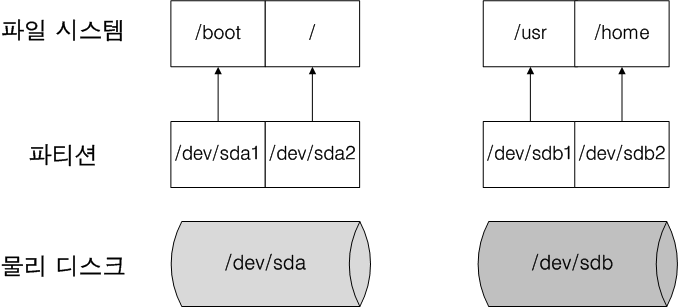
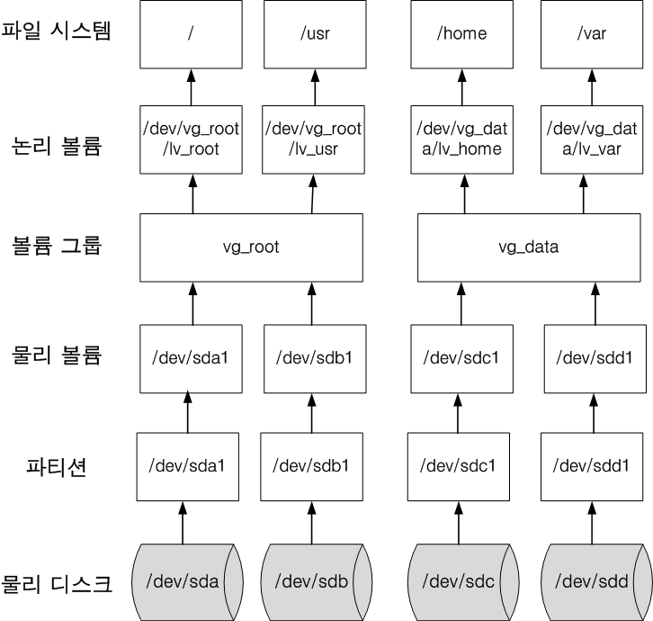

# LVM

- 논리 볼륨 관리자, Logical Volume Manager
- 리눅스의 저장 공간을 효율적이고 유연하게 관리하기 위한 커널의 일부분이다.

## 전통적인 디스크 파티셔닝

- 디스크 파티셔닝의 경우, 하드 디스크를 파티셔닝 한 후 OS 영역에 마운트해 read/write를 수행한다. 
- 크기가 고정되기 때문에 파티션의 용량이 다 찼을 경우 아래와 같은 과정을 거쳐야만 했다.(아래 예시는 `/home`)
  1. 추가 디스크를 장착
  2. 추가된 디스크에 파티션 생성 및 포맷
  3. 새로운 마운트 포인트를(`/home2`) 만들고 추가한 파티션을 마운트
  4. 기존 home 데이터를 home2에 복사하거나 이동
  5. 기존 home 파티션을 언마운트
  6. home2를 home으로 마운트

## LVM를 통해 얻을 수 있는 것

- LVM은 volume이라는 단위로 저장 장치를 다룬다. 물리 디스크를 볼륨 그룹으로 묶고 이것을 논리 볼륨으로 분할하여 관리한다.
- 이를 통해 유연하게 저장 장치를 다룰 수 있게 되었다.

- 전통적인 디스크 파티셔닝과는 다르게 LVM 방식을 이용하면 마운트, 언마운트할 필요 없이 아래의 과정만 거치면 된다. (위 그림 참고)
  1. 추가 디스크를 장착
  2. 추가된 디스크에 파티션을 만들어 물리 볼륨 생성
  3. 물리 볼륨을 볼륨 그룹에 추가한다. home은 vg_data 볼륨 그룹이므로 여기에 추가해주면 된다.
  4. home이 사용하는 논리 볼륨인 lv_home의 볼륨 사이즈를 증가시켜준다.

## 참고자료

- [LVM(Logical Volume Manager) 의 개념과 설정 방법](https://greencloud33.tistory.com/41)
- [파티션 및 설치 종류 선택 & LVM](https://www.lesstif.com/1stb/lvm-20775667.html)