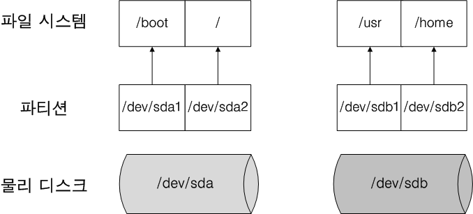
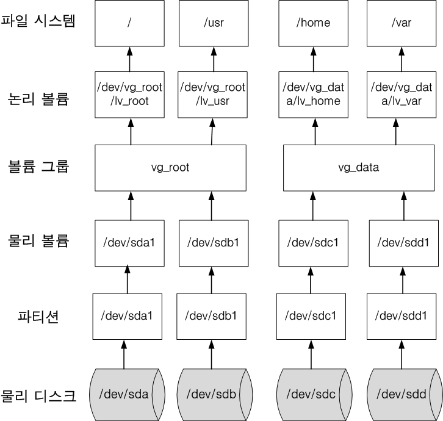
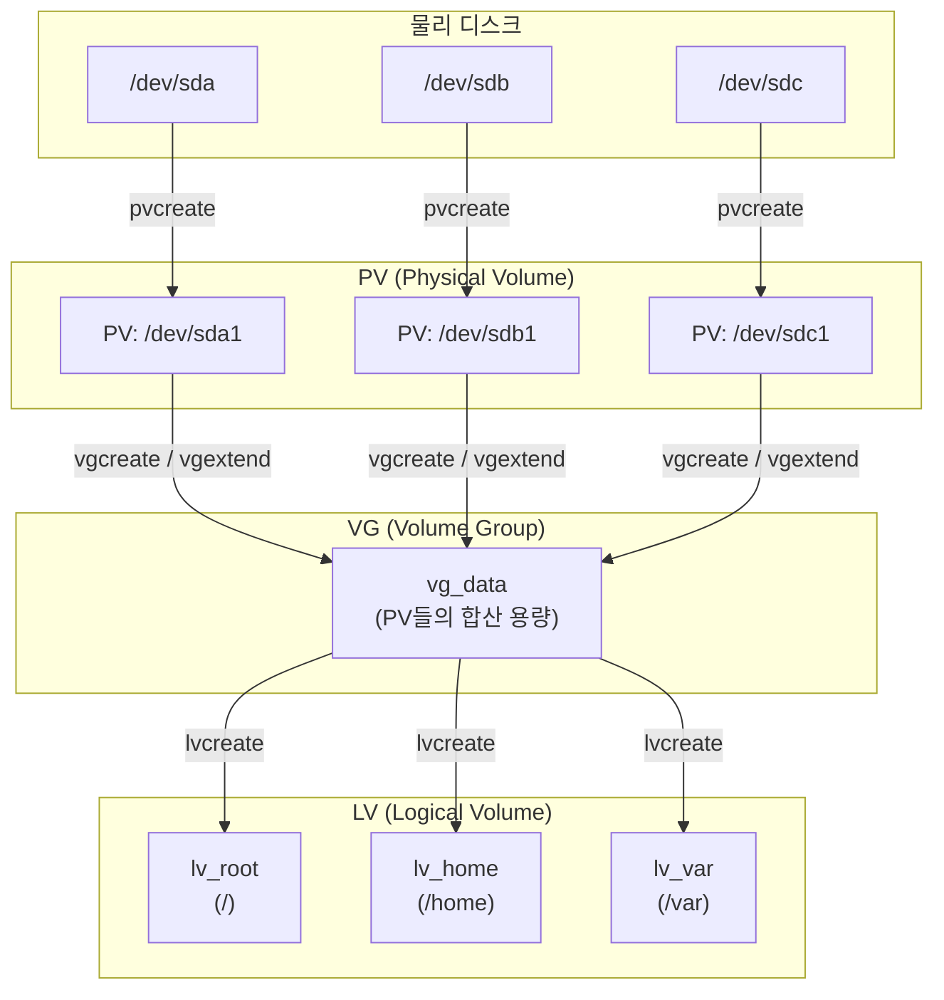

# LVM

- 논리 볼륨 관리자, Logical Volume Manager
- 리눅스의 저장 공간을 효율적이고 유연하게 관리하기 위한 커널의 일부분이다.

## 전통적인 디스크 파티셔닝



- 디스크 파티셔닝의 경우, 하드 디스크를 파티셔닝 한 후 OS 영역에 마운트해 read/write를 수행한다. 
- 크기가 고정되기 때문에 파티션의 용량이 다 찼을 경우 아래와 같은 과정을 거쳐야만 했다.(아래 예시는 `/home`)
  1. 추가 디스크를 장착
  2. 추가된 디스크에 파티션 생성 및 포맷
  3. 새로운 마운트 포인트를(`/home2`) 만들고 추가한 파티션을 마운트
  4. 기존 home 데이터를 home2에 복사하거나 이동
  5. 기존 home 파티션을 언마운트
  6. home2를 home으로 마운트


## LVM를 통해 얻을 수 있는 것

- LVM은 volume이라는 단위로 저장 장치를 다룬다. 물리 디스크를 볼륨 그룹으로 묶고 이것을 논리 볼륨으로 분할하여 관리한다.
- 이를 통해 유연하게 저장 장치를 다룰 수 있게 되었다.



- 전통적인 디스크 파티셔닝과는 다르게 LVM 방식을 이용하면 마운트, 언마운트할 필요 없이 아래의 과정만 거치면 된다. (위 그림 참고)
  1. 추가 디스크를 장착
  2. 추가된 디스크에 파티션을 만들어 물리 볼륨 생성
  3. 물리 볼륨을 볼륨 그룹에 추가한다. home은 vg_data 볼륨 그룹이므로 여기에 추가해주면 된다.
  4. home이 사용하는 논리 볼륨인 lv_home의 볼륨 사이즈를 증가시켜준다.

## 핵심 용어

| 용어 | 풀네임 | 설명 |
|------|--------|------|
| **PV** | Physical Volume | 실제 물리 디스크 또는 파티션을 LVM에서 사용할 수 있도록 초기화한 것 |
| **VG** | Volume Group | 하나 이상의 PV를 묶어 만든 저장 공간 풀. LV를 생성하는 기반이 된다 |
| **LV** | Logical Volume | VG에서 할당받아 실제 마운트하여 사용하는 논리적 파티션 |
| **PE** | Physical Extent | PV를 구성하는 고정 크기의 블록 단위 (기본 4MB) |
| **LE** | Logical Extent | LV를 구성하는 블록 단위. PE와 1:1로 매핑된다 |

- PE와 LE는 LVM이 공간을 관리하는 최소 단위다. VG 생성 시 PE 크기를 지정할 수 있으며, LV의 크기는 PE 크기의 배수로 결정된다.

## LVM 구조



- 물리 디스크 → PV → VG → LV 순서로 계층이 구성된다.
- 하나의 VG 안에서 여러 LV를 자유롭게 분할할 수 있고, VG에 PV를 추가하면 전체 용량이 늘어난다.

> **참고**: `/dev/sda`, `/dev/sdb` 등에서 `sd`는 **SCSI(Small Computer System Interface) Disk**의 약자이고, 뒤의 알파벳(`a`, `b`, `c`...)은 디스크 인식 순서를 나타낸다. 숫자가 붙으면 해당 디스크의 파티션 번호다. (예: `/dev/sda1` = 첫 번째 디스크의 1번 파티션) 원래 SCSI 인터페이스 디스크용 이름이었지만, 현재는 SATA, SAS, USB 등 대부분의 디스크에 `sd*` 네이밍이 사용된다. NVMe SSD는 `/dev/nvme0n1` 같은 별도 네이밍을 쓴다.

## 주요 명령어

### PV (Physical Volume)

```bash
# PV 생성
pvcreate /dev/sdb1

# PV 목록 확인
pvs
pvdisplay

# PV 제거
pvremove /dev/sdb1
```

### VG (Volume Group)

```bash
# VG 생성 (PE 크기 지정 가능)
vgcreate vg_data /dev/sdb1 /dev/sdc1
vgcreate -s 8M vg_data /dev/sdb1   # PE 크기를 8MB로 지정

# VG에 PV 추가 (확장)
vgextend vg_data /dev/sdd1

# VG에서 PV 제거
vgreduce vg_data /dev/sdd1

# VG 목록 확인
vgs
vgdisplay

# VG 제거
vgremove vg_data
```

### LV (Logical Volume)

```bash
# LV 생성
lvcreate -L 10G -n lv_home vg_data       # 10GB 크기로 생성
lvcreate -l 100%FREE -n lv_home vg_data   # VG의 남은 공간 전부 사용

# LV 확장
lvextend -L +5G /dev/vg_data/lv_home      # 5GB 추가
lvextend -l +100%FREE /dev/vg_data/lv_home # 남은 공간 전부 추가

# 파일시스템도 함께 확장 (중요!)
resize2fs /dev/vg_data/lv_home             # ext4
xfs_growfs /dev/vg_data/lv_home            # xfs

# LV 축소 (ext4만 가능, xfs는 축소 불가)
umount /dev/vg_data/lv_home
e2fsck -f /dev/vg_data/lv_home             # 파일시스템 체크 필수
resize2fs /dev/vg_data/lv_home 5G          # 파일시스템을 먼저 축소
lvreduce -L 5G /dev/vg_data/lv_home        # 그 다음 LV 축소
mount /dev/vg_data/lv_home /home

# LV 목록 확인
lvs
lvdisplay

# LV 제거
lvremove /dev/vg_data/lv_home
```

### 포맷 및 마운트

```bash
# 파일시스템 생성
mkfs.ext4 /dev/vg_data/lv_home
mkfs.xfs /dev/vg_data/lv_home

# 마운트
mount /dev/vg_data/lv_home /home

# 영구 마운트 (/etc/fstab에 추가)
echo '/dev/vg_data/lv_home /home ext4 defaults 0 2' >> /etc/fstab
```

## 스냅샷 (Snapshot)

- 스냅샷은 특정 시점의 LV 상태를 그대로 보존하는 기능이다.
- **COW(Copy-On-Write)** 방식으로 동작한다. 스냅샷 생성 시점에 전체 데이터를 복사하는 것이 아니라, 원본 데이터가 변경될 때만 변경 전 데이터를 스냅샷 영역에 복사한다.
- 따라서 스냅샷 생성은 거의 즉시 완료되며, 스냅샷이 차지하는 용량은 변경된 데이터 크기에 비례한다.

### 스냅샷 활용 사례

- 시스템 업데이트 전 백업 → 문제 발생 시 롤백
- 데이터베이스 백업 시 일관된 시점의 데이터 확보
- 운영 중인 서버에서 무중단으로 백업 수행

### 스냅샷 명령어

```bash
# 스냅샷 생성 (원본: lv_home, 스냅샷 크기: 2GB)
lvcreate -s -L 2G -n lv_home_snap /dev/vg_data/lv_home

# 스냅샷 상태 확인 (사용률 주시 필요)
lvs -o +snap_percent

# 스냅샷을 마운트하여 내용 확인
mount -o ro /dev/vg_data/lv_home_snap /mnt/snap

# 스냅샷으로 원본 복원
umount /dev/vg_data/lv_home
lvconvert --merge /dev/vg_data/lv_home_snap

# 스냅샷 제거
lvremove /dev/vg_data/lv_home_snap
```

> **주의**: 스냅샷 영역이 100% 차면 스냅샷이 무효화된다. 변경량을 고려하여 충분한 크기를 할당하거나, 자동 확장을 설정해야 한다.

## 씬 프로비저닝 (Thin Provisioning)

- 일반 LV는 생성 시 VG에서 전체 용량을 즉시 할당받는다.
- 씬 프로비저닝은 **실제 데이터를 쓸 때만 공간을 할당**하는 방식이다.
- VG의 실제 물리 용량보다 더 큰 LV를 생성할 수 있다 (오버 프로비저닝).

### 일반 LV vs Thin LV

| | 일반 LV | Thin LV |
|---|---------|---------|
| 공간 할당 | 생성 시 전체 할당 | 쓸 때만 할당 |
| 오버 프로비저닝 | 불가 | 가능 |
| 스냅샷 | COW 방식, 별도 공간 필요 | Thin 풀 내에서 효율적 관리 |
| 적합한 상황 | 사용량이 예측 가능할 때 | VM, 컨테이너 등 다수 볼륨 관리 시 |

### Thin Provisioning 명령어

```bash
# Thin Pool 생성 (VG 안에 풀을 먼저 만든다)
lvcreate -L 50G --thinpool thin_pool vg_data

# Thin LV 생성 (가상 크기 100GB, 실제 할당은 사용량만큼)
lvcreate -V 100G --thin -n thin_lv1 vg_data/thin_pool

# Thin Pool 사용률 확인
lvs -o +data_percent,metadata_percent
```

> **주의**: 실제 물리 공간이 부족해지면 I/O 에러가 발생할 수 있으므로, 모니터링을 통해 Thin Pool 사용률을 주시해야 한다.

## 볼륨 확장/축소 실습 예시

### 시나리오: /home 용량이 부족하여 디스크 추가

```bash
# 1. 현재 상태 확인
df -h /home
pvs
vgs
lvs

# 2. 새 디스크(/dev/sdd)에 파티션 생성
fdisk /dev/sdd
# → n(새 파티션) → t(타입 변경) → 8e(Linux LVM) → w(저장)

# 3. PV 생성
pvcreate /dev/sdd1

# 4. 기존 VG에 PV 추가
vgextend vg_data /dev/sdd1

# 5. LV 확장 (10GB 추가)
lvextend -L +10G /dev/vg_data/lv_home

# 6. 파일시스템 확장
resize2fs /dev/vg_data/lv_home    # ext4인 경우
# xfs_growfs /home                 # xfs인 경우

# 7. 결과 확인
df -h /home
```

### 시나리오: /var 용량을 줄이고 /home에 재할당 (ext4)

```bash
# 1. /var 언마운트
umount /var

# 2. 파일시스템 체크
e2fsck -f /dev/vg_data/lv_var

# 3. 파일시스템 축소 (먼저!)
resize2fs /dev/vg_data/lv_var 10G

# 4. LV 축소
lvreduce -L 10G /dev/vg_data/lv_var

# 5. /var 다시 마운트
mount /dev/vg_data/lv_var /var

# 6. 확보된 공간을 /home에 할당
lvextend -l +100%FREE /dev/vg_data/lv_home
resize2fs /dev/vg_data/lv_home

# 7. 결과 확인
df -h /var /home
```

> **주의**: LV 축소는 반드시 **파일시스템 축소 → LV 축소** 순서로 진행해야 한다. 순서가 바뀌면 데이터가 손실된다. 또한 **xfs 파일시스템은 축소를 지원하지 않는다**.

## 참고자료

- [LVM(Logical Volume Manager) 의 개념과 설정 방법](https://greencloud33.tistory.com/41)
- [파티션 및 설치 종류 선택 & LVM](https://www.lesstif.com/1stb/lvm-20775667.html)