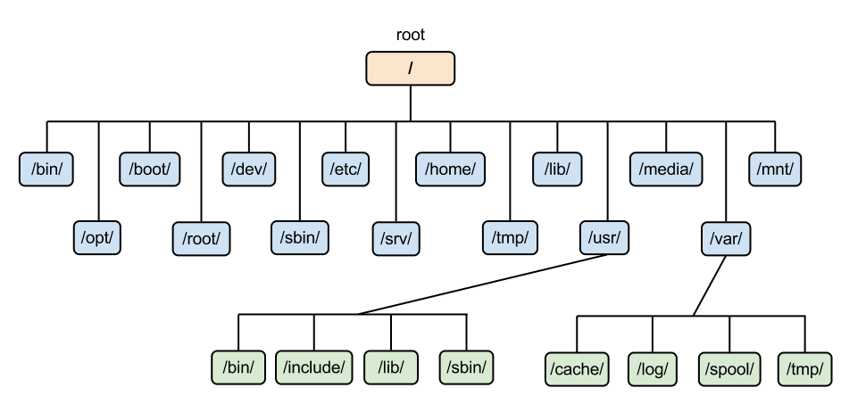
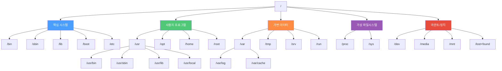

# 리눅스 파일시스템

## FHS (Filesystem Hierarchy Standard)

FHS는 리눅스 및 유닉스 계열 운영체제에서 **디렉토리 구조와 각 디렉토리의 용도를 정의한 표준**이다.
대부분의 리눅스 배포판(Ubuntu, CentOS, Fedora 등)이 이 표준을 따르기 때문에, 한 배포판에서 익힌 디렉토리 구조가 다른 배포판에서도 동일하게 적용된다.

FHS의 핵심 원칙:
- **공유 가능 vs 비공유**: 네트워크를 통해 다른 호스트와 공유할 수 있는 파일(`/usr`, `/opt`)과 그렇지 않은 파일(`/etc`, `/boot`)을 구분한다.
- **정적 vs 가변**: 변경되지 않는 파일(`/usr/bin`)과 운영 중 변경되는 파일(`/var/log`, `/tmp`)을 구분한다.

## 리눅스의 디렉토리

- 대략적인 디렉토리



### 디렉토리 구조

리눅스의 디렉토리 구조는 전체적으로 tree 구조이며 명령어의 성격과 내용 및 사용권한 등에 따라 디렉토리로 구분된다.



### 주요 디렉토리

`~`는 현재 로그인한 사용자의 홈 디렉토리를 가리키며, 터미널 구동 시 최초의 위치이다.

| 디렉토리 | 설명 | 예시 |
|---|---|---|
| `/` | FHS의 최상단 디렉토리(Root). 시스템의 근간을 이루며 절대경로의 기준이 된다. | - |
| `/bin` | 시스템 운영에 필수적인 기본 명령어가 저장된 디렉토리. 모든 사용자가 사용 가능하다. | `ls`, `cp`, `mv`, `cat`, `bash` |
| `/sbin` | 시스템 관리용 명령어가 저장된 디렉토리. 주로 root 사용자가 사용한다. | `fdisk`, `ifconfig`, `reboot`, `shutdown` |
| `/boot` | 부팅에 필요한 커널 이미지, 부트로더 설정 파일 등이 저장된 디렉토리. | `vmlinuz`, `initrd.img`, `grub/` |
| `/dev` | 시스템의 모든 디바이스를 파일로 접근할 수 있는 디렉토리. | `sda`(디스크), `tty`(터미널), `null` |
| `/etc` | 시스템 전체 설정 파일이 모여있는 디렉토리. | `passwd`, `fstab`, `hosts`, `nginx/` |
| `/home` | 일반 사용자의 홈 디렉토리가 생성되는 곳. | `/home/ubuntu`, `/home/user1` |
| `/root` | root 사용자의 홈 디렉토리. `/home`이 아닌 별도 위치에 존재한다. | `.bashrc`, `.ssh/` |
| `/lib` | `/bin`, `/sbin`의 명령어 실행에 필요한 공유 라이브러리와 커널 모듈이 저장된 디렉토리. | `libc.so`, `modules/` |
| `/usr` | 일반 사용자를 위한 프로그램, 라이브러리, 문서 등이 위치하는 디렉토리. | - |
| `/usr/bin` | 일반 사용자가 사용할 수 있는 명령어 파일이 저장된 디렉토리. | `git`, `vim`, `python3` |
| `/usr/sbin` | 시스템 관리용이지만 부팅에 필수적이지 않은 명령어가 저장된 디렉토리. | `useradd`, `cron` |
| `/usr/local` | 사용자가 직접 컴파일하거나 설치한 프로그램이 저장되는 디렉토리. | `bin/`, `lib/`, `share/` |
| `/var` | 시스템 운영 중 발생하는 가변 데이터(로그, 캐시, 메일 등)가 저장되는 디렉토리. | `log/`, `cache/`, `mail/` |
| `/tmp` | 임시 파일이 저장되는 디렉토리. 부팅 시 초기화된다. | - |
| `/proc` | 가상 파일시스템으로 프로세스 정보와 커널 상태를 파일로 제공한다. | `cpuinfo`, `meminfo`, `1/status` |
| `/sys` | 커널의 디바이스, 드라이버, 기능 관련 정보를 제공하는 가상 파일시스템. | `block/`, `class/`, `devices/` |
| `/media` | CD-ROM, USB 등 이동식 저장장치가 자동 마운트되는 디렉토리. | `cdrom/`, `usb/` |
| `/mnt` | 파일시스템을 임시로 수동 마운트하는 디렉토리. | - |
| `/opt` | 서드파티 추가 패키지가 설치되는 디렉토리. | `google/`, `discord/` |
| `/srv` | FTP, Web 등 서비스에서 제공하는 데이터가 저장되는 디렉토리. | `www/`, `ftp/` |
| `/run` | 부팅 이후 실행 중인 서비스의 런타임 데이터가 저장되는 디렉토리. | `lock/`, `user/`, PID 파일 |
| `/lost+found` | 파일시스템 검사(fsck) 시 손상된 파일 조각이 복구되는 디렉토리. ext 파일시스템 파티션마다 존재한다. | - |

## 리눅스 파일 종류

리눅스에서는 **모든 것이 파일**로 취급된다. `ls -l` 명령어의 첫 번째 문자로 파일의 종류를 구분할 수 있다.

| 기호 | 종류 | 설명 | 예시 |
|---|---|---|---|
| `-` | 일반 파일 (Regular File) | 텍스트, 바이너리, 이미지 등 데이터를 담는 파일 | `.txt`, `.sh`, `.png` |
| `d` | 디렉토리 (Directory) | 파일과 하위 디렉토리를 포함하는 컨테이너 | `/home`, `/etc` |
| `l` | 심볼릭 링크 (Symbolic Link) | 다른 파일이나 디렉토리를 가리키는 포인터 | `python` → `python3.10` |
| `b` | 블록 디바이스 (Block Device) | 블록 단위로 데이터를 읽고 쓰는 장치 | `/dev/sda`, `/dev/nvme0n1` |
| `c` | 캐릭터 디바이스 (Character Device) | 문자 단위로 데이터를 읽고 쓰는 장치 | `/dev/tty`, `/dev/null` |
| `p` | 파이프 (Named Pipe / FIFO) | 프로세스 간 통신(IPC)에 사용되는 특수 파일 | `mkfifo`로 생성 |
| `s` | 소켓 (Socket) | 프로세스 간 네트워크 통신에 사용되는 특수 파일 | `/var/run/docker.sock` |

## 파일 권한 (Permission)

### rwx 권한

리눅스는 각 파일에 대해 **소유자(Owner)**, **그룹(Group)**, **기타(Others)** 세 범주로 권한을 관리한다.

```
-rwxr-xr-- 1 user group 4096 Mar 15 10:00 example.sh
│└┬┘└┬┘└┬┘
│ │   │   └── Others: r-- (읽기만 가능)
│ │   └────── Group:  r-x (읽기 + 실행)
│ └────────── Owner:  rwx (읽기 + 쓰기 + 실행)
└──────────── 파일 종류: - (일반 파일)
```

| 권한 | 문자 | 숫자 | 파일에 대한 의미 | 디렉토리에 대한 의미 |
|---|---|---|---|---|
| 읽기 | `r` | 4 | 파일 내용 읽기 | 디렉토리 내 파일 목록 조회 |
| 쓰기 | `w` | 2 | 파일 내용 수정 | 디렉토리 내 파일 생성/삭제 |
| 실행 | `x` | 1 | 파일 실행 | 디렉토리 접근(cd) |

### 권한 관련 명령어

```bash
# chmod: 파일 권한 변경
chmod 755 script.sh          # rwxr-xr-x (숫자 방식)
chmod u+x script.sh          # 소유자에게 실행 권한 추가 (기호 방식)
chmod go-w file.txt          # 그룹과 기타에서 쓰기 권한 제거

# chown: 파일 소유자 변경
chown user:group file.txt    # 소유자와 그룹 동시 변경
chown user file.txt          # 소유자만 변경

# chgrp: 파일 그룹 변경
chgrp developers file.txt    # 그룹을 developers로 변경
```

### 특수 권한

| 권한 | 숫자 | 설명 | 예시 |
|---|---|---|---|
| **SUID** (Set User ID) | 4000 | 실행 시 파일 소유자의 권한으로 실행된다. | `/usr/bin/passwd` (일반 사용자가 비밀번호 변경 가능) |
| **SGID** (Set Group ID) | 2000 | 실행 시 파일 그룹의 권한으로 실행된다. 디렉토리에 설정하면 하위 파일이 같은 그룹을 상속한다. | 공유 디렉토리에서 그룹 권한 유지 |
| **Sticky Bit** | 1000 | 디렉토리에 설정하면 파일 소유자만 해당 파일을 삭제할 수 있다. | `/tmp` (모두 쓰기 가능하지만 타인의 파일 삭제 불가) |

```bash
chmod 4755 program            # SUID 설정 (-rwsr-xr-x)
chmod 2755 shared_dir         # SGID 설정 (drwxr-sr-x)
chmod 1777 /tmp               # Sticky Bit 설정 (drwxrwxrwt)
```

## 경로

- **Absolute Path (절대 경로)**
  - Root 디렉토리(`/`)부터 시작하는 완전한 경로를 의미한다.
  - 현재 위치와 상관없이 항상 동일한 파일/디렉토리를 가리킨다.
  - 예: `/home/user/documents/file.txt`

- **Relative Path (상대 경로)**
  - 현재 위치를 기준으로 한 상대적인 경로를 의미한다.
  - `.`(현재 디렉토리)과 `..`(상위 디렉토리) 심볼을 사용한다.
  - 예: `./scripts/run.sh`, `../../etc/hosts`

## 참고자료

- [리눅스 파일 종류와 디렉토리 구조](https://coding-factory.tistory.com/499)
- [Filesystem Hierarchy Standard - Linux Foundation](https://refspecs.linuxfoundation.org/FHS_3.0/fhs/index.html)
