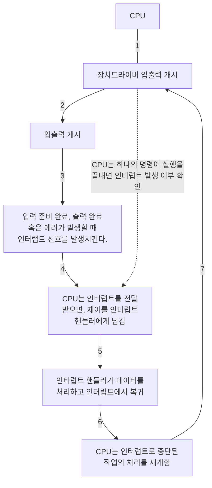

# Part1. 개관

- 운영체제는 컴퓨터 사용자와 컴퓨터 하드웨어 사이에서 중개자 역할을 한다.
  - 운영체제의 목적은 사용자가 프로그램을 편리하고 효율적으로 수행할 수 있는 환경을 제공하는 데 있다.
- 웅영체제는 컴퓨터 하드웨어를 관리하는 소프트웨어다.
  - 하드웨어는 컴퓨터 시스템의 정확한 동작을 보장하고 프로그래밍 시스템의 정상적인 동작을 방해하지 않도록 하는 적합한 메커니즘을 제공해야 한다.

# Chapter1. 서론

- 먼저 컴퓨터의 하드웨어의 구성과 구조를 이해하는 것이 중요하다.
  - CPU, 메모리, 입출력 장치, 저장장치
  - 운영체제의 근본적인 책임은 이러한 자원들을 프로그램에 할당하는 것이다.

## 1-1. 운영체제가 할 일

- 컴퓨터 시스템은 대개 네 가지 구성요소인 하드웨어, 운영체제, 응용 프로그램, 사용자로 구분할 수 있다.
  - 하드웨어: 중앙 처리 장치(CPU), 메모리 및 입출력(I/O) 장치 => 기본 계산용 자원을 제공
  - 응용 프로그램: 워드 프로세서, 스프레드시트, 컴파일러, 웹 브라우저 등 => 사용자의 계산 문제를 해결하기 위해 자원이 어떻게 사용될지를 정의
  - 운영체제: 사용자를 위해 다양한 응용 프로그램 간의 하드웨어 사용을 제어하고 조정한다.

### 1-1-1. 사용자 관점

- 컴퓨터에 대한 사용자 관점은 사용되는 인터페이스에 따라 달라진다.
  - 모니터, 키보드, 마우스로 구성된 PC 앞에서 작업한다.
  - 사용자가 자원을 독점하도록 설계 => 목표는 사용자가 수행하는 작업을 최대화하는 것
  - 이런 경우 운영체제는 대부분 사용의 용이성을 위해 설계.
- 점점 더 많은 사용자가 스마트폰과 태블릿과 같은 모바일 장치와 상호 작용
  - 일반적으로 셀룰러 또는 기타 무선 기술을 통해 네트워크에 연결
- 일부 컴퓨터는 사용자 관점이 존재하지 않거나 매우 작은 예도 있다.
  - 가전제품이나 자동차 내의 `내장형 컴퓨터` => 사용자의 개입 없이 작동하도록 설계

> #### 셀룰러 Cellular
> - 이동 무선 통신에서 셀의 설치에 의해 통신망을 구성, 운용하는 것을 말한다.

### 1-1-2. 시스템 관점

- 운영체제 = `자원 할당자 Resource Allocator`
- 자원에 대해 서로 상충할 수도 있는 많은 요청이 있으므로, 운영체제는 컴퓨터 시스템을 효율적이고 공정하게 운영할 수 있도록 어느 요청에 자원을 할당할지를 결정해야 한다.
- 운영체제에 대한 다소 다른 관점은 여러 가지 입출력 장치와 사용자 프로그램을 제어할 필요성을 강조한다.
  - 운영체제는 `제어 프로그램 Contorl Program`이다.
  - 컴퓨터의 부적절한 사용을 방지하기 위해 사용자 프로그램의 수행을 제어한다.
  - 특히 입출력 장치의 제어와 작동에 깊이 관여한다.

### 1-1-3. 운영체제의 정의

- 일반적으로 운영체제에 대한 적합한 정의는 없다.
- 일반적인 정의는 운영체제가 컴퓨터에서 항상 실행되는 프로그램(일반적으로 `커널`이라고 함)이다.
- 커널과 함께 두 가지 다른 유형의 프로그램이 있다.
  - 운영체제와 관련되어 있지만 반드시 커널의 일부일 필요는 없는 `시스템 프로그램`
  - 시스템 작동과 관련되지 않은 모든 프로그램을 포함하는 응용 프로그램
- 모바일 기기의 운영체제를 살펴보면 운영체제를 구성하는 기능의 수가 다시 증가하고 있음을 알 수 있다.
  - 종종 핵심 커널뿐만 아니라 `미들웨어`도 포함된다. 
  - ex) Apple의 IOS와 Google의 Android와 같이 가장 유명한 모바일 운영체제는 데이터베이스, 멀티미디어 및 그래픽을 지원하는 미들웨어와 함께 핵심 커널이 포함되어 있다.

> #### 미들웨어
> - 응용 프로그램 개발자에게 추가 서비스를 제공하는 일련의 소프트웨어 프레임워크

> #### 왜 운영체제를 공부하는가?
> - 운영체제를 만들거나 수정하는 사람은 소수다. 그렇다면 왜 운영체제와 그들의 작동방식을 공부할까?
> - 거의 모든 코드가 운영체제 위에서 실행되므로 운영체제 작동 방식에 대한 지식은 적절하고 효율적, 효과적이며 안전한 프로그래밍에 중요하기 때문이다.

## 1-2. 컴퓨터 시스템의 구성

- 현대의 범용 컴퓨터 시스템은 하나 이상의 CPU와 구성요소와 공유 메모리 사이의 액세스를 제공하는 공통 버스를 통해 연결된 여러 장치 컨트롤러로 구성된다.
  - 각 장치 컨트롤러는 특정 유형의 장치를 담당한다.
  - 컨트롤러에 따라 둘 이상의 장치가 연결될 수도 있다. ex) 하나의 USB 포트에 USB 허브 연결 가능
- 일반적으로 운영체제에는 각 장치 컨트롤러마다 `장치 드라이버`가 있다.
  - 장치 컨트롤러의 작동을 잘 알고 있고 운영체제에 장치에 대한 일관된 인터페이스를 제공한다.
  - CPU와 장치 컨트롤러는 병렬로 실행되어 메모리 사이클을 놓고 경쟁한다.
  - 공유 메모리를 질서 있게 액세스하기 위해 메모리 컨트롤러는 메모리에 대한 액세를 동기화한다.

### 1-2-1. 인터럽트 Interrupts

- 입출력 작업을 시작하기 위해 장치 드라이버는 장치 컨트롤러의 적절한 레지스터에 값을 적재한다.
  - 그런 다음 장치 컨트롤러는 이러한 레지스터의 내용을 검사하여 수행할 작업을 결정한다.
  - 컨트롤러는 장치에서 로컬 버퍼로 데이터 전송을 시작한다.
  - 데이터 전송이 완료되면 장치 컨트롤러는 장치 드라이버에게 작업이 완료되었음을 알린다.
  - 읽기 요청이라면 데이터 또는 데이터에 대한 포인터를 반환하여 운영체제의 다른 부분에 제어를 넘긴다.
  - 다른 작업이라면 "쓰기 완료", "장치 사용 중"과 같은 상태 정보를 반환한다. => `인터럽트`를 사용한다.

#### 1-2-1-1. 개요

- 하드웨어는 어느 순간이든 시스템 버스를 통해 CPU에 신호를 보내 인터럽트를 발생시킬 수 있다.
  - 인터럽트는 운영체제와 하드웨어 상호 작용 방식의 핵심 부분이다.
- CPU가 인터럽트되면, CPU는 하던 일을 중단하고 즉시 고정된 위치로 실행을 옮긴다.
  - 고정된 위치란, 인터럽트를 위한 서비스 루틴이 위치한 시작 주소를 가지고 있는 곳이다.
  - 인터럽트 서비스 루틴이 실행되고, 완료되면, CPU는 인터럽트 되었던 연산을 재개한다. 
- 인터럽트는 컴퓨터 구조의 중요한 부분이다.
  - 각 컴퓨터 설계는 저마다의 인터럽트 메커니즘을 가지고 있으며, 몇 가지 기능은 공통적이다.
  - 인터럽트가 요청되면, 인터럽트를 유발한 장치를 위한 인터럽트 서비스 루틴의 주소를 제공하기 위해 이 주소의 배열인 `인터럽트 벡터`가 인터럽트 요청과 함께 주어진 고유의 유일한 장치 번호로 색인된다.

#### 1-2-1-2. 구현

- `인터럽트 요청 라인 interrupt request line`이라는 선이 있는데, 이는 하나의 명령어의 실행을 완료할 때마다 CPU가 이 선을 감지한다.
  - CPU는 컨트롤러가 인터럽트 요청 라인에 신호를 보낸 것을 감지하면, 인터럽트 번호를 읽고 이 번호를 `인터럽트 벡터`의 인덱스로 사용하여 `인터럽트 핸들러 루틴 interrupt-handler routine`으로 점프한다.
  - 해당 인덱스와 관련된 주소에서 실행을 시작한다.
  - 인터럽트 처리기는 작업 중에 변경될 상태를 저장하고, 인터럽트 원인을 확인하고, 필요한 처리를 수행하고, 상태 복원을 수행하고, `return_from_interrupt` 명령어를 실행하여 CPU를 인터럽트 전 실행 상태로 되돌린다.
  - 장치 컨트롤러가 인터럽트 요청 라인에 신호를 선언하여 인터럽트를 `발생 raise`시키고 CPU는 인터럽트를 `포착 catch`하여 인터럽트 핸들러로 `디스패치 dispatch`하고 핸들러는 장치를 서비스하여 인터럽트를 `지운다 clear`

- 최신 운영체제에서는 더욱 정교한 인터럽트 처리 기능이 필요하다.
1. 중요한 처리 중에 인터럽트 처리를 연기할 수 있어야 한다.
2. 장치는 적절한 인터럽트 핸들러로 효율적으로 디스패치 할 방법이 필요하다.
3. 운영체제가 우선순위가 높은 인터럽트와 우선순위가 낮은 인터럽트를 구분하고 적절한 긴급도로 대응할 수 있도록 다단계 인터럽트가 필요하다.

- 이 세 가지 기능은 CPU 및 `인터럽트 컨트롤러 하드웨어`에 의해 제공된다.
- 대부분의 CPU에는 2개의 인터럽트 요청 라인이 있다.
  - 하나는 복구할 수 없는 메모리 오류와 같은 이벤트를 위해 예약된 `마스크 불가능 인터럽트 nonmaskable interruput`이다.
  - 두 번째 인터럽트 라인은 `마스킹 가능 maskable`이다. 인터럽트 되어서는 안되는 중요한 명령 시퀀스를 실행하기 전에 CPU에 의해 꺼질 수 있다.
- 벡터 방식 인터럽트 기법의 목적은 서비스가 필요한 장치를 결정하기 위해 하나의 인터럽트 핸들러가 가능한 모든 인터럽트 소스를 검색할 필요를 줄이기 위한 것이다.
  - 그러나 실제로 컴퓨터에는 인터럽트 벡터의 주소 개수보다 많은 장치가 있다.
  - 이 문제를 해결하는 일반적인 방법은 `인터럽트 체인 interrupt chain`을 사용하는 것이다.
- 인터럽트 기법은 또한 인터럽트 `우선순위 레벨 interrupt priority level`을 구현한다.
  - 레벨을 통해 CPU는 모든 인터럽트를 마스킹하지 않고도 우선순위가 낮은 인터럽트 처리를 연기할 수 있고, 우선순위가 높은 인터럽트가 우선순위가 낮은 인터럽트의 실행을 선점할 수 있다.
- 요약하면, 인터럽트는 최신 운영체제에서 비동기 이벤트를 처리하기 위해 사용된다.
  - 장치 컨트롤러 및 하드웨어 오류로 인해 인터럽트가 발생한다.
  - 가장 긴급한 작업을 먼저 수행하기 위해 최신 컴퓨터는 인터럽트 우선순위 시스템을 사용한다.
  - 인터럽트는 시간에 민감한 처리에 빈버하게 사용되므로 시스템 성능을 좋게 하려면 효율적인 인터럽트 처리가 필요하다.

### 1-2-2. 저장장치 구조 Storage Structure

- CPU는 메모리에서만 명령 적재 가능.
  - `RAM, Random-Access Memory`라는 재기록 가능한 메모리. => `DRAM, Dynamic Random-Access Memory`라 불리는 반도체 기술로 구현.
- 또한 `부트스트랩 프로그램`을 적재하기 위해 비휘발성 메모리인 `ROM`을 사용
  - 전기적으로 소거 가능한 프로그램 가능 읽기 전용 메모리 `EEPROM` 및 기타 형태의 `펌웨어`(쓰기 작업이 자주 발생하지 않고 비휘발성인 저장장치)
- `폰 노이만 구조 시스템`에서 실행되는 전형적인 명령-실행 사이클은 먼저 메모리부터 명령을 인출해, 그 명령을 `명령 레지스터 instruction register`에 저장한다.
  - 메모리 장치는 단지 일련의 메모리 주소만 인식.
  - 이들 주소[instruction counter, indexing, indirection, literal addresses 등]가 어ㄸㅎ게 생성되었는지 알지 못하며, 그것이 무엇인지 알지 못한다.

> #### 워드
> - 그 컴퓨터 구조의 본연의 데이터 단위
> - 예를 들어 64비트 컴퓨터라면 한 워드는 8바이트(64비트)다.

- 모든 프로그램과 데이터를 영구히 저장하기에 메인 메모리가 너무 작고, 휘발성이기 때문에 `보조저장장치`를 사용한다.
  - HDD, 비휘발성(NVM) 장치
  - NVM 장치의 가장 일반적인 형태는 플래시 메모리이다.
- 비휘발성 저장장치는 전원이 꺼졌을 때 내용을 유지한다. 이를 `NVS`라고 한다. 대부분의 경우 `NVS`는 보조저장장치를 가리킨다. 보통 2가지로 분류된다.
  - `기계적`: HDD, 광 디스크, 홀로그램 저장 장치 및 자기 테이프.
  - `전기적`: 플래시 메모리, FRAM, NRAM, SSD. 책에서는 `NVM`으로 언급.

### 1-2-3. 입출력 구조 I/O Structure

- 운영체제 코드의 상당 부분은 시스템 안정성과 성능에 대한 중요성과 장치의 다양한 특성으로 인해 I/O 관리에 할애된다.
- NVS I/O와 같은 대량 데이터 이동을 사용할 때 높은 오버헤드를 유발할 수 있으므로 `직접 메모리 액세스 DMA, Direct Memory Access`와 같은 기능이 사용된다.
  - 장치에 대한 버퍼 및 포인터, 입출력 카운트를 세팅한 후 장치 제어기는 **CPU의 개입 없이** 메모리로부터 자신의 버퍼 장치로 또는 버퍼로부터 메모리로 데이터 블록 전체를 전송한다.
  - 한 바이트마다 인터럽트가 발생하지 않고, 블록 전송이 완료될 때마다 인터럽트가 발생한다.

## 1-3. 컴퓨터 시스템 구조

### 1-3-1. 단일 처리기 시스템 Single-Processor Systems

- 몇 년 전까지만 해도 대부분의 컴퓨터 시스템은 단일 처리 코어를 가진 하나의 CPU를 포함하는 단일 프로세서를 사용했다.
  - `코어`는 명령을 실행하고 로컬로 데이터를 저장하기 위한 레지스터를 포함하는 구성요소다.
  - 이 시스템에는 다른 특수 목적 프로세서도 있다. 디스크, 키보드 및 그래픽 컨트롤러와 같은 장치별 프로세서 형태로 제공될 수 있다.
- 이 모든 전용 처리기들은 제한된 명령어 집합을 실행하고 사용자 프로세스를 실행하지는 않는다.
  - 때로 이 처리기들은 운영체제에 의해 관리되기도 하는데, 운영체제는 이 처리기들이 수행할 다음 태스크에 대한 정보를 보내고 처리기들의 상태를 감지한다.
- ex) 디스크 컨트롤러 마이크로프로세서는 주 CPU로부터 연속된 요청을 받아들여 자기 고유의 디스크 큐와 스케줄링 알고리즘을 구현한다. 
  - 이 배합은 CPU가 직접 디스크 스케줄링을 해야 하는 오버헤드를 감소시킨다.
  - PC의 키보드는 키스트로크를 CPU에 전송할 코드로 변환하는 마이크로프로세서를 가지고 있다.
- 운영체제는 이 전용 처리기들과 통신할 수 없으며 이 처리기들은 독립적으로 자신의 작업을 처리한다.
- 이런 마이크로프로세서는 포함하지 않고, 단일 처리 코어를 가진 범용 CPU가 하나만 있는 경우 시스템은 단일 프로세서 시스템이다.

### 1-3-2. 다중 처리기 시스템 Multiprocessor Systems

- 모바일 장치에서 서버에 이르기까지 최신 컴퓨터에서는 `다중 처리기 시스템`이 컴퓨팅 환경을 지배하고 있다.
  - 일반적으로 단일 코어 CPU가 있는 두 개 이상의 프로세서가 있다.
  - 프로세서는 컴퓨터 버스 및 때때로 클록, 메모리 및 주변 장치를 공유한다.
- 다중 처리기의 주요 장점은 처리량 증가다.
  - 즉, 프로세서 수를 늘리면 더 적은 시간에 더 많은 작업을 수행할 수 있다.
  - 그러나 N 프로세서의 속도 향상 비율은 N이 아니다.
  - 여러 프로세서가 하나의 작업에 협력할 때 모든 프로세서가 올바르게 작동하게 유지하는 데 일정한 양의 오버헤드가 발생한다.
- 가장 일반적인 다중 처리기 시스템은 각 피어 CPU 프로세서가 운영체제 기능 및 사용자 프로세스를 포함한 모든 작업을 수행하는 `SMP, Symmetric Multiprocessing`를 사용한다.
  - 각 CPU 처리기에는 개별 또는 로컬 캐시뿐만 아니라 자체 레지스터 세트가 있다.
  - 그러나 모든 프로세서는 시스템 버스를 통해 물리 메모리를 공유한다.
  - 이 모델의 장점은 많은 프로세스를 동시에 실행할 수 있다는 것이다.
  - 그러나 CPU가 독립적이기 때문에 하나는 유휴 상태이고 다른 하나는 과부하가 걸려 비효율적일 수 있다.
- `다중 처리기`는 시간이 지남에 따라 발전하여 이제는 여러 개의 컴퓨팅 코어가 단일 칩에 상주하는 `다중 코어` 시스템을 포함한다.
  - 칩 내 통신이 칩 간 통신보다 빠르므로 다중 코어 시스템은 단일 코어가 가지는 여러 칩보다 효율적일 수 있다.
  - 그리고 여러 개의 코어를 가지는 하나의 칩이 여러 개의 단일 코어 칩보다 훨씬 적은 전력을 사용한다. => 노트북과 모바일 장치에서는 중요한 문제
- 다중 코어 설계
  - 각각의 코어은 L1 캐시를 가지며, 하나의 칩은 L2 캐시를 공유한다.

> #### 컴퓨터 시스템 구성요소의 정의
> - `CPU`: 명령을 실행하는 하드웨어
> - `Processor`: 하나 이상의 CPU를 포함하는 물리적 칩
> - `Core`: CPU의 기본 계산 단위.
> - `Multicore`: 동일한 CPU에 여러 컴퓨팅 코어를 포함함.
> - `Multiprocessor`: 여러 프로세서를 포함함.

- 다중 처리기 시스템에 CPU를 추가하면 컴퓨팅 성능이 향상된다.
  - 그러나 이러한 개념은 그다지 확장성이 좋지 않고, CPU를 너무 많이 추가하면 시스템 버스에 대한 경합이 병목 현상이 되어 성능이 저하되기 시작한다.
  - 다른 방법은 각 CPU에 작고 빠른 로컬 버스를 통해 액세스 되는 자체 로컬 메모리를 제공하는 것이다.
  - 모든 CPU가 `공유 시스템 연결`로 연결되어 CPU가 하나의 물리 주소 공간을 공유한다.
  - 이 방법을 `MUMA, non-uniform memory access`라고 한다.
  - CPU가 로컬 메모리에 액세스 할 때 빠를 뿐만 아니라 시스템 상호 연결에 대한 경합도 없다. => 더 효과적으로 확장 가능.
- 하지만 잠재적 단점이 존재한다.
  - CPU가 시스템 상호 연결을 통해 원격 메모리에 액세스해야 할 때 지연 시간이 증가하여 성능 저하가 발생할 수 있다는 것이다.
- 마지막으로 `블레이드 서버`는 다수의 처리기 보드 및 입출력 보드, 네트워킹 보드들이 하나의 `chassis` 안에 장착되는 형태를 가진다.

### 1-3-3. 클러스터형 시스템 Clustered Systems

- 여러 CPU를 가진 시스템의 또 다른 유형은 `클러스터형 시스템`이다.
  - 다중 처리기 시스템과는 다르게, 둘 이상의 독자적 시스템 또는 노드들을 연결하여 구성한다. 각 노드는 통상 다중 코어 시스템이다.
  - 이런 시스템은 `약결합 loosely coupled`이라고 간주된다.
- 일반적으로 받아들여 지는 정의에 의하면 클러스터 컴퓨터는 저장장치를 공유하고 `근거리 통신망 LAN`이나 `InfiniBand`와 같은 고속의 `상호 연결망 interconnect`으로 연결된다.
- 클러스터링은 통상 `높은 가용성 availability`을 제공하기 위해 사용된다.
  - 즉, 하나 이상의 컴퓨터 시스템이 고장 나더라도 서비스는 계속 제공된다.
  - 일반적으로 높은 가용성은 시스템에 중복 기능을 추가함으로써 얻어진다.
  - 각 노드는 서로를 감시하며, 한 노드가 고장나면 고장난 노드의 저장장치에 대한 소유권을 넘겨 받고, 그 노드에서 실행 중이던 응용 프로그램을 다시 시작한다.
- 클러스터링은 비대칭적으로 또는 대칭적으로 구성될 수 있다.
- `비대칭형 클러스터링`에서는 다른 컴퓨터들이 응용 프로그램을 실행하는 동안 한 컴퓨터는 `긴급 대기 모드 hot-standby mode` 상태를 유지한다.
  - 이 긴급 대기 모드의 호스트는 활성 서버들을 감시하는 작업만을 수행한다.
  - 서버가 고장 난다면 긴급 대기 모드의 호스트가 활성 서버가 된다.
- `대칭형 클러스터링`에서는 둘 이상의 호스트들이 응용 프로그램을 실행하고 서로를 감시한다.
  - 가용한 하드웨어를 모두 사용하기 때문에 더 효율적이다.
  - 효율적으로 동작하기 위해서는 하나 이상의 응용 프로그램들이 실행 가능해야 한다.
- 한 클러스터가 네트워크로 연결된 다수의 컴퓨터 시스템으로 구성되므로 클러스터는 `고성능 계산` 환경을 제공하도록 사용될 수 있다.
  - 이러한 시스템은 클러스터 내의 모든 컴퓨터에서 응용을 병렬 수행할 수 있으므로 단일 처리기나 SMP 시스템보다 훨씬 큰 계산 능력을 제공할 수 있다.
  - 이는 `병렬화`라는 기법으로 프로그램을 컴퓨터의 개별 코어에서 혹은 클러스터의 각 컴퓨터에서 수행되는 분리된 요소로 나누는 작업을 포함한다.
  - 전형적으로 응용은 클러스터의 각 계산 노드가 문제 일부를 해결한 후 모든 노드의 결과를 결합하여 최종 해답을 얻게 된다.
- 다른 형태의 클러스터로 병렬(parallel) 클러스터와 WAN을 이용한 클러스터링이 있다.
  - 병렬 클러스터는 여러 호스트가 공유 저장장치상의 동일한 데이터에 접근할 수 있게 한다. 운영체제 대부분이 여러 호스트에 의한 이러한 동시 접근을 지원하지 않으므로 병렬 클러스터는 특수 소프트웨어 버전과 특별히 발매된 응용으로 달성된다.ㄴ
  - 데이터에 대한 공유 접근을 제공하기 위해 시스템은 접근 간의 충돌이 발생하지 않는 것을 보장하기 위하여 접근 제어와 잠금 기법을 제공해야 한다. `분산 잠금 관리자 distributed lock manager, DLM`라고 불리는 이 기능은 몇몇의 클러스터 기술에 포함되어 있다.
- 어떤 클러스터 제품은 수 킬로미터 떨어진 클러스터 노드들뿐 아니라 한 클러스터 안에서 수천 개의 노드를 지원한다.
  - 이러한 개선은 `스토리지 전용 네트워크 storage-area network, SAN`에 의해 가능해졌다.
  - SAN은 여러 호스트들이 여러 저장장치에 부착할 수 있게 한다. 만일 응용과 데이터가 SAN에 저장된다면 클러스터 소프트웨어는 SAN에 연결된 임의의 호스트에서 수행되도록 으용을 배정할 수 있다.
  - 호스트가 고장 나면 다른 호스트가 그 응용을 넘겨 받는다. 데이터베이스 클러스터에서는 수십 개의 호스트가 동일한 데이터베이스를 공유할 수 있기 때문에 성능과 신뢰도를 매우 증가시키게 된다.

# 참고자료

- 운영체제 | Abraham Silberschatz, Peter Baer Galvin, Greg Gagne 저/박민규 역 | 퍼스트북