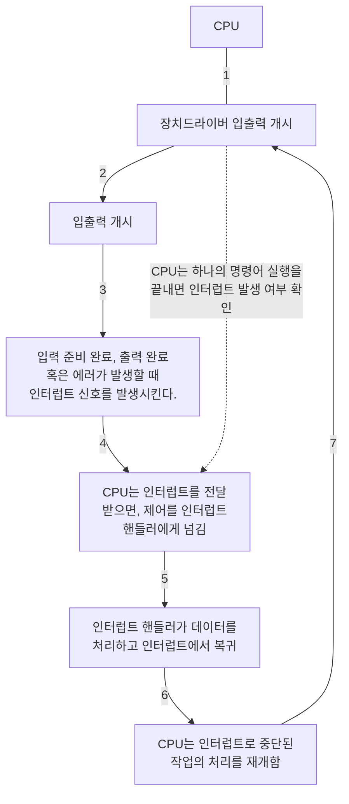
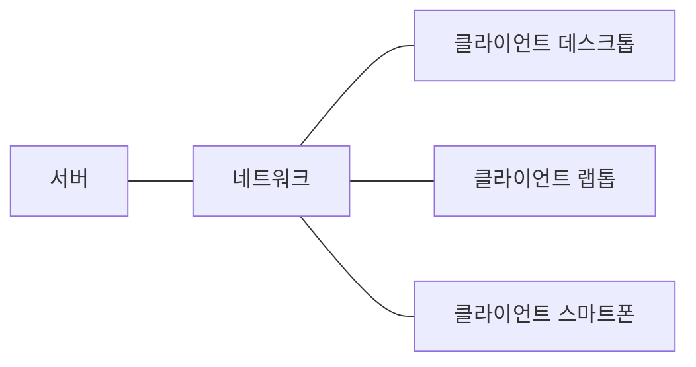
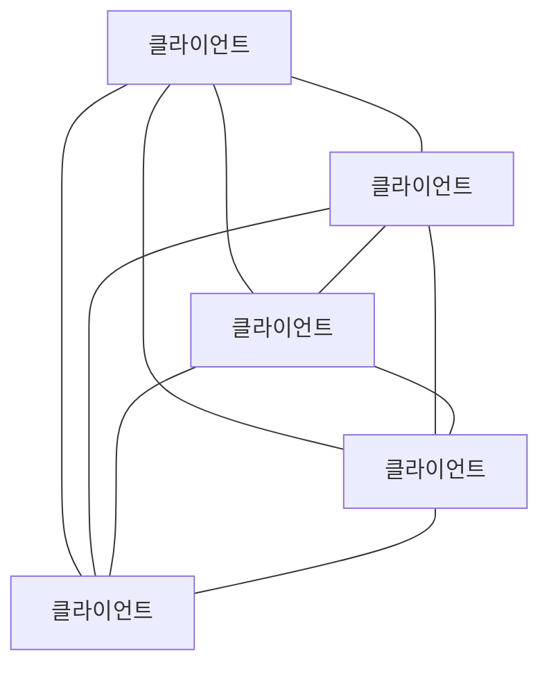
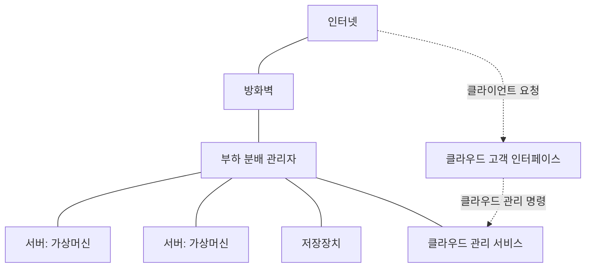

# Part1. 개관

- 운영체제는 컴퓨터 사용자와 컴퓨터 하드웨어 사이에서 중개자 역할을 한다.
  - 운영체제의 목적은 사용자가 프로그램을 편리하고 효율적으로 수행할 수 있는 환경을 제공하는 데 있다.
- 웅영체제는 컴퓨터 하드웨어를 관리하는 소프트웨어다.
  - 하드웨어는 컴퓨터 시스템의 정확한 동작을 보장하고 프로그래밍 시스템의 정상적인 동작을 방해하지 않도록 하는 적합한 메커니즘을 제공해야 한다.

# Chapter1. 서론

- 먼저 컴퓨터의 하드웨어의 구성과 구조를 이해하는 것이 중요하다.
  - CPU, 메모리, 입출력 장치, 저장장치
  - 운영체제의 근본적인 책임은 이러한 자원들을 프로그램에 할당하는 것이다.

## 1-1. 운영체제가 할 일

- 컴퓨터 시스템은 대개 네 가지 구성요소인 하드웨어, 운영체제, 응용 프로그램, 사용자로 구분할 수 있다.
  - 하드웨어: 중앙 처리 장치(CPU), 메모리 및 입출력(I/O) 장치 => 기본 계산용 자원을 제공
  - 응용 프로그램: 워드 프로세서, 스프레드시트, 컴파일러, 웹 브라우저 등 => 사용자의 계산 문제를 해결하기 위해 자원이 어떻게 사용될지를 정의
  - 운영체제: 사용자를 위해 다양한 응용 프로그램 간의 하드웨어 사용을 제어하고 조정한다.

### 1-1-1. 사용자 관점

- 컴퓨터에 대한 사용자 관점은 사용되는 인터페이스에 따라 달라진다.
  - 모니터, 키보드, 마우스로 구성된 PC 앞에서 작업한다.
  - 사용자가 자원을 독점하도록 설계 => 목표는 사용자가 수행하는 작업을 최대화하는 것
  - 이런 경우 운영체제는 대부분 사용의 용이성을 위해 설계.
- 점점 더 많은 사용자가 스마트폰과 태블릿과 같은 모바일 장치와 상호 작용
  - 일반적으로 셀룰러 또는 기타 무선 기술을 통해 네트워크에 연결
- 일부 컴퓨터는 사용자 관점이 존재하지 않거나 매우 작은 예도 있다.
  - 가전제품이나 자동차 내의 `내장형 컴퓨터` => 사용자의 개입 없이 작동하도록 설계

> #### 셀룰러 Cellular
> - 이동 무선 통신에서 셀의 설치에 의해 통신망을 구성, 운용하는 것을 말한다.

### 1-1-2. 시스템 관점

- 운영체제 = `자원 할당자 Resource Allocator`
- 자원에 대해 서로 상충할 수도 있는 많은 요청이 있으므로, 운영체제는 컴퓨터 시스템을 효율적이고 공정하게 운영할 수 있도록 어느 요청에 자원을 할당할지를 결정해야 한다.
- 운영체제에 대한 다소 다른 관점은 여러 가지 입출력 장치와 사용자 프로그램을 제어할 필요성을 강조한다.
  - 운영체제는 `제어 프로그램 Contorl Program`이다.
  - 컴퓨터의 부적절한 사용을 방지하기 위해 사용자 프로그램의 수행을 제어한다.
  - 특히 입출력 장치의 제어와 작동에 깊이 관여한다.

### 1-1-3. 운영체제의 정의

- 일반적으로 운영체제에 대한 적합한 정의는 없다.
- 일반적인 정의는 운영체제가 컴퓨터에서 항상 실행되는 프로그램(일반적으로 `커널`이라고 함)이다.
- 커널과 함께 두 가지 다른 유형의 프로그램이 있다.
  - 운영체제와 관련되어 있지만 반드시 커널의 일부일 필요는 없는 `시스템 프로그램`
  - 시스템 작동과 관련되지 않은 모든 프로그램을 포함하는 응용 프로그램
- 모바일 기기의 운영체제를 살펴보면 운영체제를 구성하는 기능의 수가 다시 증가하고 있음을 알 수 있다.
  - 종종 핵심 커널뿐만 아니라 `미들웨어`도 포함된다. 
  - ex) Apple의 IOS와 Google의 Android와 같이 가장 유명한 모바일 운영체제는 데이터베이스, 멀티미디어 및 그래픽을 지원하는 미들웨어와 함께 핵심 커널이 포함되어 있다.

> #### 미들웨어
> - 응용 프로그램 개발자에게 추가 서비스를 제공하는 일련의 소프트웨어 프레임워크

> #### 왜 운영체제를 공부하는가?
> - 운영체제를 만들거나 수정하는 사람은 소수다. 그렇다면 왜 운영체제와 그들의 작동방식을 공부할까?
> - 거의 모든 코드가 운영체제 위에서 실행되므로 운영체제 작동 방식에 대한 지식은 적절하고 효율적, 효과적이며 안전한 프로그래밍에 중요하기 때문이다.

## 1-2. 컴퓨터 시스템의 구성

- 현대의 범용 컴퓨터 시스템은 하나 이상의 CPU와 구성요소와 공유 메모리 사이의 액세스를 제공하는 공통 버스를 통해 연결된 여러 장치 컨트롤러로 구성된다.
  - 각 장치 컨트롤러는 특정 유형의 장치를 담당한다.
  - 컨트롤러에 따라 둘 이상의 장치가 연결될 수도 있다. ex) 하나의 USB 포트에 USB 허브 연결 가능
- 일반적으로 운영체제에는 각 장치 컨트롤러마다 `장치 드라이버`가 있다.
  - 장치 컨트롤러의 작동을 잘 알고 있고 운영체제에 장치에 대한 일관된 인터페이스를 제공한다.
  - CPU와 장치 컨트롤러는 병렬로 실행되어 메모리 사이클을 놓고 경쟁한다.
  - 공유 메모리를 질서 있게 액세스하기 위해 메모리 컨트롤러는 메모리에 대한 액세를 동기화한다.

### 1-2-1. 인터럽트 Interrupts

- 입출력 작업을 시작하기 위해 장치 드라이버는 장치 컨트롤러의 적절한 레지스터에 값을 적재한다.
  - 그런 다음 장치 컨트롤러는 이러한 레지스터의 내용을 검사하여 수행할 작업을 결정한다.
  - 컨트롤러는 장치에서 로컬 버퍼로 데이터 전송을 시작한다.
  - 데이터 전송이 완료되면 장치 컨트롤러는 장치 드라이버에게 작업이 완료되었음을 알린다.
  - 읽기 요청이라면 데이터 또는 데이터에 대한 포인터를 반환하여 운영체제의 다른 부분에 제어를 넘긴다.
  - 다른 작업이라면 "쓰기 완료", "장치 사용 중"과 같은 상태 정보를 반환한다. => `인터럽트`를 사용한다.

#### 1-2-1-1. 개요

- 하드웨어는 어느 순간이든 시스템 버스를 통해 CPU에 신호를 보내 인터럽트를 발생시킬 수 있다.
  - 인터럽트는 운영체제와 하드웨어 상호 작용 방식의 핵심 부분이다.
- CPU가 인터럽트되면, CPU는 하던 일을 중단하고 즉시 고정된 위치로 실행을 옮긴다.
  - 고정된 위치란, 인터럽트를 위한 서비스 루틴이 위치한 시작 주소를 가지고 있는 곳이다.
  - 인터럽트 서비스 루틴이 실행되고, 완료되면, CPU는 인터럽트 되었던 연산을 재개한다. 
- 인터럽트는 컴퓨터 구조의 중요한 부분이다.
  - 각 컴퓨터 설계는 저마다의 인터럽트 메커니즘을 가지고 있으며, 몇 가지 기능은 공통적이다.
  - 인터럽트가 요청되면, 인터럽트를 유발한 장치를 위한 인터럽트 서비스 루틴의 주소를 제공하기 위해 이 주소의 배열인 `인터럽트 벡터`가 인터럽트 요청과 함께 주어진 고유의 유일한 장치 번호로 색인된다.

#### 1-2-1-2. 구현

- `인터럽트 요청 라인 interrupt request line`이라는 선이 있는데, 이는 하나의 명령어의 실행을 완료할 때마다 CPU가 이 선을 감지한다.
  - CPU는 컨트롤러가 인터럽트 요청 라인에 신호를 보낸 것을 감지하면, 인터럽트 번호를 읽고 이 번호를 `인터럽트 벡터`의 인덱스로 사용하여 `인터럽트 핸들러 루틴 interrupt-handler routine`으로 점프한다.
  - 해당 인덱스와 관련된 주소에서 실행을 시작한다.
  - 인터럽트 처리기는 작업 중에 변경될 상태를 저장하고, 인터럽트 원인을 확인하고, 필요한 처리를 수행하고, 상태 복원을 수행하고, `return_from_interrupt` 명령어를 실행하여 CPU를 인터럽트 전 실행 상태로 되돌린다.
  - 장치 컨트롤러가 인터럽트 요청 라인에 신호를 선언하여 인터럽트를 `발생 raise`시키고 CPU는 인터럽트를 `포착 catch`하여 인터럽트 핸들러로 `디스패치 dispatch`하고 핸들러는 장치를 서비스하여 인터럽트를 `지운다 clear`

- 최신 운영체제에서는 더욱 정교한 인터럽트 처리 기능이 필요하다.
1. 중요한 처리 중에 인터럽트 처리를 연기할 수 있어야 한다.
2. 장치는 적절한 인터럽트 핸들러로 효율적으로 디스패치 할 방법이 필요하다.
3. 운영체제가 우선순위가 높은 인터럽트와 우선순위가 낮은 인터럽트를 구분하고 적절한 긴급도로 대응할 수 있도록 다단계 인터럽트가 필요하다.

- 이 세 가지 기능은 CPU 및 `인터럽트 컨트롤러 하드웨어`에 의해 제공된다.
- 대부분의 CPU에는 2개의 인터럽트 요청 라인이 있다.
  - 하나는 복구할 수 없는 메모리 오류와 같은 이벤트를 위해 예약된 `마스크 불가능 인터럽트 nonmaskable interruput`이다.
  - 두 번째 인터럽트 라인은 `마스킹 가능 maskable`이다. 인터럽트 되어서는 안되는 중요한 명령 시퀀스를 실행하기 전에 CPU에 의해 꺼질 수 있다.
- 벡터 방식 인터럽트 기법의 목적은 서비스가 필요한 장치를 결정하기 위해 하나의 인터럽트 핸들러가 가능한 모든 인터럽트 소스를 검색할 필요를 줄이기 위한 것이다.
  - 그러나 실제로 컴퓨터에는 인터럽트 벡터의 주소 개수보다 많은 장치가 있다.
  - 이 문제를 해결하는 일반적인 방법은 `인터럽트 체인 interrupt chain`을 사용하는 것이다.
- 인터럽트 기법은 또한 인터럽트 `우선순위 레벨 interrupt priority level`을 구현한다.
  - 레벨을 통해 CPU는 모든 인터럽트를 마스킹하지 않고도 우선순위가 낮은 인터럽트 처리를 연기할 수 있고, 우선순위가 높은 인터럽트가 우선순위가 낮은 인터럽트의 실행을 선점할 수 있다.
- 요약하면, 인터럽트는 최신 운영체제에서 비동기 이벤트를 처리하기 위해 사용된다.
  - 장치 컨트롤러 및 하드웨어 오류로 인해 인터럽트가 발생한다.
  - 가장 긴급한 작업을 먼저 수행하기 위해 최신 컴퓨터는 인터럽트 우선순위 시스템을 사용한다.
  - 인터럽트는 시간에 민감한 처리에 빈버하게 사용되므로 시스템 성능을 좋게 하려면 효율적인 인터럽트 처리가 필요하다.

### 1-2-2. 저장장치 구조 Storage Structure

- CPU는 메모리에서만 명령 적재 가능.
  - `RAM, Random-Access Memory`라는 재기록 가능한 메모리. => `DRAM, Dynamic Random-Access Memory`라 불리는 반도체 기술로 구현.
- 또한 `부트스트랩 프로그램`을 적재하기 위해 비휘발성 메모리인 `ROM`을 사용
  - 전기적으로 소거 가능한 프로그램 가능 읽기 전용 메모리 `EEPROM` 및 기타 형태의 `펌웨어`(쓰기 작업이 자주 발생하지 않고 비휘발성인 저장장치)
- `폰 노이만 구조 시스템`에서 실행되는 전형적인 명령-실행 사이클은 먼저 메모리부터 명령을 인출해, 그 명령을 `명령 레지스터 instruction register`에 저장한다.
  - 메모리 장치는 단지 일련의 메모리 주소만 인식.
  - 이들 주소[instruction counter, indexing, indirection, literal addresses 등]가 어ㄸㅎ게 생성되었는지 알지 못하며, 그것이 무엇인지 알지 못한다.

> #### 워드
> - 그 컴퓨터 구조의 본연의 데이터 단위
> - 예를 들어 64비트 컴퓨터라면 한 워드는 8바이트(64비트)다.

- 모든 프로그램과 데이터를 영구히 저장하기에 메인 메모리가 너무 작고, 휘발성이기 때문에 `보조저장장치`를 사용한다.
  - HDD, 비휘발성(NVM) 장치
  - NVM 장치의 가장 일반적인 형태는 플래시 메모리이다.
- 비휘발성 저장장치는 전원이 꺼졌을 때 내용을 유지한다. 이를 `NVS`라고 한다. 대부분의 경우 `NVS`는 보조저장장치를 가리킨다. 보통 2가지로 분류된다.
  - `기계적`: HDD, 광 디스크, 홀로그램 저장 장치 및 자기 테이프.
  - `전기적`: 플래시 메모리, FRAM, NRAM, SSD. 책에서는 `NVM`으로 언급.

### 1-2-3. 입출력 구조 I/O Structure

- 운영체제 코드의 상당 부분은 시스템 안정성과 성능에 대한 중요성과 장치의 다양한 특성으로 인해 I/O 관리에 할애된다.
- NVS I/O와 같은 대량 데이터 이동을 사용할 때 높은 오버헤드를 유발할 수 있으므로 `직접 메모리 액세스 DMA, Direct Memory Access`와 같은 기능이 사용된다.
  - 장치에 대한 버퍼 및 포인터, 입출력 카운트를 세팅한 후 장치 제어기는 **CPU의 개입 없이** 메모리로부터 자신의 버퍼 장치로 또는 버퍼로부터 메모리로 데이터 블록 전체를 전송한다.
  - 한 바이트마다 인터럽트가 발생하지 않고, 블록 전송이 완료될 때마다 인터럽트가 발생한다.

## 1-3. 컴퓨터 시스템 구조

### 1-3-1. 단일 처리기 시스템 Single-Processor Systems

- 몇 년 전까지만 해도 대부분의 컴퓨터 시스템은 단일 처리 코어를 가진 하나의 CPU를 포함하는 단일 프로세서를 사용했다.
  - `코어`는 명령을 실행하고 로컬로 데이터를 저장하기 위한 레지스터를 포함하는 구성요소다.
  - 이 시스템에는 다른 특수 목적 프로세서도 있다. 디스크, 키보드 및 그래픽 컨트롤러와 같은 장치별 프로세서 형태로 제공될 수 있다.
- 이 모든 전용 처리기들은 제한된 명령어 집합을 실행하고 사용자 프로세스를 실행하지는 않는다.
  - 때로 이 처리기들은 운영체제에 의해 관리되기도 하는데, 운영체제는 이 처리기들이 수행할 다음 태스크에 대한 정보를 보내고 처리기들의 상태를 감지한다.
- ex) 디스크 컨트롤러 마이크로프로세서는 주 CPU로부터 연속된 요청을 받아들여 자기 고유의 디스크 큐와 스케줄링 알고리즘을 구현한다. 
  - 이 배합은 CPU가 직접 디스크 스케줄링을 해야 하는 오버헤드를 감소시킨다.
  - PC의 키보드는 키스트로크를 CPU에 전송할 코드로 변환하는 마이크로프로세서를 가지고 있다.
- 운영체제는 이 전용 처리기들과 통신할 수 없으며 이 처리기들은 독립적으로 자신의 작업을 처리한다.
- 이런 마이크로프로세서는 포함하지 않고, 단일 처리 코어를 가진 범용 CPU가 하나만 있는 경우 시스템은 단일 프로세서 시스템이다.

### 1-3-2. 다중 처리기 시스템 Multiprocessor Systems

- 모바일 장치에서 서버에 이르기까지 최신 컴퓨터에서는 `다중 처리기 시스템`이 컴퓨팅 환경을 지배하고 있다.
  - 일반적으로 단일 코어 CPU가 있는 두 개 이상의 프로세서가 있다.
  - 프로세서는 컴퓨터 버스 및 때때로 클록, 메모리 및 주변 장치를 공유한다.
- 다중 처리기의 주요 장점은 처리량 증가다.
  - 즉, 프로세서 수를 늘리면 더 적은 시간에 더 많은 작업을 수행할 수 있다.
  - 그러나 N 프로세서의 속도 향상 비율은 N이 아니다.
  - 여러 프로세서가 하나의 작업에 협력할 때 모든 프로세서가 올바르게 작동하게 유지하는 데 일정한 양의 오버헤드가 발생한다.
- 가장 일반적인 다중 처리기 시스템은 각 피어 CPU 프로세서가 운영체제 기능 및 사용자 프로세스를 포함한 모든 작업을 수행하는 `SMP, Symmetric Multiprocessing`를 사용한다.
  - 각 CPU 처리기에는 개별 또는 로컬 캐시뿐만 아니라 자체 레지스터 세트가 있다.
  - 그러나 모든 프로세서는 시스템 버스를 통해 물리 메모리를 공유한다.
  - 이 모델의 장점은 많은 프로세스를 동시에 실행할 수 있다는 것이다.
  - 그러나 CPU가 독립적이기 때문에 하나는 유휴 상태이고 다른 하나는 과부하가 걸려 비효율적일 수 있다.
- `다중 처리기`는 시간이 지남에 따라 발전하여 이제는 여러 개의 컴퓨팅 코어가 단일 칩에 상주하는 `다중 코어` 시스템을 포함한다.
  - 칩 내 통신이 칩 간 통신보다 빠르므로 다중 코어 시스템은 단일 코어가 가지는 여러 칩보다 효율적일 수 있다.
  - 그리고 여러 개의 코어를 가지는 하나의 칩이 여러 개의 단일 코어 칩보다 훨씬 적은 전력을 사용한다. => 노트북과 모바일 장치에서는 중요한 문제
- 다중 코어 설계
  - 각각의 코어은 L1 캐시를 가지며, 하나의 칩은 L2 캐시를 공유한다.

> #### 컴퓨터 시스템 구성요소의 정의
> - `CPU`: 명령을 실행하는 하드웨어
> - `Processor`: 하나 이상의 CPU를 포함하는 물리적 칩
> - `Core`: CPU의 기본 계산 단위.
> - `Multicore`: 동일한 CPU에 여러 컴퓨팅 코어를 포함함.
> - `Multiprocessor`: 여러 프로세서를 포함함.

- 다중 처리기 시스템에 CPU를 추가하면 컴퓨팅 성능이 향상된다.
  - 그러나 이러한 개념은 그다지 확장성이 좋지 않고, CPU를 너무 많이 추가하면 시스템 버스에 대한 경합이 병목 현상이 되어 성능이 저하되기 시작한다.
  - 다른 방법은 각 CPU에 작고 빠른 로컬 버스를 통해 액세스 되는 자체 로컬 메모리를 제공하는 것이다.
  - 모든 CPU가 `공유 시스템 연결`로 연결되어 CPU가 하나의 물리 주소 공간을 공유한다.
  - 이 방법을 `MUMA, non-uniform memory access`라고 한다.
  - CPU가 로컬 메모리에 액세스 할 때 빠를 뿐만 아니라 시스템 상호 연결에 대한 경합도 없다. => 더 효과적으로 확장 가능.
- 하지만 잠재적 단점이 존재한다.
  - CPU가 시스템 상호 연결을 통해 원격 메모리에 액세스해야 할 때 지연 시간이 증가하여 성능 저하가 발생할 수 있다는 것이다.
- 마지막으로 `블레이드 서버`는 다수의 처리기 보드 및 입출력 보드, 네트워킹 보드들이 하나의 `chassis` 안에 장착되는 형태를 가진다.

### 1-3-3. 클러스터형 시스템 Clustered Systems

- 여러 CPU를 가진 시스템의 또 다른 유형은 `클러스터형 시스템`이다.
  - 다중 처리기 시스템과는 다르게, 둘 이상의 독자적 시스템 또는 노드들을 연결하여 구성한다. 각 노드는 통상 다중 코어 시스템이다.
  - 이런 시스템은 `약결합 loosely coupled`이라고 간주된다.
- 일반적으로 받아들여 지는 정의에 의하면 클러스터 컴퓨터는 저장장치를 공유하고 `근거리 통신망 LAN`이나 `InfiniBand`와 같은 고속의 `상호 연결망 interconnect`으로 연결된다.
- 클러스터링은 통상 `높은 가용성 availability`을 제공하기 위해 사용된다.
  - 즉, 하나 이상의 컴퓨터 시스템이 고장 나더라도 서비스는 계속 제공된다.
  - 일반적으로 높은 가용성은 시스템에 중복 기능을 추가함으로써 얻어진다.
  - 각 노드는 서로를 감시하며, 한 노드가 고장나면 고장난 노드의 저장장치에 대한 소유권을 넘겨 받고, 그 노드에서 실행 중이던 응용 프로그램을 다시 시작한다.
- 클러스터링은 비대칭적으로 또는 대칭적으로 구성될 수 있다.
- `비대칭형 클러스터링`에서는 다른 컴퓨터들이 응용 프로그램을 실행하는 동안 한 컴퓨터는 `긴급 대기 모드 hot-standby mode` 상태를 유지한다.
  - 이 긴급 대기 모드의 호스트는 활성 서버들을 감시하는 작업만을 수행한다.
  - 서버가 고장 난다면 긴급 대기 모드의 호스트가 활성 서버가 된다.
- `대칭형 클러스터링`에서는 둘 이상의 호스트들이 응용 프로그램을 실행하고 서로를 감시한다.
  - 가용한 하드웨어를 모두 사용하기 때문에 더 효율적이다.
  - 효율적으로 동작하기 위해서는 하나 이상의 응용 프로그램들이 실행 가능해야 한다.
- 한 클러스터가 네트워크로 연결된 다수의 컴퓨터 시스템으로 구성되므로 클러스터는 `고성능 계산` 환경을 제공하도록 사용될 수 있다.
  - 이러한 시스템은 클러스터 내의 모든 컴퓨터에서 응용을 병렬 수행할 수 있으므로 단일 처리기나 SMP 시스템보다 훨씬 큰 계산 능력을 제공할 수 있다.
  - 이는 `병렬화`라는 기법으로 프로그램을 컴퓨터의 개별 코어에서 혹은 클러스터의 각 컴퓨터에서 수행되는 분리된 요소로 나누는 작업을 포함한다.
  - 전형적으로 응용은 클러스터의 각 계산 노드가 문제 일부를 해결한 후 모든 노드의 결과를 결합하여 최종 해답을 얻게 된다.
- 다른 형태의 클러스터로 병렬(parallel) 클러스터와 WAN을 이용한 클러스터링이 있다.
  - 병렬 클러스터는 여러 호스트가 공유 저장장치상의 동일한 데이터에 접근할 수 있게 한다. 운영체제 대부분이 여러 호스트에 의한 이러한 동시 접근을 지원하지 않으므로 병렬 클러스터는 특수 소프트웨어 버전과 특별히 발매된 응용으로 달성된다.ㄴ
  - 데이터에 대한 공유 접근을 제공하기 위해 시스템은 접근 간의 충돌이 발생하지 않는 것을 보장하기 위하여 접근 제어와 잠금 기법을 제공해야 한다. `분산 잠금 관리자 distributed lock manager, DLM`라고 불리는 이 기능은 몇몇의 클러스터 기술에 포함되어 있다.
- 어떤 클러스터 제품은 수 킬로미터 떨어진 클러스터 노드들뿐 아니라 한 클러스터 안에서 수천 개의 노드를 지원한다.
  - 이러한 개선은 `스토리지 전용 네트워크 storage-area network, SAN`에 의해 가능해졌다.
  - SAN은 여러 호스트들이 여러 저장장치에 부착할 수 있게 한다. 만일 응용과 데이터가 SAN에 저장된다면 클러스터 소프트웨어는 SAN에 연결된 임의의 호스트에서 수행되도록 으용을 배정할 수 있다.
  - 호스트가 고장 나면 다른 호스트가 그 응용을 넘겨 받는다. 데이터베이스 클러스터에서는 수십 개의 호스트가 동일한 데이터베이스를 공유할 수 있기 때문에 성능과 신뢰도를 매우 증가시키게 된다.

> #### HADOOP
> - Hadoop은 단순하고 저렴한 하드웨어 구성요소를 포함하는 클러스터형 시스템에서 `대용량 데이터 세트 Big Data`의 분산 처리에 사용되는 공개 소스 소프트웨어 프레임워크다.
> - Hadoop은 단일 시스템에서 수천 개의 컨퓨팅 노드를 포함하는 클러스터로 확장되도록 설계되었다.
> - 작업은 클러스터의 노드에 할당되며 Hadoop은 노드 간 통신을 정렬하여 처리할 병렬 계산을 관리하고 결과를 통합한다.
> - 또한 노드의 장애를 감지하고 관리하여 효율적이고 매우 안정적인 분산 컴퓨팅 서비스를 제공한다.
> - Hadoop은 다음 세 가지 구성요소로 구성된다.
> 1. 분산 컴퓨팅 노드에서 데이터와 파일을 관리하는 분산 파일 시스템
> 2. `YARN, Yet Another Resource Negotiator` 프레임워크는 클러스터 내의 자원을 관리하고 클러스터의 노드에 작업을 스케줄한다.
> 3. `MapReduce` 시스템은 클러스터의 노드에서 데이터를 병렬 처리할 수 있게 한다.
> - Hadoop은 Linux 시스템에서 실행되도록 설계되었으며 Hadoop 응용 프로그램은 PHP, Perl 및 Python과 같은 스크립팅 언어를 비롯한 여러 프로그래밍 언어를 사용하여 작성할 수 있다.

## 1-4. 운영체제의 작동 Operating-System Operations

- 운영체제는 프로그램이 실행되는 환경을 제공한다.
- 컴퓨터 전원을 키거나 재부팅할 때와 같이 컴퓨터를 실행하려면 초기 프로그램을 실행해야 한다.
  - 일반적으로 컴퓨터 하드웨어 내에 펌웨어로 저장된다.
  - CPU 레지스터에서 장치 컨트롤러, 메모리 내용에 이르기까지 시스템의 모든 측면을 초기화한다.
  - 부트스트랩 프로그램은 운영체제를 적재하는 방법과 해당 시스템 실행을 시작하는 방법을 알아야 한다. 이 목표를 달성하려면 부트스트랩 프로그램이 운영체제 커널을 찾아 메모리에 적재해야 한다.
- 커널이 적재되어 실행되면 시스템과 사용자에게 서비스를 제공할 수 있다.
  - 일부 서비스는 커널이 실행되는 전체 시간 동안 실행되는 `시스템 데몬`이 되기 위해 부팅할 때 메모리에 적재되는 시스템 프로그램에 의해 커널 외부에서 제공된다.

### 1-4-1. 다중 프로그래밍과 다중 태스킹 multiprogramming and multitasking

- 운영체제의 가장 중요한 측면 중 하나는 일반적으로 하나의 프로그램이 항상 CPU나 I/O 장치를 계속 점유할 수 없고, 여러 프로그램을 실행할 수 있다는 것이다.
  - `다중 프로그래밍 multiprogramming`에서 실행 중인 프로그램을 `프로세스`라고 한다.
- 운영체제는 여러 프로세스를 동시에 메모리에 유지한다.
  - 운영체제는 이러한 프로세스 중 하나를 선택하여 실행하기 시작한다.
  - I/O 때문에 CPU가 유휴 상태가 될 수 있지 않을까? `다중 프로그래밍`은 CPU가 쉬지 못하게 한다. 일부 작업을 기다려야 한다면, 점유된 CPU를 바로 다른 프로세스로 전환하여 실행해버린다.
  - 결국 첫번째 프로세스는 대기를 마치고 CPU를 다시 돌려받는다.
  - 하나 이상의 프로세스를 실행해야 하는 한 CPU는 유휴 상태일 수 없다는 얘기다.
- `다중 태스킹 multitasking`은 다중 프로그래밍의 논리적 확장이다.
  - `다중 태스킹` 시스템에서 CPU는 여러 프로세스를 전환하며 프로세스를 실행하지만 전환이 자주 발생하여 사용자에게 빠른 `응답 시간`을 제공하게 된다.
  - 입출력 시스템은 사람의 영향이 굉장히 크다. ex) 사용자의 타이핑 속도는 컴퓨터에 비하면 굉장히 느리고, 이런 대화식 입력이 진행되는 동안 CPU를 쉬게 하지 않고, 운영체제는 CPU를 다른 사용자의 프로그램으로 신속하게 전환한다.
- 동시에 여러 프로세스를 유지하려면 메모리 관리 방식이 필요하다. 또한 다음 실행할 프로세스를 선택해야 한다.
  - => `CPU 스케줄링`
- 적절한 응답 시간을 보장하는 더 일반적인 방법은 `가상 메모리 virtual memory`인데, 이것은 일부만 메모리에 적재된 프로세스의 실행을 허용하는 기법이다.
  - 실제 `물리 메모리`보다 더 큰 값을 지정할 수 있다는 특징이 있다.
  - 메인 메모리를 크고 균등한 저장장치의 배열로 추상화하여, 사용자에게 보이는 논리 메모리를 물리 메모리로부터 분리시킨다. => 메모리 저장장치의 한계로부터 자유로워짐.\
- 다중 프로그래밍 및 다중 태스킹도 보조저장장치에 존재하는 파일 시스템을 제공한다.

### 1-4-2. 이중-모드와 다중모드 운용 Dual-Mode and Multimode Operation

- 운영체제와 사용자는 자원을 공유하기 때문에 악의적인 프로그램으로 인해 잘못 실행되지 않도록 보장해야 한다.
  - 시스템을 올바르게 실행하려면 운영체제 코드 실행과 사용자-정의 코드 실행을 구분할 수 있어야 한다.
- 적어도 두 개의 독립된 연산 모드를 필요로 한다.
  - `사용자 모드`
  - `커널 모드[수퍼바이저 모드, 시스템 모드, 혹은 특권 모드(privileged mode)]`
- `Mode bit`라고 하는 하나의 비트가 현재의 모드를 나타내기 위해 컴퓨터의 하드웨어에 추가되었다.
  - `0`: 커널 모드
  - `1`: 사용자 모드
- 컴퓨터 시스템이 사용자 Application을 위하여 실행될 때 시스템은 사용자 모드에 있게 된다.
  - 그러나 사용자 Application이 운영체제로부터 서비스를 요청하면(시스템 콜을 통합) 이 요청을 수행하기 위해서는 사용자 모드에서 커널 모드로 전환해야 한다.
- 운영체제가 컴퓨터의 제어를 얻을 때마다 항상 커널 모드에 있게 된다.
- 동작의 이중 모드는 잘못된 사용자로부터 운영체제를, 그리고 잘못된 사용자 서로를 보호하는 방법을 우리에게 제공한다.
  - 악영향을 끼칠 수 잇는 일부 명령을 `특권 명령 priviledged instruction`으로 지정함으로써 이러한 보호를 달성한다.
  - 특권 명령은 커널 모드에서만 수행 가능하다.
  - 특권 명령의 ex) 커널 모드로 전환하는 명령어, I/O 제어, 타이머 관리, 인터럽트 관리
- 또한 모드의 개념은 두 가지 이상으로 확장될 수 있다.
  - Intel 프로세서에는 4개의 분리된 `보호 링`이 있다.
  - ARMv8 시스템에는 8가지 모드가 있다.
  - 가상화를 지원하는 CPU는 종종 `VMM, Virtual Machine Manager`이 시스템을 제어하는 시점을 표시하기 위한 별도의 모드를 가진다.
- 운영체제로 다시 전환하기 위해 인터럽트, 트랩 또는 시스템 콜을 사용한다.
- `시스템 콜`
  - 사용자 프로그램이 자신을 대신하여 운영체제가 수행하도록 지정되어 있는 작업을 운영체제에 요청할 수 있는 방법을 제공
  - 시스템 콜은 일반적으로 인터럽트 벡터의 특정 위치로 트랩을 거는 형태를 취한다.
  - 이 트랩은 보통 `trap` 명령어를 통해 수행되지만 몇몇 시스템은 `syscall`이라는 특정 명령어를 가지기도 한다.
- 시스템 콜이 수행될 때, 시스템 콜은 하드웨어에 의해 하나의 소프트웨어 인터럽트로 취급된다.
  - 제어가 인터럽트 벡터를 통해 운영체제 내의 서비스 루틴으로 전달되고, 모드 비트가 커널 모드로 설정된다. 시스템 콜 서비스 루틴은 운영체제의 일부이다.
  - 커널은 인터럽트를 발생시킨 명령을 검사하여 어떤 시스템 콜이 발생했는지를 결정한다.
  - 커널은 인수가 정확하고 합법적인지를 검증하고 요청을 수행한 후 제어를 시스템 콜 다음의 명령으로 복귀한다.
  - 여기서 규칙을 위반하는 비정상적인 요청이 발견되면 오류가 하드웨어에 의해 탐지된다. 운영체제에서는 트랩을 발생시키고, 제어가 운영체제로 넘어간다. 이때 운영체제는 프로그램을 비정상 종료시켜 버린다.

### 1-4-3. 타이머 Timer

- 운영체제가 CPU에 대한 제어를 유지할 수 있도록 보장해야 한다.
  - 사용자 프로그램이 `무한 루프 infinite loop`에 빠지거나 시스템 서비스 호출에 실패하여, 제어가 운영체제로 복귀하지 않는 경우가 없도록 반드시 방지해야 한다.
  - 이러한 목적을 달성하기 위해 `timer`를 사용할 수 있다.
- 타이머는 지정된 시간 후 컴퓨터를 인터럽트 하도록 설정할 수 잇따.
  - 이 시간은 고정 혹은 가변일 수 있다.
- `가변 타이머`는 일반적으로 고정률의 클록(fixed-rate clock)과 계수기로 구현한다.
  - 운영체제가 계수기 값을 설정한다. 클록이 똑딱(tick)할 때마다 계수기가 감소한다.
  - 계수기가 0이 될 때 인터업트가 발생한다.
  - ex) 10bit 계수기 -> 1~1024ms 사이의 간격을 가진 인터럽트를 허용
- 사용자에게 제어를 양도하기 전에, 운영체제는 타이머가 인터럽트를 할 수 있도록 설정되었지를 확인한다.
  - 타이머가 인터럽트를 발생시키면 제어는 자동으로 운영체제에 넘어간다.
  - 타이머 값을 변경하는 명령은 명백히 특권 명령이다.

## 1-5. 자원 관리 Resource Management

- 운영체제 = 자원 관리자
  - 시스템의 CPU, 메모리 공간, 파일-저장 공간 및 I/O 장치

### 1-5-1. 프로세스 관리 Process Management

- 프로그램은 CPU에 의해 명령이 실행되지 않으면 아무것도 할 수 없다.
  - 프로그램 = 프로세스
- 프로세스는 자기 일을 수행하기 위해 CPU, 메모리, 파일, 그리고 입출력 장치를 포함한 여러 가지 자원을 필요로 한다.
  - 물리적 논리적 자원 외에, 여러 초기화 데이터(입력)도 아울러 전달될 수 있다.
- 프로그램 그 자체는 프로세스가 아니다.
  - 즉, 하나의 프로그램은 디스크에 저장된 파일의 내용과 같이 `수동적 passive` 개체지만 프로세스는 다음 수행할 명령을 지정하는 `프로그램 카운터 program counter`를 가진 `능동적 active`인 개체다.
- 운영체제는 프로세스 관리와 연관해 다음과 같은 활동에 대한 책임을 진다.
  - 사용자 프로세스와 시스템 프로세스의 생성과 제거
  - CPU에 프로세스와 스레드 스케줄링
  - 프로세스의 일시 중지와 재수행
  - 프로세스 동기화를 위흔 기법 제공
  - 프로세스 통신을 위한 기법 제공

### 1-5-2. 메모리 관리 Memory Management

- 메모리는 크기가 수십 만에서 수십 억까지의 범위를 갖는 바이트의 대용량 배열이다.
  - 각 바이트는 자신의 주소를 가진다.
  - 빠른 접근이 가능한 데이터 저장소이다.
- 폰 노이만 구조의 컴퓨터에서는 CPU가 `명령어 인출 사이클 instruction fetch-cycle` 동안 메인 메모리로부터 명령어를 읽고, `자료 인출 사이클 data fetch-cycle` 동안 메인 메모리로부터 데이터를 일고 쓴다.
- 메인 메모리는 일반적으로 CPU가 직접 주소를 지정할 수 있고, 그리고 직접 접근할 수 있는 유일한 대량 메모리이다.
  - ex1) 디스크로부터 가져온 데이터 -> 메모리
  - ex2) 메모리에 CPU가 실행할 명령을 저장
- 프로그램이 수행되기 위해서는 반드시 절대 주소로 `매핑 mapping`되고 메모리에 적재되어야 한다.
  - 프로그램을 수행하면서, 이러한 절대 주소를 생성하여 메모리의 프로그램 명령어와 데이터에 접근한다.
  - 최종적으로 프로그램이 종료되고 프로그램이 차지하던 메모리 공간은 가용공간으로 선언된다. 그러면 해당 공간은 다음 프로그램이 적재되어 수행될 수 있다.
- 컴퓨터의 응답 속도를 개선하기 위해 메모리에 여러 개의 프로그램을 유지해야 하며, 이를 위해 메모리 관리 기법이 필요하다. 종류는 여러 개가 있다.
- 특정 시스템에 대한 메모리 관리 기법의 선택은 여러 요인에 의해 결정되지만, 특히 시스템의 하드웨어 설계에 좌우된다. 각 알고리즘은 자기를 위한 하드웨어의 지원이 필요하다.
- 운영체제는 메모리 관리와 관련해 다음과 같은 일을 담당해야 한다.
  - 메모리의 어느 부분이 현재 사용되고 있으며 어느 프로세스에 의해 사용되고 있는지를 추적해야 한다.
  - 필요에 따라 메모리 공간을 할당하고 회수해야 한다.
  - 어떤 프로세스(또는 그 일부)들을 메모리에 적재하고 제거할 것인가를 결정해야 한다.

### 1-5-3. 파일 시스템 관리 File-System Management

- 컴퓨터 시스템의 편리한 사용을 위해, 운영체제는 정보 저장장치에 대한 균일한 논리적 관점을 제공한다.
  - 운영체제는 저장장치의 물리적 특성을 추상화하여 논리적인 저장 단위인 파일을 정의한다.
  - 운영체제는 파일을 물리적 매체로 매핑하며, 저장장치를 통해 이들 파일에 접근한다.
- 대부분의 매체는 디스크 드라이브와 같은 장치에 의해 제어되며, 이들 장치 또한 자신의 독특한 특성이 있다.
  - 이런 속성에는 접근 속도, 용량, 데이터 전송률, 그리고 접근 방식(순차 접근, 임의 접근) 등이 있다.
- 운영체제는 대량 저장 매체와 그것을 제어하는 장치를 관리함으로써 파일의 추상적인 개념을 구현한다.
  - 또한 파일은 사용하기 쉽도록 통상 디렉토리들로 구성된다.
  - 다수의 사용자가 파일에 접근하려고 할 때는 누구에 의해서, 그리고 어떤 방법으로 파일이 접근되어야 하는가를 통제하는 것이 바람직하다.
- 운영체제는 파일 관리를 위하여 다음과 같은 일을 담당한다.
  - 파일의 생성 및 제거
  - 디렉터리 생성 및 제거
  - 파일과 디렉터리를 조작하기 위한 프리미티브의 제공
  - 파일을 보조저장장치로 매핑
  - 안정적인(비휘발성) 저장 매체에 파일을 백업

### 1-5-4. 대용량 저장장치 관리 Mass-Storage Management

- HDD와 NVM 장치
- 운영체제는 보조저장장치 관리와 관련해 아래와 같은 활동을 담당한다.
  - 마운팅과 언마운팅
  - `사용 가능 공간 free-space`의 관리
  - 저장장소 할당
  - 디스크 스케줄링
  - 저장장치 분할
  - 보호
- 3차 저장장치는 시스템 성능에는 중요하지 않지만 운영체제에 의해 관리되어야만 한다. 
  - 어떤 운영체제 들은 이 역할을 직접 수행하며 다른 운영체제들은 이 역할을 응용 프로그램에게 맡기기도 한다.

### 1-5-5. 캐시 관리 Cache Management 

- CPU 내부의 프로그램 가능한 레지스터들은 메인 메모리를 위한 고속의 캐시로 볼 수 있다.
- 프로그래머(또는, 컴파일러)는 어느 정보를 메인 메모리에 두고, 어느 정보를 레지스터에 둘 것인지를 결정하는 레지스터 할당 정책과 교체 알고리즘을 구현한다.
- 전적으로 하드웨어로 구현된 캐시도 있다.
  - ex) 명령 캐시: CPU가 메인 메모리로부터 다음 명령을 인출해 올 동안 몇 사이클을 기다려야 한다. 따라서 시스템 대부분은 수행될 것으로 예상되는 명령을 넣어두는 명령 캐시를 가지고 있다.
- 캐시는 크기가 제한되어 있으므로 캐시 관리는 중요한 설계 문제이다.
  - 캐시의 크기와 교체 정책을 신중하게 선택하면 성능이 크게 향상될 수 있다.

| 층 | 1 | 2 | 3 | 4 | 5 |
|:--|:--|:--|:--|:--|:--|
| 명칭 | 레지스터 | 캐시 | 메인 메모리 | 반도체 디스크 | 디스크 저장장치 |
| 전형적인 크기 | < 1 KB | < 16 MB | < 64 GB | < 1 TB | < 10 TB |
|구현 기술|다중포트를 가지는 고유 메모리, CMOS|온칩 또는 오프칩 CMOS RAM|CMOS SRAM|플래시 메모리|자기 디스크|
|접근시간(ms)|0.25-0.5|0.5-25|80-250|25,000-50,000|5,000,000|
|대역폭(MB/sec)|20,000-100,000|5,000-10,000|1,000-5,000|500|20-150|
|관리자|컴파일러|하드웨어|운영체제|운영체제|운영체제|
|백업 여부|캐시|메인 메모리|디스크|디스크|CD 또는 테이프|

- 저장장치의 계층 구조에서 각 수준 간의 정보 이동은 하드웨어 설계나 제어하는 운영체제에 따라 명시적 또는 묵시적으로 이뤄진다.
  - ex) 캐시로부터 CPU 및 레지스터로의 데이터 전송은 통상 운영체제의 간섭 없이 하드웨어적으로 이루어진다. 반면 디스크와 메모리 간의 데이터 전송은 통상 운영체제에 의해 제어된다.

- 메모리의 계층 구조에서, 동일한 데이터가 서로 다른 수준의 저장장치 시스템에 나타나게 된다.
- ex) B라는 파일에 있는 A라는 변수를 1 증가시킴 (파일 B는 자기 디스크에 저장되어 있다.)
  - 증가 연산은 먼저 A가 있는 디스크 블록을 메인 메모리로 복사해오는 입출력 연산을 호출함으로써 진행된다.
  - 이어서 A를 캐시에 복사하고, 이어 A를 다시 내부 레지스터로 복사한다. 따라서 A의 복사본이 여러 곳에 존재하게 된다.
  - 내부 레지스터에서 증가가 일어나면, A의 값은 여러 저장장치 시스템에서 서로 달라진다.
  - A의 값은 자기 디스크에 새로운 A의 값이 다시 기록된 이후에야 비로소 같아진다.
- CPU가 여러 개의 프로세스 사이에서 이리저리 전환되는 다중 태스킹 환경에서는, 여러 개의 프로세스가 A에 접근하기를 원할 경우 이들 각 프로세스가 가장 최근에 갱신된 A의 값을 얻을 것을 보장하기 위해서는 극도의 주의가 필요하다.
- CPU가 내부 레지스터를 유지할 뿐만 아니라 로컬 캐시도 갖고 있는 다중 처리기 환경하에서는 상황이 더욱 복잡해진다.
  - 이런 환경에서는 A의 복사본이 동시에 여러 캐시에 존재할 수 있다.
  - 여러 개의 CPU 모두 동시에 실행될 수 있으므로, 한 캐시에 있는 A 값이 갱신될 경우 A가 존재하는 모든 캐시에 즉각적으로 반영되어야 한다.
  - 이러한 문제를 `캐시 일관성 문제`라고 하며, 이는 일반적으로 하드웨어적 문제다.
- 분산 환경에서는 상황이 훨씬 더 복잡해진다.
  - 동일한 파일의 여러 사본을 다른 컴퓨터에 보관할 수 있따.
  - 여러 복제본에 동시에 액세스하여 업데이트 할 수 있으므로 일부 분산 시스템은 복제본을 한 곳에서 업데이트 할 때 다른 모든 복제본을 가능한 한 빨리 최신 상태로 유지하는 것을 보장한다.

### 1-5-6. 입출력 시스템 관리 I/O System Management

- 운영체제의 목적 중 하나는 사용자에게 특정 하드웨어 장치의 특성을 숨기는 것이다.
  - ex) UNIX에서 입출력 장치의 특성은 `입출력 서브시스템`에 의해 운영체제 자체의 대부분으로부터 숨겨져 있다.
- 입출력 시스템은 다음과 같이 구성되어 있다.
  - 버퍼링, 캐싱, 스풀링을 포함한 메모리 관리 구성요소
  - 일반적인 장치 드라이버 인터페이스
  - 특정 하드웨어 장치들을 위한 드라이버
- 장치 드라이버만이 자신에게 지정된 특정 장치의 특성을 알고 있다.

## 1-6. 보안과 보호 Security and Protection

- 컴퓨터 시스템이 다수의 사용자를 가지며 다수 프로세스의 병행 수행을 허용한다면, 데이터에 대한 접근은 반드시 규제되어야 한다.
  - 이를 위해 파일, 메모리 세그먼트, CPU 및 다른 자원들에 대해 운영체제로부터 적절한 허가를 획득한 프로세스만이 작업할 수 있도록 보장하는 기법이 필요하다.
  - 예를 들어, 메모리 주소지정 하드웨어는 프로세스가 자신의 주소 영역에서만 실행될 수 있도록 보장한다.
  - 타이머는 모든 프로세스가 CPU의 제어를 얻은 후 결국에는제어를 양도하도록 보장한다.
  - 여러 주변 장치의 무결성이 보호받도록, 장치 제어 레지스터들에 사용자가 접근할 수 없게 한다.
- `보호 protection`
  - 컴퓨터 시스템이 정의한 자원에 대해 프로그램, 프로세스, 또는 사용자들의 접근을 제어하는 기법
  - 구성요소 서브시스템 간의 인터페이스에서 잠재적인 오류를 검출함으로써 시스템의 신뢰성을 증가시킬 수 있다.
- 컴퓨터 시스템은 충분한 보호 기능이 있더라도 여전히 고장이 나거나 부적절한 접근을 허용할 수 있다.
  - ex) 사용자의 인증 정보 도난 => 파일 & 메모리 보호 기능이 작동하더라도 사용자의 데이터는 복사 또는 삭제될 수 있다.
- `보안 Security`
  - 외부 또는 내부의 공격을 방어하는 기능
- 식별자의 개념
  - 운영체제는 대부분 개인 사용자를 구분하는 `사용자 식별자 user IDs`의 리스트를 유지한다. (Windows에서는 `보안 식별자 security ID, SID`라고 함)
  - 어떤 상황에서는 각 사용자가 아니라 사용자의 집합을 구분하기를 원하는데, 이 때는 그룹 기능을 사용하게 된다. 그룹 기능은 시스템 전체에 존재하는 그룹 이름과 `그룹 식별자`의 리스트로 구현될 수 있다.
  - 보통의 위의 2개의 개념으로 충분하지만, 때때로 `권한 상승`이 필요한 경우도 있다.
    - UNIX에서는 프로그램이 수행될 때 `setuid` 속성을 이용하여 현 사용자의 식별자가 아니라 접근하려고 하는 파일의 소유주 식별자를 이용하여 동작할 수 있다. 
    - 프로세스가 종료되거나 특권을 해제하기 전까니느 이 `유효 사용자 식별자 effective user ID`를 이용하여 수행된다. 

## 1-7. 가상화 Virtualization

- `가상화`는 단일 컴퓨터의 하드웨어를 여러 가지 실행 환경으로 추상화하여 개별 환경이 자신만의 컴퓨터에서 실행되고 있다는 환상을 만들어내는 기술이다.
- `가상 머신`의 사용자는 단일 운영체제에서 동시에 실행되는 다양한 프로세스로 전환할 수 있는 것과 동일하게, 다양한 운영체제로 전환이 가능하다.
- 넓은 의미의 가상화 소프트웨어는 에뮬레이션을 포함하는 클래스의 구성원이다.
  - 소프트웨어로 컴퓨터 하드웨어를 시뮬레이션하는 `에뮬레이션`은 일반적으로 소스 CPU 유형이 대상 CPU 유형과 다른 경우 사용된다.
  - 에뮬레이션 비용이 매우 크다. => 기계어 수준의 모든 명령어를 모두 번역해야 하기 때문 
- 이와 달리 가상화는 특정 CPU를 위해 컴파일된 운영체제가 동일 CPU용의 다른 운영체제 내에서 수행된다.

## 1-8. 분산 시스템 Distributed Systems

- 분산 시스템은 물리적으로 떨어져 있는 이기종 컴퓨터들의 집합이다.
  - 컴퓨터들은 사용자가 시스템 내의 다양한 자원들을 접근할 수 있도록 네트워크로 연결되어 있다.
- `네트워크`는 가장 단순하게 보면 두 개 이상 시스템 간의 통신 경로이다.
  - 분산 시스템의 많은 기능은 네트워킹에 의존하고 있다.
  - 네트워크는 사용되는 프로토콜, 노드 간의 거리, 그리고 전송 매체에 따라 다르다.
- 네트워크의 유형
  - LAN, 근거리 통신망
  - WAN, 광역 통신망
  - MAN, 도시권 통신망
  - PAN, 단거리 통신망 (블루투스와 802.11 장치의 무선 통신 기술)
- 일부 운영체제는 네트워크 연결 제공 개념을 넘어서서 네트워크 및 분산 시스템 개념을 취했다.
  - `네트워크 운영체제`는 다른 컴퓨터의 다른 프로세스가 메시지를 교환할 수 있도록 하는 통신 체계와 함께 네트워크를 통한 파일 공유와 같은 기능을 제공하는 운영체제이다.
  - 네트워크 운영체제를 실행하는 컴퓨터는 네트워크를 인식하고 다른 네트워크 컴퓨터와 통신할 수 있지만 네트워크의 다른 모든 컴퓨터와는 자율적으로 작동한다.
- 분산 운영체제는 그에 비해 덜 자율적인 환경을 제공한다.
  - 하나의 운영체제가 네트워크를 제어하는 것처럼 보이기 위해 여러 컴퓨터가 밀접하게 통신해야 한다.

## 1-9. 커널 자료구조 Kernel Data Structures

- 시스템에서 데이터가 구조화되는 방법

### 1-9-1. 리스트, 스택 및 큐 Lists, Stacks, and Queues

- 메인 메모리는 하나의 `배열 Array`로 구축된다.
  - 저장된 데이터가 한 바이트보다 커서 그 데이터에 다수의 바이트가 할당되면 그 데이터는 `데이터 수` * `데이터 크기`로 주소 지정된다.
  - 반면 크기가 변하는 데이터의 경우, 한 데이터를 제거하고 나머지 데이터들을 유지해야 하는 경우에는 배열 대신 다른 자료구조를 사용해야 한다.
- 배열에 이어 `리스트 List`도 가장 기본적인 자료 구조 중 하나이다.
  - `배열`의 각 항은 직접 접근할 수 있으나 `리스트`의 항들은 특정 순서로 접근해야 한다. 즉 `리스트`는 데이터 값들의 집단을 하나의 시퀀스로 표시한다. 
  - 이 구조를 구현하는 가장 일반적인 방법은 `연결 리스트`이다. (단일 연결 리스트, 이중 연결 리스트, 원형 연결 리스트)
    - 가변 수의 항들을 수용하며 항의 삭제와 삽입이 쉽다.
    - 하지만 특정 항을 인출할 때의 성능이 `O(n)`이라는 점이 단점이다.
- 운영체제는 함수를 호출할 경우 종종 `스택 Stack`을 사용한다.
  - 함수를 호출할 때 인수, 로컬 변수 및 복귀 주소 등이 스택에 푸쉬되고 함수로부터 복귀할 대 이들 항을 스택으로부터 `pop`한다.
- `큐 Queue`는 운영체제에서 흔하게 사용된다.
  - ex) 프린터 I/O 순서 보장
  - CPU에서 수행을 기다리는 태스크들은 종종 큐로 구성된다.

### 1-9-2. 트리 Trees

- 트리 구조에서 데이터 값들은 부모-자식 관계로 연결된다.
- `일반 트리 general tree`에서는 부모는 임의의 수의 자식을 가질 수 있다.
- `이진 트리 binary tree`에서 부모는 최대 두 개의 자식을 가질 수 있다. (좌, 우)
- `이진 탐색 트리 binary search tree`는 추가로 부모의 두 자식 사이에 순서를 요구한다. (좌 <= 우)
  - 하나의 항을 찾기 위한 최악의 경우는 `O(n)`이다. (ex) 좌, 우 중 하나로 쏠렸을 경우)
- 이러한 상황을 방지하기 위해 `균형 이진 탐색 트리 balanced binary search tree`를 만드는 알고리즘을 사용할 수 있다.
  - 이 경우 n개의 항을 갖는 트리의 최대 깊이가 `log n`이 되므로 최악의 경우에 `O(log n)`의 성능을 보장할 수 있다.
  - Linux는 CPU 스케줄링 알고리즘의 일부로 `red-black tree`라는 균형 이진 탐색 트리를 사용한다.

### 1-9-3. 해시 함수와 맵 Hash Functions and Maps 

- `해시 함수 Hash functions`는 데이터를 입력받아 이 데이터에 산술 연산을 수행하여 하나의 수를 반환한다.
  - 이 수를 데이터를 인출하기 위한 인덱스로 사용할 수 있다.
  - `리스트`가 값을 인출하기 위해 최대 `O(n)`의 비교가 필요한 반면, 해시 함수를 사용해 데이터를 인출하면 O(1)만큼 좋을 수 있다.
- 해시 함수의 단점 중 하나는 두 개의 서로 다른 입력이 하나의 출력 값을 가질 수 있다는 것이다.
  - 이를 `해시 충돌 hash collision`이라고 하며 테이블의 각 항에 연결 리스트를 두어 동일한 해시 값을 갖는 모든 항을 수록하게 한다. (리스트가 아닌 다음 칸에 넣는 방법도 있다.)
  - 충돌이 많을수록 해시 함수의 효율이 떨어지게 된다.
- 해시 함수의 한 용도는 `해시 맵 Hash map`을 구현하는 것이다.
  - 해시 맵은 해시 함수를 사용해 [key:value] 매핑을 한다.
  - ex) 사용자:패스워드 매핑

### 1-9-4. 비트맵 Bitmaps

- `비트맵 Bitmaps`은 n개의 항의 상태를 나타내는 데 사용 가능한 n개의 이진 비트 스트링이다.
  - ex) 다수의 자원이 있다고 가정해보자. 각 자원의 가용 여부를 이진 비트의 값으로 표시한다. `0` = 사용 가능 / `1` = 사용 불가 (반대도 가능)
    - `001011101`: 자원 2, 4, 5, 6, 8은 사용 불가 / 자원 0, 1, 3, 7은 사용 가능
- 비트맵의 장점은 **공간 효율**이다.
  - 단일 비트대신 8비트 부울 값을 사용하면 자료구조는 8배의 크기가 된다. (??)
  - 따라서 비트맵은 대량의 자원의 가용성을 표시할 때 일반적으로 사용된다
- 디스크 드라이브는 좋은 예다.
  - 중간 크기의 디스크 드라이버는 `디스크 블록`이라 불리는 수천 개의 독립된 단위로 나누어진다.
  - 각 디스크 블록의 가용 여부를 나타내기 위해 비트맵을 사용할 수 있다.

## 1-10.계산 환경 Computing Environments

### 1-10-1. 전통적 컴퓨팅

- 컴퓨팅이 성숙해짐에 따라 여러 전통적인 컴퓨팅 환경의 경계가 흐려지고 있다.
  - 한때는 큰 비용이 들었던 네트워크 연결은 싼 비용으로 이용 가능하며, 더 많은 데이터에 더 많은 접근을 가능하게 한다.
- 한동안 시스템은 배치 또는 대화형 방식이었다. (20세기 후반)
  - 배치 시스템은 파일이나 다른 데이터 소스로부터 정해진 입력을 가지고 대량으로 작업을 처리했다.
  - 대화형 시스템은 사용자로부터 입력을 기다렸다. 컴퓨팅 자원을 최적으로 사용하기 위해 다중 사용자들이 이 시스템의 시간을 나눠 사용했다. (`시분할 시스템` - 타이머와 스케줄링 알고리즘)

### 1-10-2. 모바일 컴퓨팅 mobile computing

- 휴대용 스마트폰, 태블릿 컴퓨터의 컴퓨팅 환경
- 휴대장치의 메모리 용량과 처리속도는 PC보다는 제한적이다.
  - 스마트폰이나 태블릿이 256GB의 저장장치를 갖는 반면 데스크톱은 종종 8TB 저장장치를 갖는다.
  - 전력 소모량이 중요한 쟁점인 휴대장치는 CPU가 작고 느리며, 더 적은 수의 코어를 가진다.

### 1-10-3. 클라이언트 서버 컴퓨팅 Client-Server Computing

- `서버 시스템`이 `클라이언트 시스템`이 생성한 요청을 만족시키는 배치를 특징으로 한다.
- `클라이언트-서버` 시스템이라 불리는 이 형태의 특수 분산 시스템은 아래와 같은 형태를 띈다.

- 서버 시스템은 계산 서버와 파일 서버로 분류될 수 있다.
- `계산-서버 시스템`
  - 클라이언트가 어떤 작업(ex-데이터 읽기)을 요청할 수 있는 인터페이스를 제공한다.
  - 그 결과로 서버는 그 작업을 수행하고 결과를 클라이언트에게 돌려보낸다.
  - 클라이언트의 데이터 요청에 응답하는 데이터베이스를 실행하고 있는 서버가 이러한 시스템의 한 예이다.
- `파일-서버 시스템`
  - 클라이언트가 파일을 생성, 갱신, 읽기 및 제거할 수 있는 파일 시스템 인터페이스를 제공한다.
  - 이런 시스템의 예로는 웹 브라우저 클라이언트에게 파일을 전달하는 웹 서버를 들 수 있다.
  - 파일의 실제 내용은 기존 웹 페이지에서부터 고화질 비디와 같은 풍부한 멀티미디어 콘텐츠에 이르기까지 매우 다양하다.

### 1-10-4 피어 간 컴퓨팅 Peer-to-Peer Computing

- 분산 시스템의 다른 구조이다.
  - 이 모델에서는 클라이언트와 서버가 서로 구별되지 않는다.
  - 대신 시스템상의 모든 노드가 피어로 간주되고 각 피어는 서비스를 요청하느냐 제공하느냐에 따라 클라이언트 및 서버로 동작한다.
- 클라이언트-서버 시스템에서는 서버가 병목으로 작용하는 반면, 피어 간 시스템에서는 서비스가 네트워크에 분산된 여러 노드에 의해 제공될 수 있다.
- 피어 간 시스템에 참여하려면 노드는 먼저 피어 간 네트워크에 참가해야 한다.
  - 네트워크에 참여하면 네트워크의 다른 노드에게 서비스를 제공하거나 서비스를 요청할 수 있다.
- 어떤 서비스가 가능한지를 결정하는 방법에는 다음 두 가지 방법이 일반적이다.
1. 노드가 네트워크에 참가할 때 네트워크의 중앙 검색 서비스에 자신이 제공하는 서비스를 등록한다. 특정 서비스를 원하는 노드는 먼저 이 중앙 검색 서비스를 통해 어떤 노드가 서비스를 제공하는지를 확인해야 한다. 나머지 통신은 클라이언트와 서비스 제공자 사이에서만 발생하게 된다.
2. 중앙 검색 서비스를 사용하지 않는 경우도 있다. 클라이언트로 동작하는 피어는 원하는 서비스를 제공하는 노드를 찾아내기 위하여 네트워크상의 모든 노드에게 서비스 요청 메시지를 `broadcast`한다. 그 서비스를 제공하는 노드 도는 노드들은 피어에게 응답 메시지를 보낸다. 이 방법을 지원하기 위해 피어들은 다른 피어들이 제공하는 서비스를 발견하기 위해 `발견 프로토콜`을 사용해야 한다.
  - 중앙 집중 서비스가 없는 피어 간 시스템은 아래와 같다.

- 예시
  - Napster
  - Gnutella
  - Skype

### 1-10-5. 클라우드 컴퓨팅 Cloud Computing

- 계산, 저장장치는 물론 응용조차도 네트워크를 통한 서비스로 제공하는 컴퓨팅 유형이다.
- 어떤 면에서는 가상화를 기능의 기반으로 사용하기 때문에 가상화의 논리적 확장이다.
- 여러 유형의 클라우드 컴퓨팅이 존재하며 아래는 몇 가지 예시이다.
  - `공중 클라우드`: 서비스를 위해 지불 가능한 사람은 누구나 인터넷을 통해 사용 가능한 클라우드
  - `사유 클라우드`: 한 회사가 사용하기 위해 운영하는 클라우드
  - `혼합형 클라우드`: 공공과 사유 부분을 모두 포함 하는 클라우드
  - `소프트웨어 서비스 Sofeware as a service, SaaS`: 인터넷을 통해 사용 가능한 하나 이상의 애플리케이션 (워드 프로세서, 스프레드시트)
  - `플랫폼 서비스 Platform as a service, Paas`: 인터넷을 통해 사용할 수 있는 애플리케이션 맞춤 소프트웨어 스택 (데이터베이스 서버)
  - `하부구조 서비스 Infrastructure as a service, IaaS`: 인터엣을 통해 사용 가능한 서버나 저장장치(데이터 백업 복사본을 저장할 저장 장치)
- 아래 그림은 IaaS를 제공하는 공중 클라우드를 묘사한 것이다.
  - 클라우드 서비스와 클라우드 사용자 인터페이스가 모두 방화벽에 의해 보호된다는 것을 유의하자!

### 1-10-6. 실시간 내장형 시스템 Real-Time Embedded Systems

- `내장형 시스템 Embedded Systems`은 가장 유행하는 컴퓨터의 형태.
  - ex) 자동차 엔진, 공장용 로봇, 광학 드라이브, 전자파 오븐 등
  - 이 장치들이 수행되는 시스템은 매우 원시적이며, 따라서 운영체제도 제한된 기능만을 제공한다.
  - 일반적으로 사용자 인터페이스가 거의 없으며 자동차 엔진이나 로봇 팔과 같은 하드웨어 장치들을 감시하고 관리하는 데 시간을 보낸다.
- 어떤 시스템은 운영체제 없이 필요한 작업을 수행하는 `응용 전용 칩 application-specific integrated circuites, ASICs`만을 갖는 하드웨어 장치들이다.
- 내장형 시스템은 거의 언제나 `실시간 운영체제`를 수행한다.
  - 실시간 시스템은 처리기의 작동이나 데이터의 흐름에 엄격한 시간 제약이 있을 때 사용된다. 따라서 실시간 시스템은 종종 전용 애플리케이션에서 제어 장치로 사용된다.
  - 실시간 시스템은 잘 정의된, 고정된 시간 제약을 가진다. 정의된 제한 시간 내에 처리가 반드시 이루어져야 하며, 그렇지 않으면 시스템은 실패하게 된다.

## 1-11. 무료 및 공개 소스 운영체제 

- 컴파일된 이진 코드가 아닌 소스 코드 형식으로 제공된다. 하지만 2가지 유형으로 나뉜다는 점에 유의해야 한다.
- `무료 소프트웨어 (혹은 freelibre software)`는 소스 코드도 공개하고 무료 사용, 재배포 및 수정을 허용하도록 라이선스를 받게 된다.
- 하지만 공개 소스이지만 일부 공개 소스 소프트웨어는 "무료"가 아니다.
  - GNU/Linux는 가장 유명한 공개 소스 운영체제이며, 일부 배포판은 무료이고 다른 배포판은 단지 공개 소스일뿐이다.
- 이와 반대 개념인 비공개 소스 방식의 독점 소프트웨어가 존재한다.
  - ex) Microsoft의 Windows, Apple의 macOS
- 이진 코드로부터 소스 코드를 추출해내는 `역공학 reverse-engineering`이라는 개념이 있지만.. 주석과 같이 유용한 정보를 복원할 수 없다.

### 1-11-1. 역사

- 현대 컴퓨팅 초기(1950년대), 일반적으로 소스 코드와 함께 제공.
- 하지만 컴퓨터 및 소프트웨어 회사는 소프트웨어 사용을 승인된 컴퓨터 혹은 유료 고객으로 제한하려고 했다. 
- 1980년까지는 독접 소프트웨어가 일반적인 경우였다.

### 1-11-2. 무료 운영체제 Free Operating Systems

- 소프트웨어 사용 및 재배포를 제한하려는 움직임에 대응하기 위해 1984년 Richard Stallman은 GNU라는 무료 UNIX 호환 운영체제를 개발하기 시작했다.
  - 여기서 "무료"란 가격이 아니라 사용의 자유를 의미한다.
- 자유 소프트웨어 운동은 소프트웨어의 금전적 거래를 반대하는 것이 아니라 사용자가 다음과 같이 네 가지 자유가 보장되어야 한다고 주장한다.
1. 자유롭게 소프트웨어를 실행시킬 권리
2. 소스 코드를 분석하고 수정할 권리
3. 코드 수정 없이 배포하거나 판매할 권리
4. 코드를 수정하여 배포하거나 판매할 권리
- 저작물을 copyleft 한다는 것은 재배포 시 4가지 자유가 그대로 유지되기만 하면 저작물을 소유한 사람에게 저작물을 자유롭게 만드는 4가지 필수 자유가 부여된다.
  - `GNU General Public License (GPL)`는 자유 소프트웨어가 공개되는 일반 라이선스이다.

### 1-11-3. GNU/Linux

- Linus Torvalds가 만든 운영체제
- Red Hat, SUSE, Fedora, Debian, Slackware, Ubuntu 등의 배포판 존재

### 1-11-4. BSD Unix

- Linux와 마찬가지로 FreeBSD, NetBSD, OpenBSD, DragonflyBSD 등의 여러 배포한이 존재한다.
- 많은 공개 소스 프로젝트와 마찬가지로 이 소스 코드는 `버전 제어 시스템`이 포함되어 제어된다.
  - 다른 버전 제어 시스템으로는 GNU/Linux 및 기타 프로그램에 사용되는 git이 있다.

### 1-11-5. Solaris

- Sun Microsystems 사의 Unix 기반 사용 운영체제

### 1-11-6. 학습 도구로서 공개 소스 시스템 Open-Source Systems as Learning Tools

- http://freshmeat.net/
- http://distrowatch.com/

---

# 연습문제

#### 1. 운영체제 목적 3가지?

1. 컴퓨터 사용자에게 프로그램을 실행하기 편라히고 효율적인 환경을 제공
2. Task를 수행하기 위해 가능한 한 공정하고 효율적으로 컴퓨터 자원을 할당
3. 프로그램을 제어. 사용자 프로그램의 실행을 감독하고 오류 및 부적절한 사용을 방지, 연산 및 I/O 장치 제어를 관리

#### 2. 하드웨어를 효율적으로 사용하는 것은 운영체제의 원칙. 하지만 이 원칙을 버리고 자원을 낭비하는 것이 적절한 때는? 그리고 이것이 실제로는 낭비를 하는 것이 아닌 이유?

- `Graphic User Interface, GUI`와 같이 사용자와 시스템 간의 상호작용이 우선시되는 경우 CPU 사이클이 낭비될 수 있다.
  - 사용자의 입력이 없다고 하더라도, 입력이 있는지 주기적으로 확인해야 한다.
  - 이는 낭비처럼 보일 수 있지만, 사용자에게 적절한 응답을 바로바로 제공하기 위해 꼭 필요한 요구사항의 구현으로 볼 수 있다.

#### 3. 실시간 환경을 위해 프로그래머가 극복해야 하는 주요 어려움.

- 시간적 제약
- 정의된 제한 시간 내에 처리가 반드시 이루어져야 하며, 그렇지 않으면 시스템은 실패하게 되고, 이로 인해 전체 시스템이 망가질 우려가 있다.
- 따라서 설계자는 시간적 제약을 고려해 응답 시간이 제한된 시간을 초과하지 않도록 스케줄링하여야 한다.

#### 4. 운영체제에 웹 브라우저 및 메일 프로그램과 같은 응용 프로그램이 포함되어야 하는지? 포함 or 포함 X 논증

- 포함한다?
  - 커널의 기능을 더 잘 활용할 수 있어 성능상 이점이 생길 수 있다.
- 포함 X?
  - 운영체제가 너무 비대해질 수 있다.
  - 보안 취약성이 생길 수 있다.

#### 5. 커널 모드와 사용자 모드의 구별은 기본적인 형태의 보호(보안)로서 어떤 기능?

- 기본적으로 사용자 모드일 때, 컴퓨터 시스템의 주요 자원에 접근할 수 없다. (제한된 사용)
- 커널 모드로 바꿔 주요 자원에 접근하려고 할 때, 비정상적인 사용자라고 판단되면 커널 모드로 바뀔 수 없기 때문에 컴퓨터 자원을 지킬 수 있다.

#### 6. 특권 명령이어야 하는 명령어는?

- 타이머 설정 (O)
- 클록 읽기 (X)
- 메모리 내용 삭제 (O)
- **트랩 명령의 실행 (X)**
- 인터럽트 끄기 (O)
- 장치 상태 테이블의 항목 수정 (O)
- **사용자에서 커널모드로 전환 (X)**
- I/O 장치 엑세스 (O)

#### 7. 일부 초기 컴퓨터. 사용자 작업이나 운영체제 자체에서 수정할 수 없는 메모리 파티션에 배치해 운영체제를 보호. 여기서 발생하는 어려움 2가지?

1. 운영체제에 필요한 데이터(암호, 액세스 제어 등)가 보호되지 않은 메모리에 저장되거나 사용될 수 있으므로 권한이 없는 사용자가 액세스할 수 있다.
2. 운영체제 자체에서 수정할 수 없는 메모리 파티션에 배치되기 때문에 운영체제를 유지보수하기 어렵다.

#### 8. 일부 CPU는 세 개 이상의 작동 모드를 제공. 다중 모드를 사용할 수 있는 2가지 경우?

1. 세분화된 보안 정책을 제공할 수 있다. (사용자 모드, 커널 모드만 구별하는 대신 다른 유형의 사용자 모드를 구별하는 게 가능)
2. 커널 코드 내에서 다른 구분을 제공할 수 있다. (특정 모드에서는 USB 장치 드라이버를 실행. 이는 USB 장치가 커널 모드로 전환하지 않고도 서비스될 수 있음을 의미하므로 본질적으로 USB 장치 드라이버가 준사용자/커널에서 실행될 수 있다.)

#### 9. 타이머는 현재 시간을 계산하는 데 사용될 수 있따. 어떻게 계산이 가능한지?

- 프로그램은 타이머 인터럽트를 사용하여 현재 시간을 계산하기 위해 다음과 같은 접근 방식을 사용할 수 있다.
1. 프로그램은 미래의 일정 시간 동안 타이머를 설정하고 절전 모드로 전환할 수 있다.
2. 인터럽트에 의해 깨어난면 로컬 상태를 업데이트하여 지금까지 받은 인터럽트의 수를 추적하는 데 사용
3. 타이머 인터럽트를 지속적으로 설정하고 인터럽트가 실제로 발생할 때 로컬 상태를 업데이트하는 이 프로세스를 반복 

#### 10-1. 캐시가 유용한 두 가지 이유. 캐시가 어떤 문제를 해결할 수 있는가?

- 캐시는 둘 이상의 장치가 데이터를 교환해야 하고 장치가 서로 다른 속도로 전송을 수행할 때 유리하다.
  - 정보를 가져오기 위해 매번 디스크와 메모리를 왕복하는 것은 시간이 오래 걸린다. 캐시는 이런 시간을 단축해줄 수 있다.
- 캐시는 구성 요소 사이에 중간 속도의 버퍼를 제공하여 전송 문제를 해결한다. 빠른 장치(ex-레지스터)가 캐시에서 필요한 데이터를 찾으면 느린 장치를 기다릴 필요가 없다.
- 예상되는 명령어를 캐시에 대기시켜 더 빠른 처리 속도 보장하는 것도 가능하다.

#### 10-2. 캐시가 어떤 문제를 야기 하는가?

- 캐시의 데이터는 구성 요소의 데이터와 일관성을 유지해야 하며, 구성 요소에 데이터 값 변경이 있고 데이터도 캐시에 있는 경우 캐시도 업데이트해야 한다.
- 또한 다중 컴퓨팅 환경일 때, 캐시 동기화 문제가 발생할 수 있다.

#### 10-3. 캐시의 크기를 캐싱하는 장치만큼 크게 만들 수 있다면 캐시의 용량을 늘린 후 원래 장치를 제거하는 않는 이유는 무엇인가?

- 간단하다. 
1. 캐시의 가격이 너무 비싸서 그렇다.
2. 캐시가 휘발성이다. 따라서 영속적으로 데이터를 남기려면 디스크가 필요하다.
- 사실 캐시에서 전력을 차단하더라도 데이터를 유지할 수 있다면 기존의 저장 장치를 제거하고 캐시로 운영하는 것도 가능하다. 

#### 11. 분산 시스템의 클라이언트-서버 시스템과 피어 간 모델의 차이

| 클라이언트-서버 | 피어 간 시스템 |
|:--|:--|
| 서버에 자원이 집중되어 있다. 클라이언트는 이를 가져다 사용한다. | 각각의 피어가 자원을 가지고 있다. |
| 자원이 서버에 집중되기 때문에 서버에 병목이 발생할 수 있다. | 네트워에 분산된 각각의 노드에 자원을 요청할 수 있다. |

---

# 이해가 안 되는 것

#### 비트맵 - "단일 비트대신 8비트 부울 값을 사용하면 자료구조는 8배의 크기가 된다."

- 왜 8배라고 하는 거지?
  - 비트 하나당 자료구조 하나라 1x 배수로 표현한 건가?

# 참고자료

- 운영체제 | Abraham Silberschatz, Peter Baer Galvin, Greg Gagne 저/박민규 역 | 퍼스트북