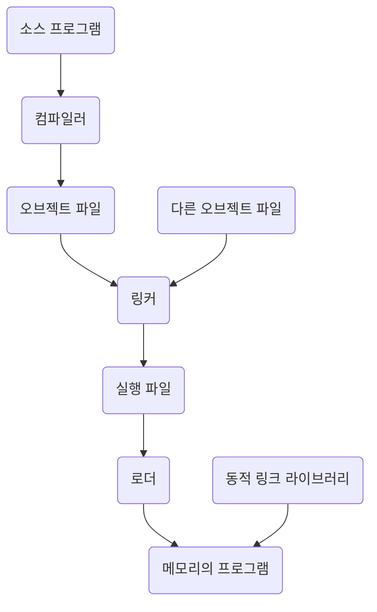

# 2. 운영체제의 구조 

- 시스템의 목표는 여러 가지 전략과 알고리즘을 선택하는 기초가 된다.
- 사용자, 프로그래머, 운영체제 설계자의 관점.
- 운영체제가 제공하는 서비스와 그 서비스가 어떤 방식으로 제공되는지.
- 컴퓨터가 운영체제를 구동하는 방법

## 2-1. 운영체제 서비스 Operating-System Services

- `사용자 인터페이스 user interface`
  - 인터페이스는 여러 형태로 제공될 수 있다. 가장 일반적으로 `그래픽 사용자 인터페이스 GUI`가 사용된다.
  - 휴대전화 및 태블릿과 같은 모바일 시스템은 `터치 스크린 인터페이스`를 제공한다.
  - 또 다른 옵션은 `명령어 라인 인터페이스 CLI`이다.
- `프로그램 수행 program execution`
  - 시스템은 프로그램을 메모리에 적재해 실행할 수 있어야 한다.
  - 프로그램을 정상적이든, 혹은 비정상적이든(오류를 표시하면서) 실행을 끝낼 수 있어야 한다.
- `입출력 연산 I/O operation`
  - 수행 중인 프로그램은 입출력을 요구할 수 있다.
  - 효율과 보호를 위해 사용자들은 통상 입출력 장치를 제어할 수 없다.
  - 따라서 운영체제가 입출력 수행의 수단을 제공해야 한다.
- `파일 시스템 조작 file system manipulation`
  - 파일 시스템은 특히 중요한 분야다.
  - 파일 읽고 쓰기, 이름에 의해 파일을 생성하고 삭제하며 지정된 파일을 찾거나 파일의 정보를 열거할 수 있어야 한다.
  - 몇몇 프로그램은 파일 소유권에 기반을 둔 권한 관리를 이용하여 파일이나 디렉터리의 접근을 허가하거나 거부할 수 있게 한다.
  - 많은 운영체제들은 때로는 개인의 선택에 따라 그리고 특정 특성과 성능 특성을 제공하기 위해 다양한 파일 시스템을 제공한다.
- `통신 communication`
  - 한 프로세스가 다른 프로세스와 정보를 교환해야 할 필요가 있는 여러 상황이 있다.
  - 이러한 통신을 수행하는 2가지 중요한 방법이 있다.
    1. 동일한 컴퓨터에서 수행되고 있는 프로세스들 사이에서 일어남.
    2. 네트워크에 의해 함께 묶여 있는 서로 다른 컴퓨터 시스템상에서 수행되는 프로세스들 사이에서 일어남
  - 통신은 `공유 메모리`를 통해서 구현될 수도 있고, `메시지 전달 message passing` 기법을 사용하여 구현될 수 있는데, 후자의 경우 정보의 패킷들이 운영체제에 의해 프로세스들 사이를 이동한다.
- `오류 탐지 error detection`
  - 모든 가능한 오류를 항상 의식하고 있어야 한다.
  - CPU 오류 
  - 메모리 하드웨어 오류(메모리 오류, 정전 등)
  - 입출력 장치 오류(테이프의 패리티 오류, 네트워크 접속 실패, 프린터의 종이 부족)
  - 사용자 프로그램 오류(연산의 오버플로우, 불법적인 메모리 위치로의 접근 시도)
  - 운영체제는 올바르고 일관성 있는 계산을 보장하기 위해 각 유형의 오류에 대해 적당한 조처를 해야 한다.
  - 물론 운영체제에 오류에 어떻게 반응하며 수정하는가에 다양한 변종이 존재한다.
  - 디버깅 설비는 시스템을 효율적으로 사용할 수 있는 사용자와 프로그래머의 능력을 향상시킨다.

- 사용자에 도움을 주는 것이 목적이 아니라 시스템 자체의 효율적인 동작을 보장하기 위한 운영체제 기능들도 존재한다.
- 다수의 프로세스가 사용하는 시스템에서는 프로세스들 간에 컴퓨터 자원을 공유하게 함으로써 효율성을 얻을 수 있다.

- `자원 할당 resource allocation`
  - 다수의 프로세스나 다수의 작업이 동시에 실행될 때, 그들 각각에 자원을 할당해 주어야 한다.
  - 운영체제는 여러 가지 다른 종류의 자원을 관리한다.
  - CPU 사이클, 메인 메모리, 파일 저장 장치 등은 특수한 할당 코드를 가질 수 있다.
  - 반면 입출력 장치들은 훨씬 일반적인 요청과 방출 코드를 가질 수 있다.
- `기록 작성 logging`
  - 어떤 프로그램이 어떤 종류의 컴퓨터 자원을 얼마나 많이 사용하는지를 추적할 수 있길 원한다.
  - 이와 같은 기록 관리는 회계(사용자에게 청구서를 보낼 수 있도록), 또는 단순한 통계를 내기 위해 사용된다. 
- `보호와 보안 protection & security`
  - 다중 사용자 컴퓨터 시스템 또는 네트워크로 연결된 컴퓨터 시스템에 저장된 정보의 소유자는 그 정보의 사용을 통제하길 원한다.
  - 서로 다른 여러 프로세스가 병행하게 수행될 때, 한 프로세스가 다른 프로세스나 운영체제 자체를 방해해서는 안 된다.
  - `보호`는 시스템 자원에 대한 모든 접근이 통제되도록 보장하는 것을 필요로 한다.
  - `보안`은 각 사용자가 자원에 대한 접근을 원할 때 통상 패스워드를 사용해서 시스템에게 자기 자신을 인증하는 것으로부터 시자가된다.
    - 네트워크 어댑터 등과 같은 외부 입출력 장치들을 부적합한 접근 시도로 부터 지킴
    - 침입의 탐지를 위해 모든 접속을 기록함.
  - 보호와 보안을 유지하기 위해 시스템 전체에 걸쳐 `예방책 precation`이 제정되어야 한다.

## 2-2. 사용자와 운영체제 인터페이스 User and Operating-System Interface

### 2-2-1. 명령 인터프리터 Command-Interperter

- 운영체제 대부분은 명령 인터프리터를 프로세스가 시작되거나 사용자가(대화형 시스템상에서) 처음 로그온 할 때 수행되는 특수한 프로그램으로 취급한다.
  - 선택할 수 있는 여러 명령 인터프리터를 제공하는 시스템에서 이 해석기는 `셸 shell`이라고 불린다.
  - 사용자가 어느 셸을 사용할 것인가를 결정하는 것은 개인적 취향에 따라 달라진다.
- 명령 인터프리터의 중요한 기능은 사용자가 지정한 명령을 가져와서 그것을 수행하는 것이다.
  - 이 수준에서 제공된 많은 명령은 파일을 조작한다. (생성, 삭제, 리스트, 프린트, 복사, 수행 등)
  - UNIX 시스템에서 사용 가능한 셸은 이런 방식으로 실행된다. 이 명령어들은 두 가지 일반적인 방식으로 구현될 수 있다.

1. 명령 인터프리터 자체가 명령을 실행할 코드를 가지는 경우
   - ex) 한 파일을 삭제하기 위한 명령은 명령 인터프리터가 자신의 코드의 한 부분으로 분기하고, 그 코드 부분이 매개변수를 설정하고 적절한 시스템 콜을 한다.
   - 이 경우 제공될 수 있는 명령의 수가 명령 인터프리터의 크기를 결정하는데, 그 이유는 각 명령이 자신의 구현 코드를 요구하기 때문이다.
2. 시스템 프로그램에 의해 대부분의 명령을 구현
   - 이 경우, 명령 인터프리터는 전혀 그 명령을 알지 못한다. 단지 메모리에 적재되어 실행될 파일을 식별하기 위해 명령을 사용한다.
   - ex) `rm file.txt` 명령어 예시
     - `rm`이라 불리는 파일을 찾아서 그 파일을 메모리에 적재하고, 그것을 매개변수 `file.txt`로 수행한다.
     - `rm` 명령과 관련된 로직은 `rm`이라는 파일 내의 코드로 완전하게 정의된다.
     - 이러한 방법으로, 프로그래머는 적합한 프로그램 로직을 가진 새로운 파일을 생성함으로써 시스템에 새로운 명령을 쉽게 추가할 수 있다.

### 2-2-2. 그래픽 기반 사용자 인터페이스 Graphical User Interface

- 사용자 친화적인 그래픽 기반 사용자 인터페이스 또는 GUI를 통하는 방법.
- 명령어 라인 인터페이스를 통해 사용자가 직접 명령어를 입력하는 것이 아니라 `데스크톱`이라고 특징지어지는 마우스를 기반으로 하는 윈도 메뉴 시스템을 사용한다.
  - 마우스 포인터와 아이콘.

### 2-2-3. 터치스크린 인터페이스 Touch-Screen Interface

- 스마트폰 및 휴대용 태블릿 컴퓨터에서 일반적으로 사용하는 방식.
- 터치스크린에서 손가락으로 누르거나 스와이프 하는 등의 `제스처`를 취하여 상호 작용한다.

### 2-2-4. 인터페이스의 선택 Choice of Interface

- 취향의 문제다.
  - 컴퓨터를 관리하는 `시스템 관리자 System Admin`와 시스템에 대해 깊게 알고 있는 `파워 유저 Power User`들은 Command-line 인터페이스를 사용한다. 하고자하는 작업에 더 빨리 접근할 수 있기 때문이다.
  - 사실 몇몇 시스템에서는 GUI를 통해서는 시스템 기능의 일부만을 이용할 수 있고 자주 쓰이지 않는 나머지 기능은 Command-line을 사용할 수 있는 사용자만이 이용할 수 있다.
  - 자주 사용되는 Command-line 절차가 있다면 이 절차를 파일로 저장하고, 이 파일을 프로그램을 실행하는 것처럼 이용할 수 있다.
  - 이러한 `셸 스크립트 Shell Script`는 명령어-라인 인터페이스에 기반을 둔 시스템에서는 흔한 형태이다.
- 사용자 인터페이스는 시스템마다 심지어 한 시스템의 사용자마다 다를 수 있다.
  - 그러나 통상 실제 시스템 구조에서는 제외되었다.
  - 따라서 유용하고 친밀한 사용자 인터페이스를 설계하는 것이 운영체제의 직접적인 기능은 아니다.

## 2-3. 시스템 콜 System Calls

- `시스템 콜`은 운영체제에 의해 사용 가능하게 된 서비스에 대한 인터페이스를 제공한다.
- 특히 저수준 작업(ex-하드웨어를 직접 접근해야 하는 작업)은 어셈블리 명령을 사용하여 작성되어야 하더라도 이러한 호출은 일반적으로 C와 C++ 언어로 작성된 함수 형태로 제공된다.

### 2-3-1. 예제 Example

- 시스템 콜은 어떻게 사용될까?

```shell
cp in.txt out.txt
```

- 이 명령은 입력 파일인 `in.txt`를 출력 파일 `out.txt`에 복사한다.
- 일단 두 개의 파일 이름이 얻어지면, 프로그램은 반드시 입력 파일을 오픈하고 출력 파일을 생성한 후 오픈한다.
  - 각각의 연산은 시스템 콜을 필요로 하며, 각 시스템 콜에서 오류가 발생하면 처리되어야 한다.
  - ex) 프로그램이 입력 파일을 오픈하려고 할 때, 그 이름을 갖는 파일이 존재하지 않거나 그 파일에 대한 접근이 금지되어 있는 것을 발견할 수 있다.
  - 이러한 경우 프로그램은 에러 메시지를 출력하고, 비정상 종료한다.
  - 입력 파일이 존재하면 새로운 출력 파일을 생성해야 하는데, 똑같은 이름을 가진 출력 파일이 존재할 수 있다. 이 때 프로그램을 중단(abort)하게 하거나, 혹은 기존 파일을 삭제한 후 새로운 파일을 생성할 수도 있다.
- 이제 두 개의 파일이 준비되면, 입력 파일로부터 읽어서 출력 파일에 기록하는 루프에 들어가게 된다.
  - 각 읽기와 쓰기는 가능한 여러 가지 오류 상황의 정보를 반환해야 한다.
  - ex) 입력 오류: 프로그램이 파일의 끝에 도달, 읽기 중에 하드웨어 오류(이를테면 패리티 오류)
  - ex) 쓰기 오류: 출력 장치에 따라 여러 가지 오류 발생(예를 들어, 디스크 공간의 부족)
- 이것만 해도 엄청나게 많은 시스템 콜이 호출되게 된다.

### 2-3-2. 응용 프로그래밍 인터페이스 Application Programming Interface

- 간단한 프로그램이라도 운영체제의 기능을 아주 많이 사용하게 된다.
  - 종종 초당 수천 개의 시스템 콜을 수행하게 된다.
- 대부분의 애플리케이션 개발자들은 `Application Programming Interface, API`에 따라 프로그램을 설계한다.
- API는 각 함수에 전달되어야 할 매개변수들과 프로그래머가 기대할 수 있는 반환 값을 포함하여 애플리케이션 프로그래머가 사용 가능한 함수의 집합을 명시한다.
  - ex) JVM에서 실행될 수 있는 프로그램을 위한 Java API
  - ex) UNIX와 Linux 시스템에서 C 언어로 작성된 프로그램을 위해서 제공되는 라이브러리 `libc` 
- API를 구성하는 함수들은 통상 애플리케이션 프로그래머를 대신하여 실제 시스템 콜을 호출한다.
  - ex) Windows의 API 함수 `CreateProcess()` => Windows 커널의 `NTCreateProcess()` 시스템 콜
- 시스템 콜은 좀 더 자세한 명세가 필요하고 프로그램상에서 작업하기가 난해하다.
  - API는 이를 쉽게 만들어준다!
- 그럼에도 API 함수를 호출하는 것과 커널의 관련된 시스템 콜을 호출하는 것에는 강한 상관관계가 존재한다.
- 시스템 콜을 처리하는 데 있어 중요한 또 다른 요소는 `실행시간 환경 RTE`이다.
  - 컴파일러 또는 인터프리터를 포함하여 특정 프로그래밍 언어로 작성된 응용 프로그램을 실행하는 데 필요한 전체 소프트웨어 제품군과 라이브러리 또는 로더와 같은 다른 소프트웨어를 함께 가리킨다.
  - `RTE`는 운영체제가 제공하는 시스템 콜에 대한 연결고리 역할을 하는 `시스템 콜 인터페이스`를 제공한다.
  - 이 시스템 콜 인터페이스는 API 함수의 호출을 가로채어 필요한 운영체제 시스템 콜을 부른다. 통상 각 시스템 콜에는 번호가 할당되고 시스템 콜 인터페이스는 이 번호에 따라 색인되는 테이블을 유지한다.
  - 시스템 콜 인터페이스는 의도하는 시스템 콜을 부르고 시스템 콜의 상태와 반환 값을 돌려준다.
- 호출자는 시스템 콜이 어떻게 구현되고 실행 중에 무슨 작업을 하는지 아무것도 알 필요가 없다.
  - 호출자는 단지 API를 준수하고 시스템 콜의 결과로서 운영체제가 무엇을 할 것인지만 이해하면 된다.
  - 따라서 운영체제 인터페이스에 대한 대부분의 자세한 내용은 API에 의해 프로그래머로부터 숨겨지고 RTE에 의해 관리된다.
- 시스템 콜은 사용되는 컴퓨터에 따라 다른 방법으로 발생한다.
  - 종종, 단순히 원하는 시스템 콜이 무엇인지보다 더 많은 정보가 요구될 수도 있다.
  - 필요한 정보의 유형과 양은 특정 운영체제와 호출에 따라 다양한다.
  - ex) 입력을 받아들이기 위해, 입력원(source)으로 사용될 파일이나 장치와 함께 읽어 들인 데이터를 저장할 메모리 버퍼의 주소와 길이를 명시할 필요가 있다. 물론 장치나 파일 그리고 길이는 시스템 콜에 `암묵적 implicit`일 수 있다.
- 운영체제에 매개변수를 전달하기 위해서 세 가지 일반적인 방법을 사용한다.
1. 가장 간단한 방법. 매개변수를 레지스터 내에 전달
2. 매개변수가 메모리 내 블록이나 테이블에 저장되고, 블록의 주소가 레지스터 내에 매개변수로 전달
  - Linux는 위 2개의 접근법을 조합하여 사용
  - 5개 이하의 매개변수가 있으면 레지스터가 사용. 매개변수 개수가 5개를 넘으면 블록 방법 사용
3. 매개변수가 프로그램에 의해 `stack`에 넣어지고(`push`), 운영체제에 의해 꺼내지는(`pop off`) 방법
  - 일부 운영체제는 블록이나 스택 방법을 선호하는데, 이들 접근법은 전달되는 매개변수들의 개수나 길이를 제한지 않기 때문이다.

### 2-3-3. 시스템 콜의 유형 Types of System Calls

- 시스템 콜은 여섯 가지의 중요한 범주로 묶을 수 있다.
  - `프로세스 제어`
  - `파일 조작`
  - `장치 조작`
  - `정보 유지 보수`
  - `통신`
  - `보호`

##### 프로세스 제어 Process Control

- 끝내기(end), 중지(abort)
- 적재(load), 수행(execute)
- 프로세스 생성, 프로세스 종료
- 프로세스 속성(attributes) 획득, 프로세스 속성(attributes) 설정
- 시간을 기다림
- 이벤트를 기다림(wait event), 이벤트를 알림(signal event)
- 메모리 할당 및 자유화

##### 파일 조작 File Manipulation

- 파일 생성(create file), 파일 삭제(delete file)
- 열기(open), 닫기(close)
- 읽기, 쓰기, 위치 변경(reposition)
- 파일 속성 획득 및 설정

##### 장치 관리 Device Management

- 장치를 요구(request devices), 장치를 방출(release devices)
- 읽기, 쓰기, 위치 변경(reposition)
- 장치 속성 획득, 장치 속성 설정
- 장치의 논리적 부착(attach) 또는 분리(detach)

##### 정보 유지 보수 Information Maintenace

- 시간과 날짜의 설정과 획득
- 시스템 데이터의 설정과 획득
- 프로세스, 파일, 장치 속성의 획득
- 프로세스, 파일, 장치 속성의 설정

##### 통신 Communication

- 통신 연결의 생성, 제거
- 메시지의 송신, 수신
- 상태 정보 전달
- 원격 장츼 부탁(attach) 및 분리(detach)

##### 보호 Protection

- get file permissions
- set file permissions

#### 2-3-3-1. 프로세스 제어 Process Control

- 실행 중인 프로그램은 수행을 정상적으로(`end()`) 또는 비정상적으로(`abort()`) 멈출 수 있어야 한다.
- 만약 현재 실행 중인 프로그램을 비정상으로 중지하기 위해 시스템 콜이 호출되거나 프로그램에 문제가 발생해 오버 트랩(trap)을 유발할 경우, 때때로 메모리 덤프가 행해지고 오류 메시지가 생성된다.
  - 이 덤프는 특별한 로그 파일이나 디스크에 기록되고 문제의 원인을 결정하기 위해 `디버거`에 의해 검사될 수 있따.
- 정상이거나 비정상인 상황에서, 운영체제는 명령 인터프리터로 제어를 전달해야 한다. 명령 인터프리터는 이어 다음 명령을 읽는다.
  - `대화식 시스템`에서 명령 인터프리터는 단순히 다음 명령을 계속 수행하며, 사용자가 오류에 응답하는 적절한 명령을 내릴 것을 가정한다.
  - `GUI 시스템`에서는 팝업 윈도가 사용자에게 오류를 알리고 지시를 내린다. 일부 시스템에서는 오류가 발생할 경우 특별한 복구 행위를 지시하는 제어 카드를 허용한다.
- 한 프로그램을 실행하고 있는 프로세스가 다른 프로그램을 적재(`load()`)하고 실행(`execute()`)하기를 원할 수 있다.
  - 이 기능은 명령 인터프리터가 사용자 명령 또는 마우스의 클릭을 통해 지시된 프로그램을 실행하는 것을 허용한다.
  - 여기서 흥미로운 질문! 적재된 프로그램이 종료되었을 때 어디로 제어를 되돌려 줄까?
  - 기존 프로그램이 유실될지, 보관될지, 새로운 프로그램과 병행하게 실행을 계속하도록 허용할 것인지 하는 문제와 관련 있다.
- 만약 프로그램이 종료되었을 때 제어가 기존 프로그램으로 되돌아간다면, 기존 프로그램의 메모리 이미지를 보관해야 한다.
  - 실질적으로 한 프로그램이 다른 프로그램을 호출하는 방식으로 돌아가게 된다.
  - 만약 두 프로그램이 병행하여 수행된다면, 다중 프로그래밍 될 새로운 프로세스를 생성한 것이다.
  - 이러한 목적을 위해 `create_process()` 시스템 콜을 호출하기도 한다.
- 만약 새로운 잡이나 프로세슷, 혹은 잡들이나 프로세스들의 집합을 생성한다면, 우리는 그들의 실행을 제어할 수 있어야 한다.
  - 잡의 우선수위, 최대 허용 실행 시간 등의 속성 `결정` 및 `재설정 reset`(`get_process_attributes()` 및 `set_process_attribute()`)
  - 또한 새로 생성한 잡이나 프로세스가 잘못되었거나 더 이상 필요 없다면 종료하기를 원할 수 있다. (`terminate_process()`)
- 새로운 프로세스를 생성한 후에는 이들의 실행이 끝나기를 기다려야 할 필요가 있을 수 있다.
  - 일정 시간만큼 기다리기를 원할 경우 `wait_time()` 시스템 콜을 사용할 수 있다.
  - 더욱 가능성이 큰 경우는 특정 이벤트가 일어날 때까지 기다리는 것이다. `wait_event()`
  - 그 경우 프로세스들은 그 이벤트가 일어나면 신호를 보내야 한다. `signal_event()`
- 둘 이상의 프로세스는 빈번하게 데이터를 공유한다.
  - 데이터의 일관성 보장을 위해 lock이 필요. => `acquire_lock`과 `release_lock()` 시스템 콜
- 새로운 프로세스를 실행하기 위해 셸은 `fork()` 시스템 콜을 사용한다.
  - 그런 다음, 선택된 프로그램이 `exec()` 시스템 콜을 통해 메모리에 적재되고, 이어 그 프로그램이 수행된다.
  - 명령이 내려진 방법에 따라, 셸은 프로세스가 종료하기를 기다리거나 백그라운드에서 프로세스를 수행한다.
  - 후자의 경우 셸은 바로 다른 명령이 입력되기를 기다린다.
  - 프로세스가 끝나면, 종료하기 위해 `exit()` 시스템 콜을 수행하며, 호출한 프로세스에게 상태 코드 0을 돌려주거나 0이 아닌 오류 코드를 돌려준다.

#### 2-3-3-2. 파일 관리 File Management

- 파일의 생성`create()`, 삭제 `delete()`
- 파일이 생성되면 그것을 열고`open()`, 읽고`read()`, 쓰고`write()`, 그리고 위치 변경`reposition()`할 수 있다.
- 파일을 더이상 사용하지 않는다면 닫기`close()`도 해줘야한다.
- 파일 시스템이 파일을 조직하기 위해 디렉터리 구조를 가진다면, 우리는 디렉토리에 대해서도 이와 같은 연산 집합이 필요해진다.
  - 디렉터리에 대해 여러 속성의 값을 결정할 수 있어야 하고, 필요하다면 그것을 재설정할 수 있어야 한다.
  - 파일 속성은 파일 이름, 파일 유형, 보호 코드, 회계 정보 등을 포함한다.
  - 이러한 기능을 위해서는 최소한 파일 속성 획득`get_file_attribute()`과 파일 속성 설정`set_file_attribute()`의 두 시스템 콜이 필요하다.
  - 몇몇 운영체제는 파일 이동`move()`과 복사`copy()` 등의 훨씬 더 많은 시스템 콜을 제공한다.
  - 일부 시스템들은 코드와 다른 시스템 콜을 이용하여 동일한 작업을 수행하는 API를 제공할 수도 있고 일부 시스템은 단순히 동일한 작업을 수행하는 시스템 프로그램을 제공하기도 한다.
  - 만일 이 시스템 프로그램이 다른 프로그램에 의해 호출 가능하다면 다른 프로그램의 입장에서는 이 시스템 프로그램이 API가 된다.

#### 2-3-3-3. 장치 관리 Device Management

- 프로세스는 작업을 계속 수행하기 위해 추가 자원이 필요할 수 있다. 이러한 추가 자원은 주 기억장치, 디스크 드라이브, 파일에의 접근 등이 될 수 있다.
- 만약 자원들을 사용할 수 있다면, 이들 자원이 주어지고, 제어가 사용자 프로그램으로 복귀될 수 있다. 그렇지 않으면, 프로그램은 충분한 자원이 사용 가능하게 될 때까지 기다려야 한다.
- 운영체제에 의해 제어되는 다양한 자원들은 장치로 간주될 수 있다. 이 장치들의 일부는 물리 장치이고 다른 장치들은 추상적 혹은, 가상적 장치로 생각할 수 있다.
- 다수의 사용자가 동시에 사용하는 시스템은 독점적인 장치 사용을 보장받기 위해 그 장치를 요청`request()`하는 것을 요구한다.
- 그 장치의 사용이 끝나면, 우리는 그것을 반드시 방출`release()`해야 한다. 이러한 기능은 파일의 열기, 닫기 시스템 콜과 비슷하다.
- 다른 운영체제들은 장치에 대해 통제되지 않은 접근을 허용한다. 예상되는 위험은 8장에서 설명될 장치에 대한 잠재적 경쟁과 교착상태이다.
- 일단 장치를 요청하고, 파일과 마찬가지로 그 장치를 읽고`read()` 쓰고`write()`, 그리고 아마도 위치 변경할`reposition()` 수 있다.
- 사실 입출력 장치와 파일 간에는 유사성이 매우 많기 때문에 UNIX를 포함한 많은 운영체제가 이들 둘을 통합된 파일-장치 구조(file device structure)로 결합하였다.
  - 이 경우 같은 시스템 콜이 파일과 장치에 대해 사용된다. 때로 입출력 장치들은 특별한 파일 이름, 디렉터리 배치 또는 파일 속성으로 식별된다.

#### 2-3-3-4. 정보 유지 관리

- 많은 시스템 콜은 단순히 사용자 프로그램과 운영체제 간의 정보 전달을 위해 존재한다.
  - 예를 들면, 시스템 대부분은 현재 시간`time()`과 날짜를 되돌려 주는`date()` 시스템 콜을 가지고 있다.
  - 다른 시스템 콜은 운영체제의 버전 번호, 자유 메모리 또는 자유 디스크 공간 등과 같은 시스템에 관한 정보를 알려준다.
- 다른 시스템 콜 집합은 프로그램 디버깅에 도움이 된다. 많은 시스템이 메모리를 덤프`dump()` 하기 위한 시스템 콜을 제공한다. 이 조항은 디버깅에 유용하다.
  - Linux 시스템에서 사용 가능한 프로그램 strace는 실행될 때마다 각 시스템 콜을 나열한다. 마이크로프로세서조차도 `한 명령어 실행 single step`이라고 하는 CPU 모드를 제공하며, 이 모드에서 모든 명령어 실행 후에 트랩이 CPU에 의해 실행된다.
  - 트랩은 일반적으로 디버거에 의해 포착된다.
- 많은 운영체제는 프로그램의 시간 프로파일을 제공한다.
  - 프로그램의 특정 위치, 혹은 위치의 집합에서 수행한 시간의 양을 나타낸다.
  - 추적 설비(tracing facility)나 정규 타이머 인터럽트가 필요하다. 타이머 인터럽트가 발생할 때마다, 프로그램 카운터의 값이 기록된다.
  - 따라서 타이머 인터럽트가 충분히 빈번하게 일어나면, 프로그램의 여러 부분에서 소비한 시간의 통계적 그림을 얻을 수 있다.
  - 더욱이 운영체제는 현재 운영되고 있는 모든 프로세스에 관한 정보를 가지고 있으며, 이러한 정보에 접근하기 위한 시스템 콜이 있다. 일반적으로, 그 프로세스 정보를 획득하고 설정하기 위한 시스템 콜도 있다.

#### 2-3-3-5. 통신 Communication

- 공유 메모리 모델
  - 다른 프로세스가 소유한 메모리 영역에 대한 접근
  - 동일한 위치에 동시에 쓰지 않도록 보장할 책임

#### 2-3-3-6. 보호 Protection

----

## 2-4. 시스템 서비스 System Service

- 시스템 유틸리티(System Utility)
- 파일 관리, 상태 정보, 파일 변경, 프로그래밍 언어 지원, 프로그램 적재와 수행, 통신, 백그라운드 서비스(데몬)

----

## 2-5. 링커와 로더 Linker and Loaders

- 소스 파일: 임의의 물리 메모리 위치에 적재되도록 설계된 오브젝트 파일(`재배치 가능 오브젝트 파일`)로 컴파일된다. 
- `링커`: 오브젝트 파일을 하나의 이진 실행 파일로 결합
- `로더`: 이진 실행 파일을 메모리에 적재하는 데 사용 -> CPU 코어에서 실행할 수 있는 상태가 된다.



- 오브젝트 파일 및 실행 파일은 표준화된 형식을 가짐 => ELF(Executable and Linkable Format)

----

## 2-6. 응용 프로그램이 운영체제마다 다른 이유

- 각 운영체제는 고유한 시스템 콜을 가진다. => 운영체제끼리 응용 프로그램 호환이 쉽지 않은 이유
- 다음 세 가지 방법 중 하나로 가능하게 만들 수 있다.
1. 인터프리터 언어로 작성된 프로그램 사용 (Python, Ruby)
2. 가상 머신을 가진 언어를 사용 (높은 이식성을 가진 Java)
3. 고유의 이진 파일을 생성하는 표준 언어 또는 API

---

## 2-7. 운영체제 설계 및 구현

### 2-7-1. 설계 목표

- `사용자 목적`과 `시스템 목적`
- 소프트웨어 공학 분야에서, 운영체제에 적용 가능한 일반적인 원칙이 존재.

### 2-7-2. 기법과 정책

- 한 가지 중요한 원칙. 기법으로부터 정책을 분리하는 것
  - `기법`: 어떤 일을 어떻게 할 것인가를 결정. ex) 타이머 구조 => CPU 보호를 보장하기 위한 기법
  - `정책`: 무엇을 할 것인가를 결정. ex) 특정 사용자를 위해 타이머를 얼마나 오랫동안 설정할지를 결정

### 2-7-3. 구현

- 설계 다음은 구현
- 저수준 언어(어셈블리어)
- 고수준 언어(C, C++)
  - 장점: 생산성, 가독성, 유지보수성 확보. 다른 하드웨어로의 이식성이 우수.
  - 단점: 속도가 느리고, 저장 장치가 많이 소요.

# 참고자료

- 운영체제 | Abraham Silberschatz, Peter Baer Galvin, Greg Gagne 저/박민규 역 | 퍼스트북
