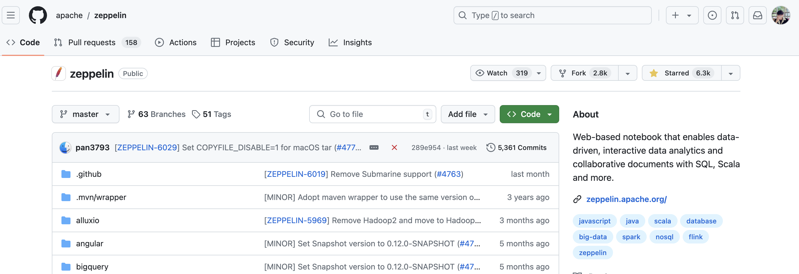
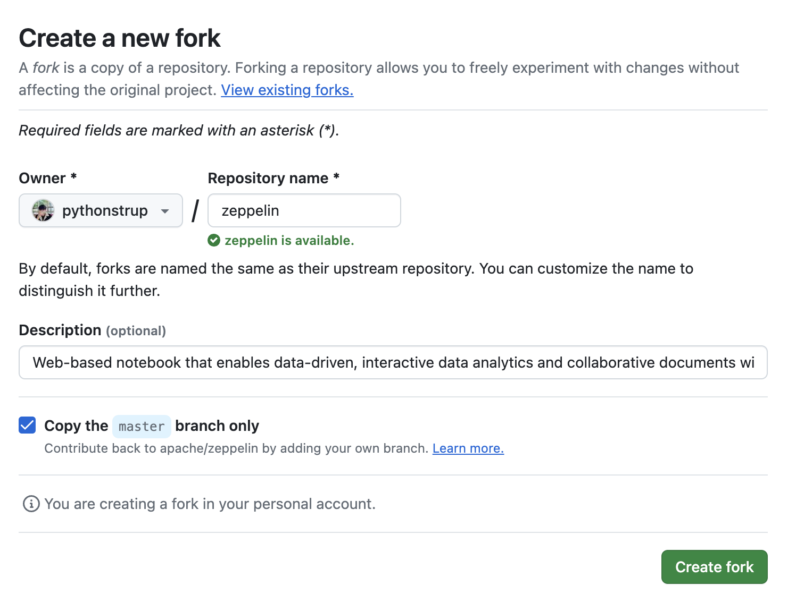
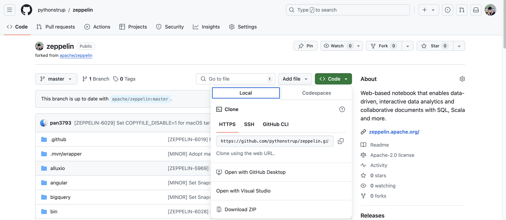
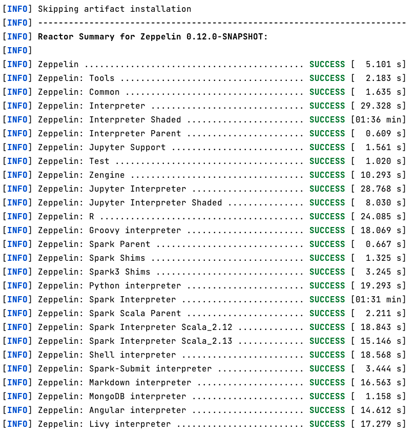
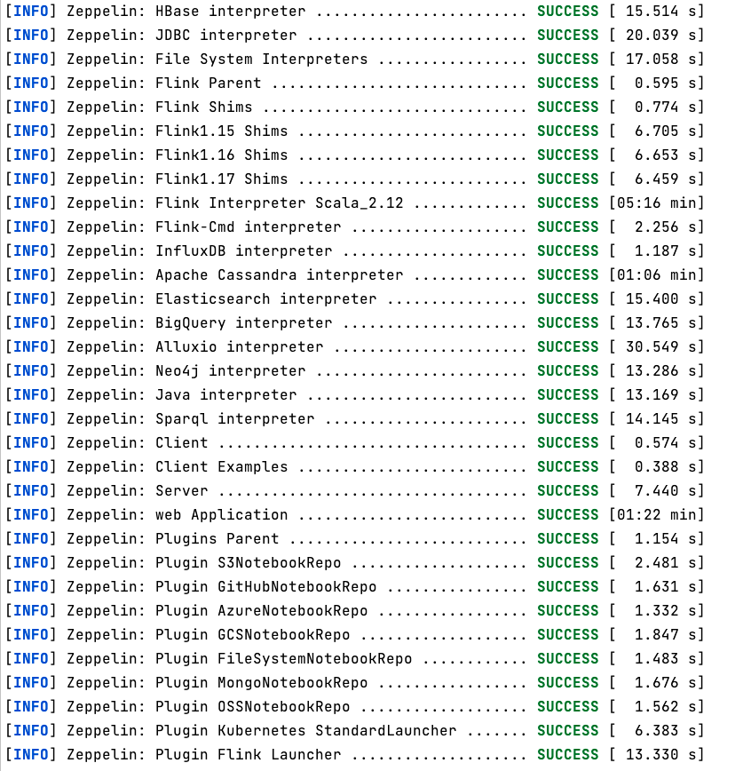
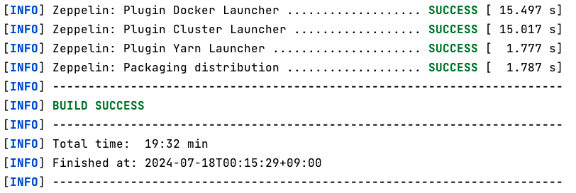
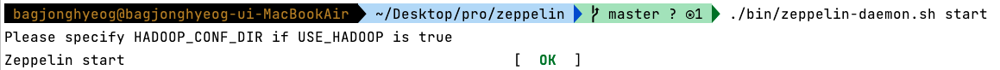
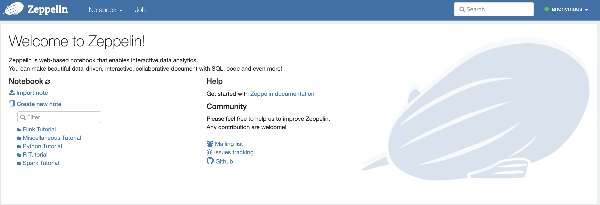

# Apache Zeppelin 시작

- [Github Link](https://github.com/apache/zeppelin)

## Github Repo



- 깃허브 레포지토리에서 Fork를 떠보자.



- Fork 떠온 레포지토리를 clone해서 프로젝트를 받아본다.



## Java 1.8 설정

- [MacOS openJDK 1.8 설치하기](https://velog.io/@sj-lee33/MacOS-openJDK-1.8-%EC%84%A4%EC%B9%98%ED%95%98%EA%B8%B0)

## Build

- build 방법은 문서에 잘 설명되어 있다.
- [공식문서](https://zeppelin.apache.org/docs/latest/setup/basics/how_to_build.html)
- 프로젝트 디렉토리에 들어가 명령어로 빌드를 실행한다.

```shell
./mvnw clean install -DskipTests

# debug를 보고 싶다면 아래와 같이 실행
./mvnw clean install -DskipTests -X
```

- 성공적으로 빌드가 완료되면 아래와 같은 결과과 뜬다.





- 빌드가 완료되면 Zeppelin Deamon을 실행하면 된다.

```shell
./bin/zeppelin-daemon.sh start
```



- 이제 `localhost:8080` 접속해보자. 제플린이 동작하는 것을 확인할 수 있다.



