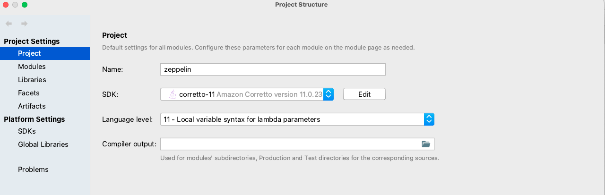
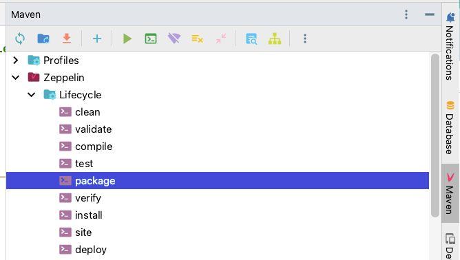

# Apache Zeppelin 시작

- [Github Link](https://github.com/apache/zeppelin)

## Github Repo


- 깃허브 레포지토리에서 Fork를 떠보자.


- Fork 떠온 레포지토리를 clone해서 프로젝트를 받아본다.


## Zeppelin 환경

- Zeppelin은 빌드도구로 Maven을 사용한다.
- 자바 버전은 아래와 같이 1.8로 되어 있지만, 멘토님 말씀에 의하면 Java 11로 빌드 가능하다고 하셨다.
- Java 17 이상에서 빌드하려면 따로 설정이 필요하다고 하셨다.

```xml
<?xml version="1.0" encoding="UTF-8"?>

<project xmlns="http://maven.apache.org/POM/4.0.0" xmlns:xsi="http://www.w3.org/2001/XMLSchema-instance"
  xsi:schemaLocation="http://maven.apache.org/POM/4.0.0 https://maven.apache.org/xsd/maven-4.0.0.xsd">
  ...
    <properties>
      <java.version>1.8</java.version>
    </properties>
  ...
</project>
```

- 정확한 이유는 모르지만 Window 환경에서는 실행이 굉장히 어렵다고 한다.
- 웬만하면 Linux나 MacOS 환경에서 실행해야..

## Build

### 자바 버전

- 꼭 SDK를 JDK 11로 설정해줘야 한다.
- SDK를 OpenJdk21로 두고 Language Level만 11로 두고 실행하면 문제가 발생한다. 
  - zeppelin-interpreter 관련된 모듈에서 계속 Retry 발생하는 문제가 있었다. 
  


### Maven으로 빌드하기

- 아래와 같이 Maven Tool의 `package`를 더블 클릭하면 빌드가 실행된다.



- 혹은 아래와 같이 Maven을 설치하고 명령어를 실행해도 된다. (Mac OS 기준)

```shell
$ brew install mvn
$ mvn package
```

## Build 시 발생했던 문제

- zengine을 빌드할 때 아래와 같은 테스트 에러가 발생
  - HeliumBundleFactoryTest의 testInstallNpm이 실패해버린다.

```shell
[ERROR] Failures: 
[ERROR]   HeliumBundleFactoryTest.testInstallNpm:60 expected: <true> but was: <false>
[ERROR] Errors: 
[ERROR]   HeliumBundleFactoryTest.bundleLocalPackage:119 » IO com.github.eirslett.maven.plugins.frontend.lib.TaskRunnerException: 'yarn install --fetch-retries=2 --fetch-retry-factor=1 --fetch-retry-mintimeout=5000 --registry=https://registry.npmjs.org/' failed.
[ERROR]   HeliumBundleFactoryTest.bundlePackage:94 » IO com.github.eirslett.maven.plugins.frontend.lib.TaskRunnerException: 'npm pack zeppelin-bubblechart@0.0.3 --registry=https://registry.npmjs.org/' failed.
[ERROR]   HeliumBundleFactoryTest.downloadPackage:77 » TaskRunner 'npm install lodash@3.9.3 --fetch-retries=2 --fetch-retry-factor=1 --fetch-retry-mintimeout=5000 --registry=https://registry.npmjs.org/' failed.
[ERROR]   HeliumBundleFactoryTest.switchVersion:183 » IO com.github.eirslett.maven.plugins.frontend.lib.TaskRunnerException: 'npm pack zeppelin-bubblechart@0.0.3 --registry=https://registry.npmjs.org/' failed.
[ERROR]   SparkInterpreterLauncherTest.testYarnClusterMode_1:195 » IO Fail to set additional jars for spark interpreter
[ERROR]   SparkInterpreterLauncherTest.testYarnClusterMode_2:244 » IO Fail to set additional jars for spark interpreter
[ERROR]   SparkInterpreterLauncherTest.testYarnClusterMode_3:294 » IO Fail to set additional jars for spark interpreter
[INFO] 
```

- `eirslett`라는 라이브러리를 사용하는데 
- 실제로 존재하지 않는 https://nodejs.org/dist/v6.9.1/node-v6.9.1-darwin-arm64.tar.gz를 다운로드받으려고 해서 에러가 발생하는 것이다.
- https://nodejs.org/dist/v6.9.1/에 접속해보면 해당 파일이 없다는 것을 확인할 수 있다.
- 해당 라이브러리의 이 에러에 대해 이슈도 달려있다. https://github.com/eirslett/frontend-maven-plugin/issues/952

- 내가 가지고 있는 노드 버전

```
$ node -v                                                        ✔  336  22:56:24
v14.21.3
```
