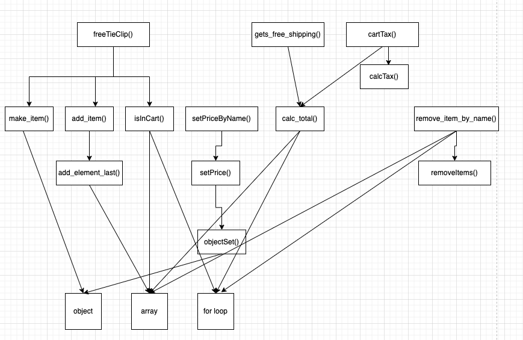
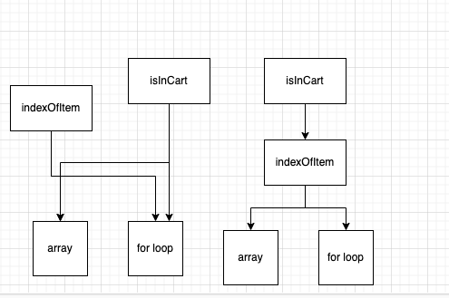
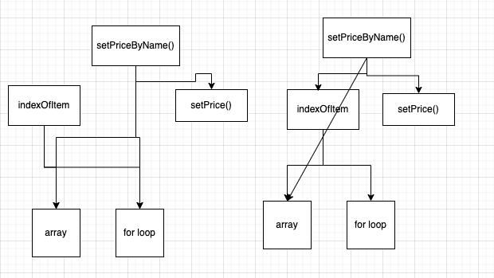
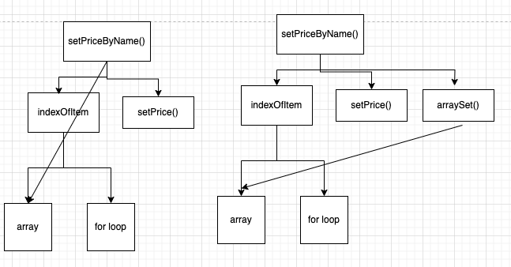

# 계층형 설계1

- 소프트웨어 설계에 대한 실용적인 정의를 소개합니다.
- 계층형 설계를 이해하고 어떤 도움이 되는지 알아봅니다.
- 깨끗한 코드를 만들기 위해 함수를 추출하는 방법을 배웁니다.
- 계층을 나눠서 소프트웨어를 설계하면 왜 더 나은 생각을 할 수 있는지 알아봅니다.

## 소프트웨어 설계란 무엇입니까?

- 코드를 만들고 테스트하고 유지보수하기 쉬운 프로그래밍 방법을 선택하기 위해 미적 감각을 사용하는 것
- 계층형 설계(stratified design)을 사용해 소프트웨어 설계를 위한 미적 감각을 키워보자!

## 계층형 설계란 무엇인가요?

- 소프트웨어를 계층으로 구성하는 기술입니다.
- 각 계층에 있는 함수는 바로 아래 계층에 있는 함수를 이용해 정의합니다.
- 비즈니스 규칙, 장바구니를 위한 동작들, 카피-온-라이트, 언어에서 지원하는 배열 관련 기능 등으로 계층을 구분할 수 있습니다.
- 각 계층을 정확히 구분하기는 어렵습니다. 계층을 잘 구분하려면 구분하기 위한 다양한 변수를 찾고 찾은 것을 가지고 어떻게 해야 하는지 알아야 합니다.

## 설계 감각을 키우기

### 전문가의 저주

- 전문가는 오랜 시간 노력으로 축적된 지식이 있지만 다른 사람들에게 설명하는 방법을 모릅니다.
- 전문가들이 블랙박스를 설명하지 못하는 이유는 복잡하기 때문입니다. 블랙박스는 복잡하고 다양한 입력을 받아 복잡하고 다양한 결과물을 냅니다.

### 계층형 설계 감각을 키우기 위한 입력

- 함수 본문
    - 길이, 복잡성, 구체화 단계, 함수 호출, 프로그래밍 언어의 기능 사용
- 계층 구조
    - 화살표 길이, 응집도, 구체화 단계
- 함수 시그니처
    - 함수명, 인자 이름, 인잣값, 리턴값

### 계층형 설계 감각을 키우기 위한 출력

- 조직화
    - 새로운 함수를 어디에 놓을지 결정, 함수를 다른 곳으로 이동
- 구현
    - 구현 바꾸기, 함수 추출하기, 데이터 구조 바꾸기
- 변경
    - 새 코드를 작성할 곳 선택하기, 적절한 수준의 구체화 단계 결정하기

## 계층형 설계 패턴

### 1. 직접 구현

- 직접 구현은 계층형 설계 구조를 만드는 데 도움이 됩니다.
- 함수 시그니처가 나타내고 있는 문제를 함수 본문에서 적절한 구체화 수준에서 해결해야 합니다.
- 만약 너무 구체적이라면 코드 스멜,,,

### 2. 추상화 벽

- 호출 그래프에 어떤 계층은 중요한 세부 구현을 감추고 인터페이스를 제공합니다.
- 고수준의 추상화 단계는 작업에 큰 도움이 됩니다.

### 3. 작은 인터페이스

- 시스템이 커질수록 비즈니스 개념을 나타내는 중요한 인터페이스는 작고 강력한 동작으로 구성하는 것이 좋습니다. 다른 동작도 직간접적으로 최소한의 인터페이스를 유지하면서 정의해야 합니다.

### 4. 편리한 계층

- 그냥 좋아서 계층을 추가하는 것이 아니라 코드와 그 코드가 속한 추상화 계층은 작업할 때 편리해야 합니다.

## 패턴1 직접 구현

- 장바구니를 돌면서 항목을 체크하고 무엇인가 결정하고 있는 코드다.
- 제대로 설계하지 않고 그냥 기능을 추가한 것이다. 어떤 설계 원칙을 가지고 설계하지 않았습니다.
- 이 코드는 첫 번째 계층형 설계 패턴인 직접 구현을 따르지 않고 있습니다.

```jsx
function freeTieClip(cart) {
  let hasTie = false;
  let hasTieClip = false;
  for (let i = 0; i < cart.length; i++) {
    const item = cart[i];
    if (item.name === 'tie') {
      hasTie = true;
    }
    if (item.name === 'tie clip') {
      hasTieClip = true;
    }
  }
  
  if (hasTie && !hasTieClip) {
    const tieClip = makeItem('tie clip', 0);
    return addItem(cart, tieClip);
  }
  return cart;
}
```

### 장바구니가 해야할 동작

- `장바구니에 제품이 있는지 확인하기`와 `장바구니 비우기` 는 추후에 추가

### 제품이 있는지 확인하는 함수가 있다면 설계를 개선할 수 있습니다.

- 장바구니 안에 제품이 있는지 확인하는 함수가 있다면 저수준의 반복문을 직접 쓰지 않았을 것입니다. 저수준의 코드는 추출해야할 가능성이 높습니다.
- 다른 제품 두 개가 있는지 확인하고 있는데 하나의 함수로 만들어 사용하도록 고치겠습니다.

```jsx
function isInCart(cart, name) {
  for (let i = 0; i < cart.length; i++) {
    if (cart[i].name === name) {
      return true;
    }
  }
  return false;
}

function freeTieClip(cart) {
  let hasTie = isInCart(cart, 'tie');
  let hasTieClip = isInCart(cart, 'tie clip');

  if (hasTie && !hasTieClip) {
    const tieClip = makeItem('tie clip', 0);
    return addItem(cart, tieClip);
  }
  return cart;
}
```

### 호출 그래프를 만들어 함수 호출을 시각화하기

- 함수에서 사용하는 다른 함수와 언어 기능을 호출 그래프(call graph)로 그릴 수 있습니다.
- `freeTieClip` 메소드는 서로 다른 추상화 단계가 있다는 것을 살펴볼 수 있습니다.(언어 기능과 직접 만든 함수는 추상화 수준이 다릅니다.)

### 직접 구현 패턴을 사용하면 비슷한 추상화 계층에 있는 함수를 호출합니다.

- `freeTieClip` 를 개선한 이후 직접 구현에 가까워졌습니다.
- `freeTieClip` 메소드 안의 함수들이 정확히 같은 추상화 단계인지 확신할 수 없지만 비슷한 추상화 단계를 사용하고 있는 것 같습니다.
- `freeTieClip`가 사용하고 있는 모든 함수는 장바구니가 배열인지 몰라도 됩니다. 배열인지 몰라도 된다는 것은 함수가 모든 비슷한 계층에 있다는 것을 의미합니다.
- 이처럼 함수가 모두 비슷한 계층에 있다면 직접 구현했다고 할 수 있습니다.

## 연습문제1

- `remove_item_by_name` 함수를 놓을 수 있는 계층은 다섯 곳입니다. 어떤 곳은 새로운 계층을 만들어야 하고 어떤 곳은 원래 계층에 추가하면 됩니다.
- 어디에 놓을까요? 놓을 위치를 결정하려면 어떤 정보가 있어야 할까요?

### 답변

- 사이에 새로운 계층, 가장 낮은 계층 정도에 둘 수 있을 것 같다.
- 사실 정답에 169페이지에 스포되고 있었다.
- `remove_item_by_name` 는 비즈니스 규칙을 포괄하고 있는 느낌보다는 장바구니를 위한 동작(일반적인 동작) 정도로 이해된다. 반면 `freeTieClip`은 비즈니스 규칙의 느낌이 강하다. 때문에 그 계층 밑에 배치하는 것이 맞다고 본다.
- 그렇다고 `freeTieClip` 에 포함된 함수들이랑은 비슷한 성격으로 볼 수 있기 때문에 가장 낮은 계층에 두는 것도 맞지 않다.

## 연습문제2



### 같은 계층에 있는 함수는 같은 목적을 가져야 합니다.

- 함수를 어떤 계층에 놓을지 선택하는 과정은 복잡합니다. 그래도 계층이 서로 구분되는 목적이 있다면, 함수가 위치할 계층을 선택하는 데 좋은 정보로 사용할 수 있습니다.
- 각 계층은 추상화 수준이 다릅니다. 그래서 어떤 계층에 잇는 함수를 읽거나 고칠 때 낮은 수준의 구체적인 내용은 신경 쓰지 않아도 됩니다.
- 다이어그램은 함수가 호출하는 것을 있는 그대로 표현한 것이기 때문에 함수를 어떤 계층에 놓을지 바로 알 수 있습니다. 그래서 다이어그램은 코드를 높은 차원에서 볼 수 있는 좋은 도구입니다.

## 3단계 줌 레벨

- 계층형 설계에서 문제는 세 가지 다른 영역에서 찾을 수 있습니다.
1. 계층 사이에 상호 관계
2. 특정 계층의 구현
3. 특정 함수의 구현

### 1. 전역 줌 레벨

- 전역 줌 레벨로 그래프 전체 중 필요한 부분을 살펴볼 수 있습니다. 전역 줌 레벨이 기본 줌 레벨입니다. 계층 사이에 상호 관계를 포함해서 모든 문제 영역을 살펴볼 수 있습니다.

### 2. 계층 줌 레벨

- 계층 줌 레벨은 한 계층과 연결된 바로 아래 계층을 볼 수 있는 줌 레벨입니다. 계층 줌 레벨로 계층이 어떻게 구현되어 있는지 알 수 있습니다.

### 3. 함수 줌 레벨

- 함수 줌 레벨로 함수 하나와 바로 아래 연결된 함수들을 볼 수 있습니다. 함수 줌 레벨로 함수 구현의 문제를 찾을 수 있습니다.

### 계층 줌 레벨로 함수가 가리키는 화살표를 계층 간에 비교할 수 있습니다.

- 직접 구현 패턴을 사용하면 모든 화살표가 같은 길이를 가져야합니다. 하지만 현재 코드를 다이어그램으로 그렸을 때 어떤 화살표는 한 계층의 길이를 가지고 있고 어떤 화살표는 세 계층 길이를 가지고 있습니다.
- 이렇게 다양한 계층을 넘나드는 것은 같은 구체화 수준이 아니라는 증거입니다.

### 함수 줌 레벨을 사용하면 함수 하나가 가진 화살표를 비교할 수 있습니다.

- remove_item_by_name() 함수 하나를 살펴봤을 뿐인데 서로 다른 계층의 동작을 사용하는 것을 확인할 수 있습니다.
- 화살표 길이를 같게 하는 가장 일반적인 방법은 중간에 함수를 두는 것입니다.

## 반복문 빼내기

- 아래와 같이 반복문을 빼낼 수 있다.

```jsx
function removeItemByName(cart, name) {
  let idx = indexOfItem(cart, name);
  if (idx !== null) {
    return removeItems(cart, idx, 1);
  }
  return cart;
}

function indexOfItem(cart, name) {
  for (let i = 0; i < cart.length; i++) {
    if (cart[i].name === name) {
      return i;
    }
  }
  return null;
}
```

## 연습문제3

- isInCart() 함수와 indexOfItem() 함수는 비슷하게 생겼습니다.
- 어떤 함수에서 다른 쪽 함수를 가져다 쓸 수 있을까요?

### 답변

- 아래와 같이 구조가 변경



- 코드 내용

```jsx
function isInCart(cart, name) {
  return indexOfItem(cart, name) !== null;
}

function indexOfItem(cart, name) {
  for (let i = 0; i < cart.length; i++) {
    if (cart[i].name === name) {
      return i;
    }
  }
  return null;
}
```

## 연습문제4

- setPriceByName() 함수와 indexOfItem() 함수에는 비슷한 반복문이 있습니다.
- 변경해봅시다.

### 답변

- 다이어그램



- 코드내용

```jsx
function setPriceByName(cart, name, price) {
  const cartCopy = cart.slice();
  const idx = indexOfItem(cart, name);
  if (idx !== null) {
    cartCopy[idx] = setPrice(cartCopy[idx], price);
  }
  return cartCopy;
}

function indexOfItem(cart, name) {
  for (let i = 0; i < cart.length; i++) {
    if (cart[i].name === name) {
      return i;
    }
  }
  return null;
}
```

## 연습문제5

- arraySet 활용

### 답변

- 다이어그램



- 코드

```jsx
function setPriceByName(cart, name, price) {
  const idx = indexOfItem(cart, name);
  if (idx !== null) {
    return arraySet(cart, idx, setPrice(cart[idx], price));
  }
  return cart;
}

function arraySet(array, idx, value) {
  const copy = array.slice();
  copy[idx] = value;
  return copy;
}

function indexOfItem(cart, name) {
  for (let i = 0; i < cart.length; i++) {
    if (cart[i].name === name) {
      return i;
    }
  }
  return null;
}
```

## 직접 구현 패턴 리뷰

### 직접 구현한 코드는 한 단계의 구체화 수준에 관한 문제만 해결합니다.

- 직접 구현하면 코드를 읽기 위해 알아야 하는 구체화 단계의 범위를 줄일 수 있습니다.

### 계층형 설계는 특정 구체화 단계에 집중할 수 있게 도와줍니다.

- 다양한 단서를 통해 구체화 수준에 집중하다 보면 설계 감각을 키울 수 있고 코드를 필요에 알맞게 바꿀 수 있습니다.

### 호출 그래프는 구체화 단계에 대한 풍부한 단서를 보여줍니다.

- 호출 그래프는 함수가 어떻게 연결되어 있는지 보여줍니다. 함수 시그니처와 본문, 호출 그래프와 같은 다양한 단서를 가지고 직접 코드 패턴을 적용할 수 있습니다.

### 함수를 추출하면 더 일반적인 함수로 만들 수 있습니다.

- 함수에 직접 구현 패턴을 적용하는 방법 중 하나는 함수가 더 구체적인 내용을 다루지 않도록 함수를 일반적인 함수로 빼내는 것입니다.

### 일반적인 함수가 많을수록 재사용하기 좋습니다.

- 함수로 빼내면 재사용할 수 있는 곳이 보입니다.
- 중복 코드를 찾기 위해 함수를 빼내는 것과는 다릅니다.
- 구현을 명확하게 하기 위해 일반적인 함수를 배내는 것입니다.

### 복잡성을 감추지 않습니다.

- 모든 계층은 바로 아래 계층에 의존해야 합니다. 복잡한 코드를 같은 계층으로 옮기면 안됩니다.
- 더 낮은 구체화 수준을 가진 일반적인 함수를 만들어 소프트웨어에 직접 구현 패턴을 적용해야 합니다.

## 결론

- 계층 간의 차이를 보기 위해 호출 그래프를 그려 코드 시각화를 시도해봤습니다.
- 계층형 설계에서 가장 중요한 첫 번째 패턴인 직접 구현 패턴도 알아봤습니다.
- 직접 구현 패턴이 적용된 계층 구조로 만들면 간단한 함수로 또 다른 간단한 함수를 만들면서 코드를 구성할 수 있습니다.