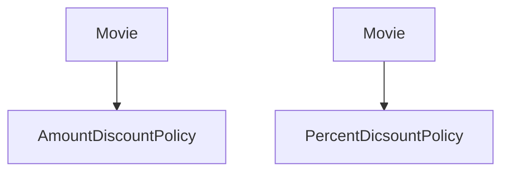
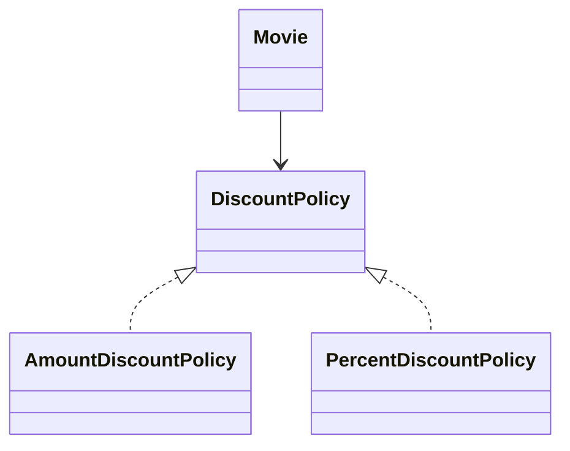
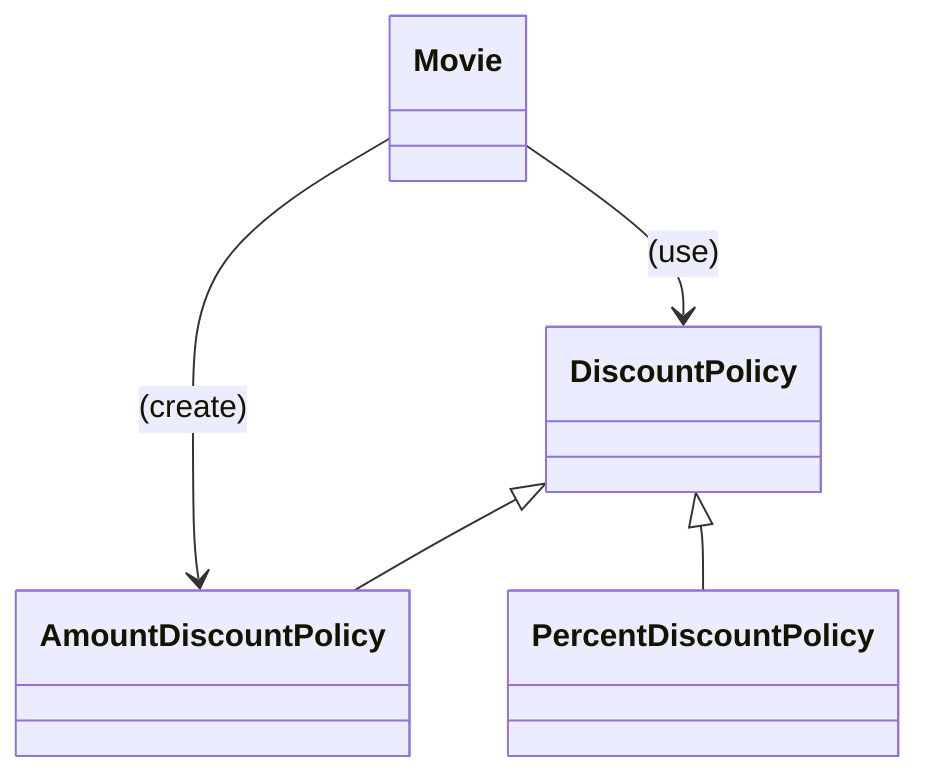
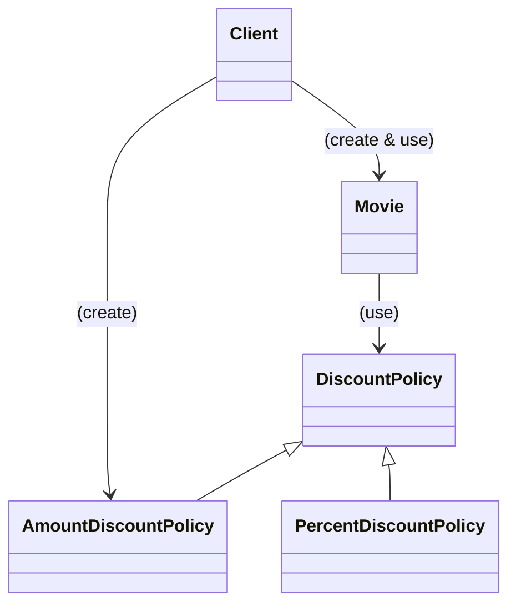
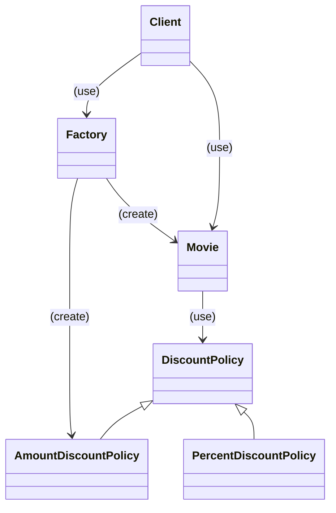
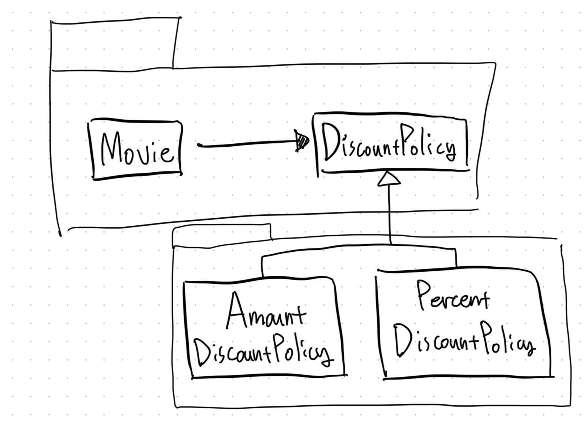

# Chapter 09 유연한 설계

## 1. 개방-폐쇄 원칙

- 변화에 유연하게 대응할 수 있는 설계를 만들 수 있는 원칙 중 하나로 개방-폐쇄 원칙(Open-Closed Principle, OCP)을 고안했다.
    - 개방-폐쇄 원칙은 아래 한 문장으로 요약할 수 있다.
    - `소프트웨어 개체(클래스, 모듈, 함수 등등)는 확장에 대해 열려 있어야 하고 수정에 대해서는 닫혀 있어야 한다.`
- `확장에 대해 열려 있다`: 애플리케이션의 요구사항이 변경될 때 이 변경에 맞게 새로운 '동작'을 추가해서 애플리케이션의 기능을 확장할 수 있다.
- `수정에 대해 닫혀 있다`: 기존의 '코드'를 수정하지 않고도 애플리케이션의 동작을 추가하거나 변경할 수 있다.

### 컴파일타임 의존성을 고정시키고 런타임 의존성을 변경하라

- 런타임 의존성은 실행 시에 협력에 참여하는 객체들 사이의 관계다.



- 컴파일타임 의존성은 코드에서 드러나는 클래스들 사이의 관계다.



- 위의 할인 정책 설계는 이미 개방-폐쇄 원칙을 따르고 있다.
- 중복 할인 정책을 추가한다고 가정해보자.
  - `DiscountPolicy`의 자식 클래스로 `OverlappedDiscountPolicy` 클래스만 추가하면 된다.
  - `Movie`, `DiscountPolicy`, `AmountDiscountPolicy`, `PercentDiscountPolicy` 중 어떤 코드도 수정하지 않았다.
- 기존 클래스를 전혀 수정하지 않은 채 애플리케이션의 동작을 확장했다.
  - 단순히 새로운 클래스를 추가하는 것만으로 `Movie`를 새로운 컨텍스트에 사용되도록 확장할 수 있었던 것이다.

### 추상화가 핵심이다

- 개방-폐쇄 원칙의 핵심은 `추상화에 의존하는 것`이다.
  - 여기서 `추상화`와 `의존`이라는 두 개념 모두 중요하다.
- 추상화란 핵심적인 부분만 남기고 불필요한 부분은 생략함으로써 복잡성을 극복하는 기법이다.
  - 추상화 과정을 거치면 문맥이 바뀌더라도 변하지 않는 부분만 남게 되고 문맥에 따라 변하는 부분은 생략된다.
  - 추상화를 사용하면 생략된 부분을 문맥에 적합한 내용으로 채워넣음으로써 각 문맥에 적합하게 기능을 구체화하고 확장할 수 있다.
- 공통적인 부분은 문맥이 바뀌더라도 변하지 않아야 한다. 다시 말해서 수정할 필요가 없어야 한다.
  - 따라서 추상화 부분은 수정에 대해 닫혀 있다.
  - 추상화를 통해 확장의 여지를 남긴다.

```java
public abstract class DiscountPolicy {
  private List<DiscountCondition> conditions = new ArrayList<>();
  
  public DiscountPolicy(DiscountCondition ...conditions) {
    this.conditions = conditions;
  }
  
  public Money calculateDiscountAmount(Screening screening) {
    for (DiscountCondition each: conditions) {
      if (each.isSatisfiedBy(screening)) {
        return getDiscountFee(screening);
      }
    }
    return screening.getMovieFee();
  }
  
  abstract private Money getDiscountAmount(Screening screening);
}
```

- 위의 코드에서 변하지 않는 부분은 할인 여부를 판단하는 로직이고 변하는 부분은 할인된 요금을 계산하는 방법이다.
  - 추상화 과정을 통해 생략된 부분은 할인 요금을 계산하는 방법이다.
  - 상속을 통해 생략된 부분을 구체화함으로써 할인 정책을 확장했다.
- 여기서 변하는 부분을 고정하고 변하지 않는 부분을 생략하는 추상화 매커니즘이 개방-폐쇄 원칙의 기반이 된다는 사실에 주목하라.
  - 언제라도 추상화의 생략된 부분을 채워넣음으로써 새로운 문맥에 맞게 기능을 확장할 수 있다.
  - 따라서 추상화는 설계의 확장을 가능하게 한다.
- 단순히 어떤 개념을 추상화했다고 해서 수정에 대해 닫혀 있는 설계를 만들 수 있는 것은 아니다.
  - 개방-폐쇄 원칙에서 폐쇄를 가능하게 하는 것은 의존성의 방향이다.
  - 수정에 대한 영향을 최소화하기 위해서는 모든 요소가 추상화에 의존해야 한다.

```java
public class Movie {
  ...
  private DiscountPolicy discountPolicy;
  
  public Movie(String title, Duration runningTime, Money fee, DiscountPolicy discountPolicy) {
    ...
    this.discountPolicy = discountPolicy;
  }
  
  public Money calculateMovieFee(Screening screening) {
    return fee.minus(discountPolicy.calculateDiscountAmount(screening));
  }
}
```

- `Movie`는 할인 정책을 추상화한 `DiscountPolicy`에 대해서만 의존한다.
  - 의존성은 변경의 영향을 의미하고 `DiscountPolicy`는 변하지 않는 추상화라는 사실에 주목하라.
  - `DiscountPolicy`에 자식 클래스를 추가하더라도 영향을 받지 않는다.
  - 따라서 `Movie`와 `DiscountPolicy`는 수정에 대해 닫혀 있다.
- 여기서 주의할 점은 추상화를 했다고 해서 모든 수정에 대해 설계가 폐쇄되는 것은 아니라는 것이다.
  - 수정에 대해 닫혀 있고 확장에 열려 있는 설계는 공짜로 얻어지지 않는다.
  - 변경에 의한 파급효과를 최대한 피하기 위해서는 변하는 것과 변하지 않는 것이 무엇인지를 이해하고 이를 추상화의 목적으로 삼아야만 한다.

<br/>

## 2. 생성 사용 분리

- `Movie`가 오직 `DiscountPolicy`라는 추상화에만 의존하기 위해서는 `Movie` 내부에서 `AmountDiscountPolicy`같은 구체 클래스의 인스턴스를 생성해서는 안 된다.
- 아래 코드는 동작을 추가하거나 변경하기 위해 기존의 코드를 수정하도록 만들기 때문에 개방-폐쇄 원칙을 위반한다.

```java
public class Movie {
  ...
  private DiscountPolicy discountPolicy;
  
  public Movie(String title, Duration runningTime, Money fee) {
    ...
    this.discountPolicy = new AmountDiscountPolicy(...);
  }
  
  public Money calculateMovieFee(Screening screening) {
    return fee.minus(discountPolicy.calculateDiscountAmount(screening));
  }
}
```

- 결합도가 높아질수록 개방-폐쇄 원칙을 따르는 구조를 설계하기가 어려워진다.
  - 알아야 하는 지식이 많으면 결합도도 높아진다는 사실을 기억하자.
  - 이렇게 되면 컨텍스트를 바꾸기 위한 유일한 방법은 코드 안에 명시돼 있는 컨텍스트에 대한 정보를 직접 수정하는 것뿐이다.
- 동일한 클래스 안에서 객체 생성과 사용이라는 두 가지 이질적인 목적을 가진 코드가 공존하는 것이 문제가 된다.



- 유연하고 재사용 가능한 설계를 원한다면 객체와 관련된 두 가지 책임을 서로 다른 객체로 분리해야 한다.
  - 객체에 대한 `생성과 사용을 분리(Seperation use from creation)`해야 한다.

> 소프트웨어 시스템은 (응용 프로그램 객체를 제작하고 의존성을 서로 "연결"하는) 시작 단계와 (시작 단계 이후에 이어지는) 실행 단계를 분리해야 한다.

- 사용으로부터 생성을 분리하는 데 사용되는 가장 보편적인 방법은 객체를 생성할 책임을 클라이언트로 옮기는 것이다.

```java
public class Client {
  public Money getAvatarFee() {
    Movie avatar = new Movie(
        "아바타", Duration.ofMinutes(120), Money.wons(10_000), new AmountDiscountPolicy(...));
    return avatar.getFee();
  }
}
```



### Factory 추가하기

- 생성 책임을 Client로 옮긴 배경에는 `Movie`는 특정 컨텍스트에 묶여서는 안 되지만 `Client`는 묶여도 상관이 없다는 전제가 깔려 있다.
- 하지만 `Movie`를 사용하는 `Client`도 특정한 컨텍스트에 묶이지 않기를 바란다고 가정해보자.
  - = `Client`는 `Movie`를 사용만 한다. 생성 책임은 분리한다.
- 생성과 사용을 분리하기 위해 객체 생성에 특화된 객체인 **FACTORY**를 사용해볼 수 있겠다.

```java
public class Factory {
  public Movie createAvatarMovie() {
    return new Movie(
            "아바타", Duration.ofMinutes(120), Money.wons(10_000), new AmountDiscountPolicy(...)); 
  }
}
```

```java
public class Client {
  private Factory factory;
  
  public Client(Factory factory) {
    this.factory = factory;
  }
  
  public Money getAvatarFee() {
    Movie avatar = factory.createAvatarMovie();
    return avatar.getFee();
  }
}
```

- **FACTORY**를 사용하면 `Movie`와 `AmountDiscountPolicy`를 생성하는 책임 모두를 **FACTORY**로 이동할 수 있다.
- 이제 `Client`에는 사용과 관련된 책임만 남게 되는데 하나는 **FACTORY**를 통해 생성된 `Movie` 객체를 얻기 위한 것이고 다른 하나는 `Movie`를 통해 가격을 계산하기 위한 것이다.
- `Client`는 오직 사용과 관련된 책임만 지고 생성과 관련된 어떤 지식도 가지지 않을 수 있다.



### 순수한 가공물에게 책임 할당하기

- 도메인 모델은 정보 전문가를 찾기 위해 참조할 수 있는 일차적인 재료다.
  - 어떤 책임을 할당하고 싶다면 제일 먼저 도메인 모델 안의 개념 중에서 적절한 후보가 존재하는지 찾아봐야 한다.
- 방금 전에 추가한 **FACTORY**는 도메인 모델에 속하지 않는다.
  - **FACTORY**를 추가한 이유는 순수하게 기술적인 결정이다.
  - 전체적으로 결합도를 낮추고 재사용성을 높이기 위해 도메인 개념에게 할당돼 있던 객체 생성 책임을 도메인 개념과는 아무런 상관이 없는 가공의 객체로 이동시킨 것이다.
- 크레이그 라만은 시스템을 객체로 분해하는 데는 크게 2가지 방식이 존재한다고 설명한다.
  1. 표현적 분해 representational decomposition
  2. 행위적 분해 begavioral decomposition

#### 표현적 분해

- 도메인에 존재하는 사물 또는 개념을 표현하는 객체들을 이용해 시스템을 분해하는 것이다.
- 도메인 모델에 담겨 있는 개념과 관계를 따르며 도메인과 소프트웨어 사이의 표현적 차이를 최소화하는 것을 목적으로 한다.
- 객체지향 설계를 위한 가장 기본적인 접근법이다.

#### 순수한 가공물

- 그러나 종종 도메인 개념을 표현하는 객체에게 책임을 할당하는 것만으로는 부족한 경우가 발생한다.
  - 도메인 모델은 설계를 위한 중요한 출발점이지만 단지 출발점이라는 사실을 명심해야 한다.
- 실제로 동작하는 애플리케이션은 데이터베이스 접근을 위한 객체와 같이 도메인 개념들을 초월하는 기계적인 개념들을 필요로 할 수 있다.
- 모든 책임을 도메인 객체에게 할당하면 낮은 응집도, 높은 결합도, 재사용성 저하와 같은 심각한 문제점에 봉착하게 될 가능성이 높아진다.
  - 이 경우 도메인 개념을 표현한 객체가 아닌 설계자가 편의를 위해 임의로 만들어낸 가공의 객체에게 책임을 할당해서 문제를 해결해야 한다.
  - 크레이그 라만은 이처럼 책임을 할당하기 위해 창조되는 도메인과 무관한 인공적인 객체를 `PURE FABRICATION 순수한 가공물`이라고 부른다.
- 보통 특정한 행동을 표현하는 것이 일반적이다.
  - 따라서 순수한 가공물은 표현적 분해보다는 행위적 분해에 의해 생성되는 것이 일반적이다.
- 이런 측면에서 객체지향이 실세계의 모방이라는 말은 옳지 않다.
- 도메인 개념뿐만 아니라 설계자들이 임의적으로 창조한 인공적인 추상화들을 포함하고 있다.
  - 오히려 인공적으로 창조한 객체들이 도메인 개념을 반영하는 객체들보다 오히려 더 많은 비중을 차지하는 것이 일반적이다.

> PURE FABRICATION Pattern
> - 객체지향 설계는 문제 도메인 상의 개념을 소프트웨어 객체로 구현하고 책임을 할당한다. 하지만 만약 도메인 객체에 책임을 할당할 경우 `HIGH COHESION, LOW COUPLING`, 재사용성 등의 목적을 위반한다면 어떻게 해야 하는가?
> - 문제 도메인 개념을 표현하지 않는, 인위적으로 또는 편의상 만든 클래스에 매우 응집된 책임을 할당하라.
> - 이들 클래스는 문제 도메인 상에는 존재하지 않지만 순수하게 전체 설계의 품질을 높이기 위해 설계자의 임의에 따라 추가한 상상 속의 가공물이다.

<br/>

## 3. 의존성 주입

- 외부의 독립적인 객체가 인스턴스를 생성한 후 이를 전달해서 의존성을 해결하는 방법을 `의존성 주입 Dependency Injection`이라고 부른다.
  - 의존성 주입이라고 부르는 이유는 의존성의 대상을 외부에서 해결한 후 이를 사용하는 객체 쪽으로 주입하기 때문이다.
- 의존성 주입에서는 3가지 방법이 있다.
1. 생성자 주입
2. setter 주입
3. 메소드 주입: 메소드 실행 시 인자를 이용한 의존성 해결

### 숨겨진 의존성은 나쁘다.

- 의존성 주입 외에도 의존성을 해결할 수 있는 다양한 방법이 존재한다.
  - 대표적인 방법으로는 SERVICE LOCATOR 패턴이 있다.
  - 의존성을 해결할 객체들을 보관하는 일종의 저장소다.
  - 외부에서 객체에게 의존성을 전달하는 의존성 주입과 달리 SERVICE LOCATOR의 경우 객체가 직접 SERVICE LOCATOR에게 의존성을 해결해줄 것을 요청한다.

> `SERVICE LOCATOR` 패턴은 서비스를 사용하는 코드로부터 서비스가 누구인지(서비스를 구현한 구체 클래스의 타입이 무엇인지), 어디에 있는지(클래스 인스턴스를 어떻게 얻을지)를 몰라도 되게 해준다.

- ServiceLocator 클래스

```java
public class Movie {
  ...
  private DiscountPolicy discountPolicy;
  
  public Movie(String title, Duration runningTime, Money fee) {
    this.title = title;
    this.runningTime = runningTime;
    this.fee = fee;
    this.discountPolicy = ServiceLocator.discountPolicy();
  }
}
```

```java
public class ServiceLocator {
  private static ServiceLocator soleInstance = new ServiceLocator();
  private DiscountPolicy discountPolicy;
  
  public static DiscountPolicy discountPolicy() {
    return soleInstance.discountPolicy;
  }
  
  public static void provide(DiscountPolicy discountPolicy) {
    soleInstance.discountPolicy = discountPolicy;
  }
  
  private ServiceLocator() {}
}
```

- `SERVICE LOCATOR` 패턴을 사용하면 Factory가 아래와 같이 변경된다.

```java
public class Factory {
  public Movie createAvatarMovie() {
    ServiceLocator.provide(new AmountDiscountPolicy(...));
    return new Movie(
            "아바타", Duration.ofMinutes(120), Money.wons(10_000)); 
  }
}
```

- 하지만 저자는 `SERVICE LOCATOR` 패턴을 선호하지 않는다고 한다.
  - 가장 큰 단점! 의존성을 감춘다는 단점이 있기 때문
  - `Movie` 그 어느곳에도 의존성에 대한 정보가 표시돼 있지 않다.
  - 잘못하면 `NullPointerException`이 발생할 수도 있다.
- 의존성이 구현 내부로 감춰질 경우 의존성과 관련된 문제가 컴파일타임이 아닌 런타임에 가서야 발견되다는 사실을 알 수 있다.
- 의존성을 숨기는 코드는 단위 테스트 작성도 어렵다.
  - 문제의 원인은 숨겨진 의존성이 캡슐화를 위반했기 때문이다.
  - SERVICE LOCATOR는 캡슐화를 위반할 수밖에 없다.

> - 접근해야 할 객체가 있다면 전역 매커니즘 대신 필요한 객체를 인수로 넘겨줄 수는 없는지부터 생각해보자. 이 방법은 굉장히 쉬운 데다 결합을 명확하게 보여줄 수 있다.
> - 하지만 직접 객체를 넘기는 방식이 불필요하거나 도리어 코드를 읽기 어렵게 하기도 한다.
>   - 로그나 메모리 관리 같은 정보가 모듈의 공개 API에 포함돼 있어서는 안 된다.
>   - 렌더링 함수 매개변수에는 렌더링에 관련된 것만 있어야 하며 로그 같은 것이 섞여 있어서는 곤란하다.

<br/>

## 4. 의존성 역전 원칙

### 추상화와 의존성 역전

- 현재 할인 정책의 설계가 의존성 역전이 된 상태다. 
  - `Movie`가 직접 구현체를 의존하지 않고 추상화된 `DiscountPolicy`를 의존한다.
- 구체 클래스는 의존성의 시작점이어야 한다. 의존성의 목적지가 돼서는 안 된다.
- `의존성 역전 원칙 Dependency Inversion Principle, DIP`을 정리하자면 아래와 같다.
  1. 상위 수준의 모듈은 하위 수준의 모듈에 의존해서는 안 된다. 둘 모두 추상화에 의존해야 한다.
  2. 추상화는 구체적인 사항에 의존해서는 안 된다. 구체적인 사항은 추상화에 의존해야 한다.
- 이 용어를 최초로 착안한 로버트 마틴은 `역전 inversion`이라는 단어를 사용한 이유에 대해 의존성 역전 원칙을 따르는 설계는 의존성의 방향이 전통적인 절차형 프로그래밍과는 반대 방향으로 나타나기 때문이라고 설명한다.

> - 수년 동안, 많은 사람들이 왜 필자가 이 원칙의 이름에 '역전'이란 단어를 사용했는지 질문해 왔다.
> - 이것은 구조적 분석 설계와 같은 좀 더 전통적인 소프트웨어 개발 방법에서는 소프트웨어 구조에서 상위 수준의 모듈이 하위 수준의 모듈에 의존하는, 그리고 정책이 구체적인 것에 의존하는 경향이 있었기 때문이다.
> - 실제로 이런 방법의 목표 중 하나는 상위 수준의 모듈이 하위 수준의 모듈을 호출하는 방법을 묘사하는 서브프로그램의 계층 구조를 정의하는 것이었다.
> - 잘 설계된 객체지향 프로그램의 의존성 구조는 절차적 방법에 의해 일반적으로 만들어진 의존성 구조에 대해 '역전'된 것이다.

### 의존성 역전 원칙과 패키지

- **역전은 의존성의 방향뿐만 아니라 인터페이스의 소유권에도 적용된다.**
- 아래와 같이 Movie와 추상 클래스인 `DiscountPolicy`를 하나의 패키지로 모으는 것은 `Movie`를 특정한 컨텍스트로부터 완벽하게 독립시킨다.



<br/>

## 5. 유연성에 대한 조언

### 유연한 설계는 유연성이 필요할 때만 옳다

- 유연하고 재사용 가능한 설계가 항상 좋은 것은 아니다.
- 설계의 미덕은 단순함과 명확함으로부터 나온다. 단순하고 명확한 설계를 가진 코드는 읽기 쉽고 이해하기도 편하다.
- 유연한 설계는 이와는 다른 길을 걷는다. 변경하기 쉽고 확장하기 쉬운 구조를 만들기 위해서는 단순함과 명확함의 미덕을 버리게될 가능성이 높다.
  - 유연한 설계 = 복잡한 설계 = 암시적 설계
- 변경은 예상이 아니라 현실이어야 한다. 미래에 변경이 일어날지도 모른다는 막연한 불안감은 불필요하게 복잡한 설계를 낳는다.
  - 아직 일어나지 않은 변경은 변경이 아니다.
- 설계가 유연할수록 클래스 구조와 객체 구조 사이의 거리는 점점 멀어진다.
  - 따라서 유연함은 단순성과 명확성의 희생 위에서 자라난다.
  - 유연한 설계를 단순하고 명확하게 만드는 유일한 방법은 사람들 간의 긴밀한 커뮤니케이션뿐이다.
  - 복잡성이 필요한 이유와 합리적인 근거를 제시하지 않는다면 어느 누구도 설계를 만족스러운 해법으로 받아들이지 않을 것이다.

> - 우리의 지적 능력은 정적인 관계에 더 잘 들어맞고, 시간에 따른 진행 과정을 시각화하는 능력은 상대적으로 덜 발달했다는 점이다.
> - 이러한 이유로 우리는 (자신의 한계를 알고 있는 현명한 프로그래머로서) 정적인 프로그램과 동적인 프로세스 사이의 간극을 줄이기 위해 최선을 다해야 하며, 이를 통해 프로그램(텍스트 공간에 흩뿌려진)과 (시간에 흩뿌려진) 진행 과정 사이를 가능한 일치시켜야 한다.
> 
> [Dijkstra]

### 협력과 책임이 중요하다

- 설계를 유연하게 만들기 위해서는 먼저 역할, 책임, 협력에 초점을 맞춰야 한다.
- 다양한 컨텍스트에서 협력을 재사용할 필요가 없다면 설계를 유연하게 만들 당위성도 함께 사라진다.
  - 객체들이 메시지 전송자의 관점에서 동일한 책임을 수행하는지 여부를 판단할 수 없다면 공통의 추상화를 도출할 수 없다.
  - 동일한 역할을 통해 객체들을 대체 가능하게 만들지 않았다면 협력에 참여하는 객체들을 교체할 필요가 없다. 
- 초보자가 자주 저지르는 실수 중 하나는 객체의 역할과 책임이 자리를 잡기 전에 너무 성급하게 객체 생성에 집중하는 것이다.
  - 이것은 객체 생성과 관련된 불필요한 세부사항에 객체를 결합시킨다.
  - 객체를 생성할 책임을 담당할 객체나 객체 생성 매커니즘을 결정하는 시점은 책임 할당의 마지막 단계로 미뤄야만 한다.
- 책임의 불균형이 심화되고 있는 상태에서 객체의 생성 책임을 지우는 것은 설계를 하부의 특정한 매커니즘에 종속적으로 만들 확률이 높다.
  - 불필요한 Singleton 패턴은 객체 생성에 관해 너무 이른 시기에 고민하고 결정할 때 도입되는 경향이 있다.
  - 핵심은 객체를 생성하는 방법에 대한 결정은 모든 책임이 자리를 잡은 후 가장 마지막 시점에 내리는 것이 적절하다는 것이다.

<br/>

# 참고자료

- 오브젝트, 조영호 지음