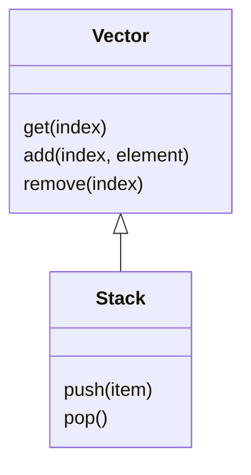
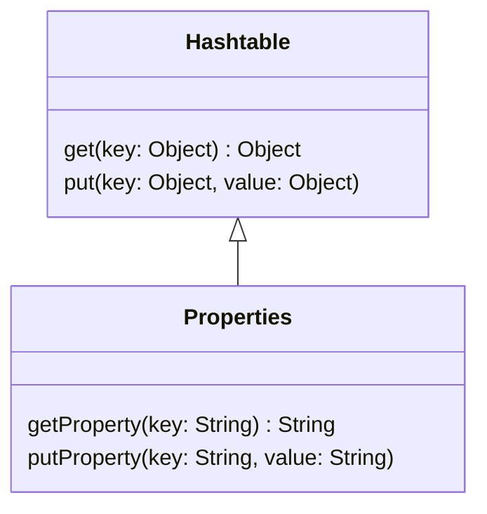
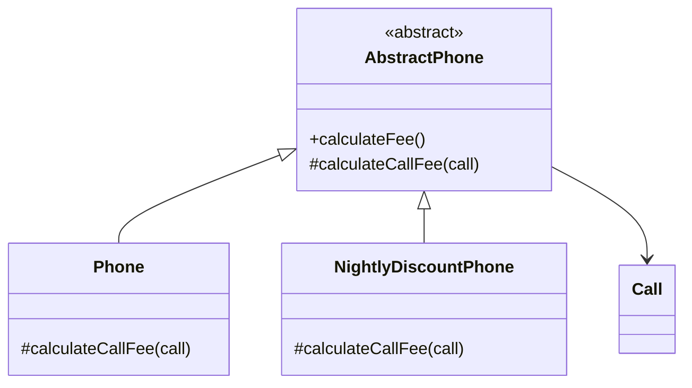

# Chapter10. 상속과 코드 재사용

- 객체지향 프로그래밍의 장점 중 하나는 코드를 재사용하기가 용이하다는 것이다.
  - 전통적인 패러다임에서 코드를 재사용하는 방법은 코드를 복사한 후 수정하는 것이다.
- 객체지향에서는 코드를 재사용하기 위해 '새로운' 코드를 추가한다.
  - 객체지향에서 클래스를 재사용하는 전통적인 방법은 새로운 클래스를 추가하는 것이다.
  - 가장 대표적인 기법으로는 `상속`이 있다.
  - 재사용 관점에서 상속이란 클래스 안에 정의된 인스턴스 변수와 메소드를 자동으로 새로운 클래스에 추가하는 구현 기법이다.
- 상속 외에도 코드를 효과적으로 재사용할 수 있는 방법이 한 가지 더 있다.
  - 인스턴스 안에 기존 클래스의 인스턴스를 포함시키는 방법으로 흔히 `합성`이라고 부른다.
- 코드를 재사용하려는 강력한 동기 이면에는 중복된 코드를 제거하려는 욕망이 숨어 있다.

<br/>

## 1. 상속과 중복 코드

- 중복 코드는 사람들의 마음 속에 의심과 불신의 씨앗을 뿌린다.
  - 유사한 코드가 이미 존재하는데도 새로운 코드를 만든 이유는 무엇일까?
  - 의도한 것인가? 실수인가? 중복이기는 한 걸까? 중복을 없애도 문제가 없을까?

### DRY 원칙

- `Don't Repeat Yourself`
- 중복 코드는 변경을 방해한다. 이것이 중복 코드를 제거해야 하는 가장 큰 이유다.
- 프로그램의 본질은 비즈니스와 관련된 지식을 코드로 변환하는 것이다. 안타깝게도 이 지식은 항상 변한다. 그에 맞춰 지식을 표현하는 코드 역시 변경해야 한다.
- 중복 코드가 가지는 가장 큰 문제는 코드를 수정하는 데 필요한 노력을 몇 배로 증가시킨다는 점이다.
  - 우선 어떤 코드가 중복인지를 찾아야 한다.
  - 찾아낸 코드를 일관되게 수정해야 한다.
  - 모든 중복 코드를 개별적으로 테스트해서 동일한 결과를 내놓는지 확인해야만 한다.
  - 중복 코드 => 수정과 테스트 비용 증가
- 중복 여부를 판단하는 기준은 변경
  - 요구사항이 변경됐을 때 두 코드를 함께 수정해야 한다면 이 코드는 중복.
  - 중복 코드를 결정하는 기준은 코드의 모양이 아니다. 모양이 유사하다는 것은 단지 중복의 징후일 뿐이다.

### 중복과 변경

#### 중복 코드 살펴보기

- 한 달에 한 번씩 가입자별로 전화 요금을 계산하는 간단한 애플리케이션을 개발.
- 요구사항
  - 10초당 5원의 통화료 부과
- 만약 심야 할인 요금제라는 요구 사항이 들어온다면?
  - 밤 10시 이전 10초당 5원
  - 밤 10시 이후 10초당 2원
- 가장 빠른 방법은 `Phone`을 복사해서 `NightlyDisountPhone`이라는 새로운 클래스를 만든 후 수정하는 것이다.
- 하지만 구현 시간을 절약한 대가로 지불해야 하는 비용은 예상보다 크다.
  - `Phone`과 `NightlyDiscountPhone` 사이에는 중복 코드가 존재하기 때문에 언제 터질지 모르는 시한폭탄을 안고 있는 것과 같다.

#### 중복 코드 수정하기

- 새로운 요구사항을 추가
  - 통화 요금에 부과할 세금 계산
  - 부과되는 세율은 가입자의 핸드폰마다 다르다.
- 현재 통화 요금을 계산하는 로직은 `Phone`과 `NightlyDiscountPhone` 양쪽 모두에 구현돼 있기 때문에 세금을 추가하기 위해서는 두 클래스를 함께 수정해야 한다.
- 중복 코드는 항상 함께 수정해야 하기 때문에 하나라도 빠트린다면 버그로 이어질 것이다.
  - 만약 `Phone`만 수정되고 `NightlyDiscountPhone`은 수정하지 않은 채 코드가 배포됐다면? => 심야 할인 요금제의 모든 가입자에게 세금이 부과되지 않는 장애가 발생할 것이다.

#### 타입 코드 사용하기

- 두 클래스 사이의 중복 코드를 제거하는 한 가지 방법은 클래스를 하나로 합치는 것이다.
  - 타입 코드의 값에 따라 로직을 분기시켜 `Phone`과 `NightlyDiscountPhone`을 하나로 합칠 수 있다.
  - 하지만 타입 코드를 사용하는 클래스는 낮은 응집도와 높은 결합도라는 문제에 시달리게 된다.

### 상속을 이용해서 중복코드 제거하기

- 이미 존재하는 클래스와 유사한 클래스가 필요하다면 코드를 복사하지 말고 상속을 이용해 코드를 재사용할 수 있다.
- 상속을 염두에 두고 설계되지 않은 클래스를 상속을 이용해 재사용하는 것은 생각처럼 쉽지 않다.
  - 개발자는 재사용을 위해 상속 계층 사이에 무수히 많은 가정을 세웠을지도 모른다.
  - 그리고 그 가정은 코드를 이해하기 어렵게 만들뿐만 아니라 직관에도 어긋날 수 있다.
- 요구사항과 구현 사이의 차이가 크면 클수록 코드를 이해하기 어려워진다.
  - 잘못 사용된 상속은 이 차이를 더 크게 벌린다.
- 실제 프로젝트에서 마주치게 될 클래스의 상속 계층은 매우 깊을 것이고, 깊고 깊은 상속 계층의 계단을 하나 내려올 때마다 이해하기 어려운 가정과 마주하게 될 수도 있다.
  - 상속은 결합도를 높인다.
  - 상속이 초래하는 부모 클래스와 자식 클래스 사이의 강한 결합이 코드를 수정하기 어렵게 만든다.

### 강하게 결합된 Phone과 NightlyDiscountPhone

- 부모 클래스와 자식 클래스 사이의 결합이 문제인 이유.
- `NightlyDiscountPhone`을 `Phone`의 자식 클래스로 만든 이유는 `Phone`의 코드를 재사용하고 중복 코드를 제거하기 위해서다.
  - 하지만 세금을 부과하는 로직을 추가하기 위해 `Phone`을 수정할 때 유사한 코드를 `NightlyDiscountPhone`에도 추가해야 했다.
  - 코드 중복을 제거하기 위해 상속을 사용했음에도 세금을 계산하는 로직을 추가하기 위해 새로운 중복 코드를 만들어야 하는 것이다.
- 이것은 `NightlyDiscountPhone`이 `Phone`의 구현에 너무 강하게 결합돼 있기 때문에 발생하는 문제다.

> #### 상속을 위한 경고1
> 자식 클래스의 메소드 안에서 super 참조를 이용해 부모 클래스의 메소드를 직접 호출할 경우 두 클래스는 강하게 결합된다. super 호출을 제거할 수 있는 방법을 찾아 결합도를 제거하라.

- 이처럼 상속 관계로 연결된 자식 클래스가 부모 클래스의 변경에 취약해지는 현상을 가리켜 취약한 기반 클래스 문제라고 부른다.
  - 취약한 기반 클래스 문제는 코드 재사용을 목적으로 상속을 사용할 때 발생하는 가장 대표적인 문제다.

<br/>

## 2. 취약한 기반 클래스 문제

- 상속은 자식 클래스와 부모 클래스의 결합도를 높인다.
  - 자식 클래스는 부모 클래스의 불필요한 세부사항에 엮이게 된다. 부모 클래스의 작은 변경에도 자식 클래스는 컴파일 오류와 실행 에러라는 고통에 시달려야 할 수도 있다.
  - 이처럼 부모 클래스의 변경에 의해 자식 클래스가 영향을 받는 현상을 `취약한 기반 클래스 문제 Fragile Base Class Problem, Brittle Base Class Problem`라고 부른다.
  - 상속을 사용한다면 피할 수 없는 객체지향 프로그래밍의 근본적인 취약성이다.

> - 결합도의 개념을 상속에 적용해보자. 구현을 상속한 경우(extends를 사용한 경우) 파생 클래스는 기반 클래스에 강하게 결합되며, 이 둘 사이의 밀접한 연결은 바람직하지 않다.
> - 설계자들은 이런 현상에 대해 '취약한 기반 클래스 문제'라는 명칭을 붙였다. 겉으로 보기에는 안전한 방식으로 기반 클래스를 수정한 것처럼 보이더라도 이 새로운 행동이 파생 클래스에게 상속될 경우 파생 클래스의 잘못된 동작을 초래할 수 있기 때문에 기반 클래스는 '취약하다'.
> - 단순히 기반 클래스의 메소드들만 조사하는 것만으로는 기반 클래스를 변경하는 것이 안전하다고 확신할 수 없다. 모든 파생 클래스들을 살펴봐야(그리고 테스트까지 해야) 한다.
> - 나아가 기반 클래스와 파생 클래스를 사용하는 모든 코드가 새로운 코드로 인해 영향을 받지 않았는지 점검해야 한다. 핵심적인 기반 클래스에 대한 단순한 변경이 전체 프로그램을 불안정한 상태로 만들어버릴 수도 있다.

- 취약한 기반 클래스 문제는 상속이라는 문맥 안에서 결합도가 초래하는 문제점을 가리키는 용어다. 상속 관계를 추가할수록 전체 시스템의 결합도가 높아진다는 사실을 알고 있어야 한다.
  - 상속은 자식 클래스를 점진적으로 추가해서 기능을 확장하는 데는 용이하지만 높은 결합도로 인해 부모 클래스를 점진적으로 개선하는 것은 어렵게 만든다.
  - 최악의 경우에는 자식 클래스를 동시에 수정하고 테스트해야 할 수도 있다.
- 취약한 기반 클래스 문제는 캡슐화를 약화시키고 결합도를 높인다.
  - 상속은 자식 클래스가 부모 클래스의 구현 세부사항에 의존하도록 만들기 때문에 캡슐화를 약화시킨다.
  - 이것이 상속이 위험한 이유인 동시에 우리가 상속을 피해야 하는 첫 번째 이유다.
- 객체를 사용하는 이유느느 구현과 관련된 세부사항을 퍼블릭 인터페이스 뒤로 캡슐화할 수 있기 때문이다.
  - 캡슐화는 변경에 의한 파급효과를 제어할 수 있기 때문에 가치가 있다.
  - 객체는 변경될지도 모르는 불안정한 요소를 캡슐화함으로써 파급효과를 걱정하지 않고도 자유롭게 내부를 변경할 수 있다.
- 안타깝게도 상속을 사용하면 부모 클래스의 퍼블릭 인터페이스가 아닌 구현을 변경하더라도 자식 클래스가 영향을 받기 쉬워진다.
  - 상속 계층의 상위에 위치한 클래스에 가해지는 작은 변경만으로도 상속 계층에 속한 모든 자손들이 급격하게 요동칠 수 있다.
- 객체지향의 기반은 캡슐화를 통한 변경의 통제다.
  - 상속은 코드의 재사용을 위해 캡슐화의 장점을 희석시키고 구현에 대한 결합도를 높임으로써 객체지향이 가진 강력함을 반감시킨다.

### 불필요한 인터페이스 상속 문제

- 자바의 초기 버전에서 상속을 잘못 사용한 대표적인 사례는 `java.util.Properties`와 `java.util.Stack`이다.
  - 두 클래스의 공통점은 부모 클래스에서 상속받은 메소드를 사용할 경우 자식 클래스의 규칙이 위반될 수 있다는 것이다.

#### Stack

- `Stack은` `Vector`를 상속받아 구현되었다.
- 아래의 퍼블릭 인터페이스를 살펴보면 이 상속 관계가 가지는 문제점을 잘 알 수 있다.



- `Vector`는 임의의 위치에서 요소를 조회하고, 추가하고, 삭제할 수 있는 `get`, `add`, `remove` 오퍼레이션을 제공한다.
- 이에 비해 `Stack`은 맨 마지막 위치에서만 요소를 추가하거나 제거할 수 있는 `push`, `pop` 오퍼레이션을 제공한다.
- 안타깝게도 `Stack`이 `Vector`를 상속받기 때문에 `Stack`의 퍼블릭 인터페이스에 `Vector`의 퍼블릭 인터페이스가 합쳐진다.
  - 따라서 `Stack`에게 상속된 `Vector`의 퍼블릭 인터페이스를 이용하면 임의의 위치에서 요소를 추가하거나 삭제할 수 있다.
  - 맨 마지막 위치에서만 요소를 추가하거나 제거할 수 있도록 허용하는 `Stack`의 규칙을 쉽게 위반할 수 있다.

```java
Stack<String> stack = new Stack<>();
stack.push("1st");
stack.push("2nd");
stack.push("3rd");

stack.add(0, "4th");

assertEquals("4th", stack.pop()) // 에러! "4th"가 stack의 rule을 깨고 첫번째 요소로 삽입되었기 때문
```

- 문제의 원인은 `Stack`의 규칙을 무너뜨릴 여지가 있는 위험한 `Vector`의 퍼블릭 인터페이스까지도 함께 상속받았기 때문이다.
  - **인터페이스 설계는 제대로 쓰기엔 쉽게, 엉터리로 쓰기엔 어렵게 만들어야 한다.**

#### Properties

- `java.util.Properties` 클래스는 잘못된 유산을 물려받는 또 다른 클래스다.
  - `Properties` 클래스는 키와 값을 쌍으로 보관한다는 점에서 `Map`과 유사하지만 다양한 타입을 저장할 수 있는 `Map`과 달리 키와 값의 타입으로 오직 `String`만 가질 수 있다.



- 이 클래스는 `Map`의 조상인 `Hashtable`을 상속받는데 자바에 제네릭이 도입되기 이전에 만들어졌기 때문에 컴파일러가 키와 값의 타입이 `String`인지 여부를 체크할 수 있는 방법이 없었다.
  - 따라서 `Hashtable`이 인터페이스에 포함돼 있는 `put` 메소드를 이용하면 `String` 타입 이외의 키와 값이라도 `Properties`에 저장할 수 있다.

```java
Properties properties = new Properties();
properties.setProperty("A", "apple");
properties.setProperty("B", "banana");

properties.pus("C", 77);

assertEquals("corn", properties.getProperty("C"));
```

- "C"로 검색하면 null이 반환될 것이다.
- `Properties`의 `getProperty` 메소드가 반환할 값의 타입이 `String`이 아닐 경우 `null`을 반환하도록 구현돼 있기 때문이다.
  - 분명히 `properties.pus("C", 77)`로 값을 넣는 것에 성공했는데도 말이다.

> #### 상속을 위한 경고2
> - 상속 받은 부모 클래스의 메소드가 자식 클래스의 내부 구조에 대한 규칙을 깨트릴 수 있다.

### 메소드 오버라이딩의 오작용 문제

- 이펙티브 자바에서 소개된 `InstrumentedHashSet` 클래스(`HashSet`의 구현에 강하게 결합되어 있음)

```java
public class InstrumentedHashSet<E> extends HashSet<E> {
  private int addCount = 0;
  
  @Override
  public boolean add(E e) {
    addCount++;
    return super.add(e);
  }
  
  @Override
  public boolean addAll(Collection<? extends E> c) {
    addCount += c.size();
    return super.addAll(c);
  }
}
```

- 요소를 추가한 횟수를 기록하기 위해 `addCount`라는 인스턴스 변수를 포함한다.
  - 구현에는 아무런 문제가 없어보인다. 적어도 아래와 같은 코드를 실행하기 전에는!

```java
InstrumentedHashSet<String> languages = new InstrumentedHashSet<>();
languages.addAll(Arrays.asList("Java", "Ruby", "Scala"));
``` 

- `addCount`가 3이 될 거라고 예상하겠지만 실제로 실행한 후의 값은 6이다.
  - 그 이유는 부모 클래스인 `HashSet`의 `addAll` 메소드 안에서 `add` 메소드를 호출하기 때문이다. 
- 문제를 해결할 수 있는 방법은 `InstrumentedHashSet`의 `addAll` 메소드를 제거하는 것이다.
  - 하지만 이 방법 역시 문제가 될 수 있다.
  - 나중에 `HashSet`의 `addAll` 메소드가 `add` 메시지를 전송하지 않도록 수정된다면 `addAll` 메소드를 이용해 추가되는 요소들에 대한 카운트가 누락될 것이기 때문이다.
- 미래의 수정까지 감안한다면 더 좋은 해결책은 `InstrumentedHashSet`의 `addAll` 메소드를 오버라이딩하고 추가되는 각 요소에 대해 한 번씩 `add`를 호출하는 것이다.

```java
public class InstrumentedHashSet<E> extends HashSet<E> {
  private int addCount = 0;
  
  @Override
  public boolean add(E e) {
    addCount++;
    return super.add(e);
  }
  
  @Override
  public boolean addAll(Collection<? extends E> c) {
    boolean modified = false;
    for (E e: c)
      if (add(e))
        modified =true;
    return modified;
  }
}
```

- 하지만 이 방법에도 문제가 있다.
  - 오버라이딩된 `addAll` 메소드의 구현이 `HashSet`의 것과 동일하다는 것.
  - 미래에 발생할지 모르는 위험을 방지하기 위해 코드를 중복시킨 것이다.

> #### 상속을 위한 경고3
> - 자식 클래스가 부모 클래스의 메소드를 오버라이딩할 경우 부모 클래스가 자신의 메소드를 사용하는 방법에 자식 클래스가 결합될 수 있다.

- 조슈아 블로치는 클래스가 상속되기를 원한다면 상속을 위해 클래스를 설계하고 문서화해야 하며, 그렇지 않은 경우에는 상속을 금지시켜야 한다고 주장한다.
  - 상속이 초래하는 문제점을 보완하면서 코드 재사용의 장점을 극대화하기 위해 아래 주장을 참고

> - 우선, 그런 클래스에서는 메소드 오버라이딩으로 인한 파급 효과를 분명하게 문서화해야 한다. 달리 말해, 오버라이딩 가능한 메소드들의 자체 사용(self-use), 즉, 그 메소드들이 같은 클래스의 다른 메소드를 호출하는지에 대해 반드시 문서화해야 한다.
> - 이와 반대로, 각각의 `public`이나 `protected` 메소드 및 생성자가 어떤 오버라이딩 가능한 메소드를 호출하는지, 어떤 순서로 하는지, 호출한 결과가 다음 처리에 어떤 영향을 주는지에 대해서도 반드시 문서화해야 한다.
> - 더 일반적으로 말하면 오버라이딩 가능한 메소드를 호출할 수 있는 어떤 상황에 대해서도 문서화해야 한다는 것이다.

- 블로치는 내부 구현을 문서화하라고 말하고 있다.
  - 객체지향의 핵심이 구현을 캡슐화하는 것인데도 이렇게 내부 구현을 공개하고 문서화하는 것이 옳은가?

> - 그러나 잘 만들어진 API 문서는 메소드가 무슨 일(what)을 하는지를 기술해야 하고, 어떻게 하는지(how)를 설명해서는 안 된다는 통념을 어기는 것은 아닐까?
> - 그렇다. 어기는 것이다! 이것은 결국 상속이 캡슐화를 위밤함으로써 초래된 불행인 것이다. 서브클래스가 안전할 수 있게끔 클래스를 문서화하려면 클래스의 상세 구현 내역을 기술해야 한다.

- 설계는 트레이드오프 활동이라는 사실을 기억하라. 상속은 코드 재사용을 위해 캡슐화를 희생한다.
- 완벽한 캡슐화를 원한다면 코드 재사용을 포기하거나 상속 이외의 다른 방법을 사용해야 한다.

### 부모 클래스와 자식 클래스의 동시 수정 문제

- 음악 목록을 추가할 수 있는 플레이 리스트
- 이 예는 자식 클래스가 부모 클래스의 메소드를 오버라이딩하거나 불필요한 인터페이스를 상속받지 않았음에도 부모 클래스를 수정할 때 자식 클래스를 함께 수정해야 할 수도 있다는 사실을 보여준다.
- 조슈아 블로치는 아래와 같이 조언한다.

> - 다시 말해, 서브클래스는 올바른 기능을 위해 슈퍼클래스의 세부적인 구현에 의존한다. 슈퍼클래스의 구현은 릴리스를 거치면서 변경될 수 있고, 그에 따라 서브클래스의 코드를 변경하지 않더라도 깨질 수 있다.
> - 결과적으로 슈퍼 클래스의 작성자가 확장될 목적으로 특별히 그 클래스를 설계하지 않았다면 서브클래스는 슈퍼 클래스와 보조를 맞춰서 진화해야 한다.

<br/>

> #### 상속을 위한 경고4
> - 클래스를 상속하면 결합도로 인해 자식 클래스와 부모 클래스의 구현을 영원히 변경하지 않거나, 자식 클래스와 부모 클래스를 동시에 변경하거나 둘 중 하나를 선택할 수밖에 없다. 

<br/>

## 3. Phone 다시 살펴보기

- 상속으로 인한 피해를 최소화할 수 있는 방법을 찾아보자.
- 취약한 기반 클래스 문제를 완벽히 없앨 수는 없지만 어느 정도까지는 위험을 완화시킬 수 있다.
- 문제의 열쇠는 추상화다.

### 추상화에 의존하자

- `NightlyDiscountPhone`의 가장 큰 문제점은 Phone에 강하게 결합돼 있기 때문에 `Phone`이 변경될 경우 함께 변경될 가능성이 높다는 것이다.
- 이 문제를 해결하는 가장 일반적인 방법은 자식 클래스가 부모 클래스의 구현이 아닌 추상화에 의존하도록 만드는 것이다. 정확하게 말하면 부모 클래스와 자식 클래스 모두 추상화에 의존하도록 수정해야 한다.
- 코드 중복을 제거하기 위해 상속을 도입할 때 따르는 두 가지 원칙
1. 두 메소드가 유사하게 보인다면 차이점을 메소드로 추출하라. 메소드 추출을 통해 두 메소드를 동일한 형태로 보이도록 만들 수 있다.
2. 부모 클래스의 코드를 하위로 내리지 말고 자식 클래스의 코드를 상위로 올려라. 부모 클래스의 구체적인 메소드를 자식 클래스로 내리는 것보다 자식 클래스의 추상적인 메소드를 부모 클래스로 올리는 것이 재사용성과 응집도 측면에서 더 뛰어난 결과를 얻을 수 있다.

### 차이를 메소드로 추출하라.

- 서로 다른 로직은 먼저 추출하자.
- `calculateFee`의 for문 안에 구현된 요금 계산 로직이 서로 다르다는 사실을 알 수 있다.
  - 이 부분을 같은 이름을 가진 메소드로 추출하자.

```java
public class Phone {
  ...

  public Money calculateFee() {
    Money result = Money.ZERO;
    for (Call call: calls) {
      result = result.plus(calculateCallFee(call));
    }
    return result;
  }

  private Money calculateCallFee(Call call) {
    return amount.times(call.getDuration().getSeconds() / seconds.getSeconds());
  }
}
```

```java
public class NightlyDiscountPhone {
  ...
  
  public Money calculateFee() {
    Money result = Money.ZERO;

    for (Call call: calls) {
      result = result.plus(calculateCallFee(call));
    }
    return result;
  }

  private Money calculateCallFee(Call call) {
    if (call.getFrom().getHour() >= LATE_NIGHT_HOUR) {
      return nightlyAmount.times(call.getDuration().getSeconds() / seconds.getSeconds());
    } else {
      return regularAmount.times(call.getDuration().getSeconds() / seconds.getSeconds());
    }
  }
}
```

### 중복 코드를 부모 클래스로 올려라.

- 부모 클래스를 추가하자. 목표는 모든 클래스들이 추상화에 의존하도록 만드는 것이기 때문에 이 클래스는 추상클래스로 구현하는 것이 적합할 것이다.
- 그리고 공통 부분을 부모 클래스로 이동시키자.
  - 공통 코드를 옮길 때 **인스턴스 변수보다 메소드를 먼저 이동시키는 게** 편한데, 메소드를 옮기고 나면 그 메소드에 필요한 메소드나 인스턴스 변수가 무엇인지를 **컴파일 에러를 통해** 자동으로 알 수 있기 때문이다.
  - 컴파일 에러를 바탕으로 메소드와 인스턴스 변수를 이동시키면 불필요한 부분은 자식 클래스에 둔 채로 부모 클래스에 꼭 필요한 코드만 이동시킬 수 있다.

```java
package chapter09.bell.refactoring;

import java.util.ArrayList;
import java.util.List;

public abstract class AbstractPhone {

  private List<Call> calls = new ArrayList<>();

  public List<Call> getCalls() {
    return calls;
  }

  public void call(Call call) {
    calls.add(call);
  }

  public Money calculateFee() {
    Money result = Money.ZERO;

    for (Call call: calls) {
      result = result.plus(calculateCallFee(call));
    }
    return result;
  }

  abstract protected Money calculateCallFee(Call call);
}
```

- 리팩토링 후의 상속 계층은 아래와 같이 변모한다.



- 공통점을 부모 클래스로 옮김으로써 실제 코드를 기반으로 상속 계층을 구성할 수 있다.
- 이제 우리의 설계는 추상화에 의존하게 된다. 이 말의 의미는 아래와 같다.

> - '위로 올리기' 전략은 실패했더라도 수정하기 쉬운 문제를 발생시킨다. 문제는 쉽게 찾을 수 있고 쉽게 고칠 수 있다.
> - 추상화하지 않고 빼먹은 코드가 있더라도 하위 클래스가 해당 행동을 필요로 할 때가 오면 이 문제는 바로 눈에 띈다. 
> - 모든 하위 클래스가 이 행동을 할 수 있게 만들려면 여러 개의 중복 코드를 양산하거나 이 행동을 상위 클래스로 올리는 수밖에 없다.
> - 가장 초보적인 프로그래머라도 중복 코드를 양산하지 말라고 배웠기 때문에 나중에 누가 이 애플리케이션을 관리하든 이 문제는 쉽게 눈에 띈다.
> - 위로 올리기에서 실수하더라도 추상화할 코드는 눈에 띄고 결국 상위 클래스로 올려지면서 코드의 품질이 높아진다.
> - 하지만 이 리팩토링을 반대 방향으로 진행한다면, 다시 말해 구체적인 구현을 아래로 내리는 방식으로 현재 클래스를 구체 클래스에서 추상 클래스로 변경하려 한다면 작은 실수 한 번으로도 구체적인 행동을 상위 클래스에 남겨 놓게 된다.

### 추상화가 핵심이다.

- 변경 후 자식 클래스인 `Phone`과 `NightlyDiscountPhone`은 부모 클래스인 `AbstractPhone`의 구체적인 구현에 의존하지 않는다.
- 오직 추상화에만 의존한다. 이 설계는 낮은 결합도를 유지하고 있다.
- 새로운 요금제를 추가하기도 쉽다.

### 의도를 드러내는 이름 선택하기

- `AbstractPhone` -> `Phone`
- `Phone` -> `RegularPhone`

### 세금 추가하기

- 추상화된 `Phone`에 관련 코드만 추가해도 쉽게 기능이 추가된다. 대신 자식 클래스들의 인스턴스 생성자가 수정되어야 한다.
- 인스턴스 변수의 목록이 변하지 않는 상황에서 객체의 행동만 변경된다면 상속 계층에 속한 각 클래스들을 독립적으로 진화시킬 수 있다.
- 하지만 인스턴스 변수가 추가되는 경우는 다르다.
  - 자식 클래스는 자신의 인스턴스 변수를 생성할 때 부모 클래스에 정의된 인스턴스 변수를 초기화해야 하기 때문이다.
  - 결과적으로 책임을 잘 분리하더라도 인스턴스 변수의 추가는 종종 상속 계층 전반에 철린 변경을 유발한다.
- 인스턴스 초기화 로직이 두 클래스에 동일한 세금 계산 코드를 중복시키는 것보다 현명한 선택인 것은 분명하다.
  - 객체 생성 로직의 변경에 유연하게 대응할 수 있는 다양한 방법이 존재한다.
  - 따라서 객체 생성 로직에 대한 변경을 막기보다는 핵심 로직의 중복을 막아라.
  - 핵심 로직은 한 곳에 모아 놓고 조심스럽게 캡슐화해야 한다. 그리고 공통적인 핵심 로직은 최대한 추상화해야 한다.

<br/>

## 4. 차이에 의한 프로그래밍

- 기존 코드와 다른 부분만을 추가함으로써 애플리케이션의 기능을 확장하는 방법을 **차이에 의한 프로그래밍(programming by difference)**이라고 부른다.
- 상속을 이용하면 이미 존재하는 클래스의 코드를 쉽게 재사용할 수 있기 때문에 애플리케이션의 점진적인 정의(incremental definition)가 가능해진다.
- 차이에 의한 프로그래밍의 목표는 중복 코드를 제거하고 코드를 재사용하는 것이다.
  - 사실 중복 코드 제거와 코드 재사용은 동일한 행동을 가리키는 서로 다른 단어다.
- 재사용 가능한 코드란 심각한 버그가 존재하지 않는 코드다.
  - 코드를 재사용하면 코드의 품질은 유지하면서도 코드를 작성하는 노력과 테스트는 줄일 수 있다.
- 시간이 흐르고 객체지향에 대한 이해가 깊어지면서 사람들은 코드를 재사용하기 위해 맹목적으로 상속을 사용하는 것이 위험하다는 사실을 깨닫기 시작했다.
  - 상속이 코드 재사용이라는 측면에서 매우 강력한 도구인 것은 사실이지만 강력한 만큼 잘못 사용할 경우에 돌아오는 피해 역시 크다.
  - 정말로 필요한 경우에만 상속을 사용하라.

<br/>

# 참고자료

- 오브젝트, 조영호 지음