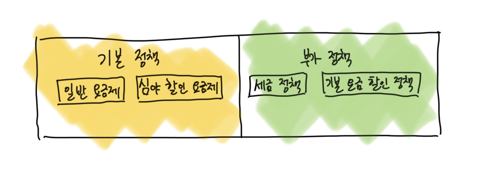
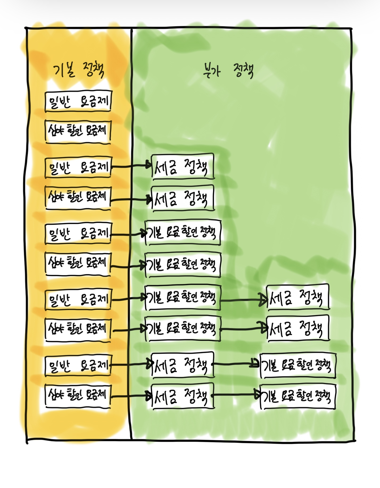
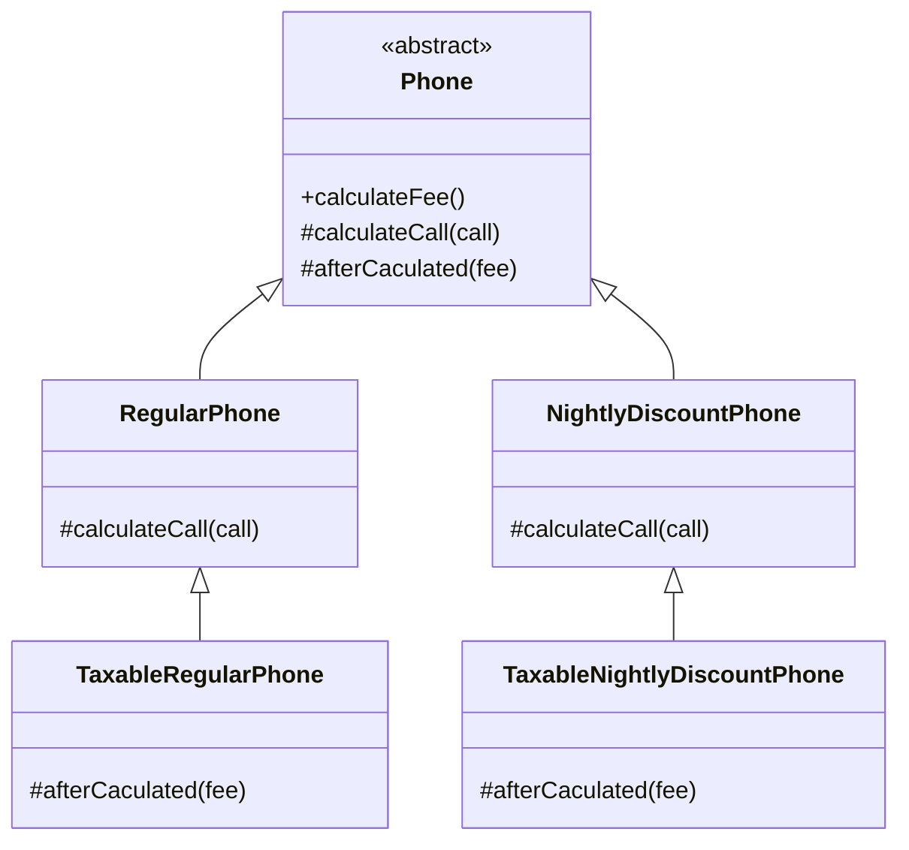
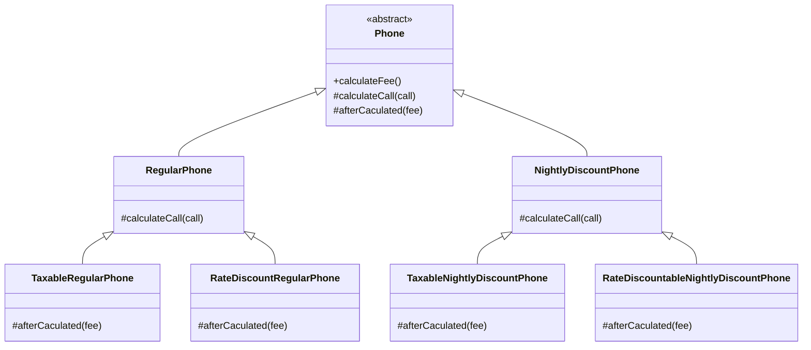
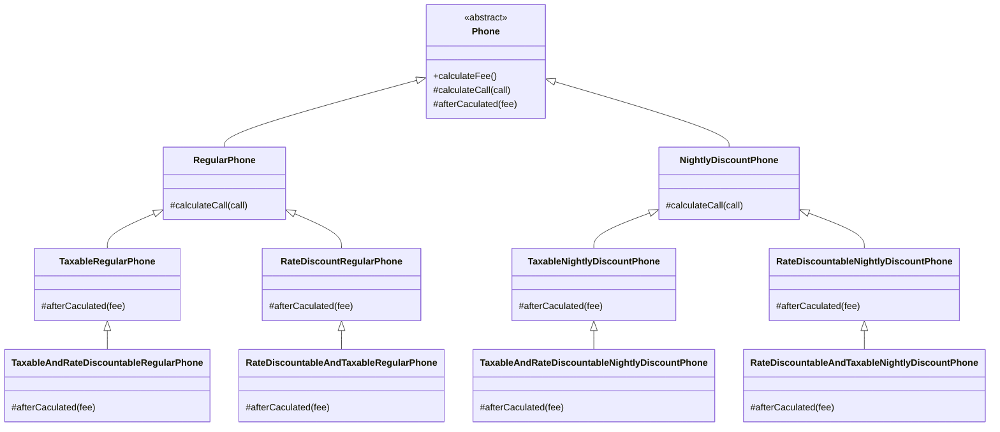
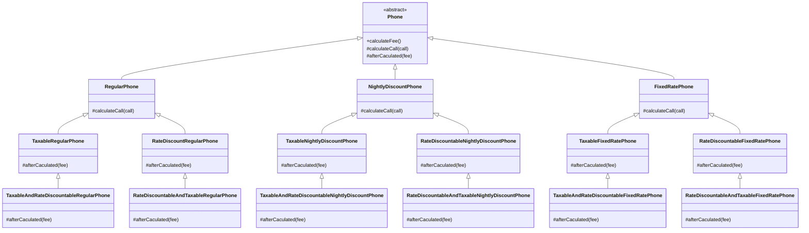

# Chapter 11 합성과 유연한 설계

- 상속과 합성은 객체지향 프로그래밍에서 가장 널리 사용되는 코드 재사용 기법이다.

|     |                  상속                  |                      합성                       |
|:---:|:------------------------------------:|:---------------------------------------------:|
| 재사용 | 부모 클래스와 자식 클래스를 연결해서 부모 클래스의 코드를 재사용 | 전체를 표현하는 객체가 부분을 표현하는 객체를 포함해서 부분 객체의 코드를 재사용 |
| 의존성 |            의존성이 컴파일타임에 해결            |                    런타임에 해결                    |
| 관계  |         `is-a-relationship`          |             `has-a-relationship`              |

- 상속과 합성은 코드 재사용이라는 동일한 목적을 가진다는 점을 제외하면 구현 방법부터 변경을 다루는 방식에 이르기가지 모든 면에서 도드라진 차이를 보인다.
- 상속은 재사용이 쉽다. 하지만 부모와 자식 간의 결합도가 높아질 수밖에 없다. (우아한 방법은 아니다.)
- 합성은 구현에 의존하지 않는다는 점에서 상속과 다르다.
  - 합성은 내부에 포함되는 객체의 구현이 아닌 퍼블릭 인터페이스에 의존한다.
  - 따라서 합성을 이용하면 포함된 객체의 내부 구현이 변경되더라도 영향을 최소화할 수 있기 때문에 더 안정적인 코드를 얻을 수 있게 된다.
- 상속 관계는 클래스 사이의 정적인 관계인 데 비해 합성 관계는 객체 사이의 동적인 관계다.
  - 따라서 상속 대신 합성을 사용하면 변경하기 쉽고 유연한 설계를 얻을 수 있다.
  - 물론 상속보다 합성을 이용하는 것이 구현 관점에서 좀 더 번거롭고 복잡하게 느껴질 수도 있다. 하지만 설계는 변경과 관련된 것이라는 점을 기억하라.
  - 변경에 유연하게 대처할 수 있는 설계가 대부분의 경우에 정답일 가능성이 높다.

> [코드 재사용을 위해서는] 객체 합성이 클래스 상속보다 더 좋은 방법이다[GOF94].

- 상속과 합성은 재사용의 대상이 다르다. 상속은 부모 클래스 안에 구현된 코드 자체를 재사용하지만 합성은 포함되는 객체의 퍼블릭 인터페이스를 재사용한다.
  - 따라서 상속 대신 합성을 사용하면 구현에 대한 의존성을 인터페이스에 대한 의존성으로 변경할 수 있다.
  - 다시 말해서 클래스 사이의 높은 결합도를 객체 사이의 낮은 결합도로 대체할 수 있는 것이다.

> - 객체지향 시스템에서 기능을 재사용할 수 있는 가장 대표적인 기법은 `클래스 상속 class ingeritance`와 `객체 합성 object composition`이다.
> - 클래스 상속은 다른 클래스를 이용해서 한 클래스의 구현을 정의하는 것이다. 서브클래싱에 의한 재사용을 `화이트박스 재사용 white-box reuse`이라고 부른다. 화이트박스라는 말은 가시성 때문에 나온 말이다. 상속을 받으면 부모 클래스의 내부가 자식 클래스에 공개되기 때문에 화이트박스인 셈이다.
> - 객체 합성은 클래스 상속의 대안이다. 새로운 기능을 위해 객체들을 합성한다. 객체를 합성하려면 합성할 객체들의 인터페이스를 명확하게 정의해야만 한다. 이런 스타일의 재사용을 `블랙박스 재사용 black-box reuse`아리고 하는데, 객체의 내부는 공개되지 않고 인터페이스를 통해서만 재사용되기 때문이다.

<br/>

## 1. 상속을 합성으로 변경하기

- 상속을 남용했을 때 직면할 수 있는 문제를 다시 확인해보자.

#### 불필요한 인터페이스 상속 문제

- 자식 클래스에게 부적합한 부모 클래스의 오퍼레이션이 상속되기 때문에 자식 클래스 인스턴스의 상태가 불안정해지는 문제.
- JDK에 포한된 `java.util.Properties`와 `java.util.Stack`의 예시

#### 메소드 오버라이딩 오작용 문제

- 자식 클래스가 부모 클래스의 메소드를 오버라이딩할 때 자식 클래스가 부모 클래스의 메소드 호출 방법에 영향을 받는 문제.
- `java.util.HashSet`을 상속받은 `InstrumentedHashSet`의 예시

#### 부모 클래스와 자식 클래스의 동시 수정 문제

- 부모 클래스와 자식 클래스 사이의 개념적인 결합으로 인해 부모 클래스를 변경할 때 자식 클래스도 함께 변경해야 하는 문제.
- `Playlist`를 상속받은 `PersonalPlaylist`의 예시

<br/>

- 합성을 사용하면 상속이 초래하는 세 가지 문제점을 해결할 수 있다.
- 상속을 합성으로 바꾸는 방법은 매우 간단한데 자식 클래스에 선언된 상속 관계를 제거하고 부모 클래스의 인스턴스를 자식 클래스의 인스턴스 변수로 선언하면 된다.

### 불필요한 인터페이스 상속 문제: java.util.Properties와 java.util.Stack

- Hashtable 클래스와 Properties 클래스 사이의 상속 관계를 합성 관계로 바꾸기
  - 상속 관계를 제거하고 Hashtable을 Properties의 인스턴스 변수로 포함시키면 합성 관계로 변경할 수 있다.
  - 불필요한 Hashtable의 오퍼레이션들이 Proeprties 클래스의 퍼블릭 인터페이스를 오염시키지 않는다. 

```java
public class Properties {

  private Hashtable<String, String> properties = new Hashtable<>();

  public void setProperties(final Hashtable<String, String> properties) {
    this.properties = properties;
  }

  public Hashtable<String, String> getProperties() {
    return properties;
  }
}
```

- Vector를 상속받는 Stack 역시 Vector 인스턴스 변수를 Stack 클래스의 인스턴스 변수로 선언함으로써 합성 관계로 변경할 수 있다.

```java
public class Stack<E> {
  private Vector<E> elements = new Vector<>();

  public E push(E item) {
    elements.addElement(item);
    return item;
  }

  public E pop() {
    if (elements.isEmpty()) {
      throw new EmptyStackException();
    }
    return elements.remove(elements.size() - 1);
  }
}
```

### 메소드 오버라이딩의 오작용 문제: InstrumentedHashSet

- `InstrumentedHashSet`도 같은 방법을 사용해 합성 관계로 변경할 수 있다.
- 하지만 `InstrumentedHashSet`는 다른 점이 한 가지 있다.
  - `Properties`나 `Stack`을 합성으로 변경한 이유는 불필요한 오퍼레이션들이 퍼블릭 인터페이스에 스며드는 것을 방지하기 위해서다.
  - 하지만 `InstrumentedHashSet`의 경우 `HashSet`이 제공하는 퍼블릭 인터페이스를 그대로 제공해야 한다.
- `HashSet`에 대한 구현 결합도를 제거하면서도 퍼블릭 인터페이스는 그대로 상속받을 수 있는 방법은 없을까?
  - 자바의 인터페이스를 사용하면 이 문제를 해결할 수 있다.
  - `HashSet`은 `Set` 인터페이스를 실체화하는 구현체 중 하나이며, `InstrumentedHashSet`이 제공해야 하는 모든 오퍼레이션들은 `Set` 인터페이스에 정의돼 있다. 따라서 `InstrumentedHashSet`가 `Set` 인터페이스를 구현하면 된다.

```java
public class InstrumentedHashSet<E> implements Set<E> {
  private int addCount = 0;
  private Set<E> set;

  public InstrumentedHashSet(final Set<E> set) {
    this.set = set;
  }

  @Override
  public boolean add(E e) {
    addCount++;
    return set.add(e);
  }

  @Override
  public boolean addAll(Collection<? extends E> c) {
    addCount += c.size();
    return set.addAll(c);
  }

  public int getAddCount() {
    return addCount;
  }

  @Override public int size() {return set.size();}
  @Override public boolean isEmpty() {return set.isEmpty();}
  @Override public boolean contains(final Object o) {return set.contains(o);}
  @Override public Iterator<E> iterator() {return set.iterator();}
  @Override public Object[] toArray() {return set.toArray();}
  @Override public <T> T[] toArray(final T[] a) {return set.toArray(a);}
  @Override public boolean remove(final Object o) {return set.remove(o);}
  @Override public boolean containsAll(final Collection<?> c) {return set.containsAll(c);}
  @Override public boolean retainAll(final Collection<?> c) {return set.retainAll(c);}
  @Override public boolean removeAll(final Collection<?> c) {return set.removeAll(c);}
  @Override public void clear() {set.clear();}
}
```

- `InstrumentedHashSet` 코드를 보면 `Set`의 오퍼레이션을 오버라이딩한 인스턴스 메소드에서 내부의 `HashSet` 인스턴스에게 동일한 메소드 호출을 그대로 전달한다는 것을 알 수 있다.
- 이를 `포워딩 forwarding`이라고 부르고 동일한 메소드를 호출하기 위해 추가된 메소드를 `포워딩 메소드 forwarding method`라고 부른다.
  - 포워딩은 기존 클래스의 인터페이스를 그대로 외부에 제공하면서 구현에 대한 결합 없이 일부 작동 방식을 변경하고 싶은 경우에 사용할 수 있는 유용한 기법이다.

### 부모 클래스와 자식 클래스의 동시 수정 문제: PersonalPlaylis

- 안타깝게도 `Playlist`의 경우에는 합성으로 변경하더라도 가수별 노래 목록을 유지하기 위해 `Playlist`와 `PersonalPlaylist`를 함께 수정해야 하는 문제가 해결되지 않는다.

```java
public class PersonalPlaylist {
  private Playlist playlist = new Playlist();
  
  public void append(Song song) {
    playlist.append(song);
  }
  
  public void remove(Song song) {
    playlist.getTracks().remove(song);
    playlist.getSingers().remove(song.getSinger());
  }
}
```

- 그렇다고 하더라도 여전히 상속보다는 합성을 사용하는 게 더 좋은데, 향후에 `Playlist`의 내부 구현을 변경하더라도 파급효과를 최대한 `PersonalPlaylist` 내부로 캡슐화할 수 있기 때문이다.
- 대부분의 경우 구현에 대한 결합보다는 인터페이스에 대한 결합이 더 좋다는 사실을 기억하라.

> #### 몽키 패치 Monkey Patch
> - 현재 실행 중인 환경에만 영향을 미치도록 지역적으로 코드를 수정하거나 확장하는 것을 의미한다.
> - Playlist의 코드를 수정할 권한이 없거나 소스코드가 존재하지 않는다고 하더라도 몽키 패치가 지원되는 환경이라면 Playlist에 직접 remove 메소드를 추가하는 것이 가능하다.
> - 자바는 언어 차원에서 몽키 패치를 지원하고 있지 않기 때문에 바이트코드를 직접 변환하거나 AOP를 이용해 몽키 패치를 구현하고 있다.

<br/>

## 2. 상속으로 인한 조합의 폭발적인 증가

- 상속으로 인해 결합도가 높아지면 코드를 수정하는 데 필요한 작업의 양이 과도하게 늘어나는 경향이 있다.
  - 가장 일반적인 상황은 작은 기능들을 조합해서 더 큰 기능을 수행하는 객체를 만들어야 하는 경우다.
  1. 하나의 기능을 추가하거나 수정하기 위해 불필요하게 많은 수의 클래스를 추가하거나 수정해야 한다.
  2. 단일 상속만 지원하는 언어에서는 상속으로 인해 오히려 중복 코드의 양이 늘어날 수 있다.
- 합성을 사용하면 상속으로 인해 발생하는 클래스의 증가와 중복 코드 문제를 간단하게 해결할 수 있다.

### 기본 정책과 부가 정책 조합하기

- 10장에서 소개했던 핸드폰 과금 시스템에 새로운 요구사항 추가.
  - 핸드폰 요금제를 '기본 정책'과 '부가 정책'을 조합해서 구성된다고 가정



- 기본 정책은 가입자의 통화 정보를 기반으로 한다.
  - '일반 요금제'와 '심야 요금 할인제'는 통화량을 기반으로 요금을 계산하기 때문에 기본 정책으로 분류된다.
- 부가 정책은 통화량과 무관하게 기본 정책에 선택적으로 추가할 수 있는 요금 방식을 의미한다.
  - ex. 세금 부과
  - 세금 정책 외에도 최종 계산된 요금에서 일정 금액을 할인해 주는 '기본 요금 할인 정책'도 존재한다.

- 부가 정책은 아래와 같은 특성을 가진다는 것을 기억해야 한다.

#### 기본 정책의 계산 결과에 적용된다.

- 세금 정책은 기본 정책은 `RegularPhone`이나 `NightlyDiscountPhone`의 계산이 끝난 결과에 세금을 부과한다. 할인도 마찬가지

#### 선택적으로 적용할 수 있다.

- 기본 정책의 계산 결과에 세금 정책을 적용할 수도 있고 적용하지 않을 수도 있다.

#### 조합 가능하다.

- 기본 정책에 세금 정책만 적용하는 것도 가능. 기본 요금 할인 정책만 적용하는 것도 가능.
- 또한 둘 다 적용하는 것도 가능해야 한다.

#### 부가 정책은 임의의 순서로 적용 가능하다.

- 기본 정책에 세금 정책과 기본 요금 할인 정책을 함께 적용할 경우 세금 정책을 적용한 후에 기본 요금 할인 정책을 적용할 수도 있고, 기본 요금 할인 정책을 적용한 후에 세금 정책을 적용할 수도 있다.



### 상속을 이용해서 기본 정책 구현하기

- 기본 정책은 `Phone` 추상 클래스를 루트로 삼는 기존의 상속 계층을 그대로 이용
  - 일반 요금제를 구현하는 `RegularPhone`과 심야 할인 요금제를 구현하는 `NightlyDiscountPhon`은 `Phone`의 자식 클래스로 구현

### 기본 정책에 세금 정책 조합하기

- 만약 일반 요금제에 세금 정책을 조합해야 한다면 어떻게 해야 할까? 가장 간단한 방법은 `RegularPhone` 클래스를 상속 받은 `TaxableRegularPhone` 클래스를 추가하는 것이다.
- 부모 클래스의 메소드를 재사용하기 위해 `super` 호출을 사용하면 원하는 결과를 쉽게 얻을 수 있지만 자식 클래스와 부모 클래스 사이의 결합도가 높아지고 만다.
  - 결합도를 낮추는 방법은 자식 클래스가 부모 클래스의 메소드를 호출하지 않도록 부모 클래스에 추상 메소드를 제공하는 것이다.
  - 하지만 부모 클래스에 추상 메소드를 추가하면 모든 자식 클래스들이 추상 메소드를 오버라이딩해야 하는 문제가 발생한다. 자식 클래스가 많다면 상당히 번거로울 것이다.
  - 그런데 사실 추상 메소드의 구현이 동일하다. 따라서 `Phone` 추상클래스에 기본 구현을 제고하는 것이 좋을 것 같다. 그러면 자식 클래스에서 구현할 필요가 없어진다.

```java
public abstract class Phone {
  ...
  protected Money afterCalculated(Money fee) {
    return fee;
  }
}
```

> #### 추상 메소드와 훅 메소드
> - 개방-폐쇄 원칙을 만족하는 설계를 만들 수 있는 한 가지 방법은 부모 클래스에 새로운 추상 메소드를 추가하고 부모 클래스의 다른 메소드 안에서 호출하는 것이다.
> - 자식 클래스는 추상 메소드를 오버라이딩하고 자신만의 로직을 구현해서 부모 클래스에서 정의한 플로우에 개입할 수 있게 된다.
> - 추상 메소드의 단점은 상속 계층에 속하는 모든 자식 클래스가 추상 메소드를 오버라이딩해야 한다는 것이다. 대부분의 자식 클래스가 추상 메소드를 동일한 방식으로 구현한다면 상속 계층 전반에 걸쳐 중복 코드가 존재하게 될 것이다. 해결 방법은 메소드에 기본 구현을 제공하는 것이다.
> - 이처럼 추상 메소드와 동일하게 자식 클래스에서 오버라이딩할 의도로 메소드를 추가했지만 편의를 위해 기본 구현을 제공하는 메소드를 `훅 메소드 hook method`라고 부른다. 예제의 `Phone`에 추가한 `afterCalculated(Money fee)`가 바로 훅 메소드다.

- 이제 `Taxable`한 `Phone`을 만들 차례다. 각각의 구현체는 `afterCalculated` 메소드를 오버라이딩한 후 fee에 세금을 더해서 반환하도록 구현한다.
  - 아래는 상속 계층을 다이어그램으로 표현한 것이다.



- 문제는 `TaxableNightlyDiscountPhone`와 `TaxableRegularPhone` 사이에 코드 중복이 발생했다는 것이다.
  - 자바를 비롯한 대부분의 객체지향 언어는 단일 상속만 지원하기 때문에 상속으로 인해 발생하는 중복 코드 문제를 해결하기 쉽지 않다.

```java
@Override
protected Money afterCalculated(final Money fee) {
  return fee.times(taxRate);
}
```

### 기본 정책에 기본 요금 할인 정책 조합하기

- 기본 할인 정책을 `Phone`에 적용해보자. 똑같이 `afterCalculated`를 오버라이드하여 사용한다.
- 아래는 기본 요금 할인 정책을 추가한 후의 상속 계층을 추가한 것이다.
  - 위의 요구사항 추가와 동일하게 중복 코드가 추가되었다.



### 중복 코드의 덫에 걸리다

- 부가 정책은 자유롭게 조합할 수 있어야 하고 적용되는 순서 역시 임의로 결정할 수 있어야 한다.
  - 상속을 이용한 방법은 모든 가능한 조합별로 자식 클래스를 하나씩 추가해야 한다.
  - 세금 정책을 먼저 조합하고 싶다면 `TaxableRegularPhone`을 상속받는 새로운 자식 클래스 `TaxableAndRateDiscountableRegularPhone`을 추가해야 한다.
  - 반대로 기본 요금 정책을 먼저 적용하고 세금을 나중에 부과하고 싶다면, `RateDiscountableRegularPhone`을 상속받는 `RateDiscountableAndTaxableRegularPhone` 클래스를 추가하면 된다.
  - 야간 요금제도 일반 요금제와 동일하게 상속받아 자식 클래스를 만들면 된다.



- 만약 이런 상태에서 새로운 기본 정책을 추가해야 한다고 가정해보자.
  - 추가할 기본 정책은 '고정 요금제'로 `FixedRatePhone`이라는 클래스로 구현할 것이다.
  - 이제 새로운 요금제 하나를 추가하기 위해 5개의 새로운 클래스를 추가해야 한다는 것을 깨달을 것이다.



- 이번에는 새로운 부가 정책을 추가하는 경우를 생각해보자. (어우.. 상상만 해도 하기 싫다.)
  - '약정 할인 정책'을 추가한다고 가정해보자.
  - 문제는 각각의 `기본 정책` 구현체에 약정 할인 정책을 선택적으로 적용할 수 있어야 할뿐만 아니라 다른 부가 정책인 세금 정책, 기본 요금 할인 정책과도 임의 순서로 조합 가능해야 한다는 것이다.
  - 위의 클래스 다이어그램에서 약정 요금 할인 추가하는 것만으로 6개의 클래스가 추가되어야 할 것이다. 
- 이처럼 상속의 남용으로 하나의 기능을 추가하기 위해 필요 이상으로 많은 수의 클래스를 추가해야 하는 경우를 가리켜 `클래스 폭발 class exposion` 문제 또는 `조합의 폭발 combinational explosion` 문제라고 부른다.
  - 클래스 폭발 문제는 자식 클래스가 부모 클래스의 구현과 강하게 결합되도록 강요하는 상속의 근본적인 한계 때문에 발생하는 문제다. 
  - 컴파일타임에 결정된 자식 클래스와 부모 클래스 사이의 관계는 변경될 수 없기 때문에 자식 클래스와 부모 클래스의 다양한 조합이 필요한 상황에서 유일한 해결 방법은 조합의 수만큼 새로운 클래스를 추가하는 것뿐이다.
- 기능을 수정할 때도 문제가 된다.
  - 만약 세금 정책을 변경해야 한다면? 세금 정책과 관련된 코드가 여러 클래스에 중복돼 있기 때문에 세금 정책과 관련된 모든 클래스를 찾아 동일한 방식으로 수정해야 할 것이다.
  - 이 클래스 중 하나라도 누락한다면 세금이 부과되지 않는 버그가 발생하고 말 것이다.

<br/>

# 참고자료

- 오브젝트, 조영호 지음