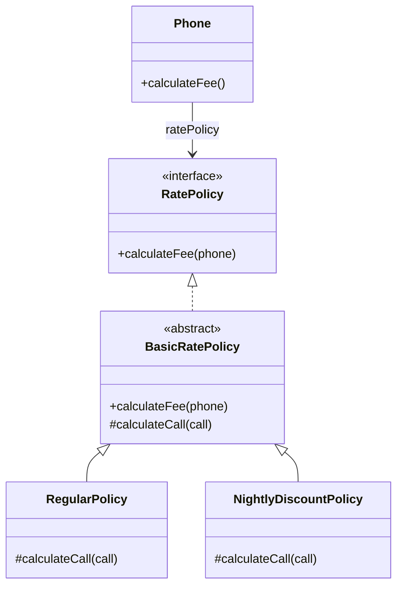
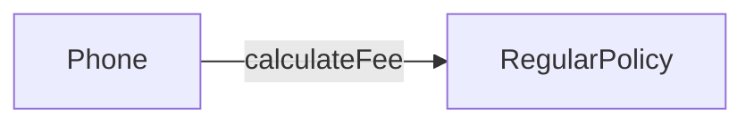
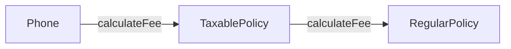
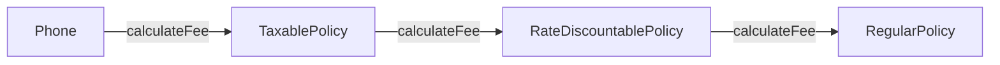
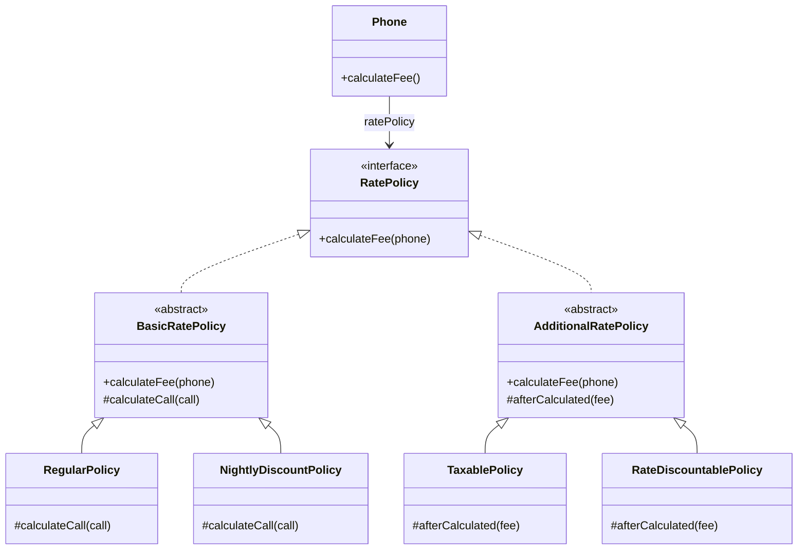
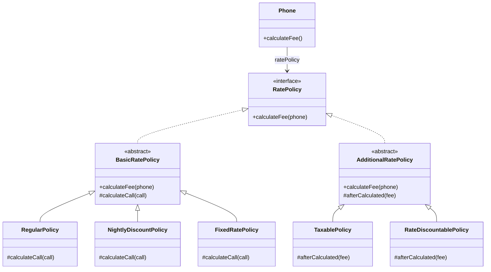
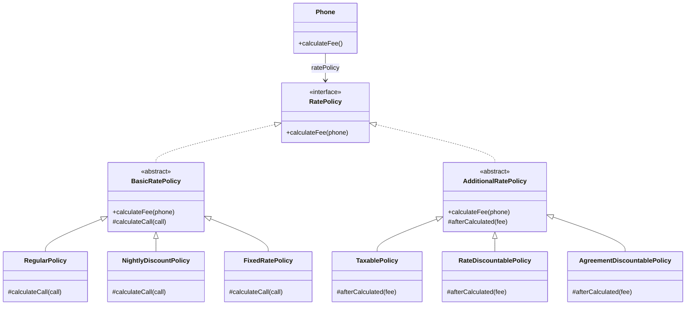
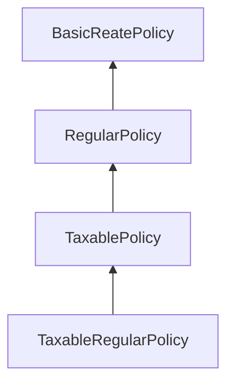
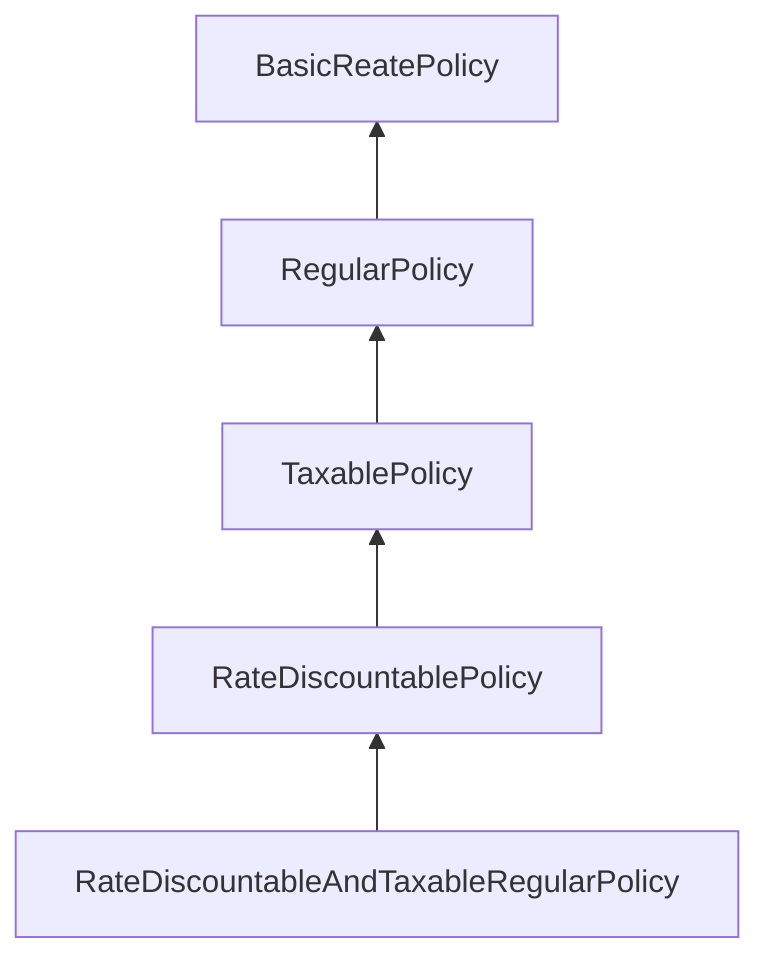

# Chapter 11 합성과 유연한 설계

- 상속과 합성은 객체지향 프로그래밍에서 가장 널리 사용되는 코드 재사용 기법이다.

|     |                  상속                  |                      합성                       |
|:---:|:------------------------------------:|:---------------------------------------------:|
| 재사용 | 부모 클래스와 자식 클래스를 연결해서 부모 클래스의 코드를 재사용 | 전체를 표현하는 객체가 부분을 표현하는 객체를 포함해서 부분 객체의 코드를 재사용 |
| 의존성 |            의존성이 컴파일타임에 해결            |                    런타임에 해결                    |
| 관계  |         `is-a-relationship`          |             `has-a-relationship`              |

- 상속과 합성은 코드 재사용이라는 동일한 목적을 가진다는 점을 제외하면 구현 방법부터 변경을 다루는 방식에 이르기가지 모든 면에서 도드라진 차이를 보인다.
- 상속은 재사용이 쉽다. 하지만 부모와 자식 간의 결합도가 높아질 수밖에 없다. (우아한 방법은 아니다.)
- 합성은 구현에 의존하지 않는다는 점에서 상속과 다르다.
  - 합성은 내부에 포함되는 객체의 구현이 아닌 퍼블릭 인터페이스에 의존한다.
  - 따라서 합성을 이용하면 포함된 객체의 내부 구현이 변경되더라도 영향을 최소화할 수 있기 때문에 더 안정적인 코드를 얻을 수 있게 된다.
- 상속 관계는 클래스 사이의 정적인 관계인 데 비해 합성 관계는 객체 사이의 동적인 관계다.
  - 따라서 상속 대신 합성을 사용하면 변경하기 쉽고 유연한 설계를 얻을 수 있다.
  - 물론 상속보다 합성을 이용하는 것이 구현 관점에서 좀 더 번거롭고 복잡하게 느껴질 수도 있다. 하지만 설계는 변경과 관련된 것이라는 점을 기억하라.
  - 변경에 유연하게 대처할 수 있는 설계가 대부분의 경우에 정답일 가능성이 높다.

> [코드 재사용을 위해서는] 객체 합성이 클래스 상속보다 더 좋은 방법이다[GOF94].

- 상속과 합성은 재사용의 대상이 다르다. 상속은 부모 클래스 안에 구현된 코드 자체를 재사용하지만 합성은 포함되는 객체의 퍼블릭 인터페이스를 재사용한다.
  - 따라서 상속 대신 합성을 사용하면 구현에 대한 의존성을 인터페이스에 대한 의존성으로 변경할 수 있다.
  - 다시 말해서 클래스 사이의 높은 결합도를 객체 사이의 낮은 결합도로 대체할 수 있는 것이다.

> - 객체지향 시스템에서 기능을 재사용할 수 있는 가장 대표적인 기법은 `클래스 상속 class ingeritance`와 `객체 합성 object composition`이다.
> - 클래스 상속은 다른 클래스를 이용해서 한 클래스의 구현을 정의하는 것이다. 서브클래싱에 의한 재사용을 `화이트박스 재사용 white-box reuse`이라고 부른다. 화이트박스라는 말은 가시성 때문에 나온 말이다. 상속을 받으면 부모 클래스의 내부가 자식 클래스에 공개되기 때문에 화이트박스인 셈이다.
> - 객체 합성은 클래스 상속의 대안이다. 새로운 기능을 위해 객체들을 합성한다. 객체를 합성하려면 합성할 객체들의 인터페이스를 명확하게 정의해야만 한다. 이런 스타일의 재사용을 `블랙박스 재사용 black-box reuse`아리고 하는데, 객체의 내부는 공개되지 않고 인터페이스를 통해서만 재사용되기 때문이다.

<br/>

## 1. 상속을 합성으로 변경하기

- 상속을 남용했을 때 직면할 수 있는 문제를 다시 확인해보자.

#### 불필요한 인터페이스 상속 문제

- 자식 클래스에게 부적합한 부모 클래스의 오퍼레이션이 상속되기 때문에 자식 클래스 인스턴스의 상태가 불안정해지는 문제.
- JDK에 포한된 `java.util.Properties`와 `java.util.Stack`의 예시

#### 메소드 오버라이딩 오작용 문제

- 자식 클래스가 부모 클래스의 메소드를 오버라이딩할 때 자식 클래스가 부모 클래스의 메소드 호출 방법에 영향을 받는 문제.
- `java.util.HashSet`을 상속받은 `InstrumentedHashSet`의 예시

#### 부모 클래스와 자식 클래스의 동시 수정 문제

- 부모 클래스와 자식 클래스 사이의 개념적인 결합으로 인해 부모 클래스를 변경할 때 자식 클래스도 함께 변경해야 하는 문제.
- `Playlist`를 상속받은 `PersonalPlaylist`의 예시

<br/>

- 합성을 사용하면 상속이 초래하는 세 가지 문제점을 해결할 수 있다.
- 상속을 합성으로 바꾸는 방법은 매우 간단한데 자식 클래스에 선언된 상속 관계를 제거하고 부모 클래스의 인스턴스를 자식 클래스의 인스턴스 변수로 선언하면 된다.

### 불필요한 인터페이스 상속 문제: java.util.Properties와 java.util.Stack

- Hashtable 클래스와 Properties 클래스 사이의 상속 관계를 합성 관계로 바꾸기
  - 상속 관계를 제거하고 Hashtable을 Properties의 인스턴스 변수로 포함시키면 합성 관계로 변경할 수 있다.
  - 불필요한 Hashtable의 오퍼레이션들이 Proeprties 클래스의 퍼블릭 인터페이스를 오염시키지 않는다. 

```java
public class Properties {

  private Hashtable<String, String> properties = new Hashtable<>();

  public void setProperties(final Hashtable<String, String> properties) {
    this.properties = properties;
  }

  public Hashtable<String, String> getProperties() {
    return properties;
  }
}
```

- Vector를 상속받는 Stack 역시 Vector 인스턴스 변수를 Stack 클래스의 인스턴스 변수로 선언함으로써 합성 관계로 변경할 수 있다.

```java
public class Stack<E> {
  private Vector<E> elements = new Vector<>();

  public E push(E item) {
    elements.addElement(item);
    return item;
  }

  public E pop() {
    if (elements.isEmpty()) {
      throw new EmptyStackException();
    }
    return elements.remove(elements.size() - 1);
  }
}
```

### 메소드 오버라이딩의 오작용 문제: InstrumentedHashSet

- `InstrumentedHashSet`도 같은 방법을 사용해 합성 관계로 변경할 수 있다.
- 하지만 `InstrumentedHashSet`는 다른 점이 한 가지 있다.
  - `Properties`나 `Stack`을 합성으로 변경한 이유는 불필요한 오퍼레이션들이 퍼블릭 인터페이스에 스며드는 것을 방지하기 위해서다.
  - 하지만 `InstrumentedHashSet`의 경우 `HashSet`이 제공하는 퍼블릭 인터페이스를 그대로 제공해야 한다.
- `HashSet`에 대한 구현 결합도를 제거하면서도 퍼블릭 인터페이스는 그대로 상속받을 수 있는 방법은 없을까?
  - 자바의 인터페이스를 사용하면 이 문제를 해결할 수 있다.
  - `HashSet`은 `Set` 인터페이스를 실체화하는 구현체 중 하나이며, `InstrumentedHashSet`이 제공해야 하는 모든 오퍼레이션들은 `Set` 인터페이스에 정의돼 있다. 따라서 `InstrumentedHashSet`가 `Set` 인터페이스를 구현하면 된다.

```java
public class InstrumentedHashSet<E> implements Set<E> {
  private int addCount = 0;
  private Set<E> set;

  public InstrumentedHashSet(final Set<E> set) {
    this.set = set;
  }

  @Override
  public boolean add(E e) {
    addCount++;
    return set.add(e);
  }

  @Override
  public boolean addAll(Collection<? extends E> c) {
    addCount += c.size();
    return set.addAll(c);
  }

  public int getAddCount() {
    return addCount;
  }

  @Override public int size() {return set.size();}
  @Override public boolean isEmpty() {return set.isEmpty();}
  @Override public boolean contains(final Object o) {return set.contains(o);}
  @Override public Iterator<E> iterator() {return set.iterator();}
  @Override public Object[] toArray() {return set.toArray();}
  @Override public <T> T[] toArray(final T[] a) {return set.toArray(a);}
  @Override public boolean remove(final Object o) {return set.remove(o);}
  @Override public boolean containsAll(final Collection<?> c) {return set.containsAll(c);}
  @Override public boolean retainAll(final Collection<?> c) {return set.retainAll(c);}
  @Override public boolean removeAll(final Collection<?> c) {return set.removeAll(c);}
  @Override public void clear() {set.clear();}
}
```

- `InstrumentedHashSet` 코드를 보면 `Set`의 오퍼레이션을 오버라이딩한 인스턴스 메소드에서 내부의 `HashSet` 인스턴스에게 동일한 메소드 호출을 그대로 전달한다는 것을 알 수 있다.
- 이를 `포워딩 forwarding`이라고 부르고 동일한 메소드를 호출하기 위해 추가된 메소드를 `포워딩 메소드 forwarding method`라고 부른다.
  - 포워딩은 기존 클래스의 인터페이스를 그대로 외부에 제공하면서 구현에 대한 결합 없이 일부 작동 방식을 변경하고 싶은 경우에 사용할 수 있는 유용한 기법이다.

### 부모 클래스와 자식 클래스의 동시 수정 문제: PersonalPlaylis

- 안타깝게도 `Playlist`의 경우에는 합성으로 변경하더라도 가수별 노래 목록을 유지하기 위해 `Playlist`와 `PersonalPlaylist`를 함께 수정해야 하는 문제가 해결되지 않는다.

```java
public class PersonalPlaylist {
  private Playlist playlist = new Playlist();
  
  public void append(Song song) {
    playlist.append(song);
  }
  
  public void remove(Song song) {
    playlist.getTracks().remove(song);
    playlist.getSingers().remove(song.getSinger());
  }
}
```

- 그렇다고 하더라도 여전히 상속보다는 합성을 사용하는 게 더 좋은데, 향후에 `Playlist`의 내부 구현을 변경하더라도 파급효과를 최대한 `PersonalPlaylist` 내부로 캡슐화할 수 있기 때문이다.
- 대부분의 경우 구현에 대한 결합보다는 인터페이스에 대한 결합이 더 좋다는 사실을 기억하라.

> #### 몽키 패치 Monkey Patch
> - 현재 실행 중인 환경에만 영향을 미치도록 지역적으로 코드를 수정하거나 확장하는 것을 의미한다.
> - Playlist의 코드를 수정할 권한이 없거나 소스코드가 존재하지 않는다고 하더라도 몽키 패치가 지원되는 환경이라면 Playlist에 직접 remove 메소드를 추가하는 것이 가능하다.
> - 자바는 언어 차원에서 몽키 패치를 지원하고 있지 않기 때문에 바이트코드를 직접 변환하거나 AOP를 이용해 몽키 패치를 구현하고 있다.

<br/>

## 2. 상속으로 인한 조합의 폭발적인 증가

- 상속으로 인해 결합도가 높아지면 코드를 수정하는 데 필요한 작업의 양이 과도하게 늘어나는 경향이 있다.
  - 가장 일반적인 상황은 작은 기능들을 조합해서 더 큰 기능을 수행하는 객체를 만들어야 하는 경우다.
  1. 하나의 기능을 추가하거나 수정하기 위해 불필요하게 많은 수의 클래스를 추가하거나 수정해야 한다.
  2. 단일 상속만 지원하는 언어에서는 상속으로 인해 오히려 중복 코드의 양이 늘어날 수 있다.
- 합성을 사용하면 상속으로 인해 발생하는 클래스의 증가와 중복 코드 문제를 간단하게 해결할 수 있다.

### 기본 정책과 부가 정책 조합하기

- 10장에서 소개했던 핸드폰 과금 시스템에 새로운 요구사항 추가.
  - 핸드폰 요금제를 '기본 정책'과 '부가 정책'을 조합해서 구성된다고 가정


- 기본 정책은 가입자의 통화 정보를 기반으로 한다.
  - '일반 요금제'와 '심야 요금 할인제'는 통화량을 기반으로 요금을 계산하기 때문에 기본 정책으로 분류된다.
- 부가 정책은 통화량과 무관하게 기본 정책에 선택적으로 추가할 수 있는 요금 방식을 의미한다.
  - ex. 세금 부과
  - 세금 정책 외에도 최종 계산된 요금에서 일정 금액을 할인해 주는 '기본 요금 할인 정책'도 존재한다.

- 부가 정책은 아래와 같은 특성을 가진다는 것을 기억해야 한다.

#### 기본 정책의 계산 결과에 적용된다.

- 세금 정책은 기본 정책은 `RegularPhone`이나 `NightlyDiscountPhone`의 계산이 끝난 결과에 세금을 부과한다. 할인도 마찬가지

#### 선택적으로 적용할 수 있다.

- 기본 정책의 계산 결과에 세금 정책을 적용할 수도 있고 적용하지 않을 수도 있다.

#### 조합 가능하다.

- 기본 정책에 세금 정책만 적용하는 것도 가능. 기본 요금 할인 정책만 적용하는 것도 가능.
- 또한 둘 다 적용하는 것도 가능해야 한다.

#### 부가 정책은 임의의 순서로 적용 가능하다.

- 기본 정책에 세금 정책과 기본 요금 할인 정책을 함께 적용할 경우 세금 정책을 적용한 후에 기본 요금 할인 정책을 적용할 수도 있고, 기본 요금 할인 정책을 적용한 후에 세금 정책을 적용할 수도 있다.


### 상속을 이용해서 기본 정책 구현하기

- 기본 정책은 `Phone` 추상 클래스를 루트로 삼는 기존의 상속 계층을 그대로 이용
  - 일반 요금제를 구현하는 `RegularPhone`과 심야 할인 요금제를 구현하는 `NightlyDiscountPhon`은 `Phone`의 자식 클래스로 구현

### 기본 정책에 세금 정책 조합하기

- 만약 일반 요금제에 세금 정책을 조합해야 한다면 어떻게 해야 할까? 가장 간단한 방법은 `RegularPhone` 클래스를 상속 받은 `TaxableRegularPhone` 클래스를 추가하는 것이다.
- 부모 클래스의 메소드를 재사용하기 위해 `super` 호출을 사용하면 원하는 결과를 쉽게 얻을 수 있지만 자식 클래스와 부모 클래스 사이의 결합도가 높아지고 만다.
  - 결합도를 낮추는 방법은 자식 클래스가 부모 클래스의 메소드를 호출하지 않도록 부모 클래스에 추상 메소드를 제공하는 것이다.
  - 하지만 부모 클래스에 추상 메소드를 추가하면 모든 자식 클래스들이 추상 메소드를 오버라이딩해야 하는 문제가 발생한다. 자식 클래스가 많다면 상당히 번거로울 것이다.
  - 그런데 사실 추상 메소드의 구현이 동일하다. 따라서 `Phone` 추상클래스에 기본 구현을 제고하는 것이 좋을 것 같다. 그러면 자식 클래스에서 구현할 필요가 없어진다.

```java
public abstract class Phone {
  ...
  protected Money afterCalculated(Money fee) {
    return fee;
  }
}
```

> #### 추상 메소드와 훅 메소드
> - 개방-폐쇄 원칙을 만족하는 설계를 만들 수 있는 한 가지 방법은 부모 클래스에 새로운 추상 메소드를 추가하고 부모 클래스의 다른 메소드 안에서 호출하는 것이다.
> - 자식 클래스는 추상 메소드를 오버라이딩하고 자신만의 로직을 구현해서 부모 클래스에서 정의한 플로우에 개입할 수 있게 된다.
> - 추상 메소드의 단점은 상속 계층에 속하는 모든 자식 클래스가 추상 메소드를 오버라이딩해야 한다는 것이다. 대부분의 자식 클래스가 추상 메소드를 동일한 방식으로 구현한다면 상속 계층 전반에 걸쳐 중복 코드가 존재하게 될 것이다. 해결 방법은 메소드에 기본 구현을 제공하는 것이다.
> - 이처럼 추상 메소드와 동일하게 자식 클래스에서 오버라이딩할 의도로 메소드를 추가했지만 편의를 위해 기본 구현을 제공하는 메소드를 `훅 메소드 hook method`라고 부른다. 예제의 `Phone`에 추가한 `afterCalculated(Money fee)`가 바로 훅 메소드다.

- 이제 `Taxable`한 `Phone`을 만들 차례다. 각각의 구현체는 `afterCalculated` 메소드를 오버라이딩한 후 fee에 세금을 더해서 반환하도록 구현한다.
  - 아래는 상속 계층을 다이어그램으로 표현한 것이다.


- 문제는 `TaxableNightlyDiscountPhone`와 `TaxableRegularPhone` 사이에 코드 중복이 발생했다는 것이다.
  - 자바를 비롯한 대부분의 객체지향 언어는 단일 상속만 지원하기 때문에 상속으로 인해 발생하는 중복 코드 문제를 해결하기 쉽지 않다.

```java
@Override
protected Money afterCalculated(final Money fee) {
  return fee.times(taxRate);
}
```

### 기본 정책에 기본 요금 할인 정책 조합하기

- 기본 할인 정책을 `Phone`에 적용해보자. 똑같이 `afterCalculated`를 오버라이드하여 사용한다.
- 아래는 기본 요금 할인 정책을 추가한 후의 상속 계층을 추가한 것이다.
  - 위의 요구사항 추가와 동일하게 중복 코드가 추가되었다.


### 중복 코드의 덫에 걸리다

- 부가 정책은 자유롭게 조합할 수 있어야 하고 적용되는 순서 역시 임의로 결정할 수 있어야 한다.
  - 상속을 이용한 방법은 모든 가능한 조합별로 자식 클래스를 하나씩 추가해야 한다.
  - 세금 정책을 먼저 조합하고 싶다면 `TaxableRegularPhone`을 상속받는 새로운 자식 클래스 `TaxableAndRateDiscountableRegularPhone`을 추가해야 한다.
  - 반대로 기본 요금 정책을 먼저 적용하고 세금을 나중에 부과하고 싶다면, `RateDiscountableRegularPhone`을 상속받는 `RateDiscountableAndTaxableRegularPhone` 클래스를 추가하면 된다.
  - 야간 요금제도 일반 요금제와 동일하게 상속받아 자식 클래스를 만들면 된다.


- 만약 이런 상태에서 새로운 기본 정책을 추가해야 한다고 가정해보자.
  - 추가할 기본 정책은 '고정 요금제'로 `FixedRatePhone`이라는 클래스로 구현할 것이다.
  - 이제 새로운 요금제 하나를 추가하기 위해 5개의 새로운 클래스를 추가해야 한다는 것을 깨달을 것이다.


- 이번에는 새로운 부가 정책을 추가하는 경우를 생각해보자. (어우.. 상상만 해도 하기 싫다.)
  - '약정 할인 정책'을 추가한다고 가정해보자.
  - 문제는 각각의 `기본 정책` 구현체에 약정 할인 정책을 선택적으로 적용할 수 있어야 할뿐만 아니라 다른 부가 정책인 세금 정책, 기본 요금 할인 정책과도 임의 순서로 조합 가능해야 한다는 것이다.
  - 위의 클래스 다이어그램에서 약정 요금 할인 추가하는 것만으로 6개의 클래스가 추가되어야 할 것이다. 
- 이처럼 상속의 남용으로 하나의 기능을 추가하기 위해 필요 이상으로 많은 수의 클래스를 추가해야 하는 경우를 가리켜 `클래스 폭발 class exposion` 문제 또는 `조합의 폭발 combinational explosion` 문제라고 부른다.
  - 클래스 폭발 문제는 자식 클래스가 부모 클래스의 구현과 강하게 결합되도록 강요하는 상속의 근본적인 한계 때문에 발생하는 문제다. 
  - 컴파일타임에 결정된 자식 클래스와 부모 클래스 사이의 관계는 변경될 수 없기 때문에 자식 클래스와 부모 클래스의 다양한 조합이 필요한 상황에서 유일한 해결 방법은 조합의 수만큼 새로운 클래스를 추가하는 것뿐이다.
- 기능을 수정할 때도 문제가 된다.
  - 만약 세금 정책을 변경해야 한다면? 세금 정책과 관련된 코드가 여러 클래스에 중복돼 있기 때문에 세금 정책과 관련된 모든 클래스를 찾아 동일한 방식으로 수정해야 할 것이다.
  - 이 클래스 중 하나라도 누락한다면 세금이 부과되지 않는 버그가 발생하고 말 것이다.

<br/>

## 3. 합성 관계로 변경하기

- 상속 관계는 컴파일타임에 결정되고 고정되기 때문에 코드를 실행하는 도중에는 변경할 수 없다.
- 합성은 컴파일타임 관계를 런타임 관계로 변경함으로써 이 문제를 해결한다.
  - 합성을 사용하면 구현이 아닌 퍼블릭 인터페이스에 대해서만 의존할 수 있기 때문에 런타임에 객체의 관계를 변경할 수 있다.
- 합성을 사용하면 구현 시점에 정책들의 관계를 고정시킬 필요가 없으며 실행 시점에 정책들의 관계를 유연하게 변경할 수 있게 된다.
  - 상속이 조합을 개별 클래스 안으로 밀어 넣는 것이 방법이라면 합성은 조합을 구성하는 요소들을 개별 클래스로 구현한 후 실행 시점에 인스턴스를 조립하는 방법으로 사용하는 것이라고 할 수 있다.
  - 물론 컴파일타임 의존성과 런타임 의존성의 거리가 멀면 멀수록 설계의 복잡도가 상승하기 때문에 코드를 이행하기 어려워지는 것 역시 사실이다.
  - 하지만 설계는 변경과 유지보수를 위해 존재한다는 사실을 기억하라. 변경에 따르는 고통이 복잡성으로 인한 혼란을 넘어서고 있다면 유연성의 손을 들어주는 것이 현명한 판단일 확률이 높다.
- 아이러니하게도 변경하기 편리한 설계를 만들기 위해 복잡성을 더하고 나면 원래의 설계보다 단순해지는 경우를 종종 볼 수 있다. 상속을 합성으로 변경한 핸드폰 과금 시스템이 바로 그런 경우일 것이다.

### 기본 정책 합성하

- 가장 먼저 해야 할 일은 각 정책을 별도의 클래스로 구현하는 것이다.
  - 분리된 정책들을 연결할 수 있도록 합성 관계를 이용해 구조를 개선해보자.
- `Phone` 내부에 `RatePolicy`에 대한 참조자가 포함돼 있다는 것에 주목하라. 이것이 바로 합성이다.



- 합성을 사용하면 `Phone`과 연결되는 `RatePolicy` 인터페이스의 구현 클래스가 어떤 타입인지에 따라 요금을 계산하는 방식이 달라진다.
  - 여기까지만 보면 단순히 원하는 클래스를 선택하는 상속보다 더 복잡해졌다는 생각이 들 수도 있다.
  - 하지만 합성의 장점은 부가 정책을 추가해보면 실감할 수 있을 것이다.

### 부가 정책 적용하기

- 일반 요금제를 적용한 경우 생성된 인스턴스 관계를 살펴보자.



- 지금부터 할 일은 여기에 부가 정책을 추가하는 것이다. 부가 정책은 기본 정책에 대한 계산이 끝난 후에 적용된다는 것을 기억하라.
- 만약 세금 정책을 추가한다면 아래와 같은 형태가 될 것이다.



- 그리고 일반 요금제에 기본 요금 알힌 정책을 적용한 후 세금 정책을 적용해야 한다면 아래 그림과 같은 순서로 인스턴스를 연결해야 한다.



- 다음의 두 가지 제약에 따라 부가 정책을 구현해야 한다는 사실을 잘 보여준다.
1. 부가 정책은 기본 정책이나 다른 부가 정책의 인스턴스를 참조할 수 있어야 한다. 다시 말핼서 부가 정책의 인스턴스는 어떤 종류의 정책과도 합성될 수 있어야 한다.
2. `Phone`의 입장에서는 자신이 기본 정책의 인스턴스에게 메시지를 전송하고 있는지, 부가 정책의 인스턴스에게 메시지를 전송하고 있는지를 몰라야 한다. 다시 말해서 기본 정책과 부가 정책은 협력 안에서 동일한 '역할'을 수행한다. 이것은 부가 정책이 기본 정책과 동일한 `RatePolicy` 인터페이스를 구현해야 한다는 것을 의미한다.

- 부가 정책을 `AdditionalRatePolicy` 추상 클래스로 구현하고, 이것을 상속받는 `TaxablePolicy`와 `RateDiscountablePolicy` 자식 클래스를 만들자.



### 기본 정책과 부가 정책 합성하기

- 이제 다양한 방식으로 정책들을 조합할 수 있는 설계가 준비됐다.
- 남은 일은 원하는 정책의 인스턴스를 생성한 후 의존성 주입을 통해 다른 정책의 인스턴스에 전달하는 것 뿐이다.
- 상속보다는 복잡하고 정해진 규칙에 따라 객체를 생성하고 조합해야 하기 때문에 처음에는 코드를 이해하기 어려울 수도 있다.
  - 하지만 설계에 익숙해지고 나면 객체를 조합하고 사용하는 방식이 상속을 사용한 방식보다 더 예측 가능하고 일관성 있다는 사실을 알 수 있다.

### 새로운 정책 추가하기

- 만약 새로운 기본 정책 '고정 요금제'를 추가하고 싶다면 어떻게 할 수 있을까?
  - 클래스 '하나'만 추가하면 된다.



- 만약 '약정 할인 정책'이라는 새로운 부가 정책이 필요하다면? 
  - 마찬가지로 클래스 '하나'만 추가하면 된다.



- 이제는 오직 하나의 클래스만 추가하고 런타임에 필요한 정책들을 조합해서 원하는 기능을 얻을 수 있다.
- 이제 변경하는 일도 훨씬 수월해진다. 세금 정책을 변경한다고 가정해보자.
  - 세금 정책을 다루는 코드가 상속 계층 여기저기에 중복돼 있던 기존 설계에서는 세금 정책을 변경하기 위해 여러 클래스를 수정해야 한다.
  - 반면 합성을 사용한 설계는 `TaxablePolicy` 클래스 하나만 변경하면 된다.
  - 변경 후의 설계는 **단일 책임 원칙**을 준수하고 있는 것이다. 

### 객체 합성이 클래스 상속보다 더 좋은 방법이다.

- 코드를 재사용하면서도 건전한 결합도를 유지할 수 있는 좋은 방법. 합성.
  - 상속이 구현을 재사용하는 데 비해 합성은 객체의 인터페이스를 재사용한다.
- `구현 상속`과 `인터페이스 상속`을 명확히 구별.
  - 구현 상속은 피하고 인터페이스를 상속을 해야 한다.

<br/>

## 4. 믹스인

- 상속과 클래스를 기반으로 하는 재사용 방법을 사용하면 클래스의 확장과 수정을 일관성 있게 표현할 수 있는 추상화의 부족으로 인해 변경하기 어려운 코드를 얻게 된다.
  - 따라서 구체적인 코드를 재사용하면서도 낮은 결합도를 유지할 수 있는 유일한 방법은 재사용에 적합한 추상화를 도입하는 것이다.
- `믹스인 mixin`은 객체를 생성할 때 코드 일부를 클래스 안에 섞어 넣어 재사용하는 기법을 가리키는 용어다.
  - 합섭이 실행 시점에 객체를 조합하는 재사용 방법이라면 믹스인은 컴파일 시점에 필요한 코드 조각을 조합하는 재사용 방법이다.
- 믹스인은 상속과 다르다. 믹스인은 말 그대로 코드를 다른 코드 안에 섞어 넣기 위한 방법이다.
  - 반면 상속의 진정한 목적은 자식 클래스를 부모 클래스와 동일한 개념적인 범주로 묶어 is-a 관계를 만들기 위한 것이다.
  - 상속이 클래스와 클래스의 관계를 고정시키는 데 비해 믹스인은 유연하게 관계를 재구성할 수 있다.
  - 믹스인은 코드 재사용에 특화된 방법이면서도 상속과 같은 결합도 문제를 초래하지 않는다.
- 어떤 언어는 믹스인을 위한 구성 요소를 언어 차원에서 직접 지원하는 데 비해 어떤 언어는 다른 용도로 고안된 요소를 이용해 믹스인을 구현하기도 한다.

### 기본 정책 구현하기

```scala
abstract class BasicRatePolicy {
  def calculate(phone: Phone): Money =
      phone.calls.map(calculateCallFee(_)).reduce(_ + _)
      
  protected def calculateCallFee(call: Call): Money;
}
```

```scala
class RegularPolicy(val amount: Money, val second: Duration) extends BasicRatePolicy {
  
  override protected def calculateCallFee(call: Call): Money =
    amount * (call.duration.getSeconds / seconds.getSeconds)
}
```

```scala
class NightlyDiscountPolicy(
  val nightlyAmount: Money,
  val regularAmount: Money,
  val seconds: Duration) {
  
  override protected def calculateCallFee(call: Call): Money =
          if (call.from.getHour >= NightlyDiscountPolicy.LateNightHour) {
            nightlyAmount * (call.duration.getSeconds / seconds.getSeconds)
          } else {
            regularAmount * (call.duration.getSeconds / seconds.getSeconds)
          }
}

object NightlyDiscountPolicy {
  val LateNightHour: Integer = 22
}
```

### 트레이드로 부가 정책 구현하기

- 아래 코드는 `BasicRatePolicy`를 확장한다는 점에 주목하라.
  - `TaxablePolicy`가 `BasicRatePolicy`나 `BasicRatePolicy`의 자손에 해당하는 경우에만 믹스인될 수 있다는 것을 의미한다.
  - 우리는 기본 정책의 기능에 대해서만 부가 정책을 적용하기를 원하기 때문에 이 제약을 코드로 표현하는 것은 의미를 명확하게 전달할뿐만 아니라 `TaxablePolicy` 트레이트를 사용하는 개발자의 실수를 막을 수 있다는 장점이 있다. 

```scala
trait TaxablePolicy extends BasicRatePolicy {
  
  def taxRate: Double
  
  override def calculateFee(phone: Phone): Money = {
    val fee = super.calculateFee(phone)
    fee + fee * taxRate
  }
}
```

- 그런데 의문이 들 것이다. `BasicRatePolicy`를 상속받는다고? 이건 그냥 앞에서 클래스로 구현했던 상속 계층과 차이점이 거의 없는 거 아닌가?
  - 게다가 앞에서 `super` 호출을 사용하지 말라고 이야기했으면서 왜 여기서는 `super` 호출을 사용하는 것인가?
  - 이렇게 되면 다시 `TaxablePolicy`와 `BasicRatePolicy` 사이에 결합도가 높아지는 것은 아닌가?
- `TaxablePolicy` 트레이트가 `BasicRatePolicy`을 상속하도록 구현했지만 실제로 `TaxablePolicy`가 `BasicRatePolicy`의 자식 트레이트가 되는 것은 아니다.
  - 위 코드에서 `extends` 문은 단지 `TaxablePolicy`가 사용될 수 있는 문맥을 제한할 뿐이다.
  - 이 사실은 믹스인과 상속의 가장 큰 차이점을 보여준다. 상속은 정적이지만 믹스인은 동적이다. 믹스인은 제약을 둘뿐 실제로 어떤 코드에 믹스인될 것인지를 결정하지 않는다.
- `TaxablePolicy` 트레이트는 어떤 코드에 믹스인 될까? 알 수 없다.
  - 실제로 트레이트를 믹스인하는 시점에 가서야 믹스인할 대상을 결정할 수 있다.
- `super` 호출을 보자. 트레이트가 부모 클래스를 고정시키지 않기 때문에 `super`로 참조되는 코드 역시 고정되지 않는다.
  - 동적으로 결정된다는 말이다. 이것이 트레이트를 사용한 믹스인이 클래스를 사용한 상속보다 더 유연한 재사용 기법인 이유다.
  - 트레이트는 문맥을 확장 가능하도록 열어 놓는다.
- 그러면 이제 두 번째 부가 정책인 할인 정책을 트레이트로 구현하자.

```scala
trait RateDiscountablePolicy extends BasicRatePolicy {
  
  val discountAmount: Money
  
  override def calculateFee(phone: Phone): Money = {
    val fee = super.calculateFee(phone)
    fee - discountAmount
  }
}
```

### 부가 정책 트레이트 믹스인하기

- 스칼라는 트레이트를 클래스나 다른 트레이트에 믹스인할 수 있도록 `extends`와 `with` 키워드를 제공한다.
  - 믹스인하려는 대상 클래스의 부모 클래스가 존재하는 경우 부모 클래스는 `extends`를 이용해 상속받고 트레이트는 `with`를 이용해 믹스인해야 한다.
  - 이를 `트레이트 조합 trait composition`이라고 부른다.

```scala
class TaxableRegularPolicy(
    amount: Money,
    seconds: Duration,
    val taxRate: Double)
  extends RegularPolicy(amount, seconds)
  with TaxablePolicy 
```

- 이 객체의 인스턴스에 `calculateFee` 메시지를 전송했을 때 어떤 메소드가 실행될까?
  - 스칼라는 특정 클래스에 믹스인한 클래스와 트레이트를 `선형화 linearization`해서 어떤 메소드를 호출할지 결정한다.
  - 클래스 자신과 조상 클래스, 트레이트를 일렬로 나열해서 순서를 정한다.
  - 그리고 실행 중인 메소드 내부에서 `super`를 호출하면 다음 단계에 위치한 클래스나 트레이트의 메소드가 호출된다.



- 다음은 두 가지 부가 정책을 믹스인 해보자.

```scala
class RateDiscountableAndTaxableRegularPolicy(
    amount: Money,
    seconds: Duration,
    val discountAmount: Money)
  extends RegularPolicy(amount, seconds)
  with TaxablePolicy
  with RateDiscountablePolicy 
```

- 이제 아래와 같이 선형화되어 차례로 실행될 것이다.



- 만약 부가 정책을 반대로 적용하고 싶다면 트레이트의 순서만 바꿔주면 된다.

```scala
class TaxableAndRateDiscountableRegularPolicy(
    amount: Money,
    seconds: Duration,
    val discountAmount: Money)
  extends RegularPolicy(amount, seconds)
  with RateDiscountablePolicy
  with TaxablePolicy
```

### 쌓을 수 있는 변경

- 전통적으로 믹스인은 특정한 클래스의 메소드를 재사용하고 기능을 확장하기 위해 사용돼 왔다.
- 믹스인은 상속 계층 안에서 확장한 클래스보다 더 하위에 위치하게 된다. 다시 말해서 믹스인은 대상 클래스의 자식 클래스처럼 사용될 용도로 만들어지는 것이다.
- 따라서 믹스인을 `추상 서브클래스 abstract subclass`라고 부르기도 한다.

> - 믹스인의 주요 아이디어는 간단하다. 객체지향 언어에서 슈퍼클래스는 서브클래스를 명시하지 않고도 정의될 수 있다.
> - 그러나 이것은 대칭적이지 않다. 서브클래스가 정의될 때는 슈퍼클래스를 명시해야 한다. 믹스인(추상 서브클래스)은 결론적으로 슈퍼클래스로부터 상속될 클래스를 명시하는 케머니즘을 표현한다.
> - 따라서 하나의 믹스인은 매우 다양한 클래스를 도출하면서 서로 다른 서브클래스를 이용해 인스턴스화될 수 있다. 믹스인의 이런 특성은 다중 클래스를 위한 단일의 점진적인 확장을 정의하는 데 적절하게 만든다.
> - 이 클래스들 중 하나를 슈퍼클래스로 삼아 믹스인이 인스턴스호될 때 추가적인 행위가 확장된 클래스를 생성한다.

- 믹스인을 사용하면 특정한 클래스에 대한 변경 또는 확장을 독립적으로 구현한 후 필요한 시점에 차례대로 추가할 수 있다.
- 마틴 오더스키는 믹스인의 이어한 특징을 `쌓을 수 있는 변경 stackable modification`이라고 부른다.

> - 스칼라에서 트레이트는 코드 재사용의 근간을 이루는 단위다. 트레이트로 메소드와 필드 정의를 캡슐화하면 트레이트를 조합한 클래스에서 그 메소드나 필드를 재사용할 수 있다. 하나의 부모 클래스만 갖는 클래스의 상속과 달리 트레이트의 경우 몇 개라도 믹스인될 수 있다.
> - 클래스와 트레이트의 또 다른 차이는 클래스에서는 super 호출을 정적으로 바인딩하지만, 트레이트에서는 동적으로 바인딩한다는 것이다.
> - super.toString이라는 표현을 어떤 클래스에서 사용하면 어떤 메소드 구현을 호출할지 정확하게 알 수 있다. 하지만 트레이트에 같은 내용을 작성해도 트레이트를 정의하는 시점에는 super가 호출할 실제 메소드 구현을 알 수 없다.
> - 호출할 메소드의 구현은 트레이트를 클래스 구현에 믹스인할 때마다 (클래스에 따라) 새로 정해진다. super가 이렇게 동작하기 때문에 트레이트를 이용해 변경 위에 변경을 쌓아 올리는 쌓을 수 있는 변경이 가능해진다.

<br/>

# 참고자료

- 오브젝트, 조영호 지음
