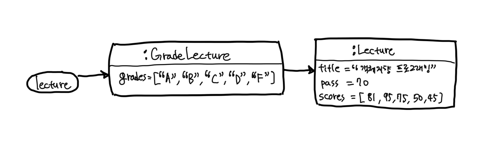
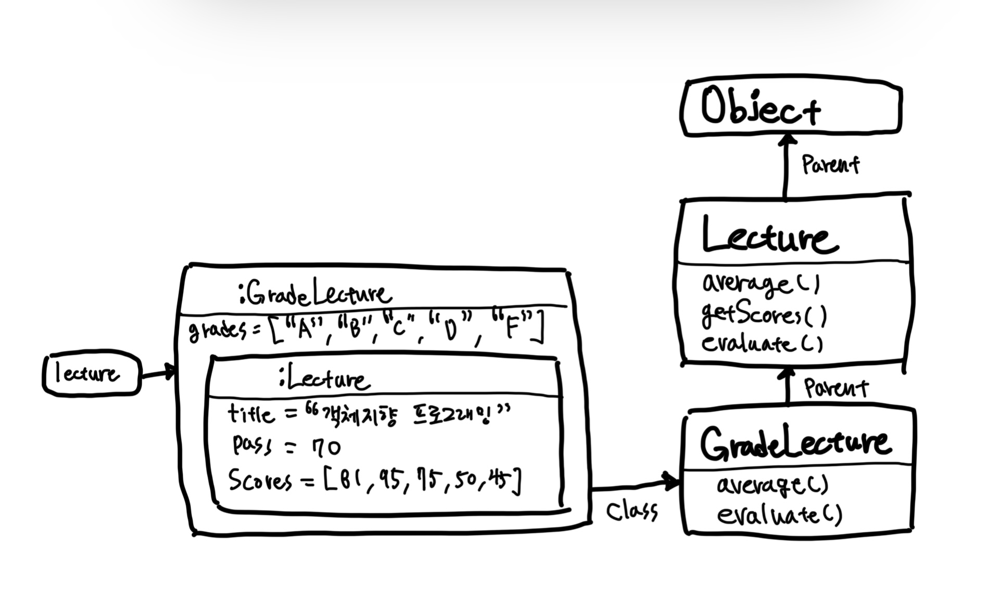

# Chapter 12 다형성

- 코드 재사용을 목적으로 상속을 사용하면 변경하기 어렵고 유연하지 못한 설계에 이를 확률이 높아진다.
  - 상속의 목적은 코드 재사용이 아니다.
  - 상속은 타입 계층을 구조화하기 위해 사용해야 한다.
- 상속의 관점에서 다형성이 구현되는 기술적인 메커니즘.
  - 다형성이 런타임에 메시지를 처리하기에 적합한 메소드를 동적으로 탐색하는 과정을 통해 구현되며, 상속이 이런 메소드를 찾기 위한 일종의 탐색 경로를 클래스 계층의 형태로 구현하기 위한 방법이라는 사실.


## 1. 다형성

- `다형성 polymorphism`이라는 단어는 그리스어에서 '많은'을 의미하는 'poly'와 '형태'를 의미하는 `morph`의 합성어.
  - '많은 형태를 가질 수 있는 능력'
  - 컴퓨터 과학에서는 다형성을 하나의 추상 인터페이스에 대해 코드를 작성하고 이 추상 인터페이스에 대해 서로 다른 구현을 연결할 수 있는 능력으로 정의한다.


- 객체지향 프로그래밍에서 사용되는 다형성은 `유니버설(Universal) 다형성 `과 `임시(Ad Hoc) 다형성`으로 분류할 수 있다.
- 유니버설 다형성은 다시 `매개변수(Parametric) 다형성`과 `포함(Inclusion) 다형성`으로 분류할 수 있다.
- 임시 다형성은 `오버로딩(Overloading) 다형성`과 `강제(Coercion) 다형성`으로 분류할 수 있다.

#### 오버로딩

- 아래와 같이 동일한 이름의 다양한 메소드가 존재하는 것을 의미한다.
  - 기억해야 하는 이름의 수를 극적으로 줄일 수 있다는 장점이 있다.

```java
public class Money {
  public Money plus(Money amount) {...}
  public Money plus(BigDecimal amount) {...}
  public Money plus(long amount) {...}
}
```

#### 강제 다형성

- 언어가 지원하는 자동적인 타입 변환이나 사용자가 직접 구현한 타입 변환을 이용해 동일한 연산자를 다양한 타입에 사용할 수 있는 방식을 가리킨다.
- 예를 들어 자바에서 이항 연산자인 '+'는 피연산자가 모두 정수일 경우에는 정수에 대한 덧셈 연산자로 동작하지만 하나는 정수형이고 다른 하나는 문자열인 경우 연결 연산자로 동작한다.
  - 정수형 피연산자는 문자열 타입으로 **강제 형변환**된다.

```java
10 + 10 // 덧셈 연산으로 동작. 결과값: 20
"10" + "10" // 연결 연산으로 동작. 결과값: "1010"
```

#### 매개변수 다형성

- `제너릭 프로그래밍 Generic Programming`과 관련이 깊다.
- 클래스의 인스턴스 변수나 메소드의 매개변수 타입을 임의의 타입으로 선언한 후 사용하는 시점에 구체적인 타입으로 지정하는 방식을 가리킨다.
- 자바의 `List`
  - 컬렉션에 보관할 요소의 타입의 임의의 타입 T로 지정
  - 실제 인스턴스를 생성하는 시점에 T를 구체적인 타입으로 지정할 수 있게 하고 있다.
  - 따라서 다양한 타입의 요소를 다루기 위해 동일한 오퍼레이션을 사용할 수 있다.

```java
public interface List<E> extends SequencedCollection<E> {...}
```

```java
List<String> string = new ArrayList<>();
List<Integer> integer = new ArrayList<>();
List<Member> members = new ArrayList<>();        
```

#### 포함 다형성

- 메시지가 동일하더라도 수신한 객체의 타입에 따라 실제로 수행되는 행동이 달라지는 능력을 의미.
- `서브타입(Sybtype) 다형성`이라고도 부른다.
- 객체지향 프로그래밍에서 가장 널리 알려진 형태의 다형성이기 때문에 특별한 언급 없이 다형성이라고 할 때는 포함 다형성을 의미하는 것이 일반적이다.
- `Movie` 클래스의 예시
  - `Movie` 클래스는 `discountPolicy`에게 `calculateDiscountAmount` 메시지를 전송하지만 실제로 실행되는 메서드는 메시지를 수신한 객체의 타입에 따라 달라진다.

```java
public class Movie {
  private DiscountPolicy discountPolicy;
  
  public Money calculateMoveiFee(Screening screening) {
    return fee.minus(discountPolicy.calculateDiscountAmount(screening));
  }
}
```

- 포함 다형성을 구현하는 가장 일반적인 방법은 상속을 사용하는 것이다.
- 포함 다형성을 서브타입 다형성이라고 부른다는 사실에서 예상할 수 있겠지만 포함 다형성을 위한 전제조건은 자식 클래스가 부모 클래스의 서브타입이어야 한다는 것이다.
  - 그리고 상속의 진정한 목적은 코드 재사용이 아니라 다형성을 위한 서브타입 계층을 구축하는 것이다.
- 상속의 일차적인 목적은 코드 재사용이 아니라 서브타입의 구현이다.
- 포함 다형성을 위해 상속을 사용하는 가장 큰 이유는 상속이 클래스들을 계층으로 쌓아 올린 후 상황에 따라 적절한 메소드를 선택할 수 있는 메커니즘을 제공하기 때문이다.
  - 객체가 메시지를 수신하면 객체지향 시스템은 메시지를 처리할 적절한 메서드를 상속 계층 안에서 탐색한다.
  - 실행할 메서드를 선택하는 기준은 어떤 메시지를 수신했는지에 따라, 어떤 클래스의 인스턴스인지에 따라, 상속 계층이 어떻게 구성돼 있는지에 따라 달라진다.

<br/>

## 2. 상속의 양면성

- 객체지향 패러다임의 근간을 이루는 아이디어. 데이터와 행동을 객체라고 불리는 하나의 실행 단위 안으로 통합하는 것이다.
  - 데이터와 행동. 두 가지 관점을 함께 고려해야 한다.
- 상속 역시 예외는 아니다.
  - 부모 클래스에서 정의한 모든 데이터를 자식 클래스의 인스턴스에 자동으로 포함시킬 수 있다. 이것이 데이터 관점의 상속.
  - 데이터뿐만 아니라 부모 클래스에서 정의한 일부 메소드 역시 자동으로 자식 클래스에 포함시킬 수 있다. 이것이 행동 관점의 상속.
- 단순히 데이터와 행동의 관점에서만 바라보면 상속이란 부모 클래스에서 정의한 데이터와 행동을 자식 클래스에서 자동적으로 공유할 수 있는 재사용 메커니즘으로 보일 것이다.
  - 하지만 이 관점은 상속을 오해한 것이다.
- 상속의 목적은 코드 재사용이 아니다.
  - 상속은 프로그램을 구성하는 개념들을 기반으로 다형성을 가능하게 하는 타입 계층을 구축하기 위한 것이다.
  - 타입 계층에 대한 고민 없이 코드를 재사용하기 위해 상속을 사용하면 이해하기 어렵고 유지보수하기 버거운 코드가 만들어질 확률이 높다.
  - 문제를 피할 수 있는 유일한 방법은 상속이 무엇이고 언제 사용해야 하는지를 이해하는 것뿐이다.
- 상속의 메커니즘을 이해하기 위한 몇 가지 개념
  - 업캐스팅
  - 동적 메소드 탐색
  - 동적 바인딩
  - self 참조
  - super 참조

### 상속을 사용한 강의 평가

#### Lecture 클래스 살펴보기

- 프로그램은 아래와 같이 전체 수강생들의 성적 통계를 출력한다.

```
Pass:3 Fail:2, A:1 B:1 C:1 D:0 F:2
```

- 출력은 두 부분으로 구성
  - `Pass:3 Fail:2`: 이수한 학생과 낙제한 학생의 수
  - `A:1 B:1 C:1 D:0 F:2`: 학생들의 분포 현황
- `Lecture` 클래스의 구현

```java
public class Lecture {
  private String title;
  private int pass;
  private List<Integer> scores = new ArrayList<>();

  public Lecture(final String title, final int pass, final List<Integer> scores) {
    this.title = title;
    this.pass = pass;
    this.scores = scores;
  }

  public double average() {
    return scores.stream()
        .mapToInt(Integer::intValue)
        .average().orElse(0);
  }

  public List<Integer> getScores() {
    return Collections.unmodifiableList(scores);
  }

  public String evaluate() {
    return String.format("Pass:%d Fail:%d", passCount(), failCount());
  }

  private long passCount() {
    return scores.stream().filter(score -> score >= pass).count();
  }

  private long failCount() {
    return scores.size() - passCount();
  }
}
```

#### 상속을 사용해 Lecture 클래스 재사용하기

- `Lecture` 클래스는 새로운 기능을 구현하는 데 필요한 대부분의 데이터와 메소드를 포함하고 있다.
  - 따라서 `Lecture` 클래스를 상속받으면 새로운 기능을 쉽고 빠르게 추가할 수 있을 것이다.

```java
public class GradeLecture extends Lecture {
  private List<Grade> grades;

  public GradeLecture(final String title, final int pass, final List<Integer> scores,
      final List<Grade> grades) {
    super(title, pass, scores);
    this.grades = grades;
  }

  @Override
  public String evaluate() {
    return super.evaluate() + ", " + gradesStatistics();
  }

  private String gradesStatistics() {
    return grades.stream()
        .map(this::format)
        .collect(Collectors.joining(" "));
  }

  private String format(Grade grade) {
    return String.format("%s:%d", grade.getName(), gradeCount(grade));
  }

  private long gradeCount(final Grade grade) {
    return getScores().stream()
        .filter(grade::include)
        .count();
  }
}
```

- 여기서 주목할 부분은 `GradeLecture`와 `Lecture`에 구현된 두 `evaluate` 메소드의 시그니처가 완전히 동일하다는 것이다.
  - 부모 클래스와 자식 클래스에 동일한 시그니처를 가진 메소드가 존재할 경우 자식 클래스의 메소드 우선순위가 더 높다.
  - 여기서 우선순위가 더 높다는 것은 메시지를 수신했을 때 부모 클래스의 메소드가 아닌 자식 클래스의 메소드가 실행된다는 것을 의미한다.
- 결과적으로 동일한 시그니처를 가진 자식 클래스의 메소드가 부모 클래스의 메소드를 가리게 된다.
  - 이처럼 자식 클래스 안에 상속받은 메소드와 동일한 시그너처의 메서드를 재정해서 부모 클래스의 구현을 새로운 구현으로 대체하는 것을 `메소드 오버라이딩`이라고 부른다.
- 자식 클래스에 부모 클래스에 없던 새로운 메소드를 추가하는 것도 가능하다.

```java
public class GradeLecture extends Lecture {
  public double average(String gradeName) {
    return grades.stream()
            .filter(each -> each.isName(gradeName))
            .findFirst()
            .map(this::gradeAverage)
            .orElse(0d);
  }

  private double gradeAverage(final Grade grade) {
    return getScores().stream()
            .filter(grade::include)
            .mapToInt(Integer::intValue)
            .average()
            .orElse(0);
  }
}
```

- evaluate 메소드와 달리 `GradeLecture`의 `average` 메소드는 부모 클래스인 `Lecture`에 정의된 `average` 메소드와 이름은 같지만 시그니처는 다르다.
  - 두 메소드의 시그니처가 다르기 때문에 `GradeLecture`의 `average`메소드는 `Lecture`의 `average` 메소드를 대체하지 않으며 결과적으로 두 메소드는 사이좋게 공존할 수 있다.
  - 다시 말해서 클라이언트는 두 메소드 모두를 호출할 수 있다는 것이다.
  - 이처럼 부모 클래스에서 정의한 메소드와 이름은 동일하지만 시그니처는 다른 메소드를 자식 클래스에 추가하는 것을 `메소드 오버로딩 method overloading`이라고 부른다.

### 데이터 관점의 상속

- 다음과 같이 `Lecture` 인스턴스를 생성했다.

```java
Lecture lecture = new Lecture("객체지향 프로그래밍", 70, Arrays.asList(81, 95, 75, 50, 45));
```

- `Lecture` 인스턴스를 생성하면 시스템은 인스턴스 변수 `title`, `pass`, `scores`를 저장할 수 있는 메모리 공간을 할당하고 생성자의 매개변수를 이용해 값을 설정한 후 생성된 인스턴스의 주소를 `lecture`라는 이름의 변수에 대입한다.


- 이번에는 `GradeLecture`를 생성해보자.

```java
GradeLecture gradeLecture = new GradeLecture(
        "객체지향 프로그래밍",
        70,
        Arrays.asList(81, 95, 75, 50, 45),
        Arrays.asList(
            new Grade("A", 100, 95),
            new Grade("B", 94, 80),
            new Grade("C", 79, 70),
            new Grade("D", 69, 50),
            new Grade("F", 49, 0)));
```

- 메모리 상에 생성된 `GradeLecture`의 인스턴스는 아래와 같이 표현할 수 있다.
  - 상속을 인스턴스 관점에서 바라볼 때는 개념적으로 자식 클래스의 인스턴스 안에 부모 클래스의 인스턴스가 포함되는 것으로 생각하는 것이 유용하다.
  - 인스턴스를 참조하는 `lecture`는 `GradeLecture`의 인스턴스를 가리키기 때문에 특별한 방법을 사용하지 않으면 `GradeLecture` 안에 포함된 `Lecture` 인스턴스에 직접 접근할 수 없다.


- 아래와 같이 자식 클래스의 인스턴스에서 부모 클래스의 인스턴스로 접근 가능한 링크가 존재한다고 생각하면 된다.



### 행동 관점의 상속

- 데이터 관점의 상속이 자식 클래스의 인스턴스 안에 부모 클래스의 인스턴스를 포함하는 개념이라면 행동 관점의 상속은 부모 클래스가 정의한 일부 메소드를 자식 클래스로 포함시키는 것을 의미한다.
- 공통적으로 부모 클래스의 모든 퍼블릭 메소드는 자식 클래스의 퍼블릭 인터페이스에 포함된다.
  - 따라서 외부의 객체가 부모 클래스의 인스턴스에게 전송할 수 있는 모든 메시지는 자식 클래스의 인스턴스에게도 전송할 수 있다.
  - 실제로 클래스의 코드를 합치거나 복사하는 작업이 수행되는 것은 아니다. 런타임에 시스템이 자식 클래스에 정의되지 않은 메소드가 있을 경우 이 메소드를 부모 클래스 안에서 탐색한다.
- 행동 관점에서 상속과 다형성의 기본적인 개념을 이해하기 위해서는 상속 관계로 연결된 클래스 사이의 메소드 탐색 과정을 이해하는 것이 가장 중요하다.
- 객체의 경우 서로 다른 상태를 저장할 수 있도록 각 인스턴스별로 독립적인 메모리를 할당받아야 한다.
  - 하지만 메소드의 경우에는 동일한 클래스의 인스턴스끼리 공유가 가능하기 때문에 클래스는 한 번만 메모리에 로드하고 각 인스턴스별로 클래스를 가리키는 포인터를 갖게 하는 것이 경제적이다.
- 아래의 그림은 두 개의 `Lecture` 인스턴스를 생성한 후의 메모리 상태를 개념적으로 표현한 것이다.
  - 인스턴스는 두 개가 생성됐지만 클래스는 단 하나만 메모리에 로드됐다는 사실에 주목하라.
  - 각 객체는 클래스인 `Lecture`의 위치를 가리키는 `class`라는 이름의 포인터를 가지며 이 포인터를 이용해 자신의 클래스 정보에 접근할 수 있다.
  - `Lecture` 클래스가 자신의 부모 클래스인 `Object`의 위치를 가리키는 `parent`라는 이름의 포인터를 가진다는 사실에도 주목하라
  - 이 포인터를 사용하면 클래스의 상속 계층을 따라 부모 클래스의 정의로 이동하는 것이 가능하다.
- 자식 클래스를 보고 메소드가 존재하지 않으면 클래스의 parent 포인터를 따라 부모 클래스를 차례대로 훑어가면서 적절한 메소드가 존재하는지를 검색한다.


- 마지막으로 `GradeLecutre` 클래스의 인스턴스를 생성했을 때의 메모리 구조를 살펴보자.
  - 아래 그림에서 볼 수 있는 것처럼 `GradeLecture`의 인스턴스는 `Lecture`의 인스턴스 내부에 포함된다.
  - `GradeLecture` 인스턴스의 class 포인터를 따라가면 `GradeLecture` 클래스에 이르고 parent 포인터를 따라가면 `Lecture` 그리고 `Object`까지 이어진다.



<br/>

## 3. 업캐스팅과 동적 바인딩

- 현재 성적 계산 프로그램에 각 교수별로 강의에 대한 성적 통계를 계산하는 기능 추가

```java
public class Professor {

  private String name;
  private Lecture lecture;

  public Professor(final String name, final Lecture lecture) {
    this.name = name;
    this.lecture = lecture;
  }

  public String compileStatistics() {
    return String.format("[%s] %s - Avg: %.1f", name, lecture.evaluate(), lecture.average());
  }
}
```

- `Lecture` 인스턴스를 전달하는 예시

```java
Professor professorLecture = new Professor(
    "다익스트라", new Lecture("알고리즘", 70, Arrays.asList(81, 95, 75, 50, 45)));
System.out.println(professorLecture.compileStatistics());
```

- 만약 `Lecture` 인스턴스 대신 `GradeLecture` 인스턴스를 전달하면 어떻게 될까?

```java
Professor professorGradeLecture = new Professor(
  "다익스트라",
  new GradeLecture(
      "객체지향 프로그래밍",
      70,
      Arrays.asList(81, 95, 75, 50, 45),
      Arrays.asList(
          new Grade("A", 100, 95),
          new Grade("B", 94, 80),
          new Grade("C", 79, 70),
          new Grade("D", 69, 50),
          new Grade("F", 49, 0))));
System.out.println(professorGradeLecture.compileStatistics());
```

- 아무런 문제가 없다.
- 동일한 객체 참조인 `lecture`에 대해 동일한 `evaluate` 메시지를 전송하는 동일한 코드 안에서 서로 다른 클래스 안에 구현된 메소드를 실행할 수 있다는 사실을 알 수 있다.
- 이처럼 코드 안에서 선언된 참조 타입과 무관하게 실제로 메시지를 수신하는 객체의 타입에 따라 실행되는 메소드가 달라질 수 있는 것은 업캐스팅과 동적 바인딩이라는 메커니즘이 작용하기 때문이다.
  - 부코 클래스(`Lecture`) 타입으로 선언된 변수에 자식 클래스(`GradeLecture`)의 인스턴스를 할당하는 것이 가능하다. 이를 **업캐스팅**이라고 부른다.
  - 선언된 변수의 타입이 아니라 메시지를 수신하는 객체의 타입에 따라 실행되는 메소드가 결정된다. 이것은 객체지향 시스템이 메시지를 처리할 적절할 메소드를 컴파일 시점이 아니라 실행 시점에 결정하기 때문에 가능하다. 이를 **동적 바인딩**이라고 부른다.

> #### 개방-폐쇄 원칙과 의존성 역전 원칙
> - 업캐스팅과 동적 메소드 탐색은 코드를 변경하지 않고도 기능을 추가할 수 있게 해주며 이것은 개방-폐쇄 원칙의 의도와도 일치한다.
> - 개방-폐쇄 원칙은 유연하고 확장 가능한 코드를 만들기 위해 의존관계를 구조화하는 방법을 설명한다. 업캐스팅과 동적 메소드 탐색은 상속을 이용해 개방-폐쇄 원칙을 따르는 코드를 작성할 때 하부에서 동작하는 기술적인 내부 메커니즘을 설명한다. 개방-폐쇄 원칙이 목적이라면 업캐스팅과 동적 메소드 탐색은 목적에 이르는 방법이다.

### 업캐스팅

- 상속을 이용하면 부모 클래스의 퍼블릭 인터페이스가 자식 클래스의 퍼블릭 인터페이스에 합쳐지기 때문에 부모 클래스의 인스턴스에게 전송할 수 있는 메시지를 자식 클래스의 인스턴스에게 전송할 수 있다.
- 부모클래스의 인스턴스 대신 자식 클래스의 인스턴스를 사용하더라도 메시지를 처리하는 데는 아무런 문제가 없으며, 컴파일러는 명시적인 타입 변환 없이도 자식 클래스가 부모 클래스를 대체할 수 있게 허용한다.
- 이런 특성을 활용할 수 있는 대표적인 두 가지가 대입문과 파라미터 타입이다.
  - 객체지향 언어는 명시적으로 타입을 변환하지 않고도 부모 클래스 타입의 참조 변수에 자식 클래스의 인스턴스를 대입할 수 있게 허용한다.

```java
Lecture lecture = new GradeLecture(...);
```

- 부모 클래스 타입으로 선언된 파라미터에 자식 클래스의 인스턴스를 전달하는 것도 가능하다.

```java
public class Professor {
  public Professor(String name, Lecture lecture) {...}
}

Professor professor = new Professor("다익스트라", new GradeLecture(...));
```

- 반대로 부모 클래스의 인스턴스를 자식 클래스 타입으로 변환하기 위해서는 명시적인 타입 캐스팅이 필요한데 이를 `다운캐스팅 downcasting`이라고 부른다.

```java
Lecture lecture = new GradeLecture(...);
GradeLecture lecture = (GradeLecture) lecture;
```

- 컴파일러 관점에서 자식 클래스는 아무런 제약 없이 부모 클래스를 대체할 수 있기 때문에 부모 클래스와 협력하는 클라이언트는 다양한 자식 클래스의 인스턴스와도 협력하는 것이 가능하다.
- 여기서 자식 클래스가 현재 상속 계층에 존재하는 자식 클래스뿐만 아니라 앞으로 추가될지도 모르는 미래의 자식 클래스들을 포함한다.
  - `Lecture`의 모든 자식 클래스는 `evaluate` 메시지를 이해할 수 있기 때문에 `Professor`는 `Lecture`를 상속받는 어떤 자식 클래스와도 협력할 수 있는 무한한 확장 가능성을 가진다.  
  - 따라서 이 설계는 유연하며 확장이 용이하다.

### 동적 바인딩

- 전통적인 언어에서 함수를 실행하는 방법은 함수를 호출하는 것이다.
  - 함수를 컴파일타임에 결정한다. (코드를 작성하는 시점에 호출될 코드가 결정된다.)
  - 이런 방식을 `정적 바인딩 static binding`, `초기 바인딩 early binding`, `컴파일타임 바인딩 compile-time binding`이라고 부른다.
- 객체지향 언어에서는 메지지를 수신했을 때 실행될 메소드가 런타임에 결정된다.
  - 객체가 실제로 어떤 클래스의 인스턴스인지. 또 해당 클래스의 상속 계층의 어디에 위치하는지를 알아야 한다.
  - 이런 방식을 `동적 바인딩 dynamic binding`, `지연 바인딩 late binding`이라고 부른다.

<br/>

## 4. 동적 메소드 탐색과 다형성

- 객체지향 시스템은 다음 규칙에 따라 실행할 메소드를 선택한다.
1. 메시지를 수신한 객체는 먼저 자신을 생성한 클래스에 적합한 메소드가 존재하는지 검사한다. 존재하면 메소드를 실행하고 탐색을 종료한다.
2. 메소드를 찾지 못했다면 부모 클래스에서 메소드 탐색을 계속한다. 이 과정은 적합한 메소드를 찾을 때까지 상속 계층을 따라 올라가며 계속된다.
3. 상속 계층의 가장 최상위 클래스에 이르렀지만 메소드를 발견하지 못한 경우 예외를 발생시키며 탐색을 중단한다.

- 메시지 탐색과 관련해서 이해해야 하는 중요한 변수가 하나 있다. `self 참조(self reference)`가 바로 그것이다.
  - 객체가 메시지를 수신하면 컴파일러는 self 참조라는 임시 변수를 자동으로 생성한 후 메시지를 수신한 객체를 가리키도록 설정한다.
  - 동적 메소드 탐색은 `self`가 가리키는 객체의 클래스에서 시작해서 상속 게층의 역방향으로 이뤄지며 메소드 탐색이 종료되는 순간 `self` 참조는 자동으로 소멸된다.
  - 시스템은 앞에서 설명한 `class` 포인터와 `parent` 포인터와 함께 `self` 참조를 조합해서 메소드를 탐색한다.

> #### self와 this
> - 정적 타입에 속하는 C++, 자바 C#에서는 `self` 참조를 `this`라고 부른다.
> - 동적 타입 언어에 속하는 스몰토크, 루비에서는 `self` 참조를 나타내는 키워드로 `self`를 사용한다.
> - 파이썬에서는 `self` 참조의 이름을 임의로 정할 수 있지만 대부분의 개발자들은 전통을 존중해서 `self`라는 이름을 사용한다.

- 메소드 탐색은 자식 클래스에서 부모 클래스의 방향으로 진행된다. 따라서 항상 자식 클래스의 메소드가 부모 클래스의 메소드보다 먼저 탐색되기 때문에 자식 클래스에 선언된 메소드가 부모 클래스의 메소드보다 더 높은 우선순위를 가지게 된다.
- 동적 메소드 탐색은 두 가지 원리로 구성된다는 것을 알 수 있다.
  1. **자동적인 메시지 위임**이다. 자식 클래스는 자신이 이해할 수 없는 메시지를 전송받은 경우 상속 계층을 따라 부모 클래스에게 처리를 위임한다. 클래스 사이의 위임은 프로그래머의 개입 없이 상속 계층을 따라 자동으로 이뤄진다.
  2. 두 번째 원리는 메소드를 탐색하기 위해 **동적인 문맥**을 사용한다는 것이다. 메시지를 수신했을 때 실제로 어떤 메소드를 실행할지를 결정하는 것은 컴파일 시점이 아닌 실행 시점에 이뤄지며, 메소드를 탐색하는 경로는 `self` 참조를 이용해서 결정한다.

- 메시지가 처리되는 문맥을 이해하기 위해서는 정적인 코드를 분석하는 것만으로는 충분하지 않다.
  - 런타임에 실제로 메시지를 수신한 객체가 어떤 타입인지를 추적해야 한다.
  - 이 객체의 타입에 따라 메소드를 탐색하는 문맥이 동적으로 결정되며, 여기서 가장 중요한 역할을 하는 것이 바로 `self` 참조다.

### 자동적인 메시지 위임

- 동적 메소드 탐색의 입장에서 상속 계층은 메시지를 수신한 객체가 자신이 이해할 수 없는 메시지를 부모 클래스에게 전달하기 위한 물리적인 경로를 정의하는 것으로 볼 수 있다.
  - 상속 계층 안의 클래스는 메시지를 처리할 방법을 알지 못할 경우 메시지에 대한 처리를 부모 클래스에게 위임한다.
  - 메시지 처리를 위임받은 부모 클래스 역시 수신한 메시지를 이해할 수 없다면 자신의 부모 클래스에게 메시지를 전달한다.
  - 여기서 핵심은 적절한 메소드를 찾을 때까지 상속 계층을 따라 부모 클래스로 처리가 위임된다는 것이다.
- 상속을 이용할 경우 프로그래머가 메시지 위임과 관련된 코드를 명시적으로 작성할 필요가 없음에 주목하라. 메시지는 상속 계층을 따라 부모 클래스에게 자동으로 위임된다.
  - 이런 관점에서 상속 계층을 정의하는 것은 메소드 탐색 경로를 정의하는 것과 동일하다.
- 일부 언어들은 상속이 아닌 방법을 이용해 메시지를 자동으로 위임할 수 있는 메커니즘을 제공하기도 한다.
  - 루비는 모듈, 스몰토크와 스칼라는 트레이트, 스위프트는 프로토콜과 확장 메커니즘으로 상속 계층에 독립적으로 메시지를 위임할 수 있다.
- 자식 클래스에서 부모 클래스 방향으로 자동으로 메시지 처리가 위임되기 때문에 자식 클래스에서 어떤 메소드를 구현하고 있느냐에 따라 부모 클래스에 구현된 메소드의 운명이 결정되기도 한다.
  - 메소드 오버라이딩은 자식 클래스의 메소드가 동일한 시그니처를 가진 부모 클래스의 메소드보다 먼저 탐색되기 때문에 벌어지는 현상이다.
  - 반면 메소드 오버로딩은 상속 계층에 걸쳐 사이좋게 공존할 수 있다.

### 동적인 문맥

- 메시지를 수신한 객체가 무엇이냐에 따라 메소드 탐색을 위한 문맥이 동적으로 바뀐다.
  - 그리고 이 동적인 문맥을 결정하는 것은 바로 메시지를 수신한 객체를 가리키는 `self` 참조다.
- `self` 참조가 `Lecture`의 인스턴스를 가리키고 있다면 메소드를 탐색할 문맥은 `Lecture` 클래스에서 시작해서 `Object` 클래스에서 종료되는 상속 계층이 된다.
- `self` 참조가 `GradeLecture`의 인스턴스를 가리키고 있다면 메소드 탐색의 문맥은 `GradeLecture` 클래스에서 시작해서 `Object` 클래스에서 종료되는 상속 계층이 된다.
- `self` 참조가 동적 문맥을 결정한다는 사실은 종종 어떤 메소드가 실행될지를 예상하기 어렵게 만든다.
  - 대표적인 경우가 자신에게 다시 메시지를 전송하는 `self 전송(self send)`이다.
- 아래 코드에서 `stats()`를 호출할 때 보통 **객체의 `getEvaluationMehod()` 메소드를 호출한다**라고 표현하지만 이 말은 정확하지 않다.
  - 현재 클래스의 메소드를 호출하는 것이 아니라 현재 객체에게 `getEvaluationMehod` 메시지를 전송하는 것이다.
  - **현재 객체에게 메시지를 전송하는 것이다.**

```java
public class Lecture {
  public String stats() {
    return String.format("Title: %s, Evaluation Method: %s", title, getEvaluationMethod());
  }
  
  public String getEvaluationMethod() {
    return "Pass of Fail";
  }
}
```

- 그렇다면 현재 객체란 무엇인가? 바로 `self` 참조가 가리키는 객체다. 이 객체는 처으메 `stats` 메시지를 수신했던 바로 그 객체다.
  - 이처럼 `self` 참조가 가리키는 자기 자신에게 메시지를 전송하는 것을 `self` 전송이라고 부른다.
  - `self` 전송을 이해하기 위해서는 `self` 참조가 가리키는 바로 그 객체에서부터 메시지 탐색을 다시 시작한다는 사실을 기억해야 한다.
- 위 예제는 단순하다. 하지만 상속이 끼어들면 이야기가 달라진다. 만약 아래와 같이 `GradeLecture` 클래스에서 `getEvaluationMethod` 메소드를 오버라이딩하면 어떻게 될까?

```java
public class GradeLecture extends Lecture {
  @Override
  public String getEvaluationMethod() {
    return "Grade";
  }
}
```

- `GradeLecture`에 `stats` 메시지를 전송하려면 `self` 참조는 `GradeLecture` 인스턴스를 가리키도록 설정되고 메소드 탐색은 `GradeLecture` 클래스에서부터 시작된다.
- 과정은 아래와 같다.
1. `self` 참조는 `class` 포인터를 통해 `GradeLecture` 클래스에서 `stats` 메시지를 처리할 수 있는 메소드를 찾는다.
2. 하지만 존재하지 않기 때문에 부모 클래스인 `Lecture`에서 메소드 탐색을 계속한다.
3. `Lecture` 클래스에 `stats` 메소드를 발견하고 이를 실행한다.
4. `stats`에서 `getEvaluationMethod` 메시지를 전송하는 구문과 마주치게 된다.이때 메소드 탐색은 `self` 참조가 가리키는 객체에서 다시 시작된다.
5. `GradeLecture`에서 탐색을 시작하고 오버라이딩한 `getEvaluationMethod` 메소드를 발견하고 실행한 후 동적 메소드 탐색을 종료한다.

- `self` 전송은 자식 클래스에서 부모 클래스 방향으로 진행되는 동적 메소드 탐색 경로를 다시 `self` 참조가 가리키는 원래의 자식 클래스로 이동시킨다. 
  - 이로 인해 최악의 경우 실제로 실행될 메소드를 이해하기 위해 상속 계층 전체를 훑어가며 코드를 이해해야 하는 상황이 발생할 수 있다.

### 이해할 수 없는 메시지

- 만약 동적 메소드를 탐색을 진행할 때 상속 계층의 정상에 오고 나서도 자신이 메시지를 처리할 수 없다는 사실을 아게 됐다면 어떻게 해야 할까?
  - 다시 말해서 객체가 메시지를 이해할 수 없다는 어떻게 할까?
  - 이는 프로그래밍 언어가 정적 타입 언어에 속하는지, 동적 타입 언어에 속하는지에 따라 달라진다.

#### 정적 타입 언어와 이해할 수 없는 메시지

- 만약 메시지를 처리할 수 있는 메소드를 발견하지 못한다면 컴파일 에러를 발생시킨다. (따라서 아예 실행조차 하지 못함.)
  - 최상위 부모 클래스인 `Object`까지 메소드를 탐색하고 메시지를 이해할 수 없는 경우 컴파일 에러를 발생시켜 메시지를 처리할 수 없다는 사실을 프로그래머에게 알린다.

#### 동적 타입 언어와 이해할 수 없는 메시지

- 동적 타입 언어에는 컴파일 단계가 존재하지 않기 때문에 런타임에 에러가 발생한다.
- 동적 타입 언어는 이해할 수 없는 메시지를 처리할 수 있는 능력을 가짐으로써 메시지가 선언된 인터페이스와 메소드가 정의된 구현을 분리할 수 있다.
  - 메시지 전송자는 자신이 원하는 메시지를 전송하고 메시지 수신자는 스스로의 판단에 따라 메시지를 처리한다.
  - 이것은 메시지를 기반으로 협력하는 자율적인 객체라는 순수한 객체지향의 이상에 좀 더 가까운 것이다.
  - 그러나 이런 특성과 유연성은 코드를 이해하고 수정하기 어렵게 만들뿐만 아니라 디버깅 과정을 복잡하게 만들기도 한다.

> #### 이해할 수 없는 메시지와 도메인-특화 언어
> - 이해할 수 없는 메시지를 처리할 수 있는 동적 타입 언어의 특징은 메타 프로그래밍 영역에서 진가를 발휘한다.
> - 동적 타입 언어의 이러한 특징으로 인해 정적 타입 언어보다 더 쉽고 강력한 `도메인-특화 언어 Domain-Spcific Language, DSL`를 개발할 수 있는 것으로 간주된다.
> - 마틴 파울러는 동적 타입 언어의 이러한 특징을 이용해 도메인-특화 언어를 개발하는 방식을 `동적 리셉션 dynamic reception`이라고 부른다.

### self 대 super

- `super 참조(super reference)`
- `super.evaluate()` 라는 문장은 단순히 부모 클래스의 메소드를 호출하는 것이 아니라 더 상위에 위치한 조상 클래스의 메소드를 호출하는 것일 수 있다.
- 따라서 `super` 참조의 용도는 부모 클래스에 정의된 메소드를 실행하기 위한 것이 아니다.
  - `super` 참조의 정확한 의도는 '지금 이 클래스의 부모 클래스에서부터 메소드 탐색을 시작하세요'다.
- 이처럼 `super` 참조를 통해 메시지를 전송하는 것은 마치 부모 클래스의 인스턴스에게 메시지를 전송하는 것처럼 보이기 때문에 이를 `super 전송(super send)`이라고 부른다.

> #### super 참조의 문법
> - 대부분의 객체지향 언어는 부모 클래스에서부터 메소드 탐색이 시작하게 하는 `super` 참조를 위한 의사변수를 제공한다.
> - 자바에서는 이 의사 변수를 가리키기 위해 `super`라는 예약어를 사용하고 C#은 `base`라는 예약어를 사용한다.
> - C++은 부모 클래스 이름과 범위 지정 연산자인 `::`를 조합해서 부모 클래스에서부터 메소드 탐색을 시작하게 할 수 있다.

> #### super 전송과 동적 바인딩
> - 상속에서 `super`가 컴파일 시점에 미리 결정된다고 설명했지만 `super`를 런타임에 결정하는 경우도 있다. (ex. 스칼라의 트레이트는 믹스인 되는 순서에 따라 동적으로 결정된다.)
> - 따라서 사용하는 언어에 따라 컴파일 시점이 아닌 실행 시점에 `super`의 대상이 결정될 수 있다.
> - 하지만 대부분의 경우 `super`가 컴파일 시점에 결정된다.

<br/>

## 5. 상속 대 위임

- `self` 참조가 동적인 문맥을 결정한다는 사실을 이해하고 나면 상속을 바라보는 새로운 시각이 형성된다.
  - 바로 자식 클래스에서 부모 클래스로 `self` 참조를 전달하는 메커니즘으로 상속을 바라보는 것이다.

### 위임과 self 참조

```ruby
class Lecture
  def initialize(name, scores)
    @name = name
    @scores = scores
  end
  
  def stats(this)
    "Name: #{@name}, Evaluation Mehotd: #{this.getEvaluationMethod()}"
  end
  
  def getEvaluationMethod()
    "Pass or Fail"
  end
end
```

```ruby
class GradeLecture
  def initialize(name, canceled, scores)
    @parent = Lecture.new(name, scores)
    @canceled = canceled
  end
  
  def stats(this)
    @parent.stats(this)
  end
  
  def getEvaluationMethod()
    "Grade"
  end
end
```

```ruby
grade_lecture = GradeLecture.new("OOP", flase, [1, 2, 3])
puts grade_lecture.stats(grade_lecture)
```

- 위 코드에서 중요한 부분은 4가지이다.
1. `GradeLecture`는 인스턴스 변수인 `@parent`에 `Lecture`의 인스턴스를 생성해서 저장한다. (`GradeLecture` 인스턴스에 `Lecture`의 인스턴스로 이동할 수 있는 **명시적인 링크**가 추가)
2. `GradeLecture`의 `stats` 메소드는 추가적인 작업 없이 `@parent`에게 요청을 그대로 전달한다. 동적 메소드 탐색은 메타 정보를 이용해 자동으로 처리를 위임하지만 우리의 경우에는 메시지 전달 과정을 직접 구현하고 있다는 차이가 있다.
3. `GradeLecture`의 `getEvaluationMethod` 메소드는 `stats` 메소드처럼 요청을 `@parent`에 전달하지 않고 자신만의 방법으로 메소드를 구현하고 있다. (메소드 오버라이딩과 동일)
4. `GradeLecture`의 `stats` 메소드는 인자로 전달된 `this`를 그대로 `Lecture`의 `stats` 메소드에 전달한다.

- `GradeLecture`의 `stats` 메서드는 메시지를 직접 처리하지 않고 `Lecture`의 `stats` 메소드에게 요청을 전달한다는 것에 주목하라.
- 이처럼 자신이 수신한 메시지를 다른 객체에게 동일하게 전달해서 처리를 요청하는 것을 `위임 delegation`이라고 부른다.
- 위임은 본질적으로는 자신이 정의하지 않거나 처리할 수 없는 속성 또는 메소드의 탐색 과정을 다른 객체로 이동시키기 위해 사용한다.
  - 이를 위해 위임은 항상 현재의 실행 문맥을 가리키는 `self` 참조를 인자로 전달한다.
  - 바로 이것이 `self` 참조를 전달하지 않는 포워딩과 위임의 차이점이다.

> #### 포워딩과 위임
> - 객체가 다른 객체에게 요청을 처리할 때 인자로 `self`를 전달하지 않을 수도 있다. 이것은 요청을 전달받은 최초의 객체에 다시 메시지를 전송할 필요는 없고 단순히 코드를 재사용하고 싶은 경우라고 할 수 있다.
> - 이처럼 처리를 요청할 때 `self` 참조를 전달하지 않는 경우를 **포워딩**이라고 부른다.
> - 이와 달리 `self` 참조를 전달하는 경우에는 **위임**이라고 부른다.
> - 위임의 정확한 용도는 클래스를 이용한 상속 관계를 객체 사이의 합성 관계로 대체해서 다형성을 구현하는 것이다.

- 위임은 객체 사이의 동적인 연결 관계를 이용해 상속을 구현하는 방법이다.
- 상속이 매력적인 이유는 우리가 직접 구현해야 하는 이런 번잡한 과정을 자동으로 처리해준다는 점이다.

### 프로토타입 기반의 객체지향 언어

- 헨리 리버맨의 논문에서 `프로토타입 prototype`이라는 용어가 반복해서 나왔다는 점에 주목하라.
  - 클래스가 아닌 객체를 이용해서도 상속을 흉내낼 수 있다.
  - 사실 클래스가 존재하지 않고 오직 객체만 존재하는 프로토타입 기반의 객체지향 언어에서 상속을 구현하는 유일한 방법은 객체 사이의 위임을 이용하는 것이다.
- 클래스 기반 객체지향의 언어들이 상속을 이용해 `self` 참조를 자동으로 전달하는 것처럼 프로토타입 기반의 객체지향 언어들 역시 위임을 이용해 객체 사이에 `self` 참조를 자동으로 전달한다.
- 현재 가장 널리 사용되는 프로토타입 언어? 자바스크립트.
  - 언어 차원에서 `prototype`이 지원된다.
  - 따라서 `self` 참조를 직접 전달하거나 메시지 포워딩을 번거롭게 직접 구현할 필요가 없다.

```javascript
function Lecture(name, scores) {
  this.name = name;
  this.scores = scores;
}

Lecture.prototype.stats = function () {
  return `Name: ${this.name}, Evaluation Method: ${this.getEvaluationMethod()}`;
}

Lecture.prototype.getEvaluationMethod = function () {
  return "Pass or Fail";
}
```

- `GradeLecture`의 `prototype`에 `Lecture`의 인스턴스를 할당했다는 것에 주목하라.
  - 이 과정을 통해 `GradeLecture`를 이용해 생성된 모든 객체들이 `prototype`을 통해 `Lecture`에 정의된 모든 속성과 함수에 접근할 수 있게 된다.
  - 결과적으로 `GradeLecture`의 모든 인스턴스들은 `Lecture`의 특성을 자동으로 상속받게 된다.

```javascript
function GradeLecture(name, canceled, scores) {
  Lecture.call(this, name, scores);
  this.canceled = canceled;
}

GradeLecture.prototype = new Lecture();

GradeLecture.prototype.construtor = GradeLecture;

GradeLecture.prototype.getEvaluationMethod = function () {
  return "Grade";
}
```

```javascript
const gradeLecture = new GradeLecture("OOP", false, [1, 2, 3]);
gradeLecture.stats();
```

<br/>

- 객체지향은 객체를 지향하는 것이다.
  - 클래스는 편리하게 정의하고 생성하기 위해 제공되는 프로그래밍 구성 요소일 뿐이며 중요한 것은 메시지와의 협력이다.
  - 클래스 없이도 객체 사이의 협력 관계를 구축하는 것이 가능하며 다형성을 구현하는 것이 가능하다.
- 

<br/>

# 참고자료

- 오브젝트, 조영호 지음
