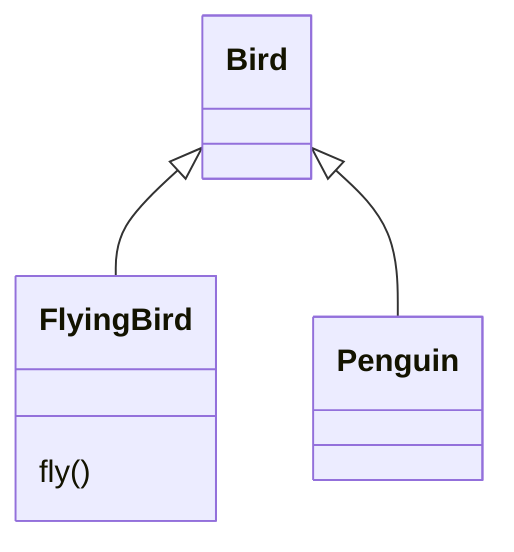
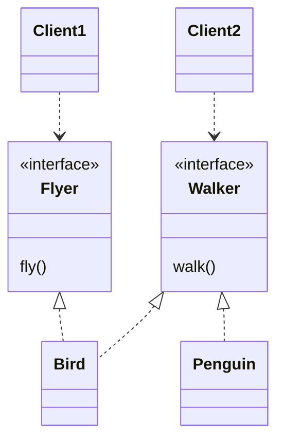
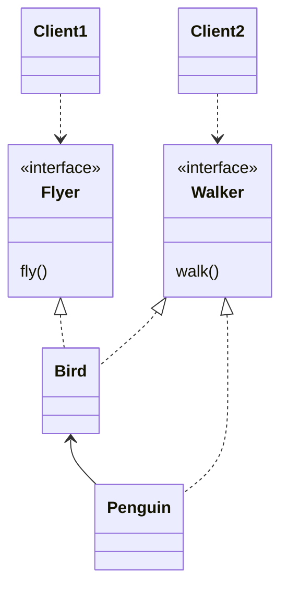

# Chapter 13. 서브클래싱과 서브타이핑

- 객체지향 커뮤니티에 널리 퍼진 상속에 대한 해묵은 불신과 오해를 풀기 위해서는 상속이 두 가지 용도로 사용된다는 사실을 이해하는 것이 중요하다.
- 상속의 첫 번째 용도는 `타입 계층`을 구현하는 것이다.
  - 타입 계층 안에서 부모 클래스는 일반적인 개념을 구현하고 자식 클래스는 특수한 개념을 구현한다.
  - 타입 계층의 관점에서 부모 클래스는 자식 클래스의 `일반화 generalization`이고 자식 클래스는 부모 클래스의 `특수화 specialization`다.
- 상속의 두 번째 용도는 `코드 재사용`이다.
  - 상속은 간단한 선언만으로 부모 클래스의 코드를 재사용할 수 있는 마법의 주문과도 같다.
  - 상속을 사용하면 점진적으로 애플리케이션의 기능을 확장할 수 있다. 하지만 재사용을 위해 상속을 사용할 경우 부모 클래스와 자식 클래스가 강하게 결합되기 때문에 변경하기 어려운 코드를 얻게될 확률이 높다.
- 상속을 사용하는 일차적인 목표는 코드 재사용이 아니라 타입 계층을 구현하는 것이어야 한다.
- 결론부터 말하자면 동일한 메시지에 대해 서로 다르게 행동할 수 있는 다형적인 객체를 구현하기 위해서는 객체의 행동을 기반으로 타입 계층을 구성해야 한다.
  - 상속의 가치는 이러한 타입 계층을 구현할 수 있는 쉽고 편안한 방법을 제공한다는 데 있다.
  - 타입 사이의 관계를 고려하지 않은 채 단순히 코드를 재사용하기 위해 상속을 사용해서는 안 된다.

> #### 객체지향 프로그래밍과 객체기반 프로그래밍
> - `객체기반 프로그래밍 Object-Based Programming`이란 상태와 행동을 캡슐화한 객체를 조합해서 프로그램을 구성하는 방식을 가리킨다.
>   - 이 정의에 따르면 `객체지향 프로그래밍 Object-Oriented Programming` 역시 객체기반 프로그래밍의 한 종류다.
> - 객체지향 프로그래밍은 객체기반 프로그래밍과 마찬가지로 객체들을 조합해서 애플리케이션을 개발하지만 `상속`과 `다형성`을 지원한다는 점에서 객체기반 프로그래밍과 차별화된다.
>   - 간단히 말해서 객체지향 프로그래밍은 상속과 다형성을 지원하지만 객체기반 프로그래밍은 지원하지 않는다.
> - 종종 객체기반 프로그래밍이 다른 의미로 사용되기 때문에 혼란을 초래하는 경우가 있다.
>   - 객체기반 프로그래밍이 자바스크립트와 같이 클래스가 존재하지 않는 `프로토타입 기반 언어 Prototype-Based Language`를 사용한 프로그래밍 방식을 가리키기 위해 사용되는 경우가 바로 그것이다.
>   - 이 관점에서 프로그래밍이란 클래스를 사용하는 프로그래밍 방식을 의미하고 객체기반 프로그래밍이란 클래스 없이 오직 객체만을 사용하는 프로그래밍 방식을 말한다.


<br/>

## 1. 타입

- 프로그래밍 언어 관점에서의 타입 vs 개념 관점에서의 타입

### 개념 관점의 타입

- 우리가 인지하는 세상의 사물의 종류. 우리가 인식하는 객체들에 적용하는 개념이나 아이디어를 가리켜 타입이라고 부름.
  - 타입은 사물을 분류하기 위한 틀.
- 어떤 대상이 타입으로 분류될 때 그 대상을 타입의 `인스턴스 Instance`라고 부른다.
  - 일반적으로 타입의 인스턴스를 `객체`라고 부른다.
- 지금까지의 설명을 통해 타입이 심볼, 내연, 외연의 세 가지 요소로 구성된다는 사실을 알 수 있다.
  - `상징 symbol`: 타입에 이름을 붙인 것. ex. 프로그래밍 언어
  - `내연 intension`: 타입의 정의로서 타입에 속하는 객체들이 가지는 공통적인 속성이나 행동. ex. '프로그래밍 언어'의 정의인 '컴퓨터에게 특정한 작업을 지시하기 위한 어휘와 문법적 규칙의 집합'
  - `외연 extension`: 타입에 속하는 객체들의 집합. ex. '프로그래밍 언어' 타입의 경우에는 자바, 루비, 자바스크립트, C

### 프로그래밍 언어 관점의 타입

- 프로그래밍 언어 관점에서 타입은 연속적인 비트에 의미와 제약을 부여하기 위해 사용.
  - 하드웨어는 데이터를 0과 1로 구성된 일련의 비트 조합으로 취급. 하지만 비트 자체에는 타입이라는 개념이 존재하지 않는다.
  - 비트에 담긴 데이터를 문자열로 다룰지, 정수로 다룰지는 전적으로 데이터를 사용하는 애플리케이션에 의해 결정된다.
  - 프로그래밍 언어 관점에서 타입은 비트 묶음에 의미를 부여하기 위해 정의된 제약과 규칙을 가리킨다.
- 프로그래밍 언어에서 타입은 두 가지 목적을 위해 사용된다.

#### 타입이 수행될 수 있는 유효한 오퍼레이션의 집합을 정의

- 자바의 '+' 연산자 vs C++과 C#에서의 (연산자 오버로딩이 가능한) '+' 연산자
- 모든 객체지향 언어들은 객체의 타입에 따라 적용 가능한 연산자의 종류를 제한함으로써 프로그래머의 실수를 막아준다.

#### 타입에 수행되는 오퍼레이션에 대해 미리 약속된 문맥을 제공

- 자바에서 int와 String을 '+' 연산자로 더할 때의 문맥.
- 객체를 생성하는 방법에 대한 문맥을 결정하는 것은 바로 객체의 타입


<br/>

- 정리하면 타입은 적용 가능한 오퍼레이션의 종류와 의미를 정의함으로써 코드의 의미를 명확하게 전달하고 개발자의 실수를 방지하기 위해 사용.

### 객체 지향 패러다임 관점의 타입

- 타입을 두 가지 관점에서 정의
  - 개념 관점에서 타입이란 공통의 특징을 공유하는 대상들의 분류.
  - 프로그래밍 언어 관점에서 타입이란 동일한 오퍼레이션을 적용할 수 있는 인스턴스들의 집합.
- 객체지향 프로그래밍에서 오퍼레이션은 객체가 수신할 수 있는 메시지를 의미.
  - 따라서 객체의 타입이란 객체가 수신할 수 있는 메시지의 종류를 정의하는 것이다.
  - 객체가 수신할 수 있는 메시지의 집합 = `퍼블릭 인터페이스`
  - 객체지향 프로그래밍에서 타입을 정의하는 것은 객체의 퍼블릭 인터페이스를 정의하는 것과 동일
- 개념 관점에서 타입은 공통의 특성을 가진 객체들을 분류하기 위한 기준.
  - 여기서 공통의 특성이란? (타입 오퍼레이션을 정의한다는 사실을 기억하면 쉽게 답을 구할 수 있을 것.)
  - 객체가 수신할 수 있는 메시지를 기준으로 타입을 분류하기 때문에 동일한 퍼블릭 인터페이스를 가지는 객체들은 동일한 타입으로 분류할 수 있다.

> 객체의 퍼블릭 인터페이스가 객체의 타입을 결정한다. 따라서 동일한 퍼블릭 인터페이스를 제공하는 객체들은 동일한 타입으로 분류된다.

- 타입의 정의는 지금까지 줄곧 강조해왔ㄷ던 객체에 관한 한 가지 사실을 다시 한 번 강조한다.
  - 객체에게 중요한 것은 속성이 아니라 행동이라는 사실이다.
  - 어떤 객체들이 동일한 상태를 가지고 있더라도 퍼블릭 인터페이스가 다르다면 이들은 서로 다른 타입으로 분류된다.
  - 반대로 어떤 객체들이 내부 상태는 다르지만 동일한 퍼블릭 인터페이스를 공유한다면 이들은 동일한 타입으로 분류된다.
- 객체를 바라볼 때는 항상 객체가 외부에 제공하는 행동에 초점을 맞춰야 한다.
  - 객체의 타입을 결정하는 것은 내부의 속성이 아니라 객체가 외부에 제공하는 행동이라는 사실을 기억하라.

<br/>

## 2. 타입 계층

### 타입 사이의 포함관계

- 다른 타입을 **포함하는 타입**은 포함되는 타입보다 더 일반화된 의미를 표현할 수 있다.
  - 더 많은 인스턴스를 가진다.
  - 외연 관점에서는 더 크고 내연 관점에서는 더 일반적이다. (일반화 관계)
- 반면 **포함되는 타입**은 좀 더 특수하고 구체적이다.
  - 외연 관점에서는 더 작고 내연 관점에서는 더 특수하다. (특수화 관계)
- 타입 계층을 표현할 때는 더 일반적인 타입을 위쪽에, 더 특수한 타입을 아래쪽에 배치하는 것이 관례다.
- 타입 계층을 구성하는 두 타입 간의 관계.
  - 더 일반적인 타입을 `슈퍼타입 supertype`
  - 더 특수한 타입을 `서브타입 subtype`
- 객체의 정의를 의미하는 내연 관점 
  - 일반화란 어떤 타입의 정의를 좀 더 보편적이고 추상적으로 만드는 과정.
  - 특수화란 어떤 타입의 정의를 좀 더 구체적이고 문맥 종속적으로 만드는 과정.

> `일반화`는 다른 타입을 완전히 포함하거나 내포하는 타입을 식별하는 행위 도는 그 행위의 결과를 가리킨다. `특수화`는 다른 타입 안에 전체적으로 포함되거나 완전히 내포되는 타입을 식별하는 행위 또는 그 행위의 결과를 가리킨다.

- 슈퍼타입과 서브타입이라는 용어는 `슈퍼셋 superset`과 `서브셋 subset`에서 유래한 것.

> #### `슈퍼타입`은 다음과 같은 특징을 가지는 타입을 가리킨다.
> - 집합이 다른 집합의 모든 멤버를 포함한다.
> - 타입 정의가 다른 타입보다 좀 더 일반적이다.

> #### `서브타입`은 다음과 같은 특징을 가지는 타입을 가리킨다. 
> - 집합에 포함되는 인스턴스들이 더 큰 집합에 포함된다.
> - 타입 정의가 다른 타입보다 좀 더 구체적이다.

### 객체지향 프로그래밍과 타입 계층

- 객체의 타입을 결정하는 것은 퍼블릭 인터페이스.
- 퍼블릭 인터페이스 관점에서 슈퍼타입과 서브타입을 다음과 같이 정의할 수 있다.

> - `슈퍼타입`이란 서브타입이 정의한 퍼블릭 인터페이스를 일반화시켜 상대적으로 범용적이고 넓은 의미로 정의한 것이다.
> - `서브타입`이란 슈퍼타입이 정의한 퍼블릭 인터페이스를 특수화시켜 상대적으로 구체적이고 좁은 의미로 정의한 것이다.

- 일반적인 타입과 구체적인 타입 간의 관계를 형성하는 기준이 `퍼블릭 인터페이스`라는 사실을 알아두자.
- 서브타입의 인스턴스는 슈퍼타입의 인스턴스로 간주될 수 있다. 이 사실이 이번 장의 핵심. 그리고 상속과 다형성의 관계를 이해하기 위한 출발점이다.

<br/>

## 3. 서브클래싱과 서브타이핑

- 객체지향 프로그래밍 언어에서 타입을 구현하는 일반적인 방법을 클래스를 이용하는 것이다.
- 그리고 타입 계층을 구현하는 일반적인 방법은 상속을 이용하는 것이다.
- 상속을 이용해 타입 계층을 구현하는 것은 부모 클래스가 슈퍼타입의 역할을, 자식 클래스가 서브타입의 역할을 수행하도록 클래스 사이의 관계를 정의한다는 것을 의미한다.

### 언제 상속을 사용해야 하는가?

- 어떤 조건을 만족시켜야 타입 계층을 위해 올바르게 상속을 사용했다고 말할 수 있을까? (마틴 오더스커의 질문. 아래 질문에 모두 '예'라고 답할 수 있어야 한다.)

> #### 상속 관계가 is-a 관계를 모델링하는가?
> 이것은 애플리케이션을 구성하는 어휘에 대한 우리의 관점에 기반한다. 일반적으로 "[자식 클래스]는 [부모 클래스]다"라고 말해도 이상하지 않다면 상속을 사용할 후보로 간주할 수 있다.

> #### 클라이언트 입장에서 부모 클래스의 타입으로 자식 클래스를 사용해도 무방한가?
> 상속 계층을 사용하는 클라이언트 입장에서 부모 클래스와 자식 클래스의 차이점을 몰라야 한다. 이를 자식 클래스와 부모 클래스 사이의 `행동 호환성`이라고 부른다.
 
- 설계 관점에서 상속을 적용할지 여부를 결정하기 위해 첫 번째 질문 보다는 두 번째 질문에 초점을 맞추는 것이 중요하다.
- 클라이언트 관점에서 두 클래스에 대해 기대하는 행동이 다르다면 비록 그것이 어휘적으로 is-a 관계로 표현할 수 있다고 하더라도 상속을 사용해서는 안된다.

### is-a 관계

- is-a 관계는 생각처럼 직관적이고 명쾌한 것은 아니다.
- 펭귄의 예시는 is-a 관계가 직관을 쉽게 배신할 수 있다는 사실을 보여준다.
  - 펭귄은 새다.
  - 새는 날 수 있다.

```java
public class Bird {
  public void fly() {}
}

public class Penguin extends Bird {}
```

- 코드는 '펭귄은 새고, 따라서 날 수 있다'라고 주장하고 있다.
- 이 예는 어휘적인 정의가 아니라 기대되는 행동에 따라 타입 계층을 구성해야 한다는 사실을 잘 보여준다.
- 타입 계층의 의미는 행동이라는 문맥에 따라 달라질 수 있다. 그에 따라 올바른 타입 계층이라는 의미 역시 문맥에 따라 달라질 수 있다.
  - 슈퍼타입과 서브타입 관계에서는 is-a보다 행동 호환성이 더 중요하다.
- 펭귄의 예시에 대한 스콧 마이어스의 말을 인용.
  - 명확하지 않은 자연어. 즉 사람의 말에 소위 '낚인' 것이라고 표현.
- 두 대상이 언어적으로 is-a라고 표현할 수 있더라도 일단은 상속을 사용할 예비 후보 정도로만 생각하라.
  - 너무 성급하게 상속을 적용하려고 서두르지 마라.

### 행동 호환성

- 두 타입 사이에 행동이 호환될 경우에만 타입 계층으로 묶어야 한다.
- 그렇다면 행동이 호환된다는 것은 무슨 의미일까? 단순히 동일한 메소드를 구현하고 있으면 행동이 호환되는 것일까?
- 여기서 중요한 것은 호환 여부를 판단하는 기준은 `클라이언트 관점`이라는 것이다.
  - 클라이언트가 두 타입이 동일하게 행동하지 않을 것이라고 기대한다면 두 타입을 타입 계층으로 묶어서는 안 된다.
- 대부분의 사람들은 '펭귄이 새다'라는 말에 현혹당한 채 상속 계층을 유지할 수 있는 해결 방법을 찾으려고 할 것이다. 상속 관계를 유지하면서 문제를 해결하기 위해 시도해 볼 수 있는 방법은 세 가지다.

1. `Penguin`의 `fly` 메소드를 오버라이딩해서 내부 구현을 비워두는 것

```java
public class Penguin extends Bird {
  
  @Override
  public void fly() {}
}
```

- 이 방법은 어떤 행동도 수행하지 않기 때문에 모든 bird가 날 수 있다는 클라이언트의 기대를 만족시키지 못한다. 따라서 올바른 설계라고 볼 수 없다.

2. `Penguin`의 `fly` 메소드를 오버라이딩한 후 예외를 던지게 하는 것.

```java
public class Penguin extends Bird {
  
  @Override
  public void fly() {
    throw new UnsupportedOperationException();
  }
}
```

- 역시나 모든 새는 날 수 있다고 가정한다는 사실에 주목하라. 예외가 던져질 거라고 기대하지 않았을 것이다. 따라서 이 방법 역시 클라이언트 관점에서 호환되지 않는다고 볼 수 있다.

3. `flyBird` 메소드를 수정해서 인자로 전달된 `bird`의 타입이 `Penguin`이 아닐 경우에만 `fly` 메시지가 전송하도록 하는 것이다.

```java
public void flyBird(Bird bird) {
  if (!(bird instanceof Penguin)) {
    bird.fly();  
  }  
}
```

- 이 방법 역시 문제가 있다. 만약 `Penguin` 이외에 날 수 없는 또 다른 새가 상속 계층에 추가된다면 어떻게 할 것인가?
  - 새로운 타입 체크가 추가되어야 한다.
  - 구체적인 클래스에 대한 결합도를 높인다. => 개방-폐쇄 원칙을 위반한다.

### 클라이언트의 기대에 따라 계층 분리하기

- 행동 호환성을 만족시키지 않는 상속 계층을 그대로 유지한 채 클라이언트의 기대를 충족시킬 수 있는 방법을 찾기란 쉽지 않다.
- 문제를 해결할 수 있는 방법은 클라이언트의 기대에 맞게 상속 계층을 분리하는 것뿐이다.
- `flyBird` 메소드는 파라미터로 전달되는 모든 새가 날 수 있다고 가정하기 때문에 `flyBird`와 협력하는 모든 객체는 `fly` 메시지에 대해 올바르게 응답할 수 있어야 한다.
  - 따라서 `Penguin` 인스턴스는 `flyBird`에 전달돼서는 안된다.
- 날 수 있는 새와 날 수 없는 새를 명확하게 구분할 수 있게 상속 계층을 분리하면 서로 다른 요구사항을 가진 클라이언트를 만족시킬 수 있을 것이다.

```java
public class Bird {}

public class FlyingBird extends Bird {
  public void fly() {}
}

public class Penguin extends Bird {}
```

```java
public void flyBird(FlyingBird bird) {
  bird.fly();  
}
```



- 이제 `FlyingBird` 타입의 인스턴스만이 `fly` 메시지를 수신할 수 있다.
  - 날 수 없는 `Bird`의 서브타입인 `Penguin`의 인스턴스에게 `fly` 메시지를 전송할 수 있는 방법은 없다.
  - 따라서 잘못된 객체와 협력해서 기대했던 행동이 수행되지 않거나 예외가 던져지는 일은 일어나지 않을 것이다.
- 이 문제를 해결하는 방법은 클라이언트에 따라 인터페이스를 분리하는 것이다.
  - 만약 `Bird`가 날 수 있으면서 걸을 수 있어야 하고, `Penguin`은 오직 걸을 수만 있다고 가정한다면?
- 인터페이스는 클라이언트가 기대하는 바에 따라 분리돼야 한다는 것을 기억하라.
  - 하나의 클라이언트가 오직 `fly` 메시지만 전송하기를 원한다면 이 클라이언트에게는 `fly` 메시지만 보여야 한다.
  - 다른 클라이언트가 `walk` 메시지만 전송하기를 원한다면 이 클라이언트에게는 `walk` 메시지만 보여야 한다.



- 만약 `Penguin`이 `Bird`의 코드를 재사용해야 한다면 어떻게 해야 할까?
  - `Penguin`이 하나의 인터페이스만 구현하고 있기 때문에 문법상으로는 `Penguin`이 `Bird`를 상속받더라도 문제가 안 되겠지만 `Penguin`의 퍼블릭 인터페이스에 `fly` 오퍼레이션이 추가되기 때문에 이 방법을 사용할 수 없다.
  - 게다가 재사용을 위한 상속은 위험하다.
- 더 좋은 방법은 합성을 사용하는 것이다.
  - 물론 `Bird`의 퍼블릭 인터페이스를 통해 재사용이 가능하다는 전제를 만족시켜야 한다.
  - 대부분의 경우에 불안정한 상속 계층을 계속 껴안고 가는 것보다는 `Bird`를 재사용 가능하도록 수정하는 것이 더 좋은 방법이다.



- 클라이언트에 따라 인터페이스를 분리하면 변경에 대한 영향을 더 세밀하게 제어할 수 있게 된다.
  - 대부분의 경우 인터페이스는 클라이언트의 요구가 바뀜에 따라 변경된다.
  - 클라이언트에 따라 인터페이스를 분리하면 각 클라이언트의 요구가 바뀌더라도 영향의 파급효과를 효과적으로 제어할 수 있게 된다.
- 인터페이스를 클라이언트의 기대에 따라 분리함으로써 변경에 의해 영향을 제어하는 설계 원칙을 `인터페이스 분리 원칙 `Interface Segregation Principle, ISP`라고 부른다.

> - 이 원칙은 '비대한' 인터페이스의 단점을 해결한다. 비대한 인터페이스를 가지는 클래스는 응집성이 없는 인터페이스를 가지는 클래스다. 즉, 이런 클래스의 인터페이스는 메소드의 그룹으로 분해될 수 있고, 각 그룹은 각기 다른 클라이언트 집합을 지원한다.
> - 비대한 클래스는 그 클라이언트 사이에 이상하고 해로운 결합이 생기게 만든다. 한 클라이언트가 이 비대한 클래스에 변경을 가하면, 나머지 모든 클래스가 영향을 받게 된다. 그러므로 클라이언트는 자신이 실제로 호출하는 메소드에만 의존해야만 한다.
> - 이것은 이 비대한 클래스의 인터페이스를 여러 개의 클라이언트에 특화된 인터페이스로 분리함으로써 성취될 수 있다.
> - 이렇게 하면 호출하지 않는 메소드에 대한 클라이언트의 의존성을 끊고, 클라이언트가 서로에 대해 독립적이 되게 만들 수 있다.

- 한 가지 주의해야할 점이 있다. 설계가 꼭 현실 세계를 반영할 필요는 없다는 것이다.
- 중요한 것은 설계가 반영할 도메인의 요구사항이고 그 안에서 클라이언트가 객체에게 요구하는 행동이다.
- 스콧 마이어스의 조언

> - 이 점은 모든 소프트웨어에 이상적인 설계 같은 것은 없다는 사실을 간단히 반증하는 예라고 할 수 있다.
> - 최고의 설계는 제작하려는 소프트웨어 시스템이 기대하는 바에 따라 달라진다. 오늘도 그렇고 미래에도 마찬가지다.
> - 여러분이 지금 만드는 애플리케이션이 비행에 대한 지식을 전혀 쓰지 않으며 나중에도 쓸 일이 없을 것이라면, 날 수 있는 새와 날지 않는 새를 구분하지 않는 것이 탁월한 선택일 수 있다.
> - 실제로 이런 것들을 잘 구분해서 설계하는 쪽이 바람직하다. 나는 새도 있고 날 수 없는 새도 있다는 사실은 여러분이 본뜨려고 하는 세계가 어떤 것이냐에 따라 고려해도 되고 고려하지 않아도 되기 때문이다.

- 요점은 자연어에 현혹되지 말고 요구사항 속에서 클라이언트가 기대하는 행동에 집중하라는 것이다.
- 클래스의 이름 사이에 어떤 연관성이 있다는 사실은 아무런 의미도 없다.
- 두 클래스 사이에 행동이 호환되지 않는다면 올바른 타입 계층이 아니기 때문에 상속을 사용해서는 안된다.

### 서브클래싱과 서브타이핑

- 상속을 사용하는 두 가지 목적에 특별한 이름을 붙였는데 **서브클래싱**과 **서브타이핑**이 그것이다.
- `서브클래싱 subclassing`: 다른 클래스의 코드를 재사용할 목적으로 상속을 사용하는 경우를 가리킨다. 
  - 자식 클래스와 부모 클래스의 행동이 호환되지 않기 때문에 자식 클래스의 인스턴스가 부모 클래스의 인스턴스를 대체할 수 없다. 
  - 서브클래싱을 `구현 상속 implementation ingeritance` 또는 `클래스 상속 class inheritance`이라고 부르기도 한다.
- `서브타이핑 subtyping`: 타입 계층을 구성하기 위해 상속을 사용하는 경우를 가리킨다. 영화 예매 시스템에서 구현한 `DiscountPolicy` 상속 계층이 서브타이핑에 해당한다. 
  - 서브 타이핑에서는 자식 클래스와 부모 클래스의 행동이 호환되기 때문에 자식 클래스의 인스턴스가 부모 클래스의 인스턴스를 대체할 수 있다. 이 때 부모 클래스는 자식 클래스의 슈퍼타입이 되고 자식 클래스는 부모 클래스의 서브타입이 된다.
  - 서브타이핑을 `인터페이스 상속 interface inheritance`이라고 부르기도 한다.
- 타입을 설명할 때 강조했던 것처럼 슈퍼타입과 서브타입 사이의 관계에서 가장 중요한 것은 퍼블릭 인터페이스다.
  - 슈퍼타입 인스턴스를 요구하는 모든 곳에서 서브타입의 인스턴스를 대신 사용하기 위해 만족해야 하는 최소한의 조건은 서브타입의 퍼블릭 인터페이스가 슈퍼타입에서 정의한 퍼블릭 인터페이스와 동일하거나 더 많은 오퍼레이션은 포함해야 한다는 것이다.
  - 개념적으로 서브타입이 슈퍼타입의 퍼블릭 인터페이스를 상속받는 것처럼 보이게 된다. 이것이 서브타이핑을 인터페이스 상속이라고 부르는 이유다.
- 서브타이핑 관계가 유지되기 위해서는 서브타입이 슈퍼타입이 하는 모든 행동을 동일하게 할 수 있어야 한다.
  - 즉, 어떤 타입이 다른 타입의 서브타입이 되기 위해서는 `행동 호환성 begavioral subsitution`을 만족시켜야 한다.
- 자식 클래스가 부모 클래스를 대신할 수 있기 위해서는 자식 클래스가 부모 클래스가 사용되는 모든 문맥에서 자식 클래스와 동일하게 행동할 수 있어야 한다.
  - 행동 호환성을 만족하는 상속 관계는 부모 클래스를 새로운 자식 클래스로 대체하더라도 시스템이 문제없이 동작할 것이라는 것을 보장해야 한다. 
  - 자식 클래스와 부모 클래스 사이의 행동 호환성은 부모 클래스에 대한 자식 클래스의 `대체 가능성 substitutability`을 포함한다.
- 행동 호환성과 대체 가능성은 올바른 상속 관계를 구축하기 위해 따라야 할 지침이라고 할 수 있다.
  - 이 지침은 리스코프 치환 원칙이라는 이름으로 정리되어 소개됨.

<br/>

## 4. 리스코프 치환 원칙

- `리스코프 치환 원칙 Liskov Substitution Principle, LSP`

> 여기서 요구되는 것은 다음의 치환 속성과 같은 것이다. 
> - S형의 각 객체 o1에 대해 T형의 객체 o2가 하나 있다. 
> - T에 의해 정의된 모든 프로그램 P에서 T가 S로 치환될 때, P의 동작이 변하지 않으면 S는 T의 서브타입이다.

- 한마디로 정리하면 "서브타입은 그것의 기반 타입에 대해 대체 가능해야 한다."는 것으로 클라이언트가 "차이점을 인식하지 못한 채 파생 클래스의 인터페이스를 통해 서브클래스를 사용할 수 있어야 한다"는 것이다.
- 결국은 자식 클래스와 부모 클래스 간의 행동 호환성.
- "정사각형은 직사각형이다(Square is-a Rectangle)"은 당연하게 생각하겠지만
  - 사실 정사각형과 직사각형의 상속 관계는 리스코프 치환 원칙을 위반하는 고전적인 사례 중 하나다.
- `resize` 메소드의 관점에서 `Rectangle` 대신 `Square`를 사용할 수 없기 때문에 `Square`는 `Rectangle`이 아니다.
  - `Square`는 `Rectangle`의 구현을 재사용하고 있을 뿐이다.
  - 두 클래스는 리스코프 치환 원칙을 위반하기 때문에 서브타이핑 관계가 아니라 서브클래싱 관계다.

#### 클라이언트와 대체 가능성

- `Stack`과 `Vector`가 서브타이핑 관계가 아니라 서브클래싱 관계인 이유
  - `Stack`과 `Vector`가 리스코프 치환 원칙을 위반하는 가장 큰 이유는 상속으로 인해 `Stack`에 포함돼서는 안 되는 `Vector`의 퍼블릭 인터페이스가 `Stack`의 퍼블릭 인터페이스에 포함됐기 때문이다.
  - `Vector`를 사용하는 클라이언트의 관점에서 `Stack`의 행동은 `Vector`의 행동과 호환되지 않는다.
  - `Vector`의 클라이언트는 임의의 위치에 요소를 추가하거나 임의의 위치에 있는 요소를 추출할 것이라고 예상한다.
  - 그러나 `Stack`의 클라이언트는 `Stack`이 임의의 위치에서의 조회나 추가를 금지할 것이라고 예상한다.
- 리스코프 치환 원칙은 "클라이언트와 격리한 채로 본 모델은 의미 있게 검증하는 것이 불가능하다"는 중요한 결론을 이끈다.
  - 어떤 모델의 유효성은 클라이언트의 관점에서만 검증 가능하다는 것이다.
- 대체 가능성을 결정하는 것은 클라이언트다.

### is-a 관계 다시 살펴보기

- is-a는 클라이언트 관점에서 is-a일 때만 참이다.
  - 정사각형은 직사각형인가? => 클라이언트가 이 둘을 동일하게 취급할 때만 그렇다.
  - 펭귄은 새인가? => 마찬가지다.
- is-a 관계는 객체지향에서 중요한 것은 객체의 속성이 아니라 객체의 행동이라는 점을 강조한다.
  - 일반적으로 클라이언트를 고려하지 않은 채 개념과 속성의 측면에서 상속 관계를 정할 경우 리스코프 치환 원칙을 위반하는 서브클래싱에 이르게 될 확률이 높다.

### 리스코프 치환 원칙은 유연한 설계의 기반이다

- 리스코프 치환 원칙은 클라이언트가 어떤 자식 클래스와도 안정적으로 협력할 수 있는 상속 구조를 구현할 수 있는 가이드라인을 제공한다.
  - 새로운 자식 클래스를 추가하더라도 클라이언트 입장에서 동일하게 행동하기만 하면 클라이언트를 수정하지 않고도 상속 계층을 확장할 수 있다.
  - 다시 말해 클라이언트의 입장에서 퍼블릭 인터페이스의 행동 방식이 변경되지 않는다면 클라이언트의 코드를 변경하지 않고도 새로운 자식 클래스와 협력할 수 있게 된다는 것이다.
- 리스코프 치환 원칙을 따르는 설계는 유연할뿐만 아니라 확장석이 높다.
  - 8장에서 중복 할인 정책을 구현하기 위해 기존의 `DiscountPolicy` 상속 계층에서 새로운 자식 클래스인 `OverlappedDiscountPolicy`를 추가하더라도 클라이언트를 수정할 필요가 없었던 것을 기억하는가?

```java
public class OverlappedDiscountPolicy extends DiscountPolicy {
  private List<DiscountPolicy> discountPolicies = new ArrayList<>();
  
  public OverlappedDiscountPolicy(DiscountPolicy ... discountPolicies) {
    this.discountPolicies = Arrays.asList(discountPolicies);
  }
  
  @Override
  protected Money getDiscountAmount(Screening screening) {
    Money result = Money.ZERO;
    for (DiscountPolicy each: discountPolicies) {
      result = result.plus(each.calculateDiscountAmount(screening));
    }
    return result;
  }
}
```

- 사실 이 설계는 `의존성 역전 원칙`과 `개방-폐쇄 원칙`, `리스코프 치환 원칙`이 한데 어우려져 설계를 확장 가능하게 만든 대표적인 예다.
  - 의존성 역전 원칙: `Moive`와 `OverlappedDiscountPolicy`는 모두 추상 클래스인 `DiscountPolicy`를 의존한다.
  - 리스코프 치환 원칙: `DiscountPolicy`에 협력하는 `Moive`의 관점에서 `DiscountPolicy` 대신 `OverlappedDiscountPolicy`와 협력해도 아무런 문제가 없다.
  - 개방-폐쇄 원칙: 할인 정책에 `OverlappedDiscountPolicy`가 추가되더라도 `Movie`에는 영향을 미치지 않는다. 기능 확장을 하면서도 기존 코드를 수정할 필요가 없다.
- 리스코프 치환 원칙은 개방-폐쇄 원칙을 만족하는 설계를 위한 전제 조건이다.

### 타입 계층과 리스코프 치환 원칙

- 클래스 상속은 타입 계층을 구현할 수 있는 다양한 방법 중 하나일 뿐이라는 사실을 잊지 말자.
- 리스코프 치환 원칙을 준수하기만 한다면 서브타이핑 관계라고 말할 수 있다.

<br/>

## 5. 계약에 의한 설계와 서브타이핑

- 클라이언트와 서버 사이의 협력을 `의무 obliigation`와 `이익 benefit`으로 구성된 계약의 관점에서 표현하는 것을 `계약에 의한 설계 Design By Contract, DBC`라고 부른다. 이는 세 가지 요소로 구성된다.
  - 계약에 의한 설계는 클라이언트가 정상적으로 메소드를 실행하기 위해 만족시켜야 하는 `사전조건 precondition`
  - 메소드가 실행된 후 서버가 클라이언트에게 보장해야 하는 `사후조건 postcondition`
  - 메소드 실행 전과 실행 후 인스턴스가 만족시켜야 하는 `클래스 불변식 class invariant`
- 리스코프 치환 원칙과 계약에 의한 설계 사이의 관계를 다음과 같은 한 문장으로 요약할 수 있다.

> 서브타입이 리스코프 치환 원칙을 만족시키기 위해서는 클라이언트와 슈퍼타입 간에 체결된 '계약'을 준수해야 한다.

- 서브클래스와 서브타입은 서로 다른 개념.
  - 어떤 클래스를 상속받으면 그 클래스의 자식 클래스 또는 서브클래스가 되지만. 모든 서브클래스가 서브타입인 것은 아니다.
- 서브타입이 슈퍼타입처럼 보일 수 있는 유일한 방법은 클라이언트가 슈퍼타입과 맺은 계약을 서브타입이 준수하는 것뿐이다.
- `Movie` 사전 조건을 위반하는 `screening`을 전달해서는 안 된다.

### 서브타입과 계약

- 계약의 관점에서 상속이 초래하는 가장 큰 문제는 자식 클래스가 부모 클래스의 메소드를 오버라이딩할 수 있다는 것이다.
- 만약 새로운 정책인 `BrokenDiscountPolicy`를 만들고 더 강력한 사전조건을 정의했다면?
- `Movie`는 `BrokenDiscountPolicy`는 모르고 `DiscountPolicy`의 사전 조건만 알고 있다는 사실을 기억하라.
  - `BrokenDiscountPolicy`의 사전조건에 실패하는 일이 생길 수 있다.

> 서브타입에 더 강력한 사전조건을 정의할 수 없다.

- 대신 오버라이딩을 통해 더 약한 사건조건으로 바꾸는 것은 아무런 영향을 주지 않을 것이다.

> 서브타입에 슈퍼타입과 같거나 더 약한 사전조건을 정의할 수 있다.

- 반면 사후조건을 강화한다면?
  - `BrokenDiscountPolicy`에서 실행한 결과값은 `Money`에 대한 조건을 거는 것이기 때문에  `Movie`와 `DiscountPolicy` 사이에 체결된 계약을 위반하지 않는다.

> 서브타입에 슈퍼타입과 같거나 더 강한 사후조건을 정의할 수 있다.

- 하지만 더 약한 사후조건을 건다면 어떻게 될까?
  - `Movie`가 원하지 않았던 결과를 반환할 수 있다. => 계약을 위반

> 서브타입에 더 약한 사후조건을 정의할 수 없다.

- 계약에 의한 설계는 클라이언트 관점에서의 대체 가능성을 계약으로 설명할 수 있다는 사실을 잘 보여준다.
- 따라서 서브타이핑을 위해 상속을 사용하고 있다면 부모 클래스가 클라이언트와 맺고 있는 계약에 관해 깊이 있게 고민해야 한다.

<br/>

# 참고자료

- 오브젝트, 조영호 지음
