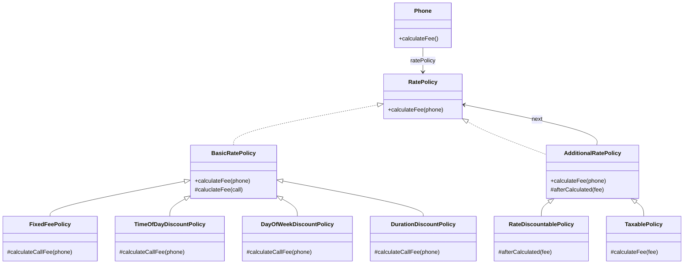
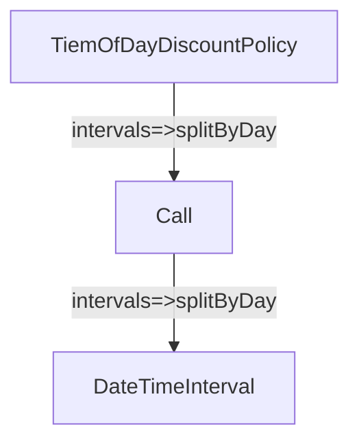
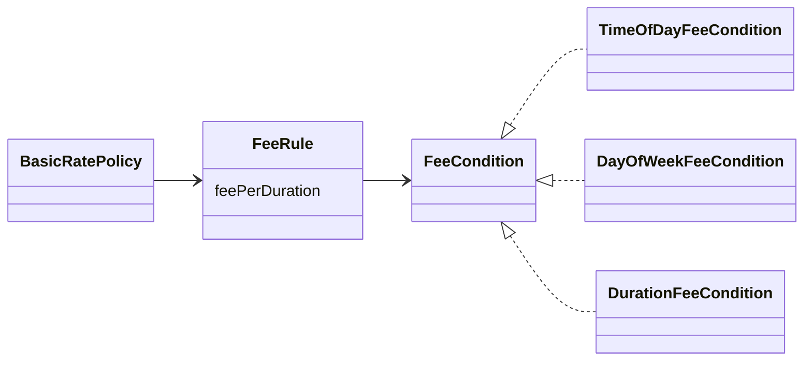
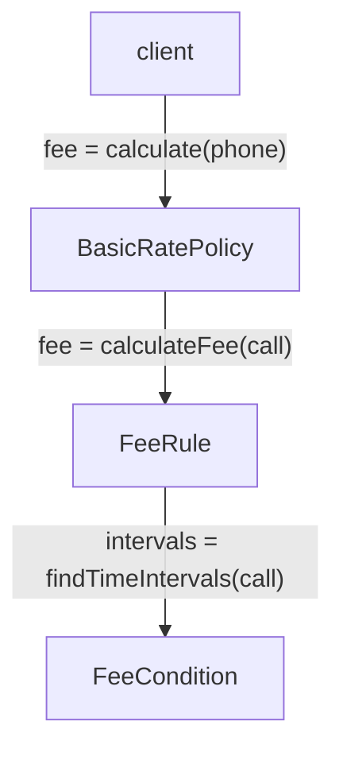
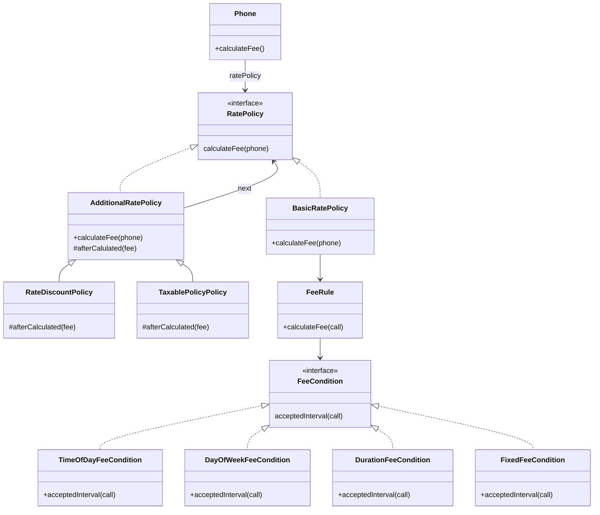

# Chapter 14. 일관성이 있는 협력

- 객체는 협력을 위해 존재한다. 협력은 객체가 존재하는 이유와 문맥을 제공한다.
- 유사한 요구사항을 반복적으로 추가하거나 수정.
  - 객체들의 협력 구조가 서로 다르면 코드 이해도 어렵고, 코드 수정으로 인해 버그가 발생할 위험성도 높아진다.
  - 요구사항을 계속 추가해야 하는 상황에서 각 협력이 서로 다른 패턴을 따를 경우에는 전체적인 설계의 일관성이 서서히 무너지게 된다.
- 객체지향 패러다임의 장점 => 설계 재사용 가능
  - 하지만 재사용은 공짜로 얻어지지 않는다. => 협력 방식을 일관성 있게 만들어야 한다.
  - 일관성은 설계에 드는 비용을 감소시킨다.
  - 특정한 문제를 유사한 방법으로 해결하고 있다는 사실을 알면 문제를 이해하는 것만으로도 코드의 구조를 예상할 수 있게 된다.
  - 유사한 기능을 구현하기 위해 유사한 협력 패턴을 사용하라.

 

## 1. 핸드폰 과금 시스템 변경하기

- 기본 정책을 4가지 방식으로 확장.
  - 고정요금 방식: `FixedFeePolicy`
  - 시간대별 방식: `TimeOfDayDiscountPolicy`
  - 요일별 방식: `DayOfWeekDiscountPolicy`
  - 구간별 방식: `DurationDiscountPolicy`

### 고정요금 방식 구현하기

- 기존의 `RegularPolicy` 이름을 `FixedFeePolicy`로 수정

### 시간대별 방식 구현하기

- `DateTimeInterval` 구현 -> `from`과 `to`를 `interval`이라는 하나의 인스턴스 변수로 묶을 수 있다.
- 작업을 객체의 책임으로 할당. 책임을 할당하는 기본 원칙은 책임을 수행하는 데 필요한 정보를 가장 잘 알고 있는 정보 전문가에게 할당하는 것이다.
1. `통화 기간을 일자 단위로 나누는 작업`의 정보 전문가? 
  - `통화 기간에 대한 정보`를 가장 잘 알고 있는 객체는 `Call`이다. 하지만 기간 자체를 처리하는 방법에 대해서 전문가가 아니다.
  - `기간을 처리하는 방법`에 대한 전문가는 바로 `DateTimeInterval`
2. `시간대별로 분할하는 작업`의 정보 전문가?
  - 시간대별 기준을 잘 알고 있는 요금 정책. `TimeOfDayDiscountPolicy`라는 이름의 클래스로 구현할 것이다.

- `TimeOfDayDiscountPolicy`가 `Call`에게 일자별로 통화 기간을 분리할 것을 요청
- `Call`은 `DateTimeInterval`에게 위임. `DateTimeInterval`은 기간을 일자 단위로 분할한 후 분할된 목록을 반환한다. `Call`은 그걸 그대로 `TimeOfDayDiscountPolicy`에게 전달.
- `TimeOfDayDiscountPolicy`는 일자별 기간의 목록을 대상으로 루프를 돌리면서 각 시간대별 기준에 맞는 시작시간과 종료시간을 획득.

### 요일별 방식 구현하기

- 요일별로 요금 규칙을 다르게 설정.
  - 각 규칙은 요일의 목록, 단위 시간, 단위 요금이라는 세 가지 요소로 구성.
  - 월~금은 10초당 38원, 토~일은 10초당 19원

### 구간별 방식 구현하기

- 지금까지의 구현을 살펴보면 그럭저럭 괜찮은 구현으로 보이지만, 모아놓고 보면 그동안 보이지 않았던 문제점들이 보인다.
- 유사한 문제를 해결하고 있음에도 불구하고 설계에 일관성이 없다.
  - 기본 정책을 구현한다는 공통의 목적을 공유. => 하지만 정책을 구현하는 방식은 완전히 다르다.
  - 개념적으로 연관돼 있지만 구현 방식에 있어서는 완전히 제각각이라는 것이다.
- 비일관성은 두 가지 상황에서 발목을 잡는다.
  1. 새로운 구현을 추가해야 할 때.
  2. 기존의 구현을 이해해야 할 때.
- 개발자로서 우리가 수행하는 대부분의 활동이 코드를 추가하고 이해하는 일과 깊숙히 연관돼 있기 때문.
- 대부분의 사람들은 유사한 요구사항을 구현하는 코드는 유사한 방식으로 구현될 것이라고 예상.
  - 하지만 유사한 요구사항을 다른 방식으로 구현? => 요구사항이 유사하다는 사실 자체도 의심하게 될 것.
  - 심리적 장벽을 만든다.
- 유지보수 가능한 시스템을 구축하는 첫걸음은 협력을 일관성 있게 만드는 것이다.
- 요일별 방식의 경우처럼 규칙을 정의하는 새로운 클래스를 추가하기로 결정.
  - 다른 클래스와는 다르게 FixedFeePolicy를 상속받는다.
  - `DurationDiscountRule` 클래스의 `calculate` 메소드 안에서 부모 클래스의 `calculateFee` 메소드를 호출하는 부분을 눈여겨보기 바란다.
- `DurationDiscountPolicy`는 할인 요금을 정상적으로 계산하고 각 클래스는 하나의 책임만을 수행한다.
  - 하지만 이 설계를 훌륭하다고 말하기는 어려운데 기본 정책을 구현하는 기존 클래스들과 일관성이 없기 때문이다.
  - 기존의 설계가 어떤 가이드도 제공하지 않기 때문에 새로운 기본 정책을 구현해야 하는 상황에서 또 다른 개발자는 또 다른 방식으로 기본 정책을 구현할 가능성이 높다.
  - 시간이 흐를수록 설계의 일관성은 더욱더 어긋나게 될 것이다.

> #### 코드 재사용을 위한 상속은 해롭다.
> - `DurationDiscountRule` 클래스가 상속을 잘못 사용한 경우다.
> - 문제는 부모 클래스인 `FixedFeePolicy`는 상속을 위해 설계된 클래스가 아니고 `DurationDiscountRule`은 `FixedFeePolicy`의 서브타입이 아니라는 점이다.
> - 단지 코드 재사용을 위해 상속을 사용한 것이다. 두 클래스 사이의 강한 결합도는 설계 개선과 새로운 기능의 추가를 방해한다.
> - 안그래도 코드 이해하기가 어려운데, `FixedFeePolicy`의 `calculateFee` 메소드를 재사용하기 위해 `DurationDiscountRule`은 `calculate` 메소드 안에서 `Phone`과 `Call` 인스턴스를 생성하는 것이 꽤나 부자연스러워 보인다.
> - 이것은 상속을 위해 설계된 클래스가 아닌 `FixedFeePolicy`를 재사용하기 위해 억지로 코드를 비튼 결과다.

 

## 2. 설계에 일관성 부여하기

1. 일관성 있는 설계? => 다양한 설계 경험을 익혀야 한다.
  - 풍부한 설계 경험은 어떤 변경이 중요한지, 그리고 그 변경을 어떻게 다뤄야 하는지에 대한 통찰력을 가지게 된다.
  - 단기간에 되는 일은 아니다.
2. 널리 알려진 디자인 패턴을 학습하고 변경이라는 문맥 안에서 디자인 패턴을 적용해 봐야 한다.
  - 디자인 패턴은 특정한 변경에 대해 일관성 있는 설계를 만들 수 있는 경험 법칙을 모아놓은 일종의 설계 템플릿이다.
  - 디자인 패턴을 배우는 것 = 빠른 시간 안에 전문가의 경험을 흡수하는 것.

- 디자인 패턴이 반복적으로 적용할 수 있는 설계 구조를 제공한다고 하더라도 모든 경우에 적합한 패턴을 찾을 수 있는 것은 아니다.
- 아래와 같은 기본 지침을 따르는 것이 도움이 된다.
1. **변하는 개념을 변하지 않는 개념으로부터 분리하라.**
2. **변하는 개념을 캡슐화하라.**

> 애플리케이션에서 달라지는 부분을 찾아내고, 달라지지 않는 부분으로부터 분리시킨다. 이것은 여러 설계 원칙 중에서 첫 번째 원칙이다. 즉, 코드에서 새로운 요구사항이 있을 때마다 바뀌는 부분이 있다면 그 행동을 바뀌지 않는 다른 부분으로부터 골라내서 분리해야 한다는 것을 알 수 있다. 이 원칙은 다음과 같은 식으로 생각할 수도 있다.
> 
> "바뀌는 부분을 따로 뽑아서 캡슐화한다. 그렇게 하면 나중에 바뀌지 않는 부분에는 영향을 미치지 않은 채로 그 부분만 고치거나 확장할 수 있다."

### 조건 로직 대 객체 탐색

- 절차지향? 조건문?
  - 새로운 조건이 필요하면 if 문들에 새로운 else 절을 추가하게 된다.
  - 조건에 따라 분기되는 어떤 로직들이 있다면 이 로직들이 바로 개별적인 변경이라고 볼 수 있다.
  - 절차지향 -> 조건문 분기 추가, 개별 분기 로직 수정
- 객체지향
  - 조건 로직을 객체 사이의 이동으로 바꾼다. (다형성을 통해.)
  - 추상적인 수준에서의 협력을 내세우지만, 실제로 협력에 참여하는 주체는 구체적인 객체다.
  - 조건 로직을 객체 사이의 이동으로 대체하기 위해서는 커다란 클래스를 더 작은 클래스들로 분리해야 한다.
- 클래스를 분리하기 위한 기준?
  - 가장 중요한 기준은 `변경의 이유와 주기`
  - 명확히 단 하나의 이유에 의해서만 변경돼야 하고 클래스 안의 모든 코드는 함께 변경돼야 한다.
  - 간단하게 말해서 단일 책임 원칙을 따르도록 클래스를 분리해야 한다는 것이다.
- 작은 클래스로 분리하고 나면 인스턴스 사이의 협력 패턴에 일관성을 부여하기가 더 쉬워진다.
  - 유사한 행동을 수행하는 작은 클래스들이 자연스럽게 역할이라는 추상화로 묶이게 되고 역할 사이에서 이뤄지는 협력 방식이 전체 설계의 일관성을 유지할 수 있게 이끌어 주기 때문.

> #### 일관성 있는 협력을 위한 지침1
> - 변하는 개념을 변하지 않는 개념으로부터 분리하라.

- 변하는 개념을 별도의 서브타입으로 분리한 후 이 서브타입들을 클라이언트로부터 캡슐화

> #### 일관성 있는 협력을 위한 지침2
> - 변하는 개념을 캡슐화 하라.

> 구성 요소를 캡슐화하는 실행 지침은 객체지향의 핵심 덕목 중 하나다: 시스템의 책임을 캡슐화한 섬들로 분리하고 그 섬들 간의 결합도를 제한하라.
> 
> 이 실행 지침이 드러나는 또 다른 주체가 패턴이다. GOF에 의하면 인터페이스에 대해 설계해야 한다고 조언하는데, 이것은 결합도가 느슨해질 수 있도록 엔티티 사이의 관계가 추상적인 수준에서 정해져야 한다는 사실을 다르게 표현한 것이다. 이 특성이 패턴들의 공통적인 경향이라는 것을 알게 될 것이다. 패턴은 매우 빈번하게 요소들이 관계를 맺을 수 있는 대상을 추상적인 기반 타입으로 제한한다.

### 캡슐화 다시 살펴보기

- 반사적으로 `데이터 은닉 data hiding`이 떠오름.
- 하지만 캡슐화는 데이터 은닉 이상.

> 설계에서 무엇이 변화될 수 있는지 고려하라. 이 접근법은 재설계의 원인에 초점을 맞추는 것과 반대되는 것이다. 설계에 변경을 강요하는 것이 무엇인지에 대해 고려하기보다는 재설계 없이 변경할 수 있는 것이 무엇인지 고려하라. 여기서의 초점은 많은 디자인 패턴의 주제인 변화하는 개념을 캡슐화하는 것이다. [GOF]

- 캡슐화하는 변할 수 있는 모든 '개념'을 감추는 것이다.
  - 가장 대표적인 예 객체의 퍼블릭 인터페이스와 구현을 분리.

### 다양한 캡슐화

- `데이터 캡슐화`
  - `private` 필드. 속성에 접근하는 방법은 메소드를 이용하는 것 뿐.
  - 내부에서 관리하는 데이터를 캡슐화
- `메소드 캡슐화`
  - 외부에서 `protected` 메소드에는 직접 접근할 수 없다.
  - 클래스 내부나 서브클래서에서는 접근이 가능하다. => 외부에 영향을 미치지 않고 메소드를 수정할 수 있다. (내부 행동 캡슐화)
- `객체 캡슐화`
  - 객체 간의 관계를 변경하더라도 외부에 영향을 미치지 않을 수 있다.
  - 객체 캡슐화는 합성을 의미.
- `서브타입 캡슐화`
  - 서브타입의 종류를 캡슐화.
  - 다형성의 기반이 된다.

- 캡슐화는 코드 수정으로 인한 파급효과를 제어할 수 있는 모든 기법.

#### 변하는 부분을 분리해서 타입 계층을 만든다.

- 공통적인 행동을 추상 클래스나 인터페이스로 추상화한 후 변하는 부분들이 이 추상 클래스나 인터페이스를 상속받게 만든다.
- 이제 변하는 부분은 변하지 않는 부분의 서브타입이 된다.

#### 변하지 않는 부분의 일부로 타입 계층을 합성한다.

- 구현한 타입 계층을 변하지 않는 부분에 합성한다.
- 변하지 않는 부분에서는 변경되는 구체적인 사항에 결합돼서는 안 된다.
- 의존성 주입과 같이 결합도를 느슨하게 유지할 수 있는 방법을 이용해 오직 추상화에만 의존하게 만든다.
- 이제 변하지 않는 부분은 변하는 부분의 구체적인 종류에 대해서는 알지 못한다. 변경이 캡슐화된 것이다.

 

## 3. 일관성 있는 기본 정책 구현하기

### 변경 분리하기

- 핸드폰 요금 예시 개선 첫 번째 단계. 변하는 개념과 변하지 않는 개념을 분리.
- 변하지 않는 부분: '단위요금'
- 변하는 부분: '적용조건'의 형식만 다르다.

### 변경 캡슐화하기

- 변경을 캡슐화해 파급효과를 줄인다.
  - 가장 좋은 방법은 변하지 않는 부분으로부터 변하는 부분을 분리하는 것.
  - 물론 변하는 부분의 공통점을 추상화하는 것도 잊어서는 안 된다.
  - 변하지 않는 부분이 오직 이 추상화에만 의존하도록 관계를 제한하면 변경을 캡슐화할 수 있게 된다.
- 변하지 않는 것 = '규칙', '단위요금' => `FeeRule`.
- 변하는 것 = '적용조건' => `FeeCondition`로 추상화

- `FeeRule`은 추상화된 `FeeCondition`에만 의존. => '적용조건'이 변하더라도 영향을 받지 않는다.
  - 즉, '적용조건'이라는 변경에 대해 캡슐화돼 있다.

### 협력 패턴 설계하기

- 각 '규칙'의 '적용조건'을 만족하는 구간들로 나누는 첫 번째 작업은 '적용조건'을 가장 잘 알고 있는 정보 전문가인 `FeeCondition`에게 할당하는 것이 적절할 것이다.
  - 이렇게 분리된 통화 구간에 '단위 요금'을 적용해서 요금을 계산하는 두 번째 작업은 '요금 기준'
  - 이렇게 분리된 통화 구간에 '단위 요금'을 적용해서 요금을 계산하는 두 번째 작업은 '요금 기준'의 정보 전문가인 `FeeRule`이 담당하는 것이 적절할 것이다.

- 협력 구조가 잘 동작할까? 확인 불가. 결국 직접 구현해보는 방법 뿐.

### 추상화 수준에서 협력 패턴 구현하기

- 변하지 않는 추상화 먼저 구현. 이 요소들을 조합하면 전체적인 협력 구조 완성.
  - `FeeCondition`, `FeeRule`, `FeePerDuration`, `BasicRatePolicy`
- 변하지 않는 요소와 추상적인 요소만으로도 전체적인 협력을 구현할 수 있다.
  - 변하는 것은 추상화 뒤에 캡슐화되어 숨겨져 있기 때문에 전체적인 협력의 구조에 영향을 미치지 않는다.

### 구체적인 협력 구현하기

- 실체화하는 클래스에 따라 기본 정책의 종류가 달라짐.
- 변하는 부분을 변하지 않는 부분으로부터 분리했기 때문에 변하지 않는 부분을 재사용할 수 있다.
- 그리고 새로운 기능을 추가하기 위해 오직 변하는 부분만 구현하면 되기 때문에 원하는 기능을 쉽게 완성할 수 있다.
  - 재사용성 향상. 테스트해야 하는 코드의 양 감소.
  - 기능을 추가할 때 따라야 하는 구조를 강제할 수 있기 때문에 기능을 추가하거나 변경할 때도 설계의 일관성이 무너지지 않는다.
  - 새로운 기본 정책을 추가하고 싶다면 `FeeCondition` 인터페이스를 구현하는 클래스를 구현하고 `FeeRule`과 연결하기만 하면 된다.
- 기본 정책을 추가하기 위해 규칙을 지키는 것보다 어기는 것이 더 어렵다는 점에 주목하라.
  - 일관성 있는 협력은 개발자에게 확장 포인트를 강제하기 때문에 정해진 구조를 우회하기 어렵게 만든다.
  - 개발자는 코드의 형태로 주어진 제약 안에 머물러야 하지만 작은 문제에 집중할 수 있는 자유를 얻는다.
  - 그리고 이 작은 문제에 대한 해결책을 전체 문맥에 연결함으로써 협력을 확장하고 구체화할 수 있다.
- 유사한 기능에 대해 유사한 협력 패턴을 적용하는 것은 객체지향 시스템에서 `개념적 무결성 Conceputal Integrity`를 유지할 수 있는 가장 효과적인 방법이다.
  - 개념적 무결성을 일관성과 동일한 뜻으로 간주해도 무방하다.
  - 시스템이 일관성 있는 몇 개의 협력 패턴으로 구성된다면 시스템을 이해하고, 수정하고, 확장하는 데 필요한 노력과 시간을 아낄 수 있따.
  - 따라서 협력을 설계하고 있다면 항상 기존의 협력 패턴을 따를 수는 없는지 고민하라. 그것이 시스템의 개념적 무결성을 지키는 최선의 방법이 될 것이다.

> 저자는 개념적 무결성이 시스템 설계에서 가장 중요하다고 감히 주장한다. 좋은 기능들이긴 하지만 서로 독립적이고 조화되지 못한 아이디어들을 담고 있는 시스템보다는 여러 가지 다양한 기능이나 갱신된 내용은 비록 빠졌더라도 하나로 통합된 일련의 설계 아이디어를 반영하는 시스템이 훨씬 좋다.

### 협력 패턴에 맞추기

- 고정요금 정책 => 다른 정책과 달리 '규칙'이라는 개념이 필요하지 않고 '단위요금' 정보만 있으면 충분.
- 기존의 협력 방시에서 벗어날 수 밖에 없는 것이다.
  - 또 다른 협력 패턴을 사용하는 것이 최선? 아니다. 가급적 기존의 협력 패턴에 맞추는 것이 가장 좋은 방법이다.
  - 이상한 구조를 낳더라도 전체적으로 일관성을 유지할 수 있는 설계를 선택하는 것이 현명하다.
- 개념적 무결성을 무너뜨리는 것보다는 약간의 부조화를 수용하는 편이 더 낫다.

> #### 지속적으로 개선하라
> - 새로운 요구사항이 추가되는 과정에서 일관성의 벽에 조금씩 금이 가는 경우를 자주 보게 된다.
> - 협력을 설계하는 초기 단계에서 모든 요구사항을 미리 예상할 수 없기 때문에 이것은 잘못이 아니며 꽤나 자연스러운 현상.
> - 새로운 요구사항을 수용할 수 있는 협력 패턴을 향해 설계를 진화시킬 수 있는 좋은 신호로 받아들여야 한다.
> - 협력은 고정된 것이 아니다. 만약 현재의 협력 패턴이 변경의 무게를 지탱하기 어렵다면 변경을 수용할 수 있는 협력 패턴을 향해 과감하게 리팩토링하라.
> - 요구사항의 변경에 따라 협력 역시 지속적으로 개선해야 한다. 중요한 것은 현재의 설계에 맹목적으로 일관성을 맞추는 것이 아니라 달라지는 변경의 방향에 맞춰 지속적으로 코드를 개선하려는 의지다.

### 패턴을 찾아라

- 현재의 구조가 변경을 캡슐화하기에 적합하지 않다면 코드를 수정하지 않고도 원하는 변경을 수용할 수 있도록 협력과 코드를 리팩토링하라.
- 변경을 수용할 수 있는 적절한 역할과 책임을 찾다 보면 협력의 일관성이 서서히 윤곽을 드러낼 것이다.
- 협력을 일관성 있게 만드는 과정은 유사한 기능을 구현하기 위해 반복적으로 적용할 수 있는 협력의 구조를 찾아가는 기나긴 여정이다.
- 따라서 협력을 일관성 있게 만든다는 것은 유사한 변경을 수용할 수 있는 협력 패턴을 발견하는 것과 동일하다.

> 객체지향 설계는 객체의 행동과 그것을 지원하기 위한 구조를 계속 수정해 나가는 작업을 반복해 나가면서 다듬어진다.
> 
> 객체, 역할, 책임은 계속 진화해 나가는 것이다. 협력자들 간에 부하를 좀 더 균형 있게 배분하는 방법을 새로 만들어내면 나눠줄 책임이 바뀌게 된다.
> 
> 만약 객체들이 서로 통신하는 방법을 개선해냈다면 이들 간의 상호작용은 재정의돼야 한다.
> 
> 이 같은 과정을 거치면서 객체들이 자주 통신하는 경로는 더욱 효율적이게 되고, 주어진 작업을 수행하는 표준 방안이 정착된다. 협력 패턴이 드러나는 것이다.

 

# 참고자료

- 오브젝트, 조영호 지음
