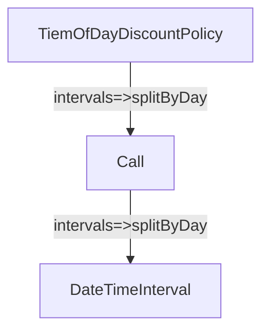

# Chapter 14. 일관성이 있는 협력

- 객체는 협력을 위해 존재한다. 협력은 객체가 존재하는 이유와 문맥을 제공한다.
- 유사한 요구사항을 반복적으로 추가하거나 수정.
  - 객체들의 협력 구조가 서로 다르면 코드 이해도 어렵고, 코드 수정으로 인해 버그가 발생할 위험성도 높아진다.
  - 요구사항을 계속 추가해야 하는 상황에서 각 협력이 서로 다른 패턴을 따를 경우에는 전체적인 설계의 일관성이 서서히 무너지게 된다.
- 객체지향 패러다임의 장점 => 설계 재사용 가능
  - 하지만 재사용은 공짜로 얻어지지 않는다. => 협력 방식을 일관성 있게 만들어야 한다.
  - 일관성은 설계에 드는 비용을 감소시킨다.
  - 특정한 문제를 유사한 방법으로 해결하고 있다는 사실을 알면 문제를 이해하는 것만으로도 코드의 구조를 예상할 수 있게 된다.
  - 유사한 기능을 구현하기 위해 유사한 협력 패턴을 사용하라.

 

## 1. 핸드폰 과금 시스템 변경하기

- 기본 정책을 4가지 방식으로 확장.
  - 고정요금 방식: `FixedFeePolicy`
  - 시간대별 방식: `TimeOfDayDiscountPolicy`
  - 요일별 방식: `DayOfWeekDiscountPolicy`
  - 구간별 방식: `DurationDiscountPolicy`

### 고정요금 방식 구현하기

- 기존의 `RegularPolicy` 이름을 `FixedFeePolicy`로 수정

### 시간대별 방식 구현하기

- `DateTimeInterval` 구현 -> `from`과 `to`를 `interval`이라는 하나의 인스턴스 변수로 묶을 수 있다.
- 작업을 객체의 책임으로 할당. 책임을 할당하는 기본 원칙은 책임을 수행하는 데 필요한 정보를 가장 잘 알고 있는 정보 전문가에게 할당하는 것이다.
1. `통화 기간을 일자 단위로 나누는 작업`의 정보 전문가? 
  - `통화 기간에 대한 정보`를 가장 잘 알고 있는 객체는 `Call`이다. 하지만 기간 자체를 처리하는 방법에 대해서 전문가가 아니다.
  - `기간을 처리하는 방법`에 대한 전문가는 바로 `DateTimeInterval`
2. `시간대별로 분할하는 작업`의 정보 전문가?
  - 시간대별 기준을 잘 알고 있는 요금 정책. `TimeOfDayDiscountPolicy`라는 이름의 클래스로 구현할 것이다.

- `TimeOfDayDiscountPolicy`가 `Call`에게 일자별로 통화 기간을 분리할 것을 요청
- `Call`은 `DateTimeInterval`에게 위임. `DateTimeInterval`은 기간을 일자 단위로 분할한 후 분할된 목록을 반환한다. `Call`은 그걸 그대로 `TimeOfDayDiscountPolicy`에게 전달.
- `TimeOfDayDiscountPolicy`는 일자별 기간의 목록을 대상으로 루프를 돌리면서 각 시간대별 기준에 맞는 시작시간과 종료시간을 획득.

### 요일별 방식 구현하기

- 요일별로 요금 규칙을 다르게 설정.
  - 각 규칙은 요일의 목록, 단위 시간, 단위 요금이라는 세 가지 요소로 구성.
  - 월~금은 10초당 38원, 토~일은 10초당 19원

### 구간별 방식 구현하기

- 지금까지의 구현을 살펴보면 그럭저럭 괜찮은 구현으로 보이지만, 모아놓고 보면 그동안 보이지 않았던 문제점들이 보인다.
- 유사한 문제를 해결하고 있음에도 불구하고 설계에 일관성이 없다.
  - 기본 정책을 구현한다는 공통의 목적을 공유. => 하지만 정책을 구현하는 방식은 완전히 다르다.
  - 개념적으로 연관돼 있지만 구현 방식에 있어서는 완전히 제각각이라는 것이다.
- 비일관성은 두 가지 상황에서 발목을 잡는다.
  1. 새로운 구현을 추가해야 할 때.
  2. 기존의 구현을 이해해야 할 때.
- 개발자로서 우리가 수행하는 대부분의 활동이 코드를 추가하고 이해하는 일과 깊숙히 연관돼 있기 때문.
- 대부분의 사람들은 유사한 요구사항을 구현하는 코드는 유사한 방식으로 구현될 것이라고 예상.
  - 하지만 유사한 요구사항을 다른 방식으로 구현? => 요구사항이 유사하다는 사실 자체도 의심하게 될 것.
  - 심리적 장벽을 만든다.
- 유지보수 가능한 시스템을 구축하는 첫걸음은 협력을 일관성 있게 만드는 것이다.
- 요일별 방식의 경우처럼 규칙을 정의하는 새로운 클래스를 추가하기로 결정.
  - 다른 클래스와는 다르게 FixedFeePolicy를 상속받는다.
  - `DurationDiscountRule` 클래스의 `calculate` 메소드 안에서 부모 클래스의 `calculateFee` 메소드를 호출하는 부분을 눈여겨보기 바란다.
- `DurationDiscountPolicy`는 할인 요금을 정상적으로 계산하고 각 클래스는 하나의 책임만을 수행한다.
  - 하지만 이 설계를 훌륭하다고 말하기는 어려운데 기본 정책을 구현하는 기존 클래스들과 일관성이 없기 때문이다.
  - 기존의 설계가 어떤 가이드도 제공하지 않기 때문에 새로운 기본 정책을 구현해야 하는 상황에서 또 다른 개발자는 또 다른 방식으로 기본 정책을 구현할 가능성이 높다.
  - 시간이 흐를수록 설계의 일관성은 더욱더 어긋나게 될 것이다.

> #### 코드 재사용을 위한 상속은 해롭다.
> - `DurationDiscountRule` 클래스가 상속을 잘못 사용한 경우다.
> - 문제는 부모 클래스인 `FixedFeePolicy`는 상속을 위해 설계된 클래스가 아니고 `DurationDiscountRule`은 `FixedFeePolicy`의 서브타입이 아니라는 점이다.
> - 단지 코드 재사용을 위해 상속을 사용한 것이다. 두 클래스 사이의 강한 결합도는 설계 개선과 새로운 기능의 추가를 방해한다.
> - 안그래도 코드 이해하기가 어려운데, `FixedFeePolicy`의 `calculateFee` 메소드를 재사용하기 위해 `DurationDiscountRule`은 `calculate` 메소드 안에서 `Phone`과 `Call` 인스턴스를 생성하는 것이 꽤나 부자연스러워 보인다.
> - 이것은 상속을 위해 설계된 클래스가 아닌 `FixedFeePolicy`를 재사용하기 위해 억지로 코드를 비튼 결과다.

 

# 참고자료

- 오브젝트, 조영호 지음
