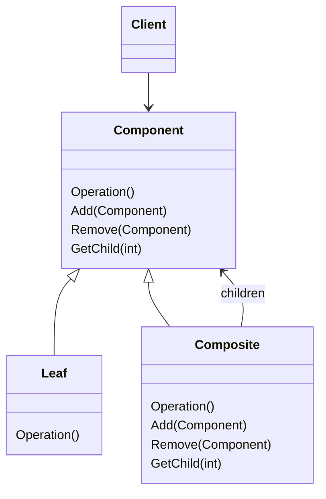
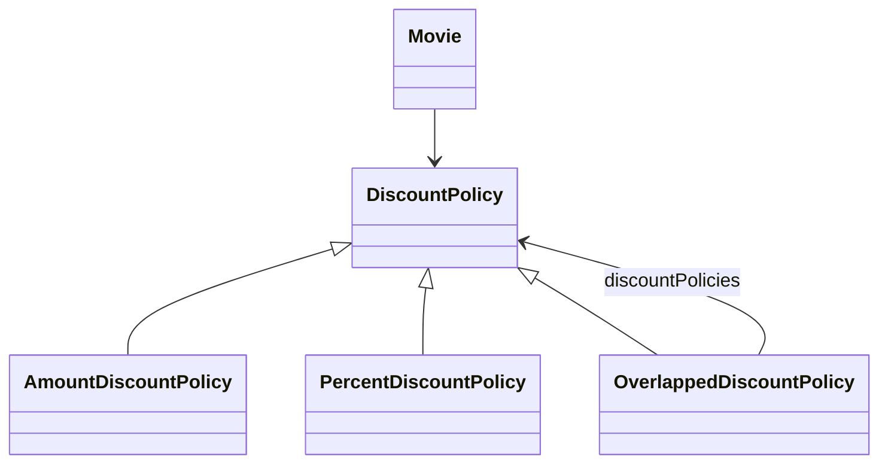
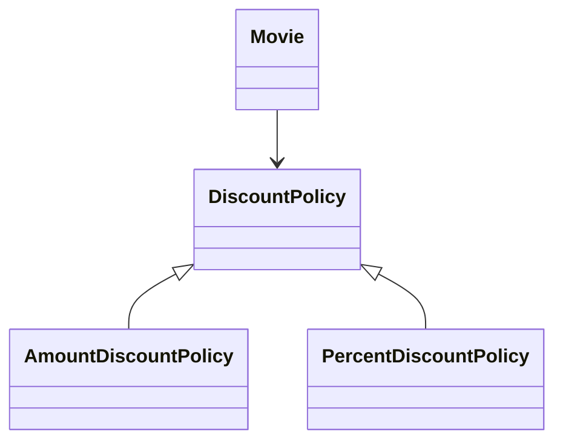
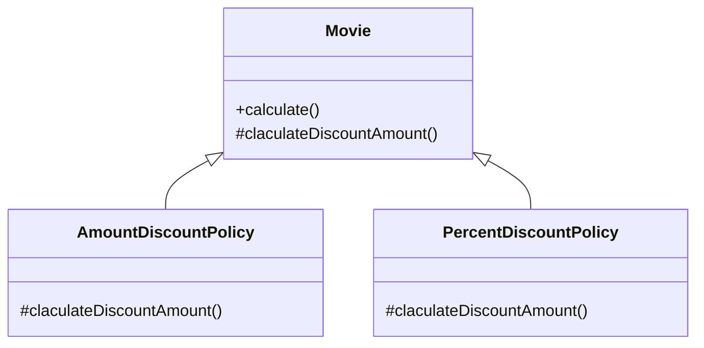
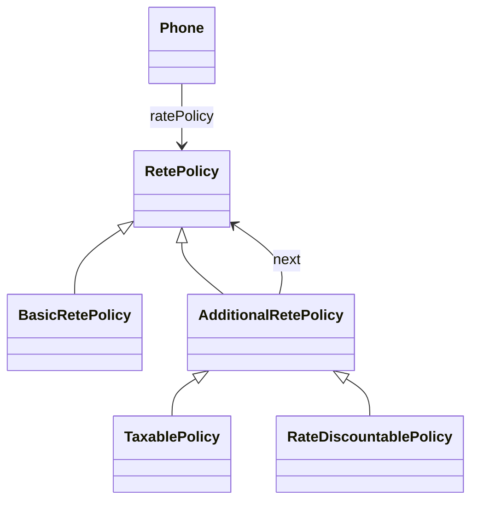

# Chapter 15 디자인 패턴과 프레임 워크

- 요구사항을 해결하기 위해 과거에 경험했던 유사한 해결 방법을 다시 사용하는 경우가 있음.
- 이처럼 소프트웨어 설계에서 반복적으로 발생하는 문제에 대해 반복적으로 적용할 수 있는 해결 방법을 `디자인 패턴`이라고 부른다.
  - 디자인 패턴의 목적 = 설계를 재사용
  - 다양한 변경을 다루기 위해 반복적으로 사용할 수 있는 설계의 묶음.
  - 디자인 패턴을 익혀두면 변경의 방향과 주기를 이해하는 것만으로도 필요한 역할과 책임, 역할들의 협력 방식을 순간적으로 떠올릴 수 있게 된다.
- `프레임워크`는 설계와 코드를 함께 재사용하기 위한 것이다.
  - 프레임워크는 애플리케이션의 아키텍처를 구현 코드의 형태로 제공한다.
  - 다양한 환경에서 테스트를 거친 견고한 구현 코드를 쉽고 빠르게 재사용할 수 있다.
  - 애플리케이션의 요구에 따라 적절하게 커스터마이징할 수 있는 확장 포인트 제공
- 디자인 패턴과 프레임워크 모두 14장에서 일관성 있는 협력과 관련이 있다.
  - 디자인 패턴은 특정한 변경을 일관성 있게 다룰 수 있는 협력 템플릿을 제공한다.
  - 프레임워크는 일관성 있는 협력을 제공하는 확장 가능한 코드라고 할 수 있다.
  - 결국 모두 협력을 일관성 있게 만들기 위한 방법이다.

 

## 1. 디자인 패턴과 설계 재사용

- 패턴이라는 거대한 숲 속에서 길을 잃지 않기 위해서는 패턴의 정의보다는 패턴이라는 용어 자체가 풍기는 미묘한 뉘앙스를 이해하는 것이 중요하다.
- 패턴이란 무엇인가를 논의할 때면 반복적으로 언급되는 몇 가지 핵심적인 특징이 있다.

1. 패턴은 반복적으로 발생하는 문제와 해법의 쌍으로 정의된다.
2. 패턴을 사용함으로써 이미 알려진 문제와 이에 대한 해법을 문서로 정리할 수 있으며, 이 지식을 다른 사람과 의사소통할 수 있다.
3. 패턴은 추상적인 원칙과 실제 코드 작성 사이의 간극을 메워주며 실질적인 코드 작성을 돕는다.
4. 패턴의 요점은 패턴이 실무에서 탄생했다는 점이다.

> #### 마틴 파울러 "Analysis Patterns". 패턴의 정의
> 내가 사용하는 패턴의 정의는 하나의 `실무 컨텍스트 practical context`에서 유용하게 사용해 왔고 다른 실무 컨텍스트에서도 유용할 것이라고 예상되는 아이디어다. 
> 아이디어라는 용어를 사용하는 이유는 어떤 것도 패턴이 될 수 있기 때문이다. 패턴은 'GOF'에서 이야기하는 것처럼 협력하는 객체 그룹일 수도 있고, `코플리엔 Coplien`의 프로젝트 조직 원리일 수도 있다.
> 실무 컨텍스트라는 용어는 패턴이 실제 프로젝트의 실무 경험에서 비롯됐다는 사실을 반영한다. 흔히 패턴을 '발명했다'고 하지 않고 '발견했다'고 말한다.
> 모델의 유용성이 널리 받아들여지는 경우에만 패턴으로 인정할 수 있기 때문에 이 말은 타당하다.
> 실무 프로젝트가 패턴보다 먼저지만 그렇다고 해서 실무 프로젝의 모든 아이디어가 패턴인 것은 아니다: 패턴은 개발자들이 다른 컨텍스트에서도 유용할 것이라고 생각하는 어떤 것이다.

- 패턴은 한 컨텍스트에서 유용한 동시에 다른 컨텍스트에서도 유용한 '아이디어'다.
  - 일반적으로 패턴으로 인정하기 위한 조건으로 '3의 규칙'을 언급한다. 최소 세 가지의 서로 다른 시스템에 특별한 문제 없이 적용할 수 있고 유용한 경우에만 패턴으로 간주할 수 있다.
- 패턴의 가장 큰 가치 = 축적된 실무 지식을 효과적으로 요약하고 전달.
  - 패턴은 경험의 산물.
  - 치열한 실무 현장의 역학관계 속에서 검증되고 입증된 자산.
  - 실무 경험이 적은 초보자라 하더라도 패턴을 익히고 반복적으로 적용하는 과정 속에서 유연하고 품질 높은 소프트웨어를 개발하는 방법을 익힐 수 있다.
- 마틴 파울러가 언급한 것처럼 패턴의 범위가 소프트웨어 개발과 직접적인 연관성을 가진 분석, 설계, 구현 영역만으로 한정되는 것은 아니다.
  - 다양한 크기의 프로젝트 조직을 구성하는 방법
  - 프로젝트 일정을 추정하는 방법
  - 스토리 카드나 백로그를 통해 요구사항을 관리하는 방법
- 패턴은 홀로 존재하지 않는다. 패턴들을 포함하는 더 큰 패턴 내에 통합될 수 있다.
  - 크리스토퍼 알렉산더는 연관된 패턴들의 집합들이 모여 하나의 `패턴 언어 Pattern Language`를 구성한다고 정의하고 있다.
  - 패턴 언어는 연관된 패턴 카테고리뿐만 아니라 패턴의 생성 규칙과 함께 패턴 언어에 속한 다른 패턴과의 관계 및 협력 규칙을 포함한다.
  - 패턴 언어라는 용어가 지닌 제약 조건을 완하하기 위해 `패턴 시스템 Pattern System`이라는 특수한 용어의 사용을 제안. 두 용어는 거의 동일한 의미로 사용되는 중.

### 패턴 분류

- 가장 일반적인 방법. 패턴의 범위나 적용 단계에 따라 아래 4가지로 분류하는 것.
  - `아키텍처 패턴 Architecture Pattern`
  - `분석 패턴 Analysis Pattern`
  - `디자인 패턴 Design Pattern`
  - `이디엄 Idiom`
- 가장 잘 알려진 것은 `디자인 패턴`.
  - 디자인 패턴은 특정 정황 내에서 일반적인 설계 문제를 해결하며, 협력하는 컴포넌트들 사이에서 반복적으로 발생하는 구조를 서술한다.
  - 디자인 패턴은 중간 규모의 패턴으로, 특정한 설계 문제를 해결하는 것을 목적으로 하며, 프로그래밍 언어나 프로그래밍 패러다임에 독립적이다.
- 디자인 패턴 상위에는 소프트웨어의 전체적인 구조르르 결정하기 위해 사용할 수 있는 `아키텍처 패턴`이 위치한다.
  - 미리 정의된 서브시스템들을 제공하고, 각 서브시스템들의 책임을 정의하며, 서브시스템들 사이의 관계를 조직화하는 규칙과 가이드라인을 포함한다.
  - 구체적인 소프트웨어 아키텍처를 위한 템플릿을 제공하면 디자인 패턴과 마찬가지로 프로그래밍 언어나 프로그래밍 패러다임에 독립적이다.
- 디자인 패턴 하위에는 `이디엄`이 위치.
  - 특정 프로그래밍 언어에만 국한된 하위 레벨 패턴.
  - 언어 종속적. 특정 언어의 이디엄이 다른 언어에서는 무용지물이 될 수 있다.
  - C++의 `COUNT POINTER` 이디엄. 자바에서는 비슷한 메커니즘인 가비지 컬렉션이 있기 때문에 유용하지 않다.

### 패턴과 책임-주도 설계

- 올바른 책임을 올바른 객체에게 할당하고 객체 간의 유연한 협력 관계 구축 = 객체지향 프로그래밍의 목표
  - 책임과 협력의 윤곽 => 캡슐화, 크기, 의존성, 유연성, 성능, 확장 가능성, 재사용성 등의 다양한 요소들의 트레이드오프를 통해 결정
  - 대부분의 경우에는 훌륭한 품질의 설계를 얻기 위해 많은 시간과 노력을 들여야만 한다.
  - 어떤 책임이 필요한가? 이 책임을 어떤 객체에게 할당해야 하는가? 유연하고 확장 가능한 협력 관계를 구축하기 위해서는 객체와 객체 간에 어떤 의존성이 존재해야 하는가?
- 패턴은 공통으로 사용할 수 있는 역할, 책임, 협력의 템플릿이다.
- 패턴은 반복적으로 발생하는 문제를 해결하기 위해 사용할 수 있는 공통적인 역할과 책임, 협력의 훌륭한 예제를 제공한다.
  - `STRATAGY PATTERN`은 다양한 알고리즘을 동적으로 교체할 수 있는 역할과 책임의 집합을 제공한다.
  - `BRIDGE PATTERN`은 추상화의 조합으로 인한 클래스의 폭발적인 증가 문제를 해결하기 위해 역할과 책임을 추상화와 구현의 두 개의 커다란 집합으로 분해함으로써 설계를 확장 가능하게 만든다.
  - `OBSERVER PATTERN` 패턴은 유연한 통지 메커니즘을 구축하기 위해 객체 간의 결합도를 낮출 수 있는 역할과 책임의 집합을 제공한다.
- 패턴의 구성 요소는 클래스가 아니라 '역할'이다.
- 아래는 클라이언트가 개별 객체와 복합 객체를 동일하게 취급할 수 있는 `COMPOSITE PATTERN`

- `Component`는 역할이기 때문에 `Component`가 제공하는 오퍼레이션을 구현하는 어떤 객체라도 `Component`의 역할을 수행할 수 있다.
- 패턴을 구성하는 요소가 클래스가 아니라 역할이라는 사실은 패턴 템플릿을 구현할 수 있는 다양한 방법이 존재한다는 사실을 암시한다.
  - 역할은 동일한 오퍼레시연에 대해 응답할 수 있는 책임의 집합을 암시하기 때문에 하나의 객체가 세 가지 역할을 모두 수행하더라도 문제가 없다.
- 반대로 다수의 클래스가 동일한 역할을 구현할 수도 있다. (중복 할인 예제)
  - `OverlappedDiscountPolicy`는 `Composite`의 역할을 수행
  - `AmountDiscountPolicy`와 `PercentDiscountPolicy`는 `Leaf`의 역할을 수행
  - `DiscountPolicy`는 `Component`

- 디자인 패턴의 구성요소가 클래스와 메소드가 아니라 역할과 책임이라는 사실을 이해하는 것이 중요하다.
- 어떤 구현 코드가 어떤 디자인 패턴을 따른다고 이야기할 때는 역할, 책임, 협력의 관점에서 유사성을 공유한다는 것이지 특정한 구현 방식을 강제하는 것은 아니라는 점을 이해하는 것 역시 중요하다.
- 따라서 위의 두 가지 방법 모두 `COMPOSITE` 패턴이다.
  - 기본적인 역할과 책임, 협력 관계를 준수한다.

### 캡슐화와 디자인 패턴

- 디자인 패턴은 협력을 일관성 있고 유연하게 만드는 것을 목적으로 한다.
  - 따라서 각 디자인 패턴은 특정한 변경을 캡슐화하기 위한 독자적인 방법을 정의하고 있다.
- 영화 예매 시스템에서 `Movie`가 `DiscountPolicy` 상속 계층을 합성 관계로 유지해야 하는 다양한 설계 원칙과 이유에 대해 장황하게 설명했지만 사실 이 설계는 `STRATEGY PATTERN`을 적용한 예다.
  - `STRATEGY PATTERN`의 목적은 알고리즘의 변경을 캡슐화하는 것이고 이를 구현하기 위해 객체 합성을 이용한다.
  - `Movie`와 `DiscountPolicy` 사이의 결합도를 낮게 유지. => 런타임에 알고리즘을 변경할 수 있다.

- 물론 변경을 캡슐화하는 방법이 합성만 있는 것은 아니다. 상속을 이용할 수도 있다.
- 변하지 않는 부분을 부모 클래스로, 변하는 부분은 자식 클래스로 분리함으로써 변경을 캡슐화할 수 있다.
- 이처럼 알고리즘을 캡슐화하기 위해 합성 관계가 아닌 상속 관계를 사용하는 것을 `TEMPLATE METHOD PATTERN`이라고 부른다.

- 다만 합성보다는 결합도가 높은 상속을 사용했기 때문에 `STRATEGY PATTERN`처럼 런타임에 객체의 알고리즘을 변경하는 것은 불가능하다.
- 하지만 알고리즘 교체와 같은 요구사항이 없다면 상대적으로 `STRATEGY PATTERN`보다 복잡도를 낮출 수 있다는 면에서 장점이 있다.

- 핸드폰 과금 시스템 설계는 `DECORATOR PATTERN`을 기반으로 한다.
  - `DECORATOR PATTERN`은 객체의 행동을 동적으로 추가할 수 있게 해주는 패턴.
  - 기본적으로 객체의 행동을 결합하기 위해 객체 합성을 사용. 선택적인 행동의 개수와 순서에 대한 변경을 캡슐화할 수 있다.

> #### 객체의 수를 캡슐화하는 `COMPOSITE PATTERN`
> - `COMPOSITE PATTERN`은 개별 객체와 복합 객체라는 객체의 수와 관련된 변경을 캡슐화하는 것이 목적이다.

### 패턴은 출발점이다

- 패턴은 목적지가 아니다.
- 패턴은 단지 목표로 하는 설계에 이를 수 있는 방향을 제시하는 나침반에 불과하다.
- 디자인 패턴이 현재의 요구사항이나 적용 기술, 프레임 워크에 적합하지 않다면 패턴을 그대로 따르지 말고 목적에 맞게 패턴을 수정하라.
- 패턴을 사용하면서 부딪히게 되는 대부분의 문제는 패턴을 맹목적으로 사용할 때 발생한다.
  - 입문자가 빠지기 쉬운 함정은 패턴을 적용하는 컨텍스트의 적절성은 무시한 채 패턴의 구조에만 초점을 맞추는 것이다.
  - "망치를 들면 모든 것이 못으로 보인다." 패턴 만능주의.
- **부적절하게 사용된 패턴은 소프트웨어의 엔트로피를 증가시킨다.**
- 명확한 트레이드오프 없이 패턴을 남용하면 설계가 불필요하게 복잡해지게 된다.
  - 코드 설계를 이해하기 어려움.
  - 설계의 의도를 이해하지 못하게 됨.
  - 패턴을 알지 못하는 사람들은 불필요하게 복합한 설계를 따라가느라 시간을 낭비하게 된다.
- 정당한 이유 없이 사용된 모든 패턴은 설계를 복잡하게 만드는 장애물.
  - 패턴의 복잡성의 가치가 단순성을 넘어설 때만 정당화돼야 한다.
  - 좀 더 단순하고 명확하게 만들 수 있는 방법을 먼저 고민하자.
  - 패턴을 적용할 때는 함께 작업하는 사람들이 패턴에 익숙한지 여부를 확인하고, 그렇지 않다면 설계에 대한 지식과 더불어 패턴에 대한 지식도 함께 공유하는 것이 필요하다.
- 조슈아 케리에브스키는 패턴을 가장 효과적으로 적용하는 방법은 패턴을 지향하거나 패턴을 목표로 리팩토링하는 것이라고 얘기한다.
  - 패턴이 적용된 최종 결과보다는 패턴을 목표로 리팩토링하는 이유를 이해하는 것이 훨씬 가치 있으며, 훌륭한 소프트웨어 설계가 발전해 온 과정을 공부하는 것이 훌륭한 설계 자체를 공부하는 것보다 훨씬 중요하다고 이야기 한다.

 

## 2. 프레임워크와 코드 재사용

### 코드 재사용 대 설계 재사용

- 디자인 패턴은 프로그래밍 언어에 독립적으로 재사용 가능한 설계 아이디어를 제공하는 것을 목적으로 한다.
- 따라서 언어에 종속적인 구현 코드를 정의하지 않기 때문에 디자인 패턴을 적용하기 위해서는 설계 아이디어를 프로그래밍 언어의 특성에 맞춰 가공해야 하고 매번 구현 코드를 재작성해야 한다는 단점이 있다.
- 재사용 관점에서 설계 재사용보다 더 좋은 방법은 코드 재사용이다.
  - 아쉽게도 컴포넌트 기반의 재사용 방법이라는 아이디어 자체는 이상적이지만 실제로 적용하는 과정에서 현실적이지 않다는 사실이 드러났다.
- 로버트 L. 글래스는 컴포넌트 기반의 재사용과 관련된 논쟁의 핵심은 '소프트웨어 다양성'이라고 불리는 주제와 관련이 있다고 생각했다.
  - 여러 프로젝트나 도메인 사이에 비슷한 문제가 충분히 많이 존재한다면 컴포넌트 기반의 접근법이 효과가 있을 수 있겠지만, 애플리케이션과 도메인의 다양성으로 인해 두 가지 문제가 아주 비슷한 경우는 거의 없다고 한다.
  - 따라서 가장 기본이 되는 아주 적은 부분만이 일반화될 수 있을 것이다. 결국 다양한 도메인에 재사용 가능한 컴포넌트라는 개념은 비현실적이라고 할 수 있다.
- 가장 이상적인 형태의 재사용 방법은 설계 재사용과 코드 재사용을 적절한 수준으로 조합하는 것이다.
  - 코드 재사용만을 강조하는 컴포넌트는 실패했다.
  - 추상적인 수준에서의 설계 재사용을 강조하는 디자인 패턴은 재사용을 위해 매번 유사한 코드를 작성해야만 한다.
  - 설계를 재사용하면서도 유사한 코드를 반복적으로 구현하는 문제를 피할 수 있는 방법? => 프레임워크
- `프레임워크`
  - '추상 클래스나 인터페이스를 정의하고 인스턴스 사이의 상호작용을 통해 시스템 전체 혹은 일부를 구현해 놓은 재사용 가능한 설계' => 구조적인 측면에 초점 
  - '애플리케이션 개발자가 현재의 요구사항에 맞게 커스터마이징할 수 있는 애플리케이션의 골격(skeleton)' => 코드의 설계의 재사용에 초점

> 프레임워크는 애플리케이션에 대한 아키텍처를 제공한다. 즉, 프레임워크는 클래스와 객체들의 분할, 전체 구조, 클래스와 객체들 간의 상호작용, 객체와 클래스 조합 방법, 제어 흐름에 대해 미리 정의한다.
> 프레임워크는 설계의 가변성을 미리 정의해 뒀기 때문에 애플리케이션 설계자나 구현자는 애플리케이션에 종속된 부분에 대해서만 설계하면 된다.
> 프레임워크는 애플리케이션 영역에 걸쳐 공통의 클래스들을 정의해서 일반적인 설계 결정을 미리 내려 둔다.
> 비록 프레임워크가 즉시 업무에 투입할 수 있는 구체적인 서브클래스를 포함하고 있기는 하지만 프레임워크는 코드의 재사용보다는 설계 자체의 재사용을 중요시한다.

### 상위 정책과 하위 정책으로 패키지 분리하기

- 프레임워크의 핵심은 추상 클래스나 인터페이스와 같은 추상화라고 할 수 있다.
  - 그렇다면 추상 클래스와 인터페이스가 가지는 어떤 특징이 프레임워크의 재사용성을 향상시키는 것일까?
  - 이 질문의 답은 일관성 있는 협력이라는 주제와 관련이 있다.
- 상위 정책은 상대적으로 변경에 안정적이지만 세부 사항은 자주 변경된다.
  - 만약 변하지 않는 상위 정책이 자주 변하는 세부 사항에 의존한다면 변경에 대한 파급 효과로 인해 상위 정책이 불안정해질 것이다.
- 상위 정책은 세부 사항에 비해 재사용될 가능성이 높다.
  - 상위 정책이 세부 사항에 의존하게 되면 상위 정책에 필요한 모든 경우에 세부 사항도 항상 함께 존재해야 하기 때문에 상위 정책의 재사용성이 낮아진다.
  - 이 문제를 해결할 수 있는 가장 좋은 방법은 의존성 역전 원칙에 맞게 상위 정책과 세부 사항 모두 추상화에 의존하게 만드는 것이다.
- 의존성 역전 원칙의 관점에서 세부 사항은 '변경'을 의미한다.
  - 동일한 역할을 수행하는 객체들 사이의 협력 구조를 다양한 애플리케이션 안에서 재사용하는 것이 핵심이다.
- 이를 위해서는 변하는 것과 변하지 않는 것을 서로 분리해야 한다.
  - 여기서 변하지 않는 것은 상위 정책에 속하는 역할들의 협력 구조다.
  - 변하는 것은 구체적인 세부 사항이다.
  - 변하는 것과 변하지 않는 것들을 서로 다른 주기로 배포할 수 있도록 별도의 '배포 단위'로 분리해야 한다.
- 이를 위한 첫걸음은 변하는 부분과 변하지 않는 부분을 별도의 패키지로 분리하는 것이다.
  - 중요한 것은 패키지 사이의 의존성 방향이다. 의존성 역전 원리에 따라 추상화에만 의존하도록 의존성의 방향을 조정하고 추상화를 경계로 패키지를 분리했기 때문에 세부 사항을 구현한 패키지는 항상 상위 정책을 구현한 패키지에 의존해야 한다.

### 제어 역전의 원리

- 객체지향 설계의 재사용성은 개별 클래스가 아니라 객체들 사이의 공통적인 협력 흐름으로부터 나온다.
  - 의존성 역전 원리라는 강력한 지원군. => 시스템 협력 흐름을 재사용. 변경에 유연하게 대처
- 의존성 역전 원리가 적절하게 지켜지지 않고 있다면 그곳에는 변경을 적절하게 수용할 수 없는 하향식의 절차적인 코드가 존재할 수 밖에 없다.
- 로버트 마틴은 훌륭한 객체지향 설계는 의존성이 역전된 설계라는 점을 강조한다.

> 사실, 좋은 객체지향 설계의 증명이 바로 이와 같은 의존성 역전이다. 프로그램이 어떤 언어로 작성됐는가는 상관없다.
> 프로그램의 의존성이 역전돼 있다면, 이것은 객체지향 설계를 갖는 것이다. 그 의존성이 역전돼 있지 않다면, 절차적 설계를 갖는 것이다.
> 의존성 역전 원칙은 객체지향 기술에서 당연하게 요구되는 많은 이점 뒤에 있는 하위 수준에서의 기본 메커니즘이다.
> 재사용 가능한 프레임워크를 만들기 위해서는 이것의 적절한 응용이 필수적이다. 이 원칙은 또한 변경에 탄력적인 코드를 작성하는 데 있어 결정적으로 중요하다.
> 추상화와 구체적인 사항이 서로 고립돼 있기 때문에 이 코드는 유지보수하기가 훨씬 쉽다.

- 프레임워크를 사용할 경우 개별 애플리케이션에서 프레임워크로 제어 흐름의 주체가 이동한다. 즉, 의존성을 역전시키면 제어 흐름의 주체 역시 역전된다.
  - 이를 `제어 역전 Inversion of Control 원리` 또는 `할리우드 Hollywood 원리`라고 한다.
- 프레임워크에서는 일반적인 해결책만 제공하고 애플리케이션에 따라 달라질 수 있는 특정한 동작인 비워둔다.
  - 그리고 이렇게 완성되지 않은 채로 남겨진 동작을 `훅 hook`이라고 부른다.
  - 훅의 구현 방식은 애플리케이션의 컨텍스트에 따라 달라진다.
  - 여기서 협력을 제어하는 것은 프레임워크라는 것에 주목하자. 프레임워크는 우리가 작성한 코드를 적절한 시점에 실행한다. => 우리의 코드는 수동적 존재가 된다.

> 설계 수준의 재사용은 애플리케이션과 기반이 되는 소프트웨어 간에 제어를 바꾸게 한다.
> 라이브러리를 사용해서 애플리케이션을 작성하면 애플리케이션이 필요한 라이브러리의 코드를 호출한다. 즉, 애플리케이션 자체가 언제 어떤 라이브러리를 사용할 것인지를 스스로 제어한다.
> 그러나 프레임워크를 재사용할 때는 프레임워크가 제공하는 메인 프로그램을 재사용하고 이 메인 프로그램이 호출하는 코드를 애플리케이션 개발자가 작성해야 한다.
> 따라서 언제 자신이 작성한 코드가 호출될 것인지를 스스로 제어할 수 없다. 제어 주체는 자신이 아닌 프레임워크로 넘어간 것이다. 즉, 제어가 역전된 것이다.
> 개발자는 이미 특정 이름과 호출 방식이 결정된 오퍼레이션을 작성해야 하지만 결정해야 하는 설계 개념은 줄어들고 애플리케이션별로 구체적인 오퍼레이션의 구현만 남게 된다.

 

# 참고자료

- 오브젝트, 조영호 지음
