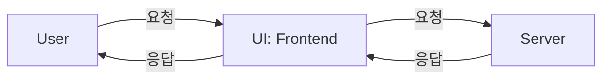

# e2e Test

- e2e test는 종단 간(End-to-end) 테스트로 애플리케이션의 전체 워크플로우를 검증하는 방법이다.
- 사용자 관점에서 실제 환경과 유사한 조건을 설정하고 애플리케이션을 테스트하며, 각각의 구성요소가 잘 섞여 시스템 전체가 올바르게 동작하는지 확인할 때 사용한다.
- 사실 엄밀히 말하자면 아래와 같이 UI를 통해 애플리케이션 전체를 테스트하는 것이 e2e 테스트라고 볼 수 있을 것이다.



- 프론트엔드 개발자나 우리의 API 서비스를 사용하는 사람을 사용자로 정의한다면, 서버 전체를 테스트하는 방식도 e2e 테스트라고 볼 수 있다.


## 외부 서비스를 그대로 사용할 것인가?

- 정식으로 계약을 맺어 제공받는 외부 서비스들은 웬만하면 Dev 서버를 가지고 있고, 개발자들은 이 서버를 유용하게 사용한다.
- e2e test에서도 외부 서비스 그대로 사용할 수도 있을 것이다. 그러면 정말 실제와 같은 테스트를 만들 수도 있을 것이다. 하지만 이 선택으로 인해 문제가 생길 수 있다. 
- 테스트가 갖춰야 할 가장 중요한 특성 중 "일관성"이라는 특징이 있다.하지만 테스트가 외부 서비스에 의존하게 되면 일관성을 유지하지 못하게 된다.
- 만약 테스트 실행 도중 외부 서비스의 Dev 서버에 장애가 발생한다면 어떻게 될까? 당연히 테스트가 실패할 것이다.

## 자동화 vs 도구 기반 테스트

- e2e test를 위해 postman과 같은 툴에 의존할 수도 있지만, 단위테스트 혹은 통합테스트를 만드는 것과 같이 자바를 통해 테스트를 자동화할 수도 있다.

<br/>

# e2e 테스트를 위한 스프링

## @SpringBootTest

- Spring Boot의 통합 테스트를 설정하는 데 사용되는 어노테이션으로 Spring ApplicationContext를 로드하여 실제 애플리케이션과 유사한 환경에서 테스트를 실행할 수 있도록 한다.

- webEnvironment를 활용하여 테스트 시 사용될 포트를 설정할 수 있다.

```java
@SpringBootTest(webEnvironment = SpringBootTest.WebEnvironment.RANDOM_PORT)
```

- 참고로 webEnvironment 프로퍼티의 기본값은 `MOCK`이다.

```java
@Target({ElementType.TYPE})
@Retention(RetentionPolicy.RUNTIME)
@Documented
@Inherited
@BootstrapWith(SpringBootTestContextBootstrapper.class)
@ExtendWith({SpringExtension.class})
public @interface SpringBootTest {
  // ...
  WebEnvironment webEnvironment() default SpringBootTest.WebEnvironment.MOCK;
}
```

- SpringBootTest의 WebEnvironment 종류는 아래와 같다.

```java
public static enum WebEnvironment {
  MOCK(false),
  RANDOM_PORT(true),
  DEFINED_PORT(true),
  NONE(false);
}
```

| 이름           | 설명                                                                                                                                                                                               |
|:-------------|--------------------------------------------------------------------------------------------------------------------------------------------------------------------------------------------------|
| `MOCK`         | `MockServletContext`를 생성하며, 실제 내장 웹 서버를 실행하지 않는 옵션이다.<br/>HTTP 요청 및 응답을 모킹하여 테스트를 수행해야 한다.<br/>따라서 MockMvc를 사용해서 테스트를 진행해야 한다.                                                                   |
| `RANDOM_PORT`  | 내장 웹 서버를 실행하고, 테스트 시 임의의 포트를 할당한다.<br/>`@LocalServerPort` 또는 `@Value("${local.server.port}")`를 사용해 할당된 포트를 확인할 수 있다.<br/>실제 네트워크 통신을 기반으로 API 테스트를 수행할 수 있고, `TestRestTemplate`과 같은 도구와 함께 사용된다. |
| `DEFINED_PORT` | 내장 웹 서버를 실행하고, 테스트 시 application.properties나 application.yaml에 선언된 포트를 사용한다. <br/>정해진 포트에서 사용하고 싶을 때 사용한다. 하지만 포트 충돌 가능성이 있다는 점을 유의해야 한다.                                                        |
| `NONE`         | 내장 웹 서버를 실행하지 않는다. `MockServletContext` 또한 생성하지 않는다. 따라서 웹 컨텍스트가 필요 없는 애플리케이션 일부 계층을 테스트하는 데 사용된다. (Service와 Repository 계층)                                                                      |

- 가장 실제 같은 서비스를 만들기 위해 사용해야 할 옵션은 `RANDOM_PORT`, `DEFINED_PORT`로 보인다.
  - `DEFINED_PORT`는 포트 충돌의 가능성이 있으므로 가장 적합해보이는 방식은 `RANDOM_PORT`이다.

## TestRestTemplate

# e2e 테스트를 위한 라이브러리

## TestContainers

- 더욱 실제와 같은 테스트를 만들기 위해 TestContainers 라이브러리를 사용할 수 있다.

