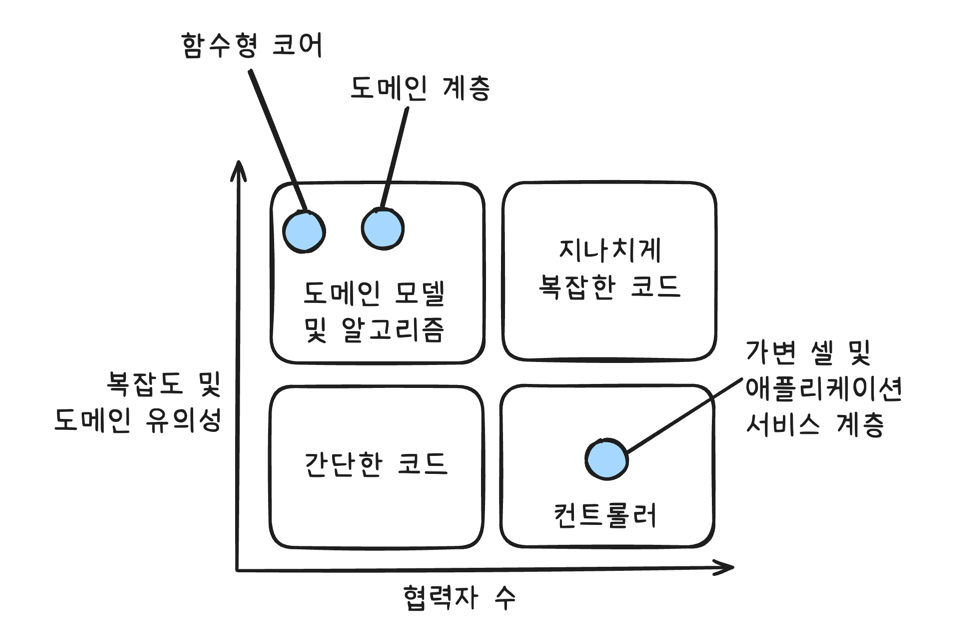

# Unit Testing, 블라디미르 코리코프

## 1. 단위 테스트의 목표

### 커버리지 지표

#### 커버리지 지표의 문제점

- 테스트 대상 시스템의 모든 결과를 검증한다고 보장할 수 없다.
- 외부 라이브러리의 코드 경로를 고려할 수 있는 커버리지 지표는 없다.

#### 특정 커버리지 숫자를 목표로 둔다는 것

- 커버리지 지표를 보는 가장 좋은 방법은 지표 그 자체로 보는 것이며, 목표로 여겨서는 안 된다.

> |팁| 시스템의 핵심 부분은 커버리지를 높게 두는 것이 좋다. 하지만 이 높은 수준을 요구사항으로 삼는 것은 좋지 않다.

### 무엇이 성공적인 테스트 스위트를 만들까?

- 성공적인 테스트 스위트의 특성
1. 개발 주기에 통합돼 있다.
2. 코드베이스에서 가장 중요한 부분만을 대상으로 한다.
3. 최소한의 유지비로 최대의 가치를 끌어낸다.

----

## 2. 단위 테스트란?

### 고전파와 런던파

#### 런던파 (or Mockist)

- `입자성 granularity`이 좋다. 테스트가 세밀해서 한 번에 한 클래스만 확인한다.
- 클래스 그래프가 커져도 테스트하기 쉽다.
- 테스트가 실패하면 어떤 기능이 실패했는지 확실히 알 수 있다.
- 하지만 Mock은 `취약성 fragility`이 있다. 
  - 객체의 행동이 바뀌면, 해당 객체의 행동에 대한 모든 Mock을 수정해줘야 한다. 
- 하향식 TDD
- 테스트가 구현에 더 자주 결합되는 편이다. (SUT의 구현 세부와 결합)

#### 고전파 (Classicist)

- 실제 객체를 사용하기 때문에 입자성이 부족할 순 있지만, 객체 간 상호작용을 현실에 가깝게 테스트할 수 있다.
- 큰 클래스 그래프를 테스트하기 어렵다.
- 테스트에서 버그가 발생했을 때, 어떤 부분에서 발생했는지 찾기 어렵다.
- 하지만 Mock보다 견고하다. 객체의 행동이 바뀌어도, 고전파 테스트는 실제 객체를 사용하기 때문에 테스트가 쉽게 깨지지 않는다.
- 상향식 TDD

---

## 3. 단위 테스트 구조

### 단위 테스트를 구성하는 방법

- AAA 패턴(`Arrange`, `Action`, `Assert`)
  - `Given-When-Then` 패턴과 유사하다.
- 여러 개의 준비, 실행, 결과를 만들지 말라. **하나의 테스트에는 하나의 실행과 결과만 검증하라.**
- 테스트 내의 `if`문은 피하자.
- 구절의 크기
  - 준비 구절 크다면, 같은 테스트 클래스 내에 비공개 메소드 혹은 팩토리 클래스를 통해 주빈 과정을 도출해내라. (`오브젝트 마더 Object Mother`, `테슽 데이터 빌더 Test Data Builder`)
  - 실행 구절이 한 줄 이상인 경우를 경계하라. => API에 문제가 있을 가능성이 크므로 설계를 다시 고려해보자.
  - 단일 동작 단위가 여러 결과를 낼 수 있으며, 하나의 테스트로 그 모든 결과를 평가하는 것이 좋다. 하지만 검증 구절이 너무 커지는 것은 경계하자. => 코드에서 추상화가 누락됐을 수 있다.
  - 모든 속성을 검증하는 대신 객체 클래스 내에 적절한 동등 멤버를 정의하는 것이 좋다. => 단일 검증문으로 기대값 비교 가능
- `sut` 명명을 통해 테스트 대상 시스템을 구별해도 좋다.

### 픽스처 재사용은 언제 해야 하는가?

- 테스트에서 언제 어떻게 재사용하는지 아는 것이 중요하다. => 특히 준비 구절 => 테스트 픽스처 사용

> #### 테스트 픽스처의 의미
> 1. 테스트 실행 대상 객체 (SUT)
> 2. NUnit에서 `[TestFixture]`는 테스트가 포함된 클래스를 표시하는 특성 

- 테스트 픽스처를 분별 없이 사용(픽스처 재사용 시, 생성자 사용)하면 아래와 같은 문제가 발생할 수 있다.
1. 테스트 간 결합도가 높아진다.
2. 테스트 가독성이 떨어진다.

- 테스트 클래스에 `비공개 팩토리 메소드 private factory method`를 두는 것이 더 나은 재사용법이다.

### 명명법 관습 (안티 패턴)

- 가장 유명한 관습: `[테스트 대상 메소드]_[시나리오]_[예상 결과]`
  - 동작 대신 세부 구현에 집중하게끔 부추기기 때문에 전혀 도움이 되지 않는다.
- 간단한 문구로 고객이나 도메인 전문가에게 의미 있는 방식으로 시스템 동작을 설명할 수 있게 하자.

#### 명명 지침

1. 엄격한 명명 정책을 따르지 않는다. 표현의 자유를 허용하라.
2. 문제 도메인에 익숙한 비개발자들에게 시나리오를 설명하는 것처럼 테스트 이름을 짓자. 도메인 전문가나 비즈니스 분석가가 좋은 예이다.
3. 단어를 `underscore(_)` 표시로 구분한다. 테스트 클래스의 이름을 지을 때는 밑줄 표시를 사용하지 않는다.

> #### `Describe-Context-It`
> - 코드의 행동을 설명하는 테스트 코드를 작성하도록 도와주는 패턴
> - `Describe`: 설명해야 할 테스트의 대상을 명시
> - `Context`: 테스트를 위한 특정한 상황이나 조건을 설명
> - `It`: 실제 테스트를 수행하는 부분으로, 특정한 상황에서 기대하는 결과를 검증. 즉 테스트 대상의 행위를 설명

----

## 4. 좋은 단위 테스트

### 4대 요소

1) 회귀 방지
2) 리팩터링 내성
3) 빠른 피드백
4) 유지 보수성

### 회귀 방지

- 코드를 수정한 후 기능이 의도한 대로 작동하지 않으면 이를 테스트가 알려줄 수 있어야 한다.
- 회귀 방지 지표에 대한 테스트 점수 평가
  - 테스트 중에 실행되는 코드의 양
  - 코드 복잡도
  - 코드의 도메인 유의성

> |팁| 회귀 방지 지표를 극대화하려면 테스트가 가능한 한 많은 코드를 실행하는 것을 목표로 해야 한다.

### 리팩터링 내성

- 테스트를 실패시키지 않고, 애플리케이션 코드를 리팩터링할 수 있어야 한다.
- 코드를 수정하고 아무것도 고장나지 않았는데, 테스트가 실패한다면 해당 케이스를 `거짓 양성 false positive`라고 한다. (허위 경보)

- 단위 테스트의 목표는 프로젝트 성장을 지속 가능하게 하는 것이다.
  - 메커니즘: 회귀 없이 주기적으로 리팩터링하고 새로운 기능을 추가.
  - 하지만 타당한 이유 없이 실패하면 코드 문제에 대응하는 능력과 의지가 희석된다. => 양치기 소년 => 운영 환경에 영향을 줄 수도.
  - 빈번한 거짓 양성 => 리팩터링 감소. 회귀를 피하려고 코드 변경을 최소화하기 때문이다.

#### 거짓 양성은 언제 발생하는가?

- SUT의 세부 구현 사항에 많이 결합할수록 허위 경보가 더 많이 생긴다.
- 거짓 양성을 줄일 방법은 해당 세부 구현에서 테스트를 분리하는 것뿐이다. => 사용자에게 의미 있는 결과만 확인해야 한다.

### 거짓 양성과 거짓 음성

- `거짓 양성`: 기능이 고장나지 않았는데 테스트가 실패하는 것. => 리팩터링에 영향을 준다.
- `거짓 음성`: 기능이 고장났는데, 테스트가 실패하지 않는 것. (알려지지 않은 버그) => 회귀 방지에 영향을 준다.

### 가치 있는 테스트. 이상적인 테스트.

- 위 4가지 범주 모두에서 점수를 내야 좋은 테스트라고 할 수 있다.
- 하지만 `회귀 방지`, `리팩터링 내성`, `빠른 피드백`은 상호 배타적이라 모두를 최대로 하는 것이 불가능하다.

#### `회귀 방지`, `리팩터링 내성`, `빠른 피드백`의 상호 배타성

- `e2e`는 `빠른 피드백`을 희생한다.
- 간단한 테스트는 `회귀 방지`를 희생한다.
- 깨지기 쉬운 테스트는 `리팩터링 내성`을 희생한다.

#### 결론

- **리팩터링 내성을 포기할 순 없다.**
  - 리팩터링 내성은 다른 특성과 다르게 이분법적으로 선택. 내성이 있느냐, 없느냐 이 두 가지로 갈림. => 포기한다면 완전히 포기하는 수밖에 없다. 
  - 반면 다른 특성은 일정 선에서 타협이 가능하다.
- 따라서, 테스트 스위트를 탄탄하게 만들려면 리팩터링 내성에 영향을 주는 `거짓 양성`을 제거하는 것이 최우선 과제다.

### 블랙박스 테스트와 화이트 박스 테스트

- `black-box testing`: 시스템의 내부 구조를 몰라도 시스템의 기능을 검사할 수 있는 소프트웨어 테스트 방법. 명세와 행동 중점.
  - 회귀 방지는 나쁘나, 리팩터링 내성이 있다.
- `white-box testing`: 애플리케이션의 내부 작업을 검증하는 테스트. 명세가 아닌 소스 코드에서 파생.
  - 리팩터링 내성이 좋지 않고, 회귀 방지에 좋다.
- 리팩터링 내성을 타협할 수 없는 것이므로, 블랙 박스 방식을 선택하는 것이 더 낫다.
  - 다만, 테스트를 분석할 때는 화이트 박스 방법을 사용할 수 있다.

---

## 5. 목과 테스트 취약성

- 목은 훌륭한 도구이며, 대부분의 테스트에 적용해야 한다. vs 목은 테스트 취약성을 초래한다.
- 런던파는 모든 의존성을 테스트 대역을 사용해 격리하자고 주장
- 고전파는 단위 테스트를 분리해 병렬로 실행할 수 있게 하자고 주장 (Mock은 병렬 테스트가 불가능하다. 병렬로 실행되는 과정에서 오염되기 때문이다.)

### 목과 스텁

- 큰 분류에 따르면
  - Mock: `Mock`, `Spy` => 외부로 나가는 상호 작용을 모방하고 검사.
  - Stub: `Stub`, `Dummy`, `Fake` => 내부로 들어오는 상호 작용을 모방하는 데 도움.
- 스텁으로 상호 작용을 검증하지 말라. (상호 작용을 검증하려면 Mock을 사용하라)
  - 최종 결과가 아닌 사항을 검증하는 관행을 `과잉 명세 overspecification`라고 부른다. 특히 상호 작용을 검사할 때 가장 흔하게 발생한다.
- CQS(Command Query Separation) 원칙과의 관련 (그렇다고 항상 원칙을 따르는 것은 아님)
  - 명령: 부작용 초래, 반환 값 없음 => `Mock`
  - 조회: 부작용 없음, 값 반환 => `Stub`

### 테스트 취약성과 리팩터링 내성

- Mock은 테스트 취약성을 유발 => 리팩터링 내성에 영향을 준다.
- 테스트에 거짓 양성이 있는 주요 원인은 코드의 세부 구현과 결합되어 있기 때문이다.
- 테스트에서 강결합을 피하는 방법
1. 코드가 생성하는 최종 결과를 검증.
2. 세부 구현과 테스트를 가능한 한 멀리 떨어뜨려 놓기. (세부 구현을 `private`으로 선언함으로써 가능) 

### 식별할 수 있는 행동

- 코드가 시스템의 식별할 수 있는 동작이려면 다음 중 하나여야 한다.
1. 클라이언트가 목표를 달성하는 데 도움이 되는 `연산 operation`을 노출하라. 연산은 계산을 수행하거나 부작용을 초래하거나 둘 다 하는 메소드다.
2. 클라이언트가 목표를 달성하는 데 도움이 되는 `상태 state`를 노출하라. 상태는 시스템의 현재 상태다.

- 세부 구현은 이 두 가지 중 아무것도 하지 않는다.
- 식별할 수 있는 동작인지 여부는 해당 클라이언트가 누구인지, 그리고 해당 클라이언트의 목표가 무엇인지에 달려 있다.
- 클라이언트라는 단어는 코드가 있는 위치에 따라 다른 것을 의미할 수 있다.
  - ex) 동일한 코드베이스, 외부 애플리케이션, 또는 사용자 인터페이스 등의 클라이언트 코드

### 잘 설계된 API와 캡슐화

- 캡슐화는 불변성 위반이라는 모순을 방지하는 조치다.
  - 여기서 불변성은 항상 참이어야 하는 조건이다.
- 복잡도를 줄이기 위해 캡슐화가 중요하다.

> #### 묻지 말고 말해라 tell-don't-ask
> - 마틴 파울러가 고안한 원칙
> - 데이터를 연산 기능과 결합하는 것을 의미한다. 캡슐화 실천의 귀결.

- 구현 세부 사항을 비공개로 하면 테스트가 식별할 수 있는 동작을 검증하는 것 외에는 다른 선택지가 없으며, 이로 인해 리팩터링 내성도 자동으로 좋아진다.

> |팁| API를 잘 설계하면 단위 테스트도 자동으로 좋아진다.

- 연산과 상태를 최소한으로 노출해야 한다. 클라이언트가 목표를 달성하는 데 직접적으로 도움이 되는 코드만 공개해야 하며, 다른 모든 것은 구현 세부 사항이므로 비공개 API 뒤에 숨겨야 한다.

### 애플리케이션 아키텍처

- 각 계층의 API를 잘 설계하면 테스트도 프랙탈 구조를 갖는다. 달성하는 목표는 같지만 서로 다른 수준에서 동작을 검증한다.
- 식별할 수 있는 동작은 바깥 계층에서 안쪽으로 흐른다.
  - 외부 클라이언트에게 중요한 목표는 개별 도메인 클래스에서 달성한 하위 목표로 변환된다. 코드 조각이 식별할 수 있는 동작이 되려면 클라이언트가 목표를 달성하도록 도울 필요가 있다.
  - 도메인 입장에서는 애플리케이션 서비스가 클라이언트에 해당한다.
  - 애플리케이션 서비스는 외부 클라이언트가 클라이언트에 해당한다.
- 각 계층의 테스트
  - 애플리케이션 서비스 테스트 => 비즈니스 유스케이스 실행 확인
  - 도메인 클래스 테스트 => 중간의 하위 목표를 검증

### 시스템 내부 통신과 시스템 간 통신

- `시스템 내부 inter-system`: 애플리케이션 내 클래스 간 통신
- `시스템 간 intra-system`: 애플리케이션이 다른 애플리케이션과 통신

> |참고| 시스템 내부 통신은 구현 세부 사항이고, 시스템 간 통신은 그렇지 않다.

- 연산을 수행하기 위한 도메인 클래스 간의 협력은 식별할 수 있는 동작이 아니므로 시스템 내부 통신은 구현 세부 사항에 해당한다. 이러한 통신은 클라이언트 목표와 직접적인 관계가 없다.

> #### 성장의 주요 원칙: 하위 호환성을 지킨다.

- 외부 애플리케이션과 통신할 때 사용하는 통신 패턴은 항상 외부 애플리케이션이 이해할 수 있도록 유지해야 한다.
- 목을 사용하면 시스템과 외부 애플리케이션 간의 통신 패턴을 확인할 때 좋다.
- 반면 내부 통신에 목을 사용하면 테스트가 구현 세부 사항과 결합되어 리팩터링 내성 지표가 미흡해진다.

### 목과 테스트 취약성 간의 관계

- 그런데 런던파는 불변 의존성을 제외한 모든 의존성에 목 사용을 권장한다.
  - 구현 세부 사항과 테스트가 결합될 가능성이 높아진다는 얘기다. => 리팩터링 내성 없어지게 된다.

### 모든 프로세스 외부 의존성을 목으로 해야 하는 것은 아니다

- 의존성 유형
1. 공유 의존성: 테스트 간에 공유하는 의존성 (제품 코드 X)
2. 프로세스 외부 의존성: 프로그램의 실행 프로세스 외에 다른 프로세스를 점유하는 의존성. ex) 데이터베이스, 메시지 버스, SMTP 서비스 등
3. 비공개 의존성: 공유하지 않는 모든 의존성

- 고전파에서는 공유 의존성을 피할 것을 권고한다. 테스트가 실행 컨텍스트를 서로 방해하고, 결국 병렬 처리를 할 수 없기 때문이다.
  - 프로세스 내부에 공유 의존성이 있으면 새 인스턴스를 써서 재사용을 피하기 쉽지만, 프로세스 외부에 있으면 테스트가 더 복잡해진다.
  - 테스트를 실행할 때마다 DB 인스턴스나 메시지 버스를 새로 준비하면 테스트 스위트가 굉장히 느려진다. 이럴 때 목이나 스텁으로 교체한다.
- 그러나 모든 외부 의존성을 목으로 해야 하는 것은 아니다.
  - 프로세스 외부 의존성이 애플리케이션을 통해서만 접근할 수 있으면, 이러한 의존성과의 통신은 시스템에서 식별할 수 있는 동작이 아니다.
  - 관찰할 수 없는 외부 의존성은 애플리케이션의 일부로 동작하므로 구현 세부 사항으로 본다. ex) 데이터베이스
  - Mock을 사용하면 깨지기 쉬운 테스트가 되어 버리지만, 그렇다고 실제 인스턴스를 사용하자니 피드백 속도가 느려진다.


---

## 6. 단위 테스트 스타일

1. `출력 기반 테스트 output-based testing`: `함수형 functional`이라고도 한다.
2. `상태 기반 테스트 state-based testing`
3. `통신 기반 테스트 communication-based testing`: Mock을 활용해 상호 작용을 검증한다.

> #### 스타일과 단위 테스트 분파
> - 두 분파 모두 출력 기반 테스트를 기반에 둔다. 아래와 같은 차이점이 있다.
> - 고전파: 상태 기반 스타일 선호
> - 런던파: 통신 기반 스타일 선호

### 테스트 스타일과 테스트 주요 지표와의 관계

- `빠른 피드백`: 테스트 속도와 스타일은 상관관계가 거의 없다. 테스트 케이스가 수만 개라면 Mock이 런타임에 지연 시간이 생기는 편이라 통신 기반 테스트가 약간 나쁠 수도 있다.
- `리팩터링 내성`: 거짓 양성의 수가 적은 것이 우수. 출력 > 상태 > 통신
- `유지 보수성`: 테스트 스타일과 밀접한 관계. 출력 > 상태(많은 상태를 확인해야 함) > 통신(테스트 대역과 상호 작용 검증 설정 문제)

### 함수형 아키텍처

- 암묵적 입출력을 사용하지 않는 순수함수 사용.
- 물론 어떤 부작용도 일으키지 않는 애플리케이션을 만들 수는 없다. 함수형의 목적은 비즈니스 로직을 처리하는 코드와 부작용을 발생시키는 코드를 분리하는 것이다.

> #### 정의
> - 부작용을 다루는 코드를 최소화하면서 순수 함수(불변) 방식으로 작성한 코드의 양을 극대화한다.
> - `불변 immutable`이란 변하지 않는 것을 의미한다. 일단 객체를 생성하면 그 상태는 바꿀 수 없다.

### 숨은 입출력의 문제

- 숨은 입출력은 코드를 테스트하기 어렵게 만든다. 가독성도 떨어진다.
- 유형
1. `부작용`: 메소드 시그니처에 표시되지 않은 출력. ex) 도메인 인스턴스를 변경했을 때, 디스크의 파일을 업데이트
2. `예외`: 메서드가 예외를 던지면, 프로그램 흐름에 메서드 시그니처에 설정된 계약을 우회하는 경로를 만든다. => 메서드 시그니처가 전달하지 않는 출력을 추가.
3. `내외부 상태에 대한 참조`: `LocalDateTime.now()`와 같은 정적 속성

### 함수형 코어와 가변 셸

- `함수형 코어 functional core`: 결정을 내리는 코드. 비즈니스 로직.
- `가변 셸 mutable shell`: 해당 결정에 따라 작용하는 코드

> #### 캡슐화와 불변성
> 객체지향 프로그래밍은 작동 부분을 캡슐화해 코드를 이해할 수 있게 한다. 
> 함수형 프로그래밍은 작동 부분을 최소화해 코드를 이해할 수 있게 한다.
> - 마이클 페더스(Michael Feathers)

### 함수형 아키텍처의 단점

- 성능 저하와 관심사 분리 희생 사이에 트레이드 오프 고민을 해야할 상황이 온다.
- `읽고-결정하고-실행하기 read-decide-act` 방식을 따르면 유지 보수성이 좋아지지만, 성능은 저하된다.
- 코드베이스의 크기가 증가할 수 있다.
  - 순수성에 많은 비용이 든다면 순수성을 따르지 말라고 조언

---

## 7. 가치 있는 단위 테스트를 위한 리팩터링

- 최소한의 유지비로 최대의 가치를 끌어내려면 다음을 할 수 있어야 한다.
1. 가치 있는 테스트(더 나아가, 별로 가치 없는 테스트) 식별하기
2. 가치 있는 테스트 작성하기

### 리팩터링할 코드 식별하기

- `복잡도 또는 도메인 유의성`과 `협력자 수`를 기준으로 코드를 4가지 유형으로 설명할 수 있다.



- `도메인 유의성 domain significance`은 프로젝트의 문제 도메인에 대해 얼마나 의미있는지를 나타낸다.
  - 복잡한 코드와 도메인 유의성을 가진 코드에서 단위 테스트를 하는 것이 가장 이롭다.
- 반면 협력자 수가 많을수록 테스트 비용이 증가한다.

> |팁| 코드가 더 중요해지거나 복잡해질수록 협력자는 더 적어야 한다.

> |참고| 좋지 않은 테스트를 작성할바에 테스트를 전혀 작성하지 않는 것이 낫다.

### 험블 객체 패턴

- 험블 객체 패턴을 사용하여 지나치게 복잡한 코드를 분할할 수 있다.
- `험블 래퍼 humble wrapper`를 활용해 `테스트하기 어려운 의존성`과 `로직`을 분리한다.
  - 단일 책임 원칙을 지키는 것.

### 리팩터링 하기

- 사분면을 기준으로 `지나치게 복잡한 코드`가 있다면 아래와 같이 분리하자.
  - 협력자 수를 많이 가진 `컨트롤러`인 `가변 셀`이나 `서비스 계층`을 만들어 객체 간 상호 작용만 제어
  - `도메인 복잡성`은 `함수형 코어`나 `도메인 계층`을 통해 처리. 이때 협력자의 수를 최소한으로 가져간다.
- 단계별 접근
1. 암시적 의존성을 명시적으로 만든다. ex) 데이터베이스나 메시지 버스에 대한 인터페이스 정의
2. 애플리케이션 서비스 계층 도입
3. 서비스 계층의 복잡도 낮추기
4. 새로운 도메인 객체가 필요하다면 만들어서 도메인 복잡성 이관하기

### 전제 조건을 테스트 해야 하는가?

- 전제 조건에 대한 테스트가 테스트 스위트에 있을 만큼 충분히 가치가 있을까?
- 일반적으로 권장하는 지침은 도메인 유의성이 있는 모든 전제 조건을 테스트하라는 것이다. ex) 직원 수가 음수가 되면 안 된다는 요구사항
- 그러나 도메인 유의성이 없는 전제 조건을 테스트하는 데 시간을 들이지 마라. ex) 비즈니스 로직과 연관 없는 안전 장치

### 컨트롤러에서 조건부 로직 처리

- 비즈니스 로직과 오케스트레이션의 분리는 다음과 같이 비즈니스 연산이 세 단계로 있을 때 가장 효과적이다. (읽고-결정하고-실행하기 구조)
1. 저장소에서 데이터 검색
2. 비즈니스 로직 실행
3. 데이터를 다시 저장소에 저장

- 문제는 세 가지 특성의 균형을 맞추는 것이다.
  - `도메인 모델 테스트 유의성`, `컨트롤러 단순성`, `성능`
1. 외부에 대한 모든 읽기와 쓰기를 비즈니스 연산 가장자리로 밀어내기: `성능`을 희생 => 대부분은 성능을 굉장히 중요시하므로 고려 X
2. 도메인 모델에 프로세스 외부 의존성을 주입하기: `도메인 모델 테스트 유의성`을 희생 => 유지 보수가 훨씬 어려워져 피하는 것이 좋다.
3. 의사 결정 프로세스 단계를 더 세분화하기: `컨트롤러 단순성`을 희생

- 결국 세 번째 방법을 사용해야 하는데, 이 문제를 완화할 수 있는 방법이 있다.
  - 컨트롤러를 제외한 모든 복잡도를 고려할 수는 없지만, 그 복잡도를 관리할 수는 있다.

### CanExecute/Execute 패턴 사용

- 컨트롤러 복잡도를 완화하는 첫 번째 방법
- 비즈니스 로직이 도메인 모델에서 컨트롤러로 유출되는 것을 방지하는 방법이다. ex) `changeEmail` 메소드
- `CanExecute/Execute 패턴`에 알아보기 전에 의사 결정을 도메인에서 했을 때, 컨트롤러에서 했을 때에 대한 문제를 알아보자.

#### 도메인에서 의사 결정 진행

- `change~` 메소드에서 의사 결정을 진행하고, 결과값만 반환
- 이 메소드의 출력에 따라 컨트롤러는 오류를 반환하거나 필요한 모든 부작용을 낼 수 있다.
  - 컨트롤러가 의사 결정을 하지 않지만, 성능 저하를 감수해야 한다.

#### 컨트롤러에서 의사 결정 진행

- `is~` 메소드를 통해 변경 진행 여부를 결정한다.
- `change~` 메소드는 변경 시 해야 할 일만 정의한다.
- 이 방법은 파편화로 인해 비즈니스 로직과 오케스트레이션 간의 분리가 방해되고 지나치게 복잡한 위험 영역에 가까워진다는 단점이 있다.

#### 패턴 적용

- `canChange~` 메소드를 정의해 `change~` 메소드의 전제 조건으로 두는 방식이다.

```java
public class User {
  public String canChangeEmail() {
    // ...
  }
  
  public void changeEmail(String email) {
    if (canChangeEmail() == null) {
      throw IllegalStateException();
    }
    // 비즈니스 로직 ...
  }
}
```

- 이점
1. 컨트롤러가 이메일 변경 프로세스를 알 필요가 없다. 유효성 검사가 모두 캡슐화되어 있다.
2. 전제 조건(`canChange~`)에 로직이 추가되도 캡슐화 덕분에 `change~` 메소드에서 변경할 수 없도록 보장할 수 있다. 

#### 도메인 이벤트를 사용해 도메인 모델 변경 사항 추적

- 비즈니스 연산을 완료한 후, 해당 변경 사항을 프로세스 외부 의존성 호출로 변화되도록 만들 수 있다.
- `도메인 이벤트 domain event`로 이러한 추적을 구현할 수 있다.

> |정의| 도메인 이벤트는 애플리케이션 내에서 도메인 전문가에게 중요한 이벤트를 말한다. 도메인 이벤트는 종종 시스템에서 발생하는 중요한 변경 사항을 외부 애플리케이션에 알리는 데 사용된다.

> |참고| 도메인 이벤트는 이미 일어난 일들을 나타내기 때문에 항상 과거 시제로 명명해야 한다. 도메인 이벤트는 값이다. 불변이며, 서로 바꿔서 쓸 수 있다.

#### 결론

> 추상화할 것을 테스트하기보다 추상화를 테스트하는 것이 더 쉽다.

- 도메인 이벤트와 `CanExecute/Execute` 패턴을 사용해 도메인 모델에 모든 의사 결정을 잘 담을 수 있지만, 항상 그렇게 할 수는 없다.
  - 비즈니스 로직 파편화가 불가피한 상황들이 있다.
  - 그러나 잠재적인 파편화가 있더라도 비즈니스 로직을 오케스트레이션에서 분리하는 것은 많은 가치가 있다. => 단위 테스트 프로세스가 크게 간소화되기 때문이다.
