# 입문

### 데이터 분석과정

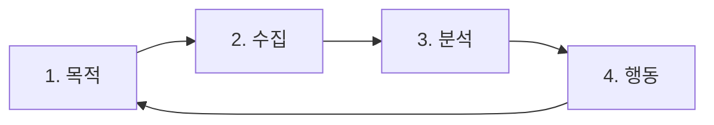

### 구글 애널리틱스를 통한 진입 장벽 낮추기

- 자동/직접 수집 데이터 확인하기
- 머신러닝으로 유용한 정보 파악하기
- 예측 분석 활용하기

---

##  보고서

목적에 따라 보고서를 확인할 수 있다.

- `보고서 개요`: 전반 현황
- `실시간 개요`: 실시간 현황
- `사용자`
  - `인구통계`: 사용자의 관심 분야, 연령
  - `기술`: 사용자의 운영체제, 기기 등을 파악
- `수명주기`
  - `획득`: 사용자 유입
  - `참여도`: 사용자의 행동 파악
  - `수익 창출`: 수익 형황
  - `유지`: 서비스의 유지 현황

### 예시

- 사용자 행동 파악이 필요하다면 참여도 보고서를 확인하면 된다.
  - 참여도에서도 주제로 구분되어 `개요`, `이벤트`, `페이지 및 화면`, `방문 페이지` 등 여러 가지 보고서를 제공한다.
- 아래는 `페이지 및 화면` 보고서이다.

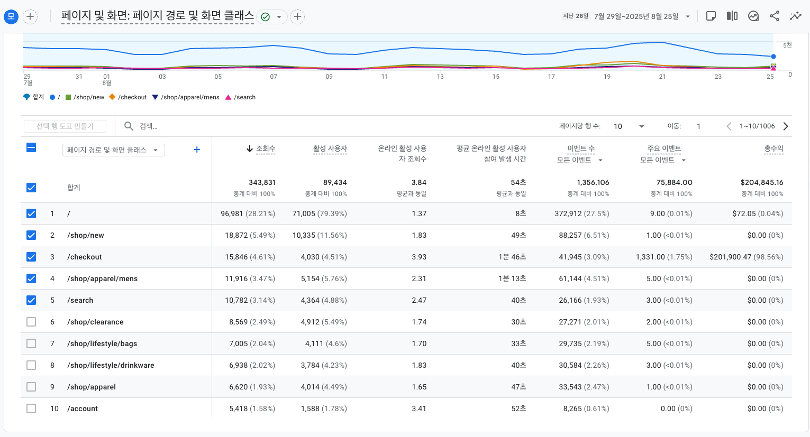

### 보고서 조작

보고서 조작을 통해 더 명확한 데이터를 얻을 수 있다.

- 일정 조정 기능 활용

- 정렬 조정 기능
- 검색 기능
- 시각화 기능
  - 활용도가 높은 편은 아니라고 함.
- 측정 기준 변경하기
  - 측정 기준을 클릭하여 변경이 가능하다.

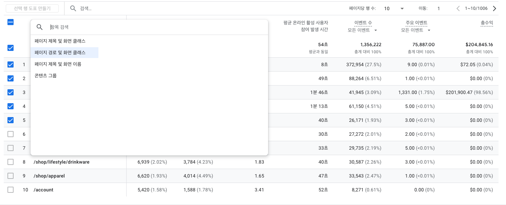

- `측정 기준` 이름 옆에 `+` 버튼을 눌러 보조 측정 기준을 추가할 수 있다.

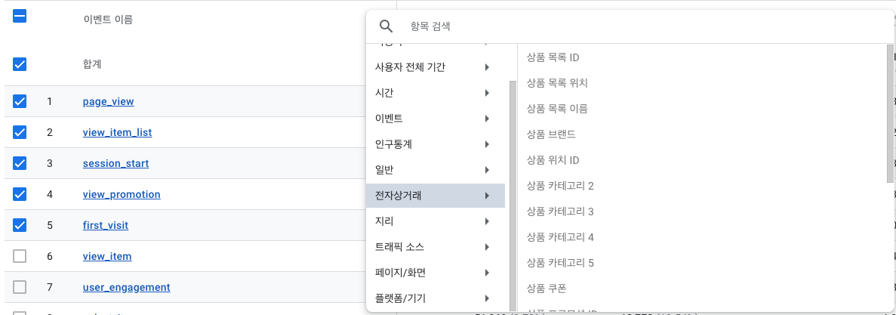

- 일정에서 비교를 활성화하여 데이터를 일정으로 비교할 수 있다.

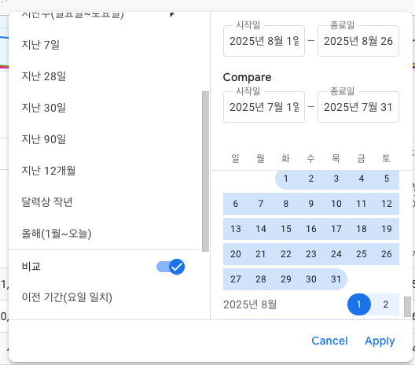

### 파일 내보내기

- PDF, Google Sheets, CSV 등으로 보고서를 내보낼 수 있다.

---

## 기본 분석

### 참여 개요 보고서 용어 개요

- 참여에 대한 데이터 확인
  - '사용자가 서비스를 몇 분동안 이용하는가?', '사용자가 어떤 페이지를 많이 보는가?'와 같은 데이터 확인

#### 1. 사용자
#### 2. 세션

- 사용자의 서비스 사용을 나타내는 단위
- `서비스 이용 생명 주기` 정도로 이해하면 될듯?

#### 3. 이벤트

- 사용자의 행동
- 사용자에 대한 정보 그 자체

#### 4. 참여 engagement

- 사용자가 서비스를 사용하는 것

#### 5. 참여 세션 engaged session

- 세션의 개념 + 참여의 개념
  - 서비스 접촉 1초만에 서비스 종료 => 의미 없는 데이터
  - 참여 없는 세션 또한 의미 없는 데이터로 볼 수 있음

### 참여 개요 보고서 용어

#### 1. 평균 참여 시간
#### 2. 사용자당 참여 세션수

- 사용자당 참여 세션수가 1이라면 이는 사용자가 서비스를 한 번만 사용해보고 다시 돌아오지 않는다는 것을 의미한다.
- 어떻게 하면 사용자당 참여 세션수를 늘릴 수 있을지 고민해봐야 한다.

#### 3. 세션당 평균 참여 시간
#### 4. 지난 30분 동안의 사용자
#### 5. 조회수와 이벤트 수
#### 6. 이벤트 이름별 이벤트 수
#### 7. 페이지 제목 및 화면 클래스별 조회수

- 사용자가 어떤 페이지를 봤는지 확인하는 영역
- '시간 경과에 따른 사용자 활동', '사용자 재방문'

### 페이지 및 화면 보고서 용어

#### 1. 조회수
#### 2. 사용자와 사용자당 조회수
#### 3. 새 사용자 수
#### 4. 평균 참여 시간

### 페이지 및 화면 보고서 읽기

- 데이터 분석에서 정말로 필요한 것은 데이터를 그대로 읽는 것이 아니라, 데이터와 데이터를 비교하여 데이터에 숨겨져 있는 어떠한 의미 혹은 어떠한 인사이트를 찾아내는 것이다.

----

## 데이터 더 상세하게 파악

- `비교군`, `잠재고객`, `세그먼트` 3가지 방법을 통해 데이터를 더 상세하게 파악할 수 있다.

### 비교군 설정하기

- `비교 추가 +` 버튼을 클릭하여 비교군을 설정할 수 있다.

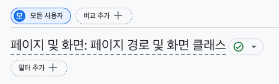

#### 비교군의 한계

- 비교군은 최대 4개까지만 설정 가능
- 비교군을 통한 사용자 설정이 항상 유지되도록 하기는 어려움 => 이때 잠재고객 설정을 사용하면 된다.

### 잠재고객 설정하기

- `관리 > 속성 설정 > 데이터 표시 > 구축`에서 설정이 가능하다.

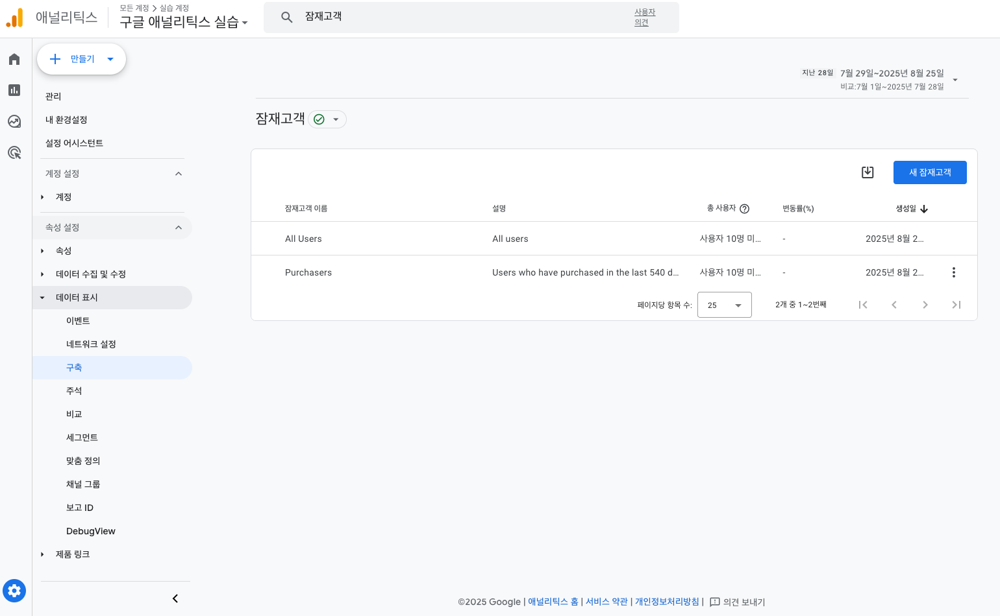

- 잠재고객은 기본 30일로 설정된다.

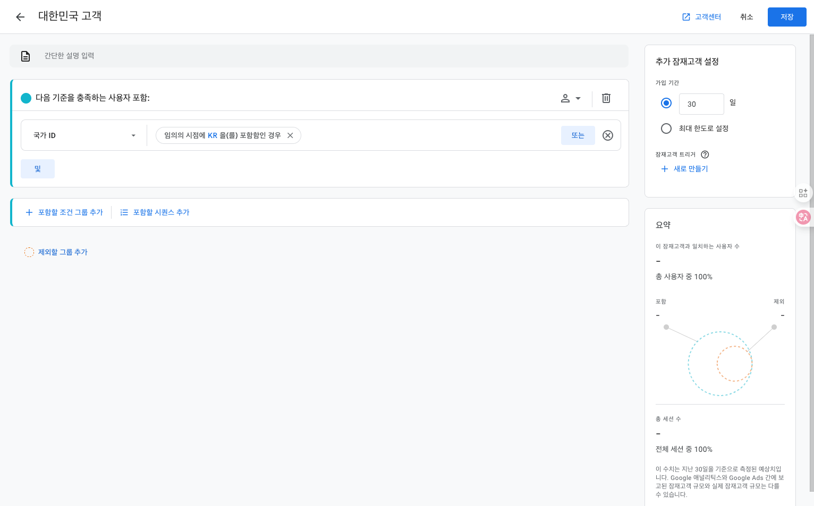

### 측정기준 설정하기

- 각 보고서에서 `+` 버튼을 눌러 보조 측정기준을 설정할 수 있다.
- 측정기준과 측정항목
  - `측정기준`: 데이터를 묶는 기준
  - `측정항목`: 기준에 따른 데이터 값 

---

## 이벤트란 무엇인가?

- 사용자에 대한 정보, 사용자의 행동에 대한 정보를 이벤트라는 형태로 수집한다. 

### 디버그 모드로 이벤트 살펴보기

- [문서](https://support.google.com/analytics/answer/7201382?hl=ko&utm_id=ad)
- 검색창에 `DebugView`를 검색하여 디버그 모드를 활용할 수 있다.
  - 혹은 `관리 > 속성 설정 > 데이터 표시 > DebugView`로 들어갈 수도 있다.

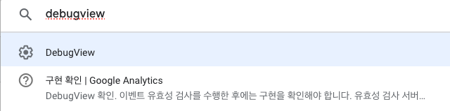

- 보통 태그 설치 문제를 해결하기 위해 사용한다.
  - cf) 구글 태그 매니저에도 디버깅을 할 수 있는 툴이 따로 있다.

### 자동 수집 이벤트 살펴보기

- 구글 애널리틱스를 설치하는 것만으로도 여러 가지 정보를 자동으로 수집한다.
- 이를 `자동 수집 이벤트`라고 한다.

| 순서 | 사용자 행동        | 이벤트 수집                           |
|:---|:--------------|:---------------------------------|
| 1  | 특정 페이지에 접속했다. | 첫 방문(first_visit) 여부를 확인하여 수집    |
|    |               | 페이지 조회(page_view)했음을 수집          |
|    |               | 세션 시작(session_start) 여부를 확인하여 수집 |
| 2  | 페이지를 스크롤했다.   | 스크롤(scroll)했음을 수집                |

### 직접 수집 이벤트 살펴보기

- 이벤트 수집을 계획해 코드로 구현하여 서비스에 적용하는 방법이 있다.
  - ex) 구글 태그 매니저의 커스텀 태그일듯?
- 예를 들어, `try_sign_up`이라는 태그를 만들어 `sign_up`과 비교하여 회원이 어떤 단계에서 가입을 포기하는지 파악할 수 있다.

### 기본 분석 다시 살펴보기

- `조회수`는 자동 수집 이벤트인 `screen_view`와 `page_view` 이벤트를 더한 수치이다.
- 스크롤 이벤트는 페이지 길이가 짧아서 스크롤 할 필요가 없는 상태일 때도 이벤트가 발생한다는 점에 주의해야 한다.
  - 따라서 프로모션 페이지에서 [이벤트 참여] 버튼 같은 결정적인 행동을 유도하는 페이지에 한하여 스크롤 이벤트를 확인하는 것이 적절한 사용법이라고 할 수 있겠다.

---

## 이벤트 분석

- 이벤트는 `자동 수집 이벤트`와 `직접 수집 이벤트`로 구분된다.

### 이벤트 수집 계획

- 구글 애널리틱스는 데이터 분석에 필요한 공통 데이터와 그 데이터를 어떻게 다루는지 누구보다 잘 알고 있다.
  - 데이터 수집/분석 노하우를 바탕으로 대부분의 서비스에 일반적으로 수집하는 이벤트에 대해 우리에게 안내하고 있다.
  - 따라서 사전 정의한 이벤트가 있다면 해당 이벤트를 사용하면 된다.

#### 추천 이벤트

- 사전 정의 이벤트 목록을 보고 싶다면 [링크](https://support.google.com/analytics/answer/9322688?hl=ko#zippy=%2C%EC%8B%A4%EC%8B%9C%EA%B0%84-%EB%B3%B4%EA%B3%A0%EC%84%9C%2Cdebugview-%EB%B3%B4%EA%B3%A0%EC%84%9C) 확인
- [추천 이벤트](https://support.google.com/analytics/answer/9267735?sjid=17362286606158046586-NC)

#### 사용자 정의 이벤트

- 이벤트 코드를 구성하여 사용자 정의 이벤트를 넣을 수 있다.

### 이벤트 맞춤 측정기준

- 사용자 정의 이벤트를 분석하기 위해 이벤트를 맞춤 측정기준으로 등록해야 한다.
  - `관리 > 속성 설정 > 데이터 표시 > 맞춤 정의`

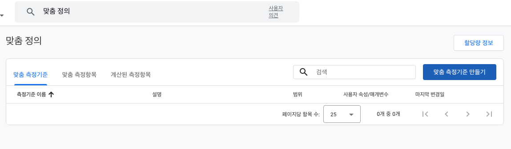

### 전환 이벤트 설정하기

- 이벤트 분석에서 정말 필요한 것은 이벤트를 일단 수집하고 보는 것이 아니라 서비스의 핵심이 되는 이벤트를 구분하고 관리하는 것이다.
- `관리 > 속성 설정 > 데이터 표시 > 이벤트`에서 이벤트를 관리할 수 있다.
  - 목표 이벤트를 `전환 이벤트`으로 설정하여, 다른 이벤트들과 구분하여 관리하는 것이 좋다.

### 이벤트 분석 정리하기

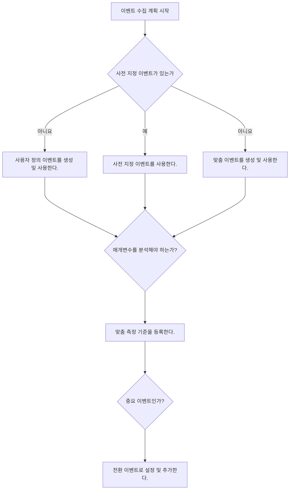

### [필수] 자동 수집 이벤트 매개변수 맞춤 측정기준 등록하기

- 구글 애널리틱스는 여러 가지 데이터를 수집하지만 수집한 데이터 전부를 우리에게 공개하지는 않는다.
- 우리는 구글 애널리틱스에 이러한 정보를 확인할 수 있도록 공개해달라고 요청할 필요가 있다. 이때 사용하는 것이 `맞춤 측정기준`을 등록하는 것이다.

---

## 탐색 분석

- 앞의 내용은 '표준 보고서'와 '기본적인 데이터 분석'
- 실제 데이터 분석 업무는 복잡하여, 페이지 데이터와 이벤트 데이터를 동시에 분석하는 복합적인 주제의 데이터 분석이 이뤄진다.
- 우리에게는 표준 보고서 이상의 보고서가 필요 => '탐색 분석'

### 탐색 분석 보고서

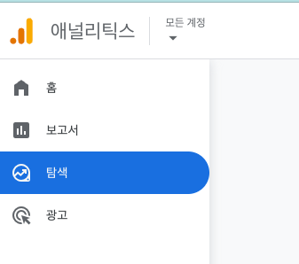

#### 템플릿

- 템플릿 갤러리에서 더 다양한 보고서들을 확인할 수 있다.

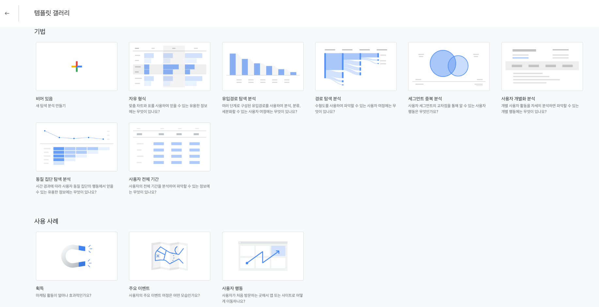

#### 자유 형식 보고서

- 탐색 분석에서 제공하는 여러 가지 형식 중 가장 많이 사용되는 것은 '비어 있음'과 '자유 형식' 보고서다.

### 표준 보고서 데이터를 탐색 보고서로 확인하기

- 표준 보고서 페이지에서 우측 상단의 `이 보고서를 탐색 분석으로 열기` 아이콘으로 열면 탐색 보고서로 볼 수 있다.

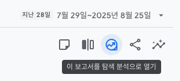

- 보고서의 구조와 모양 결정, 변수 영역, 필터 등을 통해 데이터를 보기 좋게 구성하면 된다.

