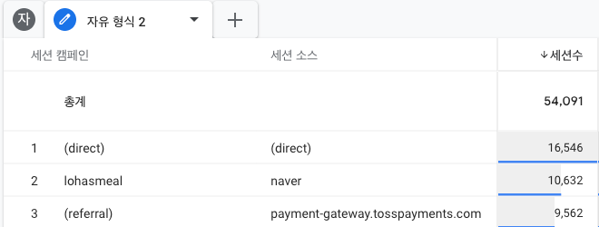
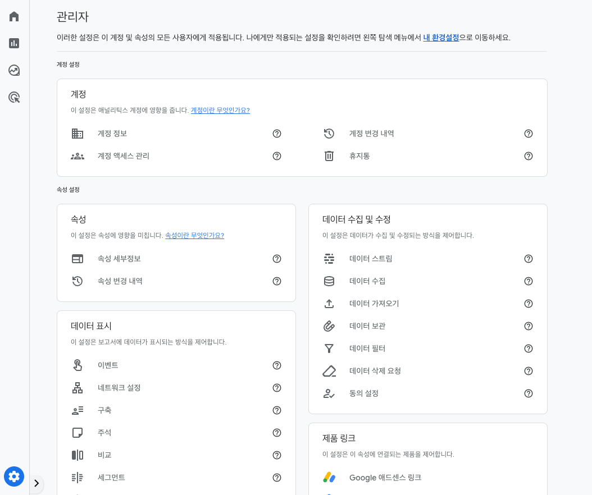
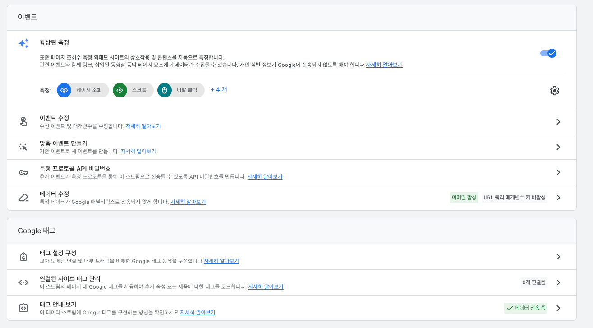
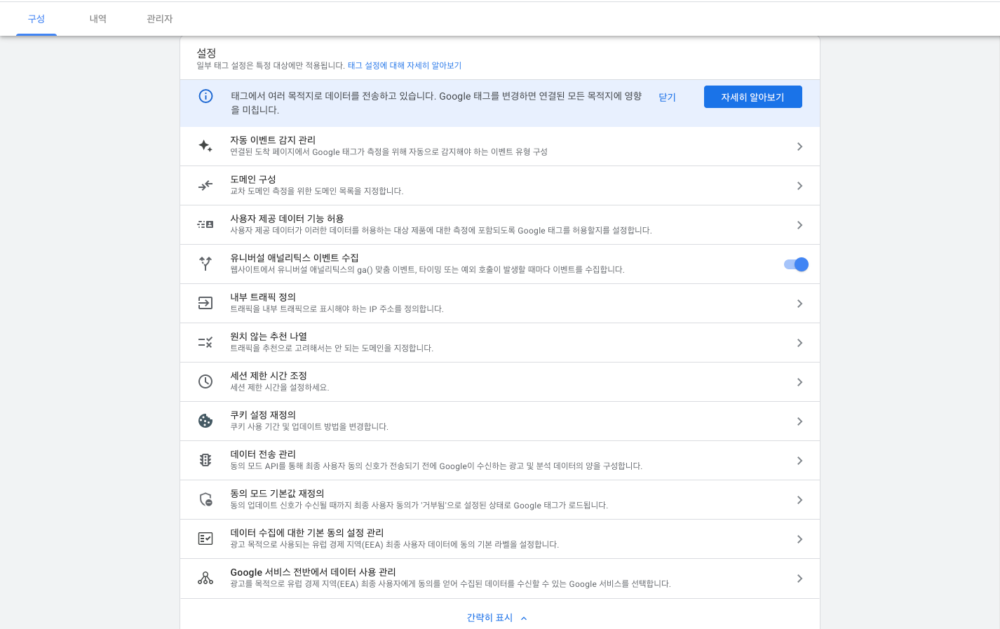
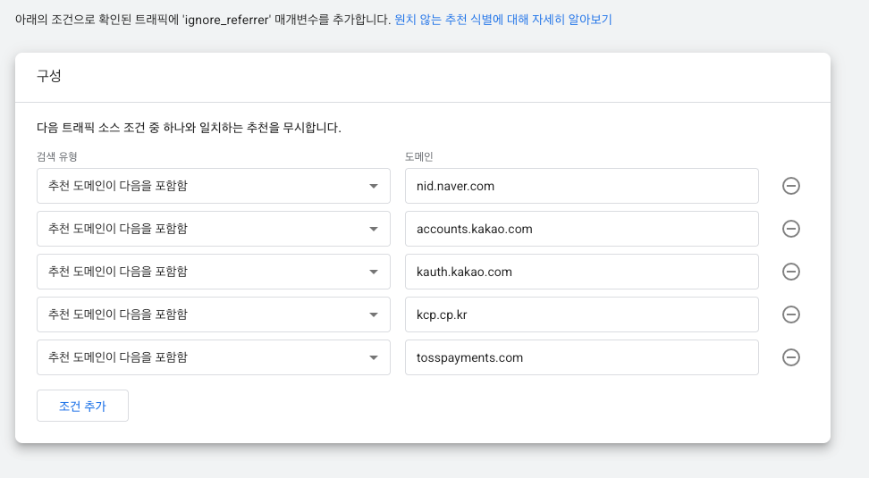

# 2장 구글 애널리틱스 파고들기

## 획득 보고서

- 사용자 획득과 사용자 접속을 분석하는 법

### 용어

#### 매체, 소스, 캠페인

| 용어             | 의미                            | 예                                                            |
|:---------------|:------------------------------|:-------------------------------------------------------------|
| `매체 medium`    | 획득의 방식 혹은 획득의 범주              | **무료 검색**으로 획득한 사용자 수가 100입니다. **광고**로 획득한 사용자 수가 50입니다. | 
| `소스 source`    | 획득의 상세한 위치 혹은 장소              | **구글**에서 획득한 새 사용자의 수가 100입니다.                               | 
| `소스/매체`        | 획득의 상세한 위치 혹은 장소와 매체          | **구글/무료 검색**으로 획득한 사용자의 수가 100입니다.                           | 
| `캠페인 campaign` | 광고의 이름 혹은 획득을 위한 여러가지 행동들의 이름 | **여름 반짝 세일** 관련 구글 광고와 페이스북 광고로 획득한 새 사용자의 수가 100입니다.        |

#### 매체 구분

- `organic`
  - 검색에 의한 획득 ('오가닉 획득', '자연유입 획득', '자연검색 획득')
  - 광고 링크를 통한 사용자 획득은 오가닉과는 다른 것이며, `paid`, `paid search`라고 한다.
- `referral`
  - 특정 사이트에 게시된 링크를 통해 우리 서비스에 접속하게 된 경우 ('레퍼러 획득', '리퍼럴 획득')
  - 이때 특정 웹페이지에 게시된 링크를 `백링크 backlink`라고 한다. 백링크가 게시된 사이트의 신뢰도 혹은 백링크의 개수를 우리 서비스의 신뢰도를 나타내는 지표로 활용하기도 한다.
  - 검색 엔진이 신뢰할 수 있는 서비스로 추정할 때, 우리 서비스가 우선 표시될 수 있다. 해당 영역은 `검색 엔진 최적화 Search Engine Optimization`이라고 부른다.
- `none`
  - `orgranic`이나 `referral`에 의한 접속이 아닌 접속을 `none`이라고 한다.
  - 주소를 직접 입력, 즐겨찾기를 통한 접속
- `data deleted`
  - 개인 정보 보호 등의 이유로 데이터가 삭제되어 확인할 수 없는 경우
- 광고
  - `sa`: Search Advertising. 검색 광고.
  - `bsa`: Brand Search Advertising. 브랜드 검색 광고.
  - `da`: Display Advertising. 디스플레이 광고 전체를 포괄하는 넓은 의미.
  - `ba`: Banner Advertising. 디스플레이 광고 중에서도 특히 이미지나 플래시 형태의 고정된 배너 광고.
  - `main`: 포털 사이트의 메인 배너. 자사 웹사이트의 주요 이벤트.
- 기타
  - `cpc`: 클릭 광고 (cost per click)
  - `email`
  - `affiliate`: 제휴처

### 사용자 획득과 트래픽 획득

- `새 사용자 획득`: ~별 새 사용자 수에서 확인 가능. `first_visit` 이벤트를 기준으로 한다.
- `세션 획득`: ~별 세션 수에서 확인 가능. `session_start` 이벤트를 기준으로 한다.
- 일반적으로 도입, 성장기에는 신규 사용자를 빠르게 확보하는 것이 목표.
  - 새 사용자 분석이 중요하다.
  - 언제 어디서 어떤 방식으로 사용자가 획득되었는가?
  - 어떤 소스/매체가 사용자 뢱득에 유리한가?
- 서비스가 성숙, 쇠퇴기에 도달하면 신규 사용자 획득이 더뎌진다. 기존 사용자들이 서비스에 더 자주 방문, 더 자주 참여하도록 하는 것이 목표.
  - 세션 분석이 중요해진다.

#### 평생 가치 Lifetime Value

- 사용자가 서비스를 첫 방문하고 서비스를 영영 떠날 때까지 어느 정도의 수익을 기대할 수 있는지를 나타낸다.
- 만약 인당 5달러의 가치를 얻고 있을 때, 고객 1명을 데려오기 위해 5달러 이상의 마케팅 비용을 사용하면 적자가 발생할 것이다.

### 사용자 획득 분석

- 실제 업무 수준의 데이터 분석을 진행할 때는 측정기준, 측정항목이 꼭 하나씩은 필요해진다.
  - 정말 간단한 데이터를 확인하는 것이 아니라면 탐색 보고서를 사용하는 습관을 들이자.
- 사용자 획득 보고서에서 탐색 분석 아이콘을 클릭하면 탐색 보고서가 생성된다.
  - 측정 기준과 측정 항목을 정하고,
  - 새 사용자 수 획득에 유리한 매체를 파악하기 위해 필터링을 걸어볼 수 있을 것이다.

### 사용자 전체 기간 보고서

- 탐색 보고서에서 `사용자 전체 기간` 보고서를 클릭

> #### 사용자 전체 기간 보고서의 예측 측정항목
> 사용자 전체 기간 보고서에는 '예측'이라는 측정 항목이 제공된다. 구매 확률, 앱 제거 가능성, 예상 수익 등을 파악할 수 있다.
> 
> 구매 확률이 높은 사용자에게 쿠폰을 제공하거나, 앱 제거 가능성이 높은 사용자에게 고객 관리 이메일을 전송하는 등 활용도가 매우 큰 측정항목이라고 할 수 있다. (잠개 고객이 있어야 함. 18장 참고.)

---

## 캠퍼인 링크 분석

- 사용자가 어떤 링크로 들어왔는지 분석

### 캠페인 링크란

- 캠페인 링크는 페이지 주소에 구글 애널리틱스가 인식할 수 있는 특수한 매개변수를 추가하여 외부에서 유입된 사용자를 분석할 수 있도록 도와주는 기능.

> #### 캠페인 링크와 광고 플랫폼의 광고 분석 도구
> 페이스북 등의 광고 플랫폼에서도 광고 분석 도구를 제공한다. 이를 활용해 페이스북 광고 성과를 자세히 분석할 수 있다. 왜 굳이 캠페인 링크를 사용하는 걸까? 캠페인 링크를 통해 들어온 사용자를 '정의'하고 '분석'하고 '활용'하기 위함이다.
> 
> 사용자 행동 패턴을 파악하여 상품 추천이나 세일 상품 안내를 할 수 있다. 사용자가 발생시키는 이벤트를 분석하여 가입을 완료했는지, 물건을 장바구니에 담았는지, 물건을 구매했는지와 같은 행동 정보도 수집 가능하다.

### 캠페인 링크 구성 이해하기

- 구글 애널리틱스는 사용자가 페이지에 접속하는 `page_view` 이벤트를 수집한다.
  - 이때 페이지의 주소가 캠페인 링크로 구성되어 있다면 구글 애널리틱스는 주소에 기록해둔 매체/소스/캠페인 정보를 같이 수집한다.

#### 매개변수란?

- 쿼리스트링을 통해 매개변수를 받으며, 캠페인 매개변수의 종류는 아래와 같다.
  - `utm_campaign`: 캠페인 이름 혹은 광고 이름 
  - `utm_source`: 소스, 획득의 상세한 위치
  - `utm_medium`: 매체, 획득의 방식
- `utm_`으로 시작하여 utm 매개변수라고 부르기도 한다.

### 트래픽 획득 분석

- `측정기준` = `세션 캠페인` & `측정항목` = `세션수`
  - 행을 `세션 캠페인`, 값을 `세션수`로 설정한다.
- 보고서가 보일텐데, `(organic)`, `(direct)`, `(referral)`을 제외한 값들이 페이지 주소의 캠페인 매개변수에 해당한다.
- 그런데 아래와 같이 결제 외부 링크에 의해 레퍼럴이 잡히는 경우가 있는데, 원치 않는 목록을 삭제해줘야 한다. 

- 좌측 메뉴의 `관리` 아이콘을 클릭하고, `데이터 스트림` 버튼을 클릭한다.

- 데이터 스트림 페이지에서 원하는 웹 스트림을 선택한다.
- 웹 스트림 세부정보에서 `태그 설정 구성`을 클릭한다.

- 설정에서 `자세히 보기`를 클릭하고, `원치 않는 추천 나열`을 클릭한다.

- 결제 링크, OAuth 로그인 링크 등을 제외해준다.

---

## 기술과 인구통계

- 사용자들의 성별, 연령대, 관심사

### 용어

#### 플랫폼

- 안드로이드, iOS, WEB 등의 플랫폼 정보

#### 운영체제

- 안드로이드, iOS, Windows, Mac 등

#### 기기 카테고리별 사용자

- MOBILE, TABLET, DESKTOP 등

#### 브라우저별

- Chrome, Safari 등

#### 화면 해상도별

- ex) 1920x1080

#### 앱 버전별 사용자
#### 최신 앱 버전 개요, 앱 안정성 개요
#### 기기 모델별 사용자

### 인구 통계와 구글 신호 데이터

- `사용자 속성 > 개요`
- 인구통계 보고서는 서비스 타겟을 설정한 `페르소나 persona`와 실제 사용자의 차이를 파악하는 데 도움이 될 수 있다.
- Google Ads의 개인 최적화 기능과 연관

### 구글 신호 데이터 활성화

- 데이터 수집 활성화를 따로 해줘야 한다.

---

## 사용자 속성 분석

- 구글 신호 데이터가 활성화되면 사용자에 대한 더 많은 정보를 얻을 수 있다.
- 성별, 연령, 관심사 등

---

## 잠재고객

