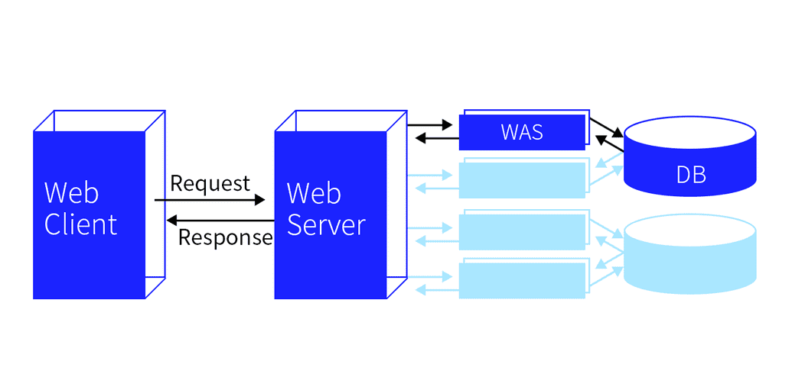

# 웹의 동작 방식

## 클라이언트와 서버

> "클라이언트가 서버에 요청을 보내면 서버는 해당 요청에 대해 응답한다."

 

- 웹의 동작 방식을 자세히 보여주자면 아래와 같다.

### 웹 클라이언트 (Web Client)

- 웹 클라이언트는 사용자가 웹에 접근하는 프로그램을 말한다.
- 우리가 육안으로 보는 대부분의 웹은 웹 브라우저에서 실행되기 때문에 일반적으로 Internet Explorer, Chrome 등의 웹 브라우저를 웹 클라이언트라고 한다.
- 브라우저 주소창에서 `https://www.naver.com` 라고 입력하고 엔터키를 누르면, 클라이언트는 사용자로부터 받은 URL에 대한 정보를 찾아 HTTP 메시지 형태로 서버에게 요청(Request)한다.

### 웹 서버 (Web Server)

- 웹 서버는 웹 페이지, 사이트 또는 앱을 저장하는 프로그램이다.
- 서버는 클라이언트에서 요청한 HTTP 메시지를 확인한 후, 이에 맞는 데이터를 처리한 뒤에 다시 클라이언트에게 응답(Response)한다. 만약 클라이언트에서 `https://www.naver.com`의 메인 페이지를 보내달라고 요청을 보낸다면, 서버에서는 이 요청을 확인하고 페이지를 만드는 데 필요한 HTML, CSS, JS, Image 등을 가져와 클라이언트에게 보내준다.

### WAS (Web Application Server)

- 웹 서버 뒤에 있는 WAS는 웹 어플리케이션 서버라는 이름에서 보이듯이 사용자 컴퓨터나 장치에 웹 어플리케이션을 수행해주는 미들웨어를 일컫는다.
- 그 예로는 아파치 톰캣(Apache Tomcat), 레진(Resin), 제이런(JRun) 등이 있다.
- 클라이언트에게 메시지를 받으면 서버는 요청에 필요한 페이지의 로직이나 데이터베이스의 연동을 위해서 WAS에 이들의 처리를 요청한다. 그러면 WAS는 이 요청을 받아와 동적인 페이지 처리를 담당하고 DB에서 데이터 정보를 받아온다. 이렇게 WAS는 DB와 연동하여 데이터르 처리한 뒤, 생성한 파일을 다시 서버에게 반환한다.
- WAS의 등장으로 웹 서버의 할 일을 분배하여 서버의 부담을 줄일 수 있고, 빠르게 동적 컨텐츠를 처리할 수 있게 되었다.

### DB (Data Base)

- 데이터베이스는 데이터의 정보를 저장하는 곳이며 WAS에서 데이터를 요청하면 필요한 데이터를 응답한다.
- WAS에서 로직을 수행하다가 DB접근이 필요하면 SQL질의를 통해 데이터를 요청하고, DB는 요청사항에 맞는 응답을 보낸다. 만약 사용자가 블로그에 새로 포스팅을 올려서 그 내용을 서버에 저장해두어야한다고 하면, WAS에서 DB에게 해당 내용을 저장하게끔 요청하고, DB는 그 내용을 정리하여 저장한다.

 

## 웹을 이해하기 위해 필요한 지식들

- 인터넷 연결: 웹에서 데이터를 보내고 받을 수 있게 해주는 것이 인터넷 연결이다.

- TCP/IP: Transmission Control Protocol (전송 제어 규약) 과 Internet Protocol (인터넷 규약) 은 데이터가 어떻게 웹을 건너 여행해야 하는지 정의하는 통신 규약이다. TCP/IP는 주문을 하고, 상점에 가고, 또 여러분의 상품을 살 수 있게 해주는 운송 장치와 같다.

- DNS: Domain Name System Servers (도메인 이름 시스템 서버) 는 웹사이트를 위한 주소록이다. 브라우저에 웹 주소를 입력할 때, 브라우저는 그 웹사이트를 검색하기 전에 DNS 를 살펴본다. 브라우저는 HTTP 메시지를 올바른 장소로 전송하기 위해 그 웹사이트가 있는 서버가 어떤 것인지 찾는다. <u>**도메인 이름에 할당된 IP 주소를 찾아 알맞은 서버를 찾아가는 것이다.**</u>

- HTTP: Hypertext Transfer Protocol (하이퍼텍스트 전송 규약) 은 클라이언트와 서버가 서로 통신할 수 있게 하기 위한 언어를 정의하는 어플리케이션 규약이다. 대표적인 HTTP 요청 메소드로는 `GET`, `POST`, `PUT`, `DELETE` 등이 있다.

- 컴포넌트 파일: 한 웹사이트는 여러분이 상점에서 사는 다양한 종류의 상품들과 같이 많은 다른 파일들로 만들어진다. 이 파일들은 두 종류가 있다.
  - 코드 파일: 웹사이트는 근본적으로 HTML, CSS, 그리고 JavaScript 로 생성된다.
  - 자원(Resource): 이것은 이미지, 음악, 비디오, 단어 문서, 그리고 PDF 같은, 웹사이트를 만드는 모든 다른 것들을 위한 파일들을 말한다.

 

## 웹의 자세한 동작 과정

1. 사용자가 브라우저에 도메인 주소를 입력한다.
2. 브라우저는 DNS 서버로 가서 웹사이트가 있는 서버의 IP 주소를 찾는다.
3. 브라우저는 서버에게 웹사이트의 사본을 클라이언트에게 보내달라는 HTTP 요청 메세지를 서버로 전송한다. 이 메세지, 그리고 클라이언트와 서버 사이에 전송된 모든 데이터는 TCP/IP 연결을 통해서 전송된다.
4. 서버는 요청에 필요한 페이지의 로직이나 데이터베이스의 연동을 위해서 WAS에 이들의 처리를 요청한다. 그러면 WAS는 이 요청을 받아와 동적인 페이지 처리를 담당하고 DB에서 데이터 정보를 받아온다. 이렇게 WAS는 DB와 연동하여 데이터르 처리한 뒤, 생성한 파일을 다시 서버에게 반환한다.
5. 파일을 반환받은 서버는 클라이언트의 요청을 승인하고, "200 OK" 메세지를 클라이언트에게 전송한다. 그 다음 서버는 웹사이트의 파일들을 데이터 패킷이라 불리는 작은 일련의 덩어리들로 브라우저에 전송하기 시작한다.
6. 브라우저는 이 작은 덩어리들을 완전한 웹 사이트로 조립하고, 사용자에게 보여준다.

 

## 참고자료

- [Mozilla: 웹의 동작 방식](https://developer.mozilla.org/ko/docs/Learn/Getting_started_with_the_web/How_the_Web_works)

- [Velog: 웹의 동작 원리](https://velog.io/@ylyl/TIL-web-operations)

- [그림으로 알아보는 웹 - 1편 웹의 동작 원리](https://swimjiy.github.io/2019-11-03-How-Web-Works)
