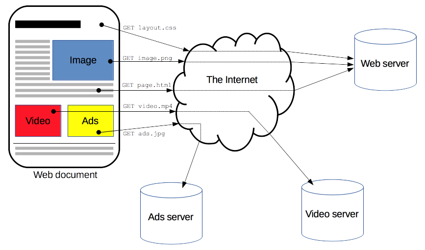
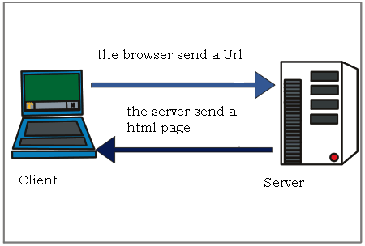
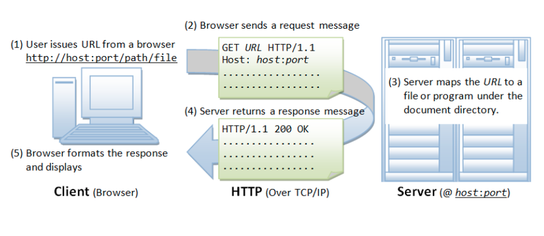
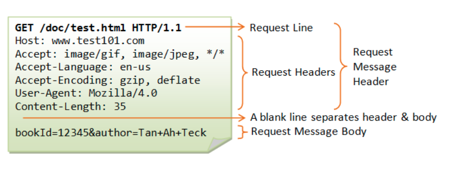
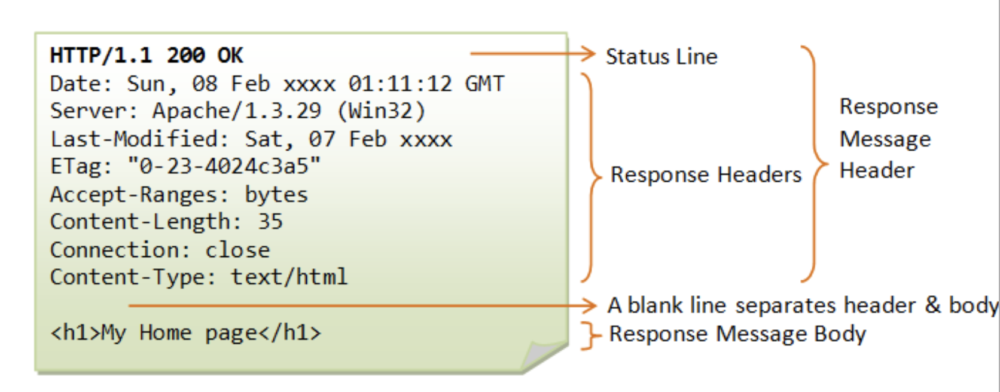
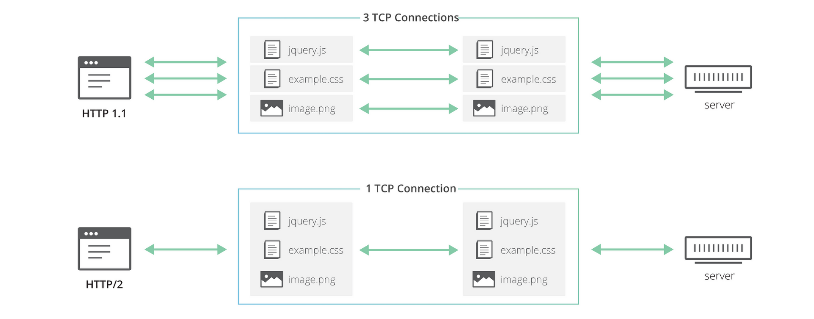
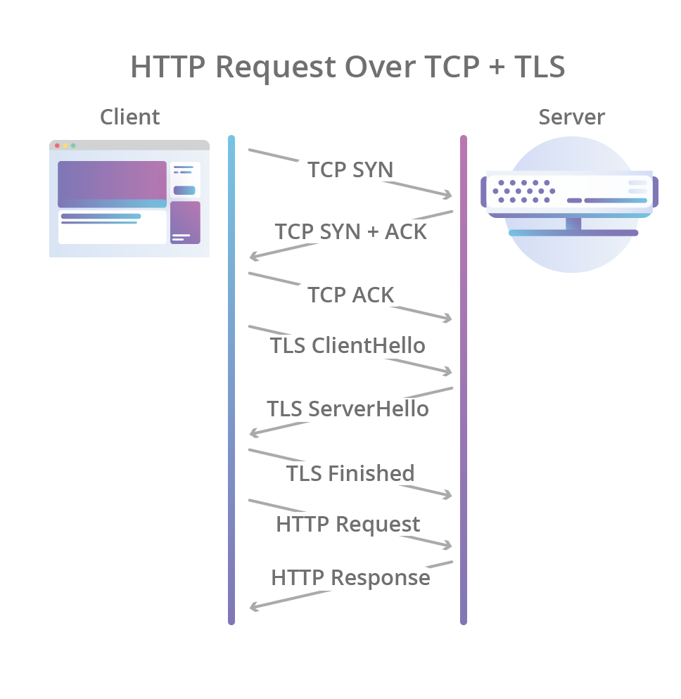
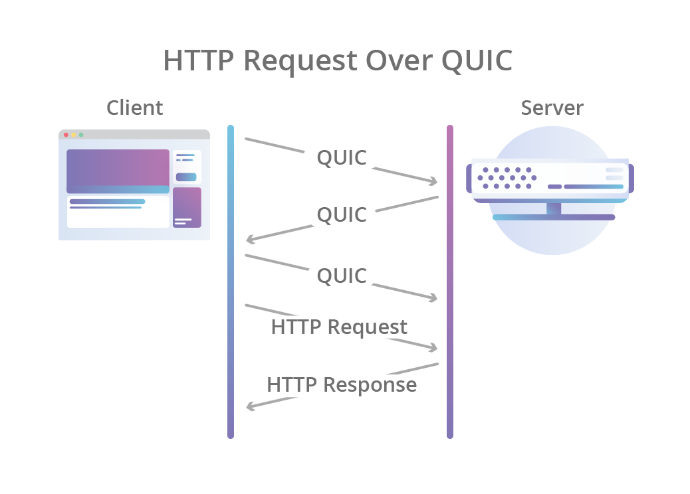
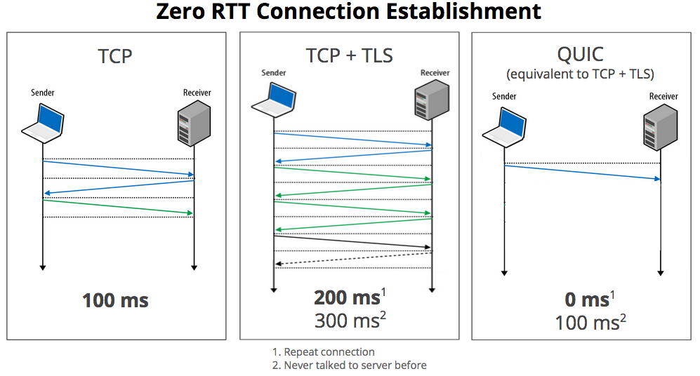

# HTTP

## HyperText Transfer Protocol

- WWW 상에서 정보를 주고받을 수 있는 프로토콜이다.
- HTML 문서를 주고받는 데에 사용된다.
- TCP와 UDP를 사용하며, 80번 포트를 사용한다.



## HTTP의 특징

- 비교적 간단하며 확장 가능하다.
- 상태가 없다(= stateless).
- HTTP1 --> HTTP/1.1 --> HTTP/2 -> HTTP/3로 버전이 변경되었으며, 계속 발전하는 중이다.

---

<br/>

# Web Client와 Server



- 클라이언트: 서버에 컨텐츠를 요청한다.
- 서버: 클라이언트의 요청에 대해 적당한 문서(응답)를 제공해 준다.
- 프록시: 클라이언트와 서버 사이에 존재하며 캐싱, 필터링, 로드 밸런싱, 인증, 로깅 등의 다양한 기능을 수행한다.

## 서버와 클라이언트로 보는 HTTP의 동작 방식

- 실제로는 DNS 서버가 개입한다.



---

<br/>

# 💨 HTTP Request와 Response

## HTTP Request

**요청(request)**은 클라이언트가 **서버로 전달하는 메시지로, 서버 측 액션을 유도**한다.

- Request Line과 Headers, Body로 구성되어 있다
- 실제로는 한 줄마다 `\r\n` 줄바꿈 문자가 포함되어 있다
- Header와 Body를 빈 줄로 구분하기 위해서도 `\r\n` 문자를 포함한다



- Request Line(또는 Start-line)이란?
  - **`HTTP 메소드** + **URI** + **HTTP 버전`** 세 가지 요소로 이루어져 있다.
- Request 헤더란?
  - 요청의 내용을 좀 더 **구체화**하고, **컨텍스트를 제공**한다. 조건부로 제한하여 요청 내용을 수정하기도 한다.
  - **Host, User-Agent, Accept, Accept-Encoding, Authorization 등으로 구성되어 있다.**

##3 HTTP Response

**응답(response)은 요청에 대한 서버의 답변**이다.

- Status Line과 Headers, Body로 구성되어 있다
- Request와 마찬가지로 한 줄마다 `\r\n` 줄바꿈 문자가 포함되어 있다



- 상태줄(Status Line)이란?
  - **`프로토콜 버전** + **상태 코드** + **상태 텍스트` 세 가지 요소로 이루어져 있다.**
- Response 헤더
  - Request 헤더와 동일한 역할을 한다. 내용은 약간 다르다.
- 아래는 Response 예시

```jsx
HTTP/1.1 200 OK
server: ecstatic-3.3.2
cache-control: max-age=3600
last-modified: Mon, 06 Jul 2020 05:09:48 GMT
etag: W/"8624175389-20-2020-07-06T05:09:48.268Z"
content-length: 20
content-type: text/html; charset=UTF-8
Date: Mon, 06 Jul 2020 05:12:29 GMT
Connection: keep-alive

<h1>Hello</h1>
Connection closed by foreign host.
```

---

<br/>

# 브라우저 동작 방식

1. 처음에는 HTML 을 가져온다.
2. HTML에서 CSS, js, 이미지에 대한 링크 정보를 추출한다.
3. 추출한 정보의 URL을 이용 새로운 요청을 보낸다.
4. 모든 웹 자원을 받아와서 렌더링을 시작한다.
5. 1.1 은 파이프라인, 2.0은 병렬처리로 성능을 개선하였다.

---

<br/>

# 상태코드

## HTTP 상태코드

- 100번 대 : 처리중입니다!!!!
- 200번 대 : 성공!
- 300번 대 : 리디렉션, 요청을 성공적으로 처리하기 위해 추가 동작이 필요합니다!! (새로운 페이지로 이동한다던가..)
- 400번 대 : 클라이언트 요청 오류(아마 많이 봐왔을 404 에러!!)
- 500번 대 : 서버 오류

## 주요 상태 코드

| 상태 | 응답                  | 의미                 |
| ---- | --------------------- | -------------------- |
| 200  | OK                    | 정상적인 처리        |
| 302  | See Other             | 주로 리다이렉트 용도 |
| 404  | Not Found             | 리소스가 없다        |
| 403  | Forbidden             | 권한 없음            |
| 500  | Internal Server Error | 서버 내부 오류       |
| 502  | Bad Gateway           | 중간 계층 오류       |
| 503  | Service Unavailable   | 서비스 제공불가      |

---

<br/>

# 🖲 HTTP/x.x 🖲

## HTTP/0.9

버전번호가 따로 없는 상태로 발표되었던 초기 HTTP는 요청이 단일 라인으로 구성되며 가능한 메서드는 `get`이 유일했다고 한다. Header도 존재하지 않았고, 오직 HTML 파일만 전송 가능했으며, 상태 확인을 위한 코드도 존재하지 않았다!!

## HTTP/1.0

매우 기능이 제한적인 기존의 것을 개선하여 나온 HTTP는 1.0이라는 버전번호를 달고 나오게 되었고, 자연스럽게 그 이전의 저번은 0.9 버전으로 기억하게 되었다. 새로운 버전에서는 다음과 같은 기능이 추가되었다.

- 요청에 버전 정보가 붙어서 붙어서 전송되기 시작
- 응답 시작 부분에 상태 코드가 추가됨
- 모든 요청과 응답에 헤더 개념이 추가됨(확장성 up, 다른 타입의 문서도 전달 가능해짐, 기타 기능 강화)

## HTTP/1.1

1.0 발표가 된지 몇달 지나지 않아 HTTP의 첫번째 표준버전인 1.1이 발표되었다. HTTP/1.1 버전은 많은 개선사항을 도입하였다.

- 커넥션의 재사용 가능(기존 연결에 대해서 handshake 생략가능)
- 파이프라이닝 추가, 이전 요청에 대한 응답이 완전히 전송되기 전에 다음 전송을 가능헤 하여, 커뮤니케이션 레이턴시를 낮춤
- 청크된 응답 지원(응답 조각)
- 캐시 제어 메커니즘
- 언어, 인코딩 타입등을 포함한 컨텐츠 전송
- 동일 IP 주소에 다른 도메인을 호스트하는 기능 가능 (HOST header)

## HTTP/2

웹이 발전함에 따라 브라우저가 웹페이지를 가져오고 렌더링 할 때 필요한 리소스의 가짓수(CSS, JavaScript, 이미지, html )등이 크게 증가함에 따라 점점 더 많은 동시성을 요구하게 되었고, TCP 연결을 병렬 수행하기 위해 나온 것이 HTTP/2이다!!

HTTP/2는 "streams"라는 개념을 도입하였다. 이것은 서로 다른 HTTP 연결들을 하나의 TCP 스트림으로 다중화하여 추상화 할 수 있는 개념으로, 브라우저에서 보다 효율적으로 TCP연결을 재사용 할 수 있도록 지원하는 개념이다.



- 이미지출처: [https://blog.cloudflare.com/http3-the-past-present-and-future/](https://blog.cloudflare.com/http3-the-past-present-and-future/)

HTTP/2도 결점이 없는 것은 아니다. HOLB(Head of line Blocking)라는 문제가 있는데 이는 TCP 패킷이 네트워크 경로에서 손실되면 스트림에 공백이 생겨, 손실 된 바이트 다음에 오는 올바른 바이트들도 재전송으로 인해 전달이 되지 않아 발생하는 불필요한 지연이 발생한다.

또한 SSL이나 TLS를 사용하는 HTTPS를 사용하면 큰 오버헤드가 발생하게 된다…



- 이미지출처: [https://blog.cloudflare.com/http3-the-past-present-and-future/](https://blog.cloudflare.com/http3-the-past-present-and-future/)

## HTTP/3

HTTP/3는 프로토콜로 UDP를 사용한다. UDP를 기반으로 하는 QUIC를 사용한다. UDP를 사용하지만 그렇다고 신뢰성 있는 통신을 사용하지 않는 것은 아니다. QUIC의 장점은 아래와 같다.

- 암호화가 프로토콜의 일부기능으로 포함되어 있다
- 스트림 연결과 암호화 스펙등을 포함한 모든 핸드쉐이크가 단일 요청/응답으로 끝난다
- 패킷이 개별적으로 암호화 되며, 다른 데이터 부분의 패킷을 기다릴 필요가 없다
- 통신이 멀티플렉싱 되며 이를 통해 HOLB를 극복할 수 있다
- QUIC는 운영체제 커널과 독립적으로 응용 프로그램 공간내에서 구현할 수 있으며, 덕분에 데이터의 이동에 따른 컨텍스트 전환에 의한 오버헤드가 없어진다
- Source Address와 무관하게 서버에 대한 연결을 고유하게 식별하는 연결 식별자가 포함되어 있어, IP주소가 변경되더라도 커넥션을 유지할 수 있다

핸드세이크로 인한 지연, 패킷 손실이 다른 스트림에 미치는 영향, 패킷 손실로 인한 지연으로부터 자유로울 수 있다.



- 이미지출처: [https://blog.cloudflare.com/http3-the-past-present-and-future/](https://blog.cloudflare.com/http3-the-past-present-and-future/)

## 연결 과정 비교



---

<br/>

# 참고자료

MDN: [https://developer.mozilla.org/ko/docs/Web/HTTP](https://developer.mozilla.org/ko/docs/Web/HTTP)

DNS 동작의 원리: [https://howdns.works/](https://howdns.works/)

AWS에서 설명해주는 DNS 동작원리: [https://aws.amazon.com/ko/route53/what-is-dns/](https://aws.amazon.com/ko/route53/what-is-dns/)

### HTTP의 버전

HTTP/2: [https://http2.github.io/](https://http2.github.io/)

참고자료: [https://gngsn.tistory.com/99](https://gngsn.tistory.com/99)

참고자료: [https://ykarma1996.tistory.com/86](https://ykarma1996.tistory.com/86)

참고자료: [https://www.hamadevelop.me/http3/](https://www.hamadevelop.me/http3/)
