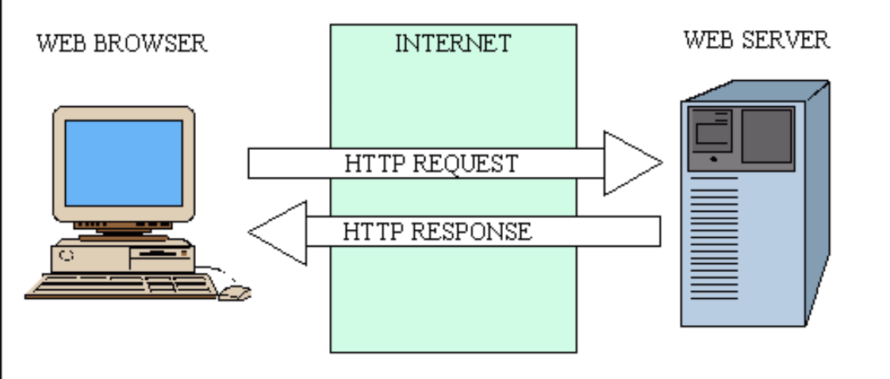
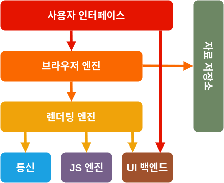
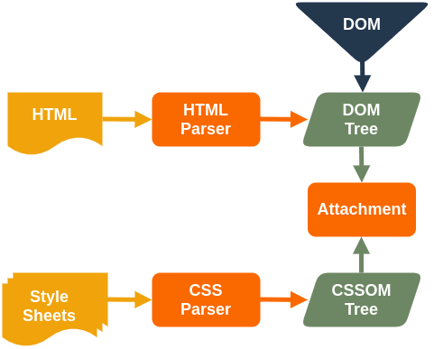
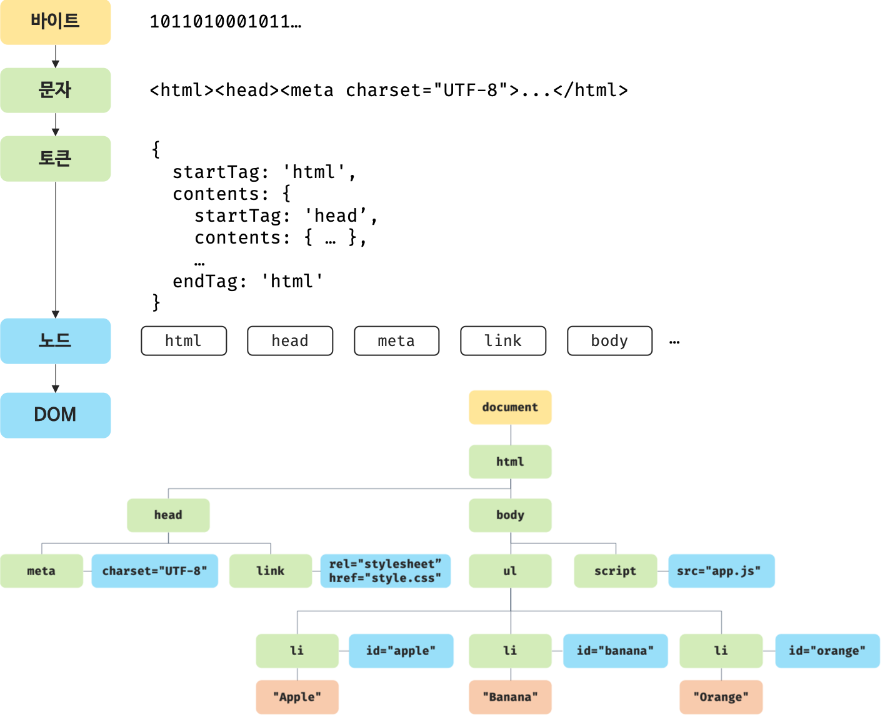
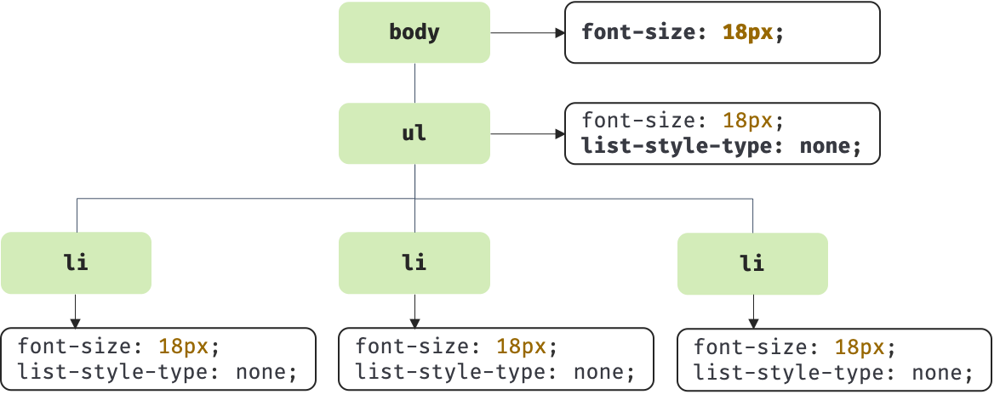
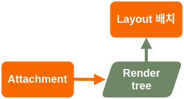

# 브라우저 작동 원리

## 브라우저?

> 인터넷에서 웹 서버의 모든 정보를 볼 수 있도록 하고, 문서 검색을 도와주는 응용 프로그램이다.

- 일상생활에서 인터넷을 통해 사용할 때 주로 크롬이나 사파리, Edge 등을 사용해 사이트에 접속한다. 이 도구들을 `브라우저` 또는 `웹 브라우저`라고 칭한다.

### 웹 브라우저의 종류

- **Chrome**

  - 구글에서 자사의 검색엔진에 최적화시켜 출시한 웹 브라우저로, 한국은 물론 전 세계에서 시장 점유율이 가장 높은 브라우저로 인기가 많다. Windows 뿐만 아니라 MAC OS, Linux, 안드로이드 등에도 지원하는 웹 브라우저이다. 빠른 속도에 확장 프로그램 기능, 고급 기능 및 개발자 도구 등의 강력한 기능들을 제공하고 있어 사용자들에게 인기가 많다.

- **Safari**

  - 애플에서 개발한 웹 브라우저로 현재 전 세계 웹 브라우저 점유율 2위에 올랐을 정도로 크롬 다음으로 인기가 많다. 애플 MAC OS나 IOS전용으로 출시되어 사실상 애플 자사 제품에 의한 웹 브라우저라고 보는 것이 타당하다. 타 OS에서 출시되지 않는 점이나 약간의 폐쇄적인 특성은 조금 아쉽지만 애플의 자사 제품에서는 메모리 누수가 적고 안정적으로 동작한다는 장점이 있다.

- **Microsoft Edge**

  - 마이크로소프트에서 개발한 웹 브라우저로 엣지 역시 크로뮴을 기반으로 만들어졌다. 크롬에 비해 메모리 사용량이 낮고 빠르다는 특징을 가지고 있고, 크롬의 확장 프로그램을 가져와서 사용할 수 있다. 하지만 기본 검색이 구글이 아닌 bing으로 되어있다는 것이 사용자들마다 호불호가 크게 갈린다.
  - 하지만 최근 `chatGPT` 열풍으로 `newBing`이 등장해 chrome의 점유율을 조금 가져올 수 있지 않을까 생각해본다.

- **Naver Whale**
  - 국내 IT기업인 네이버에서 출시한 웹 브라우저로 크로뮴을 기반으로 만들어졌다. 기본 검색엔진이 구글이 아니라 네이버로 되어 있기 때문에 사용자들마다 호불호가 크게 갈리는 편이다. 웨일은 많은 부가기능과 고급 기능이 탑재되어 있지만 이로 인해 메모리 점유율 높아 약간 아쉽다고 볼 수 있다.

<br/>

## 브라우저와 서버의 통신 과정

- 브라우저의 주요 기능은 사용자가 서버에 자원을 요청하면 그 자원을 잘 받아와 브라우저에 표현하는 것이다. 웹 브라우저에 URL을 입력하면 서버가 웹 브라우저에 웹 페이지를 제공해준다.



- DNS([자세한 내용](./05%20DNS.md))를 활용해 IP주소에 접속하고 해당 URL에 할당되어 있는 자원을 받아오는 것이다. 일반적으로 네트워크 프로그램에서 요청하는 쪽을 클라이언트(Client)라고 부르고, 요청을 받아 알맞은 기능이나 데이터를 제공하는 쪽을 서버(Server)라고 부른다.

<br/>

## 브라우저의 주요 기능

<br/>

## 브라우저의 기본 구조



- 브라우저는 아래와 같은 구성 요소를 가지고 있다. 사실 세부적인 구조는 브라우저마다 약간씩 다르다.
  - 사용자 인터페이스: 주소 표시줄, 이전/다음 버튼, 북마크 등 페이지 뷰 이외의 다른 나지 모든 부분이다.
  - 브라우저 엔진: 사용자 인터페이스와 렌더링 엔진 사이 동작을 제어한다.
  - 렌더링 엔진: HTML, CSS를 파싱해 화면에 요청한 컨텐츠를 표시한다.
  - 통신: HTTP요청과 같은 네트워크 호출에 사용된다. 플랫폼 독립적인 인터페이스로 각 플랫폼 하부에서 실행된다.
  - JS 엔진: 자바스크립트 코드를 해석하고 실행
  - UI 백엔드: 기본적인 위젯(콤보 박스 등)을 그림
  - 자료 저장소: 자료를 저장하는 계층으로 쿠키 등을 저장하는 웹 데이터베이스이다.

<br/>

## 렌더링 엔진

- 구글 크롬은 대부분의 브라우저와 달리 각 탭마다 별도의 렌더링 엔진 인스턴스를 유지하고 있다. 이를 통해 각 탭을 독립적인 프로세스로 처리할 수 있다.
- 위의 구성 요소 설명과 같이 렌더링 엔진은 요청받은 내용을 브라우저 화면에 표시해주는 역할을 한다. 브라우저마다 사용하는 렌더링 엔진이 각각 다르기 때문에, 모든 브라우저가 동일한 소스를 화면에 동일하게 그려주지 않고 엔진마다 읽을 수 있는 코드의 버전도 다르기 때문에 크로스 브라우징 이슈가 발생하곤 한다.
- 아래는 각 브라우저가 사용하는 렌더링 엔진을 보여주는 표이다. 각각의 렌더링 엔진들은 웹 표준에 따라서 개발자들이 작성한 문서를 브라우저에 보여주지만, 개발 진척도나 별도 규칙에 따라 지원하는 표준이 다르거나 렌더링 알고리즘과 방식에 차이가 있을 수 있다.

<table>
    <tr>
        <th>브라우저</th>
        <th>렌더링 엔진</th>
    </tr>
    <tr>
        <td>(역사속으로 사라져버린) IE</td>
        <td>Trident</td>
    </tr>
    <tr>
        <td>Edge</td>
        <td>EdgeHTML, Blink</td>
    </tr>
    <tr>
        <td>Chrome</td>
        <td>Webkit, Blink(버전 28이후)</td>
    </tr>
    <tr>
        <td>Safari</td>
        <td>Webkit</td>
    </tr>
    <tr>
        <td>FireFox</td>
        <td>Gecko</td>
    </tr>
</table>

<br/>

## 렌더링 엔진 작동 원리

- 아래 과정을 차례대로 알아가보자!


### 첫번째! DOM(Document Object Model) 생성 (Parsing)

1. HTML을 파싱하여 DOM 노드를 만든다. 이 DOM 노드들을 병합하여 DOM 트리를 만든다.
2. CSS를 파싱하여, CSSOM(CSS Object Model) 트리를 만들게 된다.



- 브라우저는 렌더링 할 문서를 HTML과 CSS로 나눠서 읽게 된다. 이때 HTML과 CSS는 단순한 텍스트이므로 각각 연산과 관리가 가능하도록 HTML Parser와 CSS Parser를 사용해 관리가 가능한 Object Model로 만든다.
- 일련의 과정들이 점진적으로 진행된다는 것을 아는 것이 중요하다. 렌더링 엔진은 좀 더 나은 사용자 경험을 위해 가능하면 빠르게 내용을 표시하는데 모든 HTML을 파싱할 때까지 기다리지 않고 배치와 그리기 과정을 시작한다. 네트워크로부터 나머지 내용이 전송되기를 기다리는 동시에 받은 내용의 일부를 먼저 화면에 표시하는 것이다.
- 아래 그림을 DOM 트리를 구축하는 과정을 보여준다.



1. 서버는 브라우저로부터 요청받은 HTML 파일을 읽어드린후 > 메모리에 저장하고 > 그 메모리에 저장된 바이트(101101000100…)을 응답한다.
2. 브라우저는 응답받은 바이트 형태의 문서를 meta태그의 charset 어트리뷰트에 지정된 인코딩방식(UTF-8)에 따라 문자열로 반환한다.
3. 문자열로 변환된 HTML문서를 이번에는 문법적 의미를 갖는 코드의 최소 단위인 토큰(token)으로 분해한다.
4. 토큰들의 내용에 따라 객체로 변환하여 각 노드들을 생성한다. (문서 노드, 요소 노드, 어트리뷰트 노드, 텍스트 노드)
5. HTML은 요소 간의 부자 관계인 중첩 관계를 갖는데, 이를 반영하여 모든 노드들을 트리 구조로 구성하여 DOM을 만든다.ㅠ

### 그다음! CSSOM(CSS Object Model) 생성 (Parsing)

- 렌더링 엔진은 HTML문서를 한줄 한줄 순차적으로 파싱하며 DOM을 생성한다. 그러다 CSS를 로드하는 link태그 혹은 style태그를 만나면 DOM생성을 중지한 후 CSS파싱의 결과물인 CSSOM을 생성하는 과정을 진행한다.

```html
<!DOCTYPE html>
<html>
  <head>
    <meta charset="UTF-8" />
    <!-- 여기까지 해석 후, -->
    <link rel="stylesheet" href="style.css" />
    <!-- link를 만나면 DOM생성을 중지하고 CSS파일을 서버에 요청한 후 응답받아 CSS파싱을 시작한다. -->
  </head>
  <body>
    ...
  </body>
</html>
```

- CSS파싱 과정은 바이트 > 문자 > 토큰 > 노드 > CSSOM 생성 순으로 HTML의 파싱과정과 동일하다.



### 파싱하다가 자바스크립트를 만나면 어떻게 될까?

- 렌더링 엔진은 HTML 문서를 한 줄씩 순차적으로 파싱하다가 자바스크립트 파일을 로드하는 script 태그를 만나면 DOM 생성을 일시 중단한다.
- script 태그의 src에 정의된 자바스크립트 파일을 서버에 요청하여 응답받으면 자바스크립트 코드를 파싱하기 위해 자바스크립트 엔진에게 제어권을 넘긴다.
- 자바스크립트 파싱이 끝나면 렌더링 엔진으로 다시 제어권을 넘기고 DOM 생성을 이어나간다.
- 만약 생성되지 않은 DOM을 조작한다면 에러가 발생할 수 있다. 따라서 body 요소 아래에 자바스크립트를 위치 시키거나 DOM 생성이 완료된 시점에 자바스크립트가 실행되도록 한다.

1. 자바스크립트 코드를 토크나이저가 어휘 분석하여 문법적 의미를 갖는 코드의 최소 단위인 토큰들로 분해하는데 이것을 토큰나이징이라 한다.
2. 파서가 토큰들을 구문분석하여 AST(Abstract Syntax Tree : 추상 구문 트리)로 파싱한다.
3. 바이트 코드 생성기가 AST를 바이트코드로 변환한다.
4. 인터프리터에 의해 바이트코드를 실행한다.

### 두번째 단계! 렌더 트리 구축(Attachment)

- CSSOM 트리와 DOM 트리를 결합하여, 표시해야 할 순서로 내용을 그려낼 수 있도록 하기 위해 렌더 트리를 형성한다. 이 과정을 Attachment라고 한다. 렌더 트리는 화면에 표시되는 각 노드의 위치를 계산하는 레이아웃에 사용되고 픽셀을 화면에 그리는 페인트 과정에도 사용된다.


- DOM과 CSSOM을 결합하여 렌더트리 생성하는데, 렌더 트리를 생성하려면 브라우저는 3가지 작업을 수행한다.

1. DOM 트리의 루트부터 노드 각각을 모두 탐색한다. 이 때 화면에 표시되지 않는 일부 노드들(`<script>`, `<meta>` 태그 등..)은 렌더 트리에서 제외된다. 또한 CSS 속성 중 `display:none` 같이 화면에서 숨겨지는 속성도 렌더 트리에 반영되지 않는다.
2. 화면에 표시되는 각 노드에 대해 적절하게 일치하는 CSSOM 규칙을 찾아 적용한다.
3. 화면에 표시되는 노드를 콘텐츠 및 계산된 스타일과 함께 렌더트리로 생성된다.


### 세번째! 렌더 트리 배치(Layout or Reflow)

- 렌더 트리가 생성되고, 기기의 뷰포트 내에서 렌더 트리의 노드가 정확한 위치와 크기를 계산한다. 이때 모든 상대적인 값이 픽셀값으로 변환된다. CSS에 상대적인 값인 `%`, `rem`, `vh`으로 할당된 값들은 절대적인 값인 `px` 단위로 변환 된다. 이 과정을 배치(Layout) 또는 Reflow 라고 한다.



### 마지막! 렌더 트리 그리기(Paint)

- 렌더 트리의 각 노드를 화면의 실제 픽셀로 나타낼 때 Painting메서드가 호출된다. Painting 과정 후 브라우저 화면에 UI가 나타나게 된다.


- 실제로 요소가 stacking contexts에 쌓이는 순서는 아래와 같다. 스택은 뒤에서 앞으로 그려지기 때문에 이 순서는 Painting에 영향을 미친다. 블록 렌더러가 쌓이는 순서는 다음과 같다.

  1. 배경 색
  2. 배경 이미지
  3. 테두리
  4. 자식
  5. 아웃라인

- 페인트 단계에서 메인 스레드는 페인트 기록(paint record)을 생성하기 위해 레이아웃 트리를 순회한다.

<br/>

## Reflow와 Repaint

- 렌더링 과정을 모두 마친 후 최종적으로 브라우저에 페이지가 그려진다. 하지만 특정 액션이나 이벤트에 따라 HTML요소의 크기나 위치 등의 레이아웃 수치가 변하면 해당 요소의 영향을 받는 자식 노드나 부모 노드들을 포함하여 Layout(Reflow)과정을 다시 수행하게 된다.
- 이럴경우 각 요소들의 크기와 위치를 다시 계산하게 되는데 이 과정을 Reflow, 그리고 Reflow 된 렌더 트리를 다시 화면에 그려주는 과정을 Repaint라고 한다.

### 동작 변경이 일어나면?

- 브라우저는 변경에 대해 가능한 한 최소한의 동작으로 반응하려고 노력한다. 예를 들어 div요소 한 개의 색깔이 바뀌면 해당 요소의 리페인팅만 발생한다. 요소의 위치가 바뀌면 요소와 자식 그리고 형제의 리페인팅(Repainting)과 재배치(Reflow)가 발생한다.
- 또한, DOM 노드를 추가하면 노드의 리페인팅과 재배치가 발생한다. html 요소의 글꼴 크기를 변경하는 것과 같은 큰 변경은 캐시를 무효화하고 트리 전체의 배치(Layout)와 리페인팅이 발생한다.

### Repaint

- Repaint(Redraw)는 화면에 변화가 있을 때 화면을 그리는 과정이다.
- Repaint가 발생하는 경우는 화면이 변경되는 모든 경우다.

### Reflow

- Reflow가 발생하는 경우는 화면의 구조가 바뀌었을 경우이다. 화면의 구조가 변경되었을 때에는 Reflow 과정을 거쳐 화면 구조를 다시 계산한 후 Repaint 과정을 통해 화면을 다시 그린다. <u>즉 화면의 구조가 변경되었을 때에는 Reflow와 Repaint 모두 발생한다.</u> 화면의 구조가 변경되지 않는 화면 변화의 경우 Repaint만 발생한다.
- Reflow(Layout)는 뷰포트 내에서 렌더 트리의 노드의 정확한 위치와 크기를 계산하는 과정이다.
- Reflow는 아래와 같은 경우 발생한다. (이 외에도 화면 구조가 변경된다면 Reflow 발생!!)
  - DOM 노드의 추가, 제거
  - DOM 노드의 위치 변경
  - DOM 노드의 크기 변경(margin, padding, border, width, height 등..)
  - CSS3 애니메이션과 트랜지션
  - 폰트 변경, 텍스트 내용 변경
  - 이미지 크기 변경
  - offset, scrollTop, scrollLeft과 같은 계산된 스타일 정보 요청
  - 페이지 초기 렌더링
  - 윈도우 리사이징

<br/>

## 보너스! 자바스크립트는 브라우저 기반으로 실행된다.

- 대부분의 프로그래밍 언어는 운영체제(Operating System, OS) 위에서 실행되지만 웹 애플리케이션의 자바스크립트는 브라우저에서 HTML, CSS와 함께 실행된다. 따라서 브라우저 환경을 고려해야만 더 효율적인 자바스크립트 프로그래밍이 가능하다.
- 브라우저의 핵심 기능은 사용자가 참조하고자 하는 웹페이지를 서버에 요청(Request)하고 서버의 응답(Response)을 받아 브라우저에 표시하는 것이다. 브라우저는 서버로부터 HTML, CSS, Javascript, 이미지 파일 등을 응답받는다. HTML, CSS 파일은 렌더링 엔진의 HTML 파서와 CSS 파서에 의해 파싱(Parsing)되어 DOM, CSSOM 트리로 변환되고 렌더 트리로 결합된다. 이렇게 생성된 렌더 트리를 기반으로 브라우저는 웹페이지를 표시한다.
- 자바스크립트는 렌더링 엔진이 아닌 자바스크립트 엔진이 처리한다. 위에서 설명한 것과 같이 HTML 파서는 script 태그를 만나면 자바스크립트 코드를 실행하기 위해 DOM 생성 프로세스를 중지하고 자바스크립트 엔진으로 제어 권한을 넘긴다. 제어 권한을 넘겨 받은 자바스크립트 엔진은 script 태그 내의 자바스크립트 코드 또는 script 태그의 src 어트리뷰트에 정의된 자바스크립트 파일을 로드하고 파싱하여 실행한다. 자바스크립트의 실행이 완료되면 다시 HTML 파서로 제어 권한을 넘겨서 브라우저가 중지했던 시점부터 DOM 생성을 재개한다.
- 이처럼 브라우저는 동기(Synchronous)적으로 HTML, CSS, Javascript을 처리한다. 이것은 script 태그의 위치에 따라 블로킹이 발생하여 DOM의 생성이 지연될 수 있다는 것을 의미한다. 따라서 script 태그의 위치는 중요한 의미를 갖는다.
- body 요소의 가장 아래에 자바스크립트를 위치시키는 것은 좋은 아이디어인데 그 이유는 <u>1. HTML 요소들이 스크립트 로딩 지연으로 인해 렌더링에 지장 받는 일이 발생하지 않아 페이지 로딩 시간이 단축</u>된다는 점, <u>2. DOM이 완성되지 않은 상태에서 자바스크립트가 DOM을 조작한다면 에러가 발생</u>한다는 점 등이 있다.

<br/>

## 참고자료

- [브라우저란 무엇일까: Browser](https://velog.io/@hahan/%EB%B8%8C%EB%9D%BC%EC%9A%B0%EC%A0%80browser%EB%9E%80-%EB%AC%B4%EC%97%87%EC%9D%BC%EA%B9%8C)

- [브라우저의 동작원리](https://velog.io/@thyoondev/%EC%9B%B9-%EB%B8%8C%EB%9D%BC%EC%9A%B0%EC%A0%80%EC%9D%98-%EB%8F%99%EC%9E%91%EC%9B%90%EB%A6%AC%EB%A5%BC-%EC%95%8C%EC%95%84%EB%B3%B4%EC%9E%90)

- [JavaScript Environment: 브라우저 작동원리](https://poiemaweb.com/js-browser)

- [네이버 문서: 브라우저는 어떻게 작동하는가? (진짜 길다)](https://d2.naver.com/helloworld/59361)
