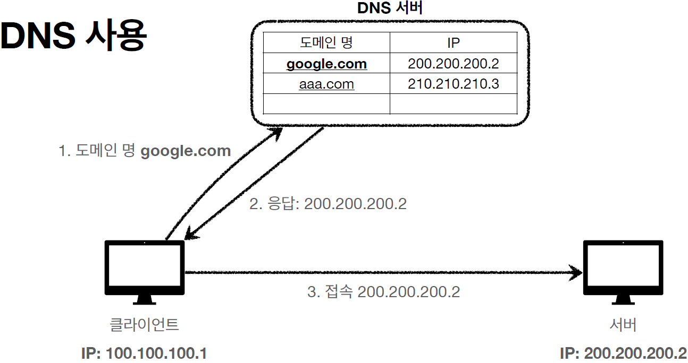

# DNS

## Domain Name Server

- 우리는 네트워크에 연결된 서버 역할을 하는 어떤 컴퓨터에 접속하기 위해 IP와 대응되는 Domain Name을 사용한다. Domain Name을 입력하면 브라우저는 DNS에 접속해 해당 문자열과 연결된 IP 주소가 있는지 확인하고 있다면 그 주소로 이동한다.
- DNS는 길을 안내해주는 친구라고 생각하면 된다.

## 참고자료

- [CloudFlare: What is DNS](https://www.cloudflare.com/learning/dns/what-is-dns/)

- [CloudFlare 한글 번역본](https://www.cloudflare.com/ko-kr/learning/dns/glossary/what-is-a-domain-name/)

- [Port & DNS](https://velog.io/@gil0127/PORT)
