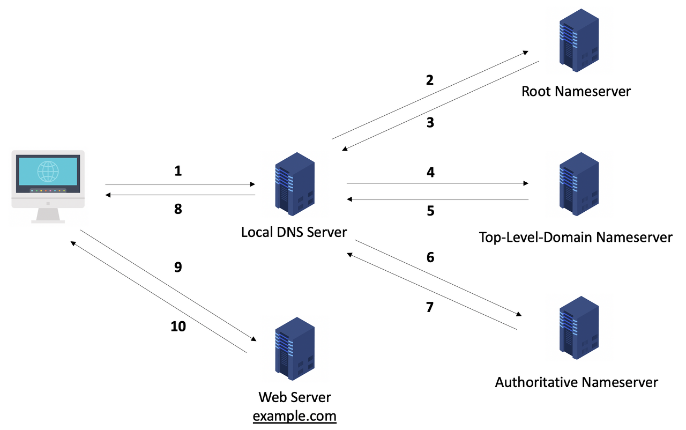
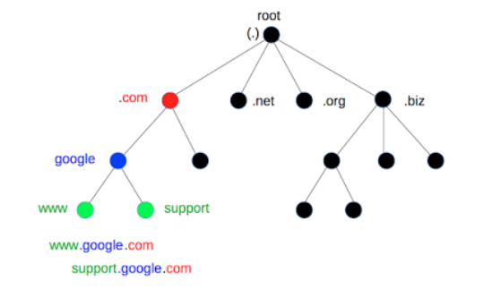

# DNS

## Domain Name System

- 우리는 네트워크에 연결된 서버 역할을 하는 어떤 컴퓨터에 접속하기 위해 IP와 대응되는 Domain Name을 사용한다. Domain Name을 입력하면 브라우저는 DNS에 접속해 해당 문자열과 연결된 IP 주소가 있는지 확인하고 있다면 그 주소로 이동한다.

- DNS는 길을 안내해주는 친구라고 생각하면 된다.

## Detail of DNS

- DNS를 조금 더 자세히 살펴보자.
- DNS는 아래와 같은 흐름으로 IP 주소를 탐색한다.
- IP 주소를 찾을 때까지 Local DNS Server가 여러 서버에게 질의해 브라우저에게 넘겨준다.

### Local DNS Server

- 기지국 DNS 서버이다.
- URL에 Domain Name을 입력했을 때 해당 IP를 찾기위해 가장먼저 찾는 DNS이다.
- 기본적으로 컴퓨터의 LAN선을 통해 인터넷이 연결되면, 인터넷을 사용할 수 있게 IP를 할당해주는 통신사(KT, SK, LG 등...) 에 해당되는 각 통신사의 DNS서버가 등록된다.
- **Authoritative DNS Server**: 도메인 네임에 대한 정보와 IP주소, 2가지를 전부 알고 있는 서버
- **Non-Authoritative DNS Server**: 도메인 네임만 알고 있거나 IP주소만 알고 있는 서버

 

### Root DNS Server

- 브라우저는 Local DNS Server에 도메인 네임에 대한 정보가 존재하지 않으면 Root DNS Server에게 물어보게 된다.
- Root DNS는 최상위 DNS서버로 해당 DNS부터 시작해서 아래 딸린 node DNS서버에게로 차례차례 물어본다. 트리구조로 되어 있으며 아래와 같다.

- 하지만 Root DNS Server에도 도메인에 대한 IP가 없을 수 있다. 그러면 Local DNS Server에 이를 알려주면서 최상위 도메인에 대한 정보를 담아 준다.
- `pythonstrup.co.kr`에 대한 정보가 없을 때, `.kr`의 주소를 알고 있으니, kr DNS Server에 가서 물어보라고 안내해준다.

### Top-Level Domain

- 최상위 도메인의 예는 아래와 같다.
  - 국가 코드 최상위 도메인(Country Code Top-Level Domain, ccTLD)는 `.kr`, `.jp`, `.CN`, `.US` 등이 존재한다.
  - 일반 최상위 도메인((generic top-level domain, gTLD)느 `.com`, `.net`, `.org` 등이 존재한다.

### DNS Cache

- 어떤 주소를 반복해서 접속할 때 최대한 효율적으로 접속하려면 어떻게 하는 것이 좋을까?
- 역시 Cache를 사용하는 것이 최고다.
- PC에서는 DNS Cache를 사용해 자주 사용하는 Domain Name에 대한 IP 주소를 저장해놓는다. 이를 통해 해당 주소를 빠르게 가져다 사용할 수 있다는 장점이 생긴다!!

 

## 참고자료

- [CloudFlare: What is DNS](https://www.cloudflare.com/learning/dns/what-is-dns/)

- [CloudFlare 한글 번역본](https://www.cloudflare.com/ko-kr/learning/dns/glossary/what-is-a-domain-name/)

- [Port & DNS](https://velog.io/@gil0127/PORT)

- [DNS deep dive](https://hwan-shell.tistory.com/320)
