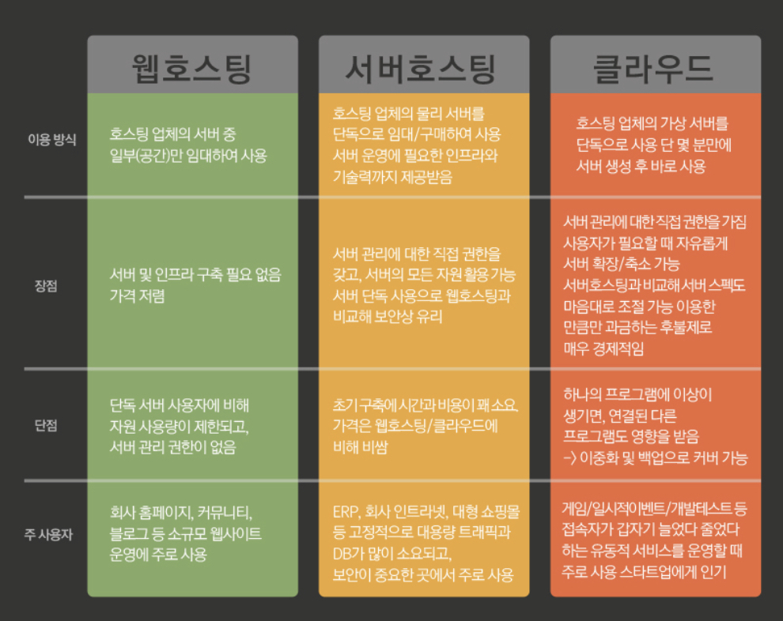

# What is the Hosting

## Hosting

- 호스팅이란 어떤 서비스를 빌려서 사용한다는 말이다.
- 그렇다면 웹 호스팅의 의미는 당연스럽게도 외부의 서버를 빌려서 기능을 사용한다는 것이다.

 

## Type of Hosting

- 웹 관련 호스팅의 예는 아래와 같이 3가지가 있다. 하나씩 차례로 알아가보자.

### Web Hosting

- HTML이나 CSS와 같은 코드를 이용해서 웹 페이지를 만들었을 때, 다른 사람들이 접속할 수 있도록 배포하기 위해 전문 업체에게 맡기는 것을 의미한다.
- 웹 호스팅은 저렴한 가격으로 이용할 수 있고 인프라 구축이 필요치 않지만, 서버의 일부분만 사용하기 때문에 사용량이 제한되고 서버 관리 권한이 없다.

### Server Hosting

- **웹 호스팅**은 서버 중 `일부`만 빌리는 서비스인 반면, **서버 호스팅**은 물리 서버를 통째로 구매하거나 임대하고, 서버 운영에 필요한 인프라와 기술력까지 제공받을 수 있는 서비스다.
- 서버 관리에 대해 직접 권한을 갖고 서버를 단독으로 사용하기 때문에 보안상 유리하지만 초기 구축단계에서 시간과 비용이 많이 드는 편이다.
- 인트라넷, 대형 쇼핑몰 등 트래픽이 정말 많고, DB 사용이 잦은 자사 서비스라면 서버 호스팅을 많이 사용하는 것 같다.

### Cloud Hosting

- 클라우드 호스팅은 대세 중의 대세다.
- AWS, 구글 클라우드 플랫폼, 네이버 클라우드 플랫폼 등이 이에 해당한다. Kubernetes, Docker, DB 전용 서버 등 서비스도 다양하고 질도 좋다.
- 원격으로 필요할 때마다 서버를 생성하고 관리할 수 있으며 트래픽 변동에도 유리하게 대처할 수 있기 때문에 일시적인 이벤트나 인프라가 유동적인 곳에 사용하기 편리하다는 장점이 있다.

 

## 어떤 호스팅을 언제 써야할까?

 

## 참고자료

- [웹 호스팅이란](https://aws.amazon.com/ko/what-is/web-hosting/)

- [웹 호스팅](https://jonghyuck.tistory.com/22)

- [호스팅이란](https://velog.io/@dreamjh/%ED%98%B8%EC%8A%A4%ED%8C%85%EC%9D%B4%EB%9E%80)
