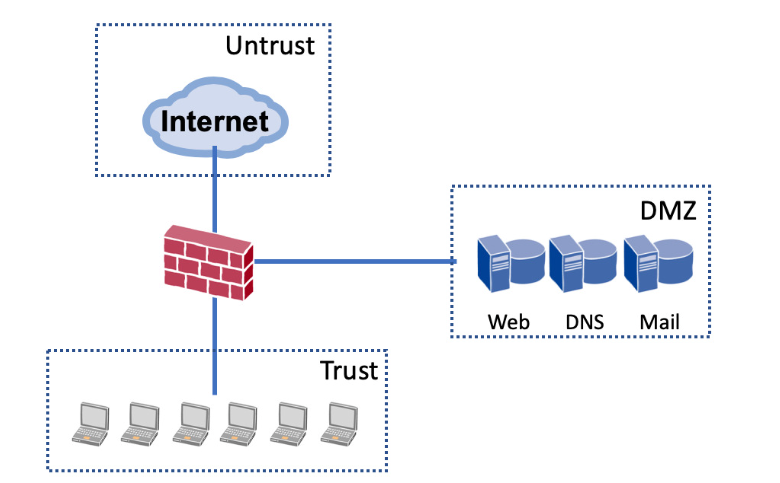

# 방화벽 Firewall

## 방화벽이란?

- 옛날엔 나무로 건물이 지어졌기 때문에 화재에 매우 취약했고 이로 인해 건물 사이사이에 돌로 방화벽이라는 것을 세워 불이 번지는 것을 막았다.
- 현재 네트워크에서 활용되는 방화벽도 위 의미와 사용 목적이 거의 동일하다. 외부에서의 침입을 차단하는 역할을 한다.

 

## 방화벽의 원리

- 방화벽은 외부에서 내부로 접속을 시도할 때 내부 시스템으로 접속을 허용하거나 차단하는 용도로 사용되기 때문에 언제나 외부에 연결된 위치에 설치된다. 일반적으로 외부에서 들어오는 인터넷 회선과 내부 시스템으로 접속되는 사이에 설치된다. 이 구간을 게이트웨이(Gateway)라고 하는데, 외부에서 들어오는 대문까지 연결된 길을 의미한다.

- 방화벽에는 네트워크의 위치 및 성격에 따라 각 구역의 이름을 부여하는데 보통 Untrust, Trust, DMZ 등을 할당한다.

### Untrust

- Untrust는 신뢰하지 않는 구간인 외부와 연결된 네트워크 구간을 의미한다.

### Trust

- Trust는 신뢰구간인 사용자 내부 네트워크 구간을 의미한다.

### DMZ

- DMZ는 우리나라 남북 사이에 있는 완충지대인 DMZ와 비슷한 개념으로, 외부(Untrust)와 내부(Trust)를 구분하고 그 중간지점을 지정한 구간이다.
- 내부에서도 접근이 가능해야 하지만, 외부에서도 접근이 가능해야하는 서버가 있는데 이런 서버를 어느 구역에 놓을지 애매할 경우 위치시킬 구역이 필요하기 때문에 존재한다.
- 아래 해당하는 서버들이 DMZ에 위치해야하는 서버이다.
  - DNS Server
  - Web Server
  - Mail Service(전자우편 서버)
- 위 서버들은 인터넷을 통해 외부에서 접속하는 사용자와 통신이 가능해야한다. 인터넷에 연결된 모든 사람들의 접속을 허용해야 문제없이 서비스를 이용할 수 있기 때문이다.
- 하지만 이 때문에 공격의 위험이 많다. 하지만 해킹을 당하더라도 모든 서버 앞에 방화벽이 각각 한 개씩 설치된다면 방어가 가능하다! 최근에는 가상 서버(VM)를 많이 사용하기 때문에 가상 서버 앞에 논리적으로 가상 방화벽을 한 개씩 설치하는 것에 문제가 없을 정도로 기술이 많이 발전하여 서버 방어력이 증가했다.

 

## 참고자료

### 방화벽 시리즈 1~8

- [방화벽](https://brunch.co.kr/@ka3211/2)
