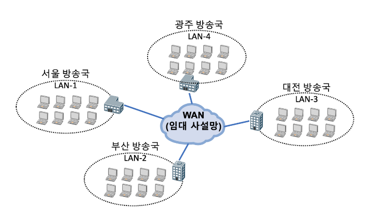
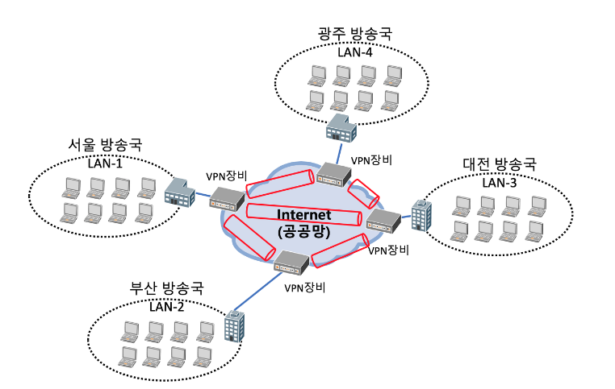
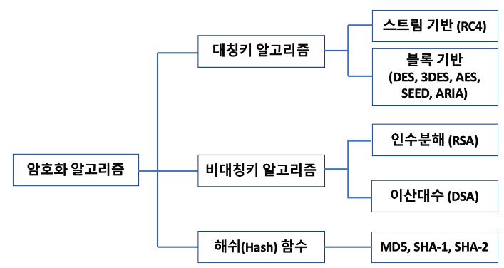
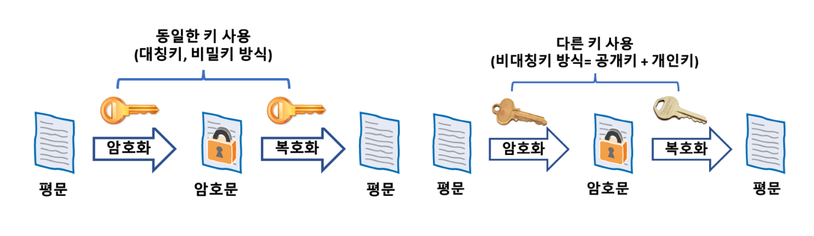
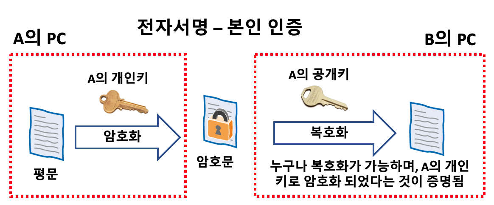
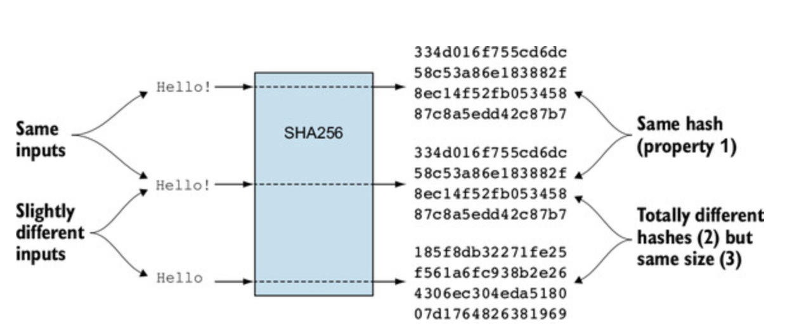
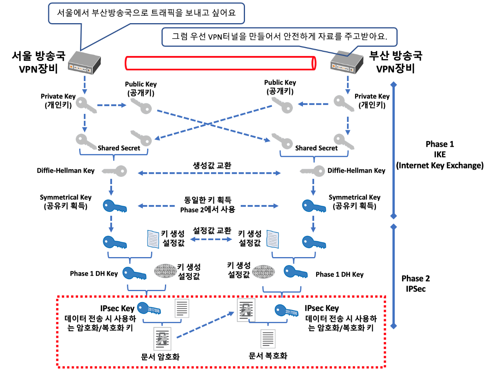
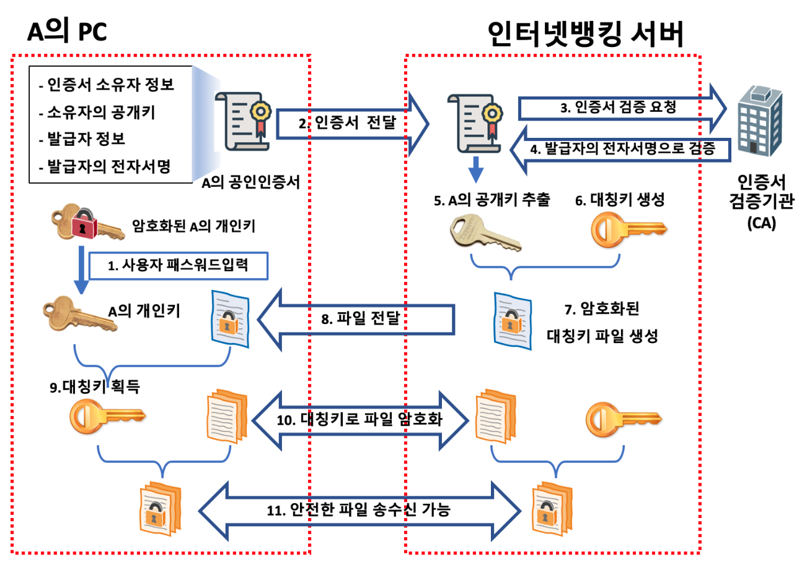

# VPN

## VPN이란?

- Virtual Private Network의 약자로 가상사설망을 의미한다.
- 인터넷망은 저렴한 비용헤 빠른 속도로 통신이 가능하지만 누구나 접속할 수 있기 때문에 사설망에 비해 업무 트래픽을 보내기에는 보안성이 떨어진다는 단점이 있다.
- 하지만 아래와 같으 WAN은 SKT, KT와 같은 사업자의 네트워크망을 임대하여 구성하기 때문에 속도도 느리고 임차 비용도 많이 든다.

- 반면 VPN 장비를 사용하면 별도의 전용선을 사용하므로 망 임대료를 낼 필요가 없고 인터넷을 사용하므로 낮은 비용 대비 빠른 통신 속도를 가질 수 있다.
- VPN은 아래와 같이 논리적 경로(빨간 파이프)를 만들어 트래픽을 주고 받을 때 암호화, 복호화를 하여 정보를 주고 받는다.

- VPN은 별도의 장비를 통해 트래픽을 암호화하여 송신하고, 수신 장비에서 복호화해 클라이언트에 데이터를 전달하는 방식으로 동작한다.

 

## 암호화 알고리즘

- VPN은 암호화 알고리즘을 이용해 트랙픽을 암호화하고 복호화한다.
- 대표적인 암호화 알고리즘으로는 대칭키 알고리즘, 비대칭키 알고리즘, 해쉬 함수 등이 있다.

### 대칭키

- 대칭키 알고리즘은 데이터를 암호화할 때 무작위 값으로 생성된 특정한 길이의 문자열을 키로 사용해 원하는 파일을 암호화하고, 동일한 키로 복호화할 수 있는 방식이다.
- 대칭키는 비대칭키 방식에 비해 월등히 빠르지만, 키를 누군가 가로챌 경우 모든 정보가 노출되기 때문에 안정성이 상대적으로 떨어지는 편이다.

### 비대칭키

- 비대칭키는 대칭키와 다르게 암호화할 때 사용하는 키와 복호화할 때 사용하는 키가 다른 방식이다.

- 비대칭키는 2개의 키가 쌍으로 동작한다. 공개키를 통해 암호화하면 그것과 쌍을 이루는 개인키로만 암호를 풀 수 있다. (개인키로 암호화하고 공개키로 복호화하는 것도 가능하다.)
- 비대칭키는 아래와 같은 `전자서명`에서 사용된다.

### 해쉬 함수

- 해쉬 함수는 암호화는 할 수 있지만 복호화가 되지 않는 단방향 암호방식이다.

 

## VPN에서 암호화 알고리즘을 사용하는 방식

- 아래 예시와 함께 살펴보자.

- 서울 방송국과 부산 방송국의 VPN 장비 간 트래픽을 전송하기 전에 터널을 생성한다. (약 1~3초 가량의 시간 소요)
  1. 비대칭키 방식과 디퍼-헬먼 키 교환 방식을 이용해 양쪽 장비에 안전하게 대칭키를 생선한다.
  2. 1단계에서 생성한 대칭키를 이용해 최종적으로 트래픽을 암호화, 복호화할 때 사용할 대칭키를 한 번 더 생성하여 데이터를 안전하게 전송할 준비를 한다.
- 이렇게 생성한 대칭키는 시간이 지날수록 보안성이 떨어지기 때문에 트래픽의 양이나 사용한 시간에 따라 갱신하도록 한다.
- 현재 공급되는 방화벽은 기본적으로 VPN 기능이 포함되어 있는 제품이라고 한다.

 

## 예시로 알아보는 VPN

### 인터넷뱅킹의 예

- 인터넷뱅킹을 할 때는 인증서가 제일 중요한데, 이 인증서가 정상적인지 검증을 받게 된다. 인증서의 고객 이름과 고유 번호를 사용해 신원을 확인하고, 안전한 통신을 위해 대칭키를 부여한다.

### OTP

- 최근에는 보안을 강화하기 위해 OTP라는 것을 사용하는데 OTP는 One Time Password의 약자로 한 번만 사용 가능한 패스워드를 의미한다. 해커가 OTP를 가로채도 아무런 문제가 발생하지 않는다.
- OTP는 현재 시간을 생성기 고유의 번호 생성 함수에 입력해 6자리의 번호를 생성하여 표시한다. 이 때 사용하는 기술이 해쉬 함수이다. 해쉬 함수에 동일한 값을 넣으면 언제나 동일한 값이 출력되는 원리를 이용한 것이다.

 

## 참고 자료

- [VPN](https://experience.dropbox.com/ko-kr/resources/what-is-vpn)

### 시리즈

- [VPN1](https://brunch.co.kr/@ka3211/11)
- [VPN2](https://brunch.co.kr/@ka3211/12)
- [VPN3](https://brunch.co.kr/@ka3211/13)
